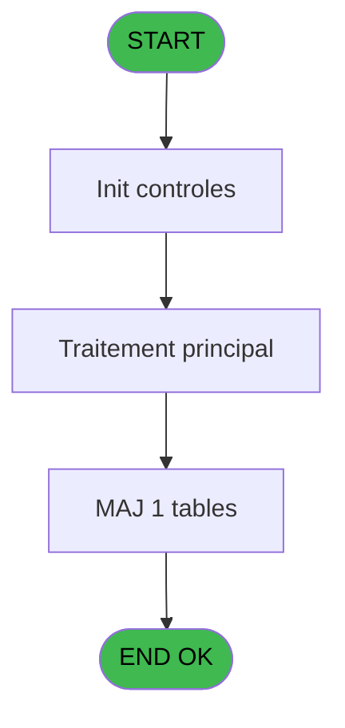
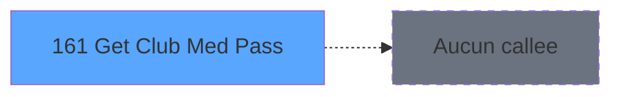

# ADH IDE 161 - Get Club Med Pass

> **Analyse**: Phases 1-4 2026-02-07 03:17 -> 03:17 (31s) | Assemblage 03:17
> **Pipeline**: V7.2 Enrichi
> **Structure**: 4 onglets (Resume | Ecrans | Donnees | Connexions)

<!-- TAB:Resume -->

## 1. FICHE D'IDENTITE

| Attribut | Valeur |
|----------|--------|
| Projet | ADH |
| IDE Position | 161 |
| Nom Programme | Get Club Med Pass |
| Fichier source | `Prg_161.xml` |
| Dossier IDE | General |
| Taches | 1 (0 ecrans visibles) |
| Tables modifiees | 1 |
| Programmes appeles | 0 |
| :warning: Statut | **ORPHELIN_POTENTIEL** |

## 2. DESCRIPTION FONCTIONNELLE

**Get Club Med Pass** assure la gestion complete de ce processus.

**Donnees modifiees** : 1 tables en ecriture (ez_card).

## 3. BLOCS FONCTIONNELS

## 5. REGLES METIER

*(Aucune regle metier identifiee)*

## 6. CONTEXTE

- **Appele par**: (aucun)
- **Appelle**: 0 programmes | **Tables**: 1 (W:1 R:0 L:0) | **Taches**: 1 | **Expressions**: 5

<!-- TAB:Ecrans -->

## 8. ECRANS

*(Programme sans ecran visible)*

## 9. NAVIGATION

### 9.3 Structure hierarchique (0 tache)

| Position | Tache | Type | Dimensions | Bloc |
|----------|-------|------|------------|------|

### 9.4 Algorigramme

> **Legende**: Vert = START/END OK | Rouge = END KO | Bleu = Decisions
> *Algorigramme auto-genere. Utiliser `/algorigramme` pour une synthese metier detaillee.*

<!-- TAB:Donnees -->

## 10. TABLES

### Tables utilisees (1)

| ID | Nom | Description | Type | R | W | L | Usages |
|----|-----|-------------|------|---|---|---|--------|
| 312 | ez_card |  | DB |   | **W** |   | 1 |

### Colonnes par table (1 / 1 tables avec colonnes identifiees)

Table 312 - ez_card (**W**) - 1 usages

| Lettre | Variable | Acces | Type |
|--------|----------|-------|------|
| A | P0 societe | W | Unicode |
| B | P0 compte | W | Numeric |
| C | P0 filiation | W | Numeric |

## 11. VARIABLES

### 11.1 Parametres entrants (3)

Variables recues en parametre.

| Lettre | Nom | Type | Usage dans |
|--------|-----|------|-----------|
| A | P0 societe | Unicode | 1x parametre entrant |
| B | P0 compte | Numeric | 1x parametre entrant |
| C | P0 filiation | Numeric | 1x parametre entrant |

## 12. EXPRESSIONS

**5 / 5 expressions decodees (100%)**

### 12.1 Repartition par type

| Type | Expressions | Regles |
|------|-------------|--------|
| OTHER | 4 | 0 |
| CONDITION | 1 | 0 |

### 12.2 Expressions cles par type

#### OTHER (4 expressions)

| Type | IDE | Expression | Regle |
|------|-----|------------|-------|
| OTHER | 3 | `P0 filiation [C]` | - |
| OTHER | 5 | `[G]` | - |
| OTHER | 1 | `P0 societe [A]` | - |
| OTHER | 2 | `P0 compte [B]` | - |

#### CONDITION (1 expressions)

| Type | IDE | Expression | Regle |
|------|-----|------------|-------|
| CONDITION | 4 | `[H]<>'O'` | - |

<!-- TAB:Connexions -->

## 13. GRAPHE D'APPELS

### 13.1 Chaine depuis Main (Callers)

**Chemin**: (pas de callers directs)

### 13.2 Callers

| IDE | Nom Programme | Nb Appels |
|-----|---------------|-----------|
| - | (aucun) | - |

### 13.3 Callees (programmes appeles)

### 13.4 Detail Callees avec contexte

| IDE | Nom Programme | Appels | Contexte |
|-----|---------------|--------|----------|
| - | (aucun) | - | - |

## 14. RECOMMANDATIONS MIGRATION

### 14.1 Profil du programme

| Metrique | Valeur | Impact migration |
|----------|--------|-----------------|
| Lignes de logique | 22 | Programme compact |
| Expressions | 5 | Peu de logique |
| Tables WRITE | 1 | Impact faible |
| Sous-programmes | 0 | Peu de dependances |
| Ecrans visibles | 0 | Ecran unique ou traitement batch |
| Code desactive | 0% (0 / 22) | Code sain |
| Regles metier | 0 | Pas de regle identifiee |

### 14.2 Plan de migration par bloc

### 14.3 Dependances critiques

| Dependance | Type | Appels | Impact |
|------------|------|--------|--------|
| ez_card | Table WRITE (Database) | 1x | Schema + repository |

---
*Spec DETAILED generee par Pipeline V7.2 - 2026-02-07 03:17*
