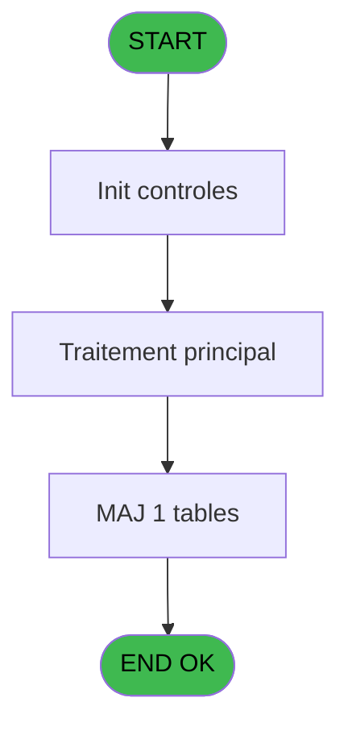
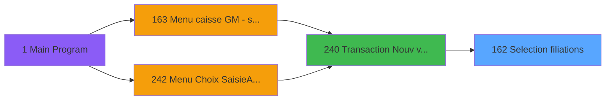
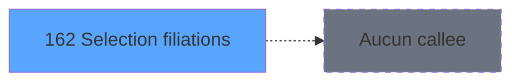

# ADH IDE 162 - Selection filiations

> **Analyse**: Phases 1-4 2026-02-07 03:51 -> 03:45 (23h54min) | Assemblage 03:45
> **Pipeline**: V7.2 Enrichi
> **Structure**: 4 onglets (Resume | Ecrans | Donnees | Connexions)

<!-- TAB:Resume -->

## 1. FICHE D'IDENTITE

| Attribut | Valeur |
|----------|--------|
| Projet | ADH |
| IDE Position | 162 |
| Nom Programme | Selection filiations |
| Fichier source | `Prg_162.xml` |
| Dossier IDE | Consultation |
| Taches | 2 (1 ecrans visibles) |
| Tables modifiees | 1 |
| Programmes appeles | 0 |
| Complexite | **BASSE** (score 7/100) |

## 2. DESCRIPTION FONCTIONNELLE

ADH IDE 162 est un programme de sélection des filiations accessible depuis le flux de vente (IDE 240). Il gère l'interface utilisateur permettant à l'opérateur de choisir une ou plusieurs filiations parmi celles disponibles pour le compte du client. Le programme modifie la table temporaire 1047 qui stocke les sélections de filiations.

Le flux se divise en deux tâches principales : la première affiche l'écran de sélection avec la liste des filiations disponibles, tandis que la seconde initialise les variables temporaires contenant les sélections effectuées. Cette interface est cruciale dans le workflow de création de vente, car le choix de la filiation conditionne les services accessibles et les tarifs appliqués.

Une fois les filiations sélectionnées, le programme retourne au flux parent (IDE 240) avec les données stockées en table 1047, permettant à la transaction de vente de continuer avec les bons paramètres de filiation. C'est un point de contrôle clé du processus de facturation, assurant que chaque vente est associée à la bonne filiation du compte client.

## 3. BLOCS FONCTIONNELS

### 3.1 Traitement (1 tache)

Traitements internes.

---

#### 162 - Sélection filiations [[ECRAN]](#ecran-t1)

**Role** : Traitement : Sélection filiations.
**Ecran** : 1238 x 284 DLU (MDI) | [Voir mockup](#ecran-t1)
**Variables liees** : ER (P.i.o.Nombre filiations cochées)

### 3.2 Consultation (1 tache)

Ecrans de recherche et consultation.

---

#### 162.1 - Init tmp selections

**Role** : Selection par l'operateur : Init tmp selections.

## 5. REGLES METIER

3 regles identifiees:

### Autres (3 regles)

#### [RM-001] Traitement conditionnel si [M]>0,Str ([M],'###')&' ans',IF ([N] est a zero

| Element | Detail |
|---------|--------|
| **Condition** | `[M]>0` |
| **Si vrai** | Str ([M] |
| **Si faux** | '###')&' ans',IF ([N]=0,'',Str ([M],'##')&' mois')) |
| **Expression source** | Expression 4 : `IF ([M]>0,Str ([M],'###')&' ans',IF ([N]=0,'',Str ([M],'##')` |
| **Exemple** | Si [M]>0 → Str ([M]. Sinon → '###')&' ans',IF ([N]=0,'',Str ([M],'##')&' mois')) |

#### [RM-002] Traitement si P.i.Texte info [D] est renseigne

| Element | Detail |
|---------|--------|
| **Condition** | `P.i.Texte info [D]<>''` |
| **Si vrai** | P.i.Texte info [D] |
| **Si faux** | 'Veuillez sélectionner les filiations concernées') |
| **Variables** | EQ (P.i.Texte info) |
| **Expression source** | Expression 9 : `IF(P.i.Texte info [D]<>'',P.i.Texte info [D],'Veuillez sélec` |
| **Exemple** | Si P.i.Texte info [D]<>'' → P.i.Texte info [D]. Sinon → 'Veuillez sélectionner les filiations concernées') |
| **Impact** | [162 - Sélection filiations](#t1) |

#### [RM-003] Negation de [Q] (condition inversee)

| Element | Detail |
|---------|--------|
| **Condition** | `NOT [Q]` |
| **Si vrai** | Action si vrai |
| **Expression source** | Expression 14 : `NOT [Q]` |
| **Exemple** | Si NOT [Q] → Action si vrai |

## 6. CONTEXTE

- **Appele par**: [Transaction Nouv vente PMS-710 (IDE 240)](ADH-IDE-240.md)
- **Appelle**: 0 programmes | **Tables**: 2 (W:1 R:1 L:1) | **Taches**: 2 | **Expressions**: 16

<!-- TAB:Ecrans -->

## 8. ECRANS

### 8.1 Forms visibles (1 / 2)

| # | Position | Tache | Nom | Type | Largeur | Hauteur | Bloc |
|---|----------|-------|-----|------|---------|---------|------|
| 1 | 162 | 162 | Sélection filiations | MDI | 1238 | 284 | Traitement |

### 8.2 Mockups Ecrans

---

#### 162 - Sélection filiations
**Tache** : [162](#t1) | **Type** : MDI | **Dimensions** : 1238 x 284 DLU
**Bloc** : Traitement | **Titre IDE** : Sélection filiations

<!-- FORM-DATA:
{
    "width":  1238,
    "vFactor":  8,
    "type":  "MDI",
    "hFactor":  8,
    "controls":  [
                     {
                         "x":  27,
                         "type":  "label",
                         "var":  "",
                         "y":  250,
                         "w":  1181,
                         "fmt":  "",
                         "name":  "",
                         "h":  24,
                         "color":  "",
                         "text":  "",
                         "parent":  null
                     },
                     {
                         "x":  26,
                         "type":  "table",
                         "var":  "",
                         "name":  "",
                         "titleH":  15,
                         "color":  "110",
                         "w":  1181,
                         "y":  35,
                         "fmt":  "",
                         "parent":  null,
                         "text":  "",
                         "rowH":  18,
                         "h":  197,
                         "cols":  [
                                      {
                                          "title":  "Nom / Prénom",
                                          "layer":  1,
                                          "w":  390
                                      },
                                      {
                                          "title":  "Sexe",
                                          "layer":  2,
                                          "w":  69
                                      },
                                      {
                                          "title":  "Age",
                                          "layer":  3,
                                          "w":  154
                                      },
                                      {
                                          "title":  "Compte / Filiation",
                                          "layer":  4,
                                          "w":  201
                                      },
                                      {
                                          "title":  "Sélectionner",
                                          "layer":  5,
                                          "w":  194
                                      }
                                  ],
                         "rows":  5
                     },
                     {
                         "x":  27,
                         "type":  "label",
                         "var":  "",
                         "y":  6,
                         "w":  1181,
                         "fmt":  "",
                         "name":  "",
                         "h":  16,
                         "color":  "",
                         "text":  "",
                         "parent":  null
                     },
                     {
                         "x":  48,
                         "type":  "edit",
                         "var":  "",
                         "y":  55,
                         "w":  361,
                         "fmt":  "",
                         "name":  "v.nom \u0026 prenom",
                         "h":  10,
                         "color":  "110",
                         "text":  "",
                         "parent":  2
                     },
                     {
                         "x":  653,
                         "type":  "edit",
                         "var":  "",
                         "y":  55,
                         "w":  178,
                         "fmt":  "15",
                         "name":  "gmr_filiation_villag",
                         "h":  10,
                         "color":  "110",
                         "text":  "",
                         "parent":  2
                     },
                     {
                         "x":  438,
                         "type":  "edit",
                         "var":  "",
                         "y":  55,
                         "w":  30,
                         "fmt":  "2",
                         "name":  "gmr_sexe",
                         "h":  10,
                         "color":  "110",
                         "text":  "",
                         "parent":  2
                     },
                     {
                         "x":  496,
                         "type":  "edit",
                         "var":  "",
                         "y":  55,
                         "w":  137,
                         "fmt":  "10",
                         "name":  "",
                         "h":  10,
                         "color":  "110",
                         "text":  "",
                         "parent":  2
                     },
                     {
                         "x":  63,
                         "type":  "button",
                         "var":  "",
                         "y":  253,
                         "w":  168,
                         "fmt":  "\u0026Annuler",
                         "name":  "",
                         "h":  16,
                         "color":  "",
                         "text":  "",
                         "parent":  1
                     },
                     {
                         "x":  938,
                         "type":  "checkbox",
                         "var":  "",
                         "y":  55,
                         "w":  32,
                         "fmt":  "",
                         "name":  "Selectionne",
                         "h":  10,
                         "color":  "110",
                         "text":  "",
                         "parent":  2
                     },
                     {
                         "x":  988,
                         "type":  "button",
                         "var":  "",
                         "y":  253,
                         "w":  168,
                         "fmt":  "\u0026Ok",
                         "name":  "",
                         "h":  16,
                         "color":  "",
                         "text":  "",
                         "parent":  1
                     },
                     {
                         "x":  52,
                         "type":  "edit",
                         "var":  "",
                         "y":  9,
                         "w":  1121,
                         "fmt":  "200",
                         "name":  "",
                         "h":  10,
                         "color":  "143",
                         "text":  "",
                         "parent":  15
                     }
                 ],
    "taskId":  "162",
    "height":  284
}
-->

<strong>Champs : 6 champs</strong>

| Pos (x,y) | Nom | Variable | Type |
|-----------|-----|----------|------|
| 48,55 | v.nom & prenom | - | edit |
| 653,55 | gmr_filiation_villag | - | edit |
| 438,55 | gmr_sexe | - | edit |
| 496,55 | 10 | - | edit |
| 938,55 | Selectionne | - | checkbox |
| 52,9 | 200 | - | edit |

<strong>Boutons : 2 boutons</strong>

| Bouton | Pos (x,y) | Action |
|--------|-----------|--------|
| Annuler | 63,253 | Annule et retour au menu |
| Ok | 988,253 | Valide la saisie et enregistre |

## 9. NAVIGATION

Ecran unique: **Sélection filiations**

### 9.3 Structure hierarchique (2 taches)

| Position | Tache | Type | Dimensions | Bloc |
|----------|-------|------|------------|------|
| **162.1** | [**Sélection filiations** (162)](#t1) [mockup](#ecran-t1) | MDI | 1238x284 | Traitement |
| **162.2** | [**Init tmp selections** (162.1)](#t2) | - | - | Consultation |

### 9.4 Algorigramme

> **Legende**: Vert = START/END OK | Rouge = END KO | Bleu = Decisions
> *Algorigramme auto-genere. Utiliser `/algorigramme` pour une synthese metier detaillee.*

<!-- TAB:Donnees -->

## 10. TABLES

### Tables utilisees (2)

| ID | Nom | Description | Type | R | W | L | Usages |
|----|-----|-------------|------|---|---|---|--------|
| 1047 | Table_1047 |  | MEM |   | **W** | L | 2 |
| 30 | gm-recherche_____gmr | Index de recherche | DB | R |   |   | 1 |

### Colonnes par table (1 / 2 tables avec colonnes identifiees)

Table 1047 - Table_1047 (**W**/L) - 2 usages

*Table utilisee uniquement en Link ou aucune colonne Real identifiee dans le DataView.*

Table 30 - gm-recherche_____gmr (R) - 1 usages

| Lettre | Variable | Acces | Type |
|--------|----------|-------|------|
| A | P.i.Societe | R | Unicode |
| B | P.i.Compte | R | Numeric |
| C | P.i.Filiation | R | Numeric |
| D | P.i.Texte info | R | Alpha |
| E | P.i.o.Nombre filiations cochées | R | Numeric |
| F | v.nom & prenom | R | Alpha |
| G | v.nombre original | R | Numeric |
| H | CHG_REASON_Selectionne | R | Numeric |
| I | CHG_PRV_Selectionne | R | Logical |

## 11. VARIABLES

### 11.1 Parametres entrants (5)

Variables recues du programme appelant ([Transaction Nouv vente PMS-710 (IDE 240)](ADH-IDE-240.md)).

| Lettre | Nom | Type | Usage dans |
|--------|-----|------|-----------|
| EN | P.i.Societe | Unicode | 1x parametre entrant |
| EO | P.i.Compte | Numeric | 3x parametre entrant |
| EP | P.i.Filiation | Numeric | - |
| EQ | P.i.Texte info | Alpha | 1x parametre entrant |
| ER | P.i.o.Nombre filiations cochées | Numeric | - |

### 11.2 Variables de session (2)

Variables persistantes pendant toute la session.

| Lettre | Nom | Type | Usage dans |
|--------|-----|------|-----------|
| ES | v.nom & prenom | Alpha | - |
| ET | v.nombre original | Numeric | - |

### 11.3 Autres (2)

Variables diverses.

| Lettre | Nom | Type | Usage dans |
|--------|-----|------|-----------|
| EU | CHG_REASON_Selectionne | Numeric | 2x refs |
| EV | CHG_PRV_Selectionne | Logical | 1x refs |

## 12. EXPRESSIONS

**16 / 16 expressions decodees (100%)**

### 12.1 Repartition par type

| Type | Expressions | Regles |
|------|-------------|--------|
| FORMAT | 3 | 0 |
| CALCULATION | 2 | 0 |
| CONCATENATION | 2 | 5 |
| CONDITION | 2 | 5 |
| NEGATION | 1 | 5 |
| CONSTANTE | 2 | 0 |
| OTHER | 4 | 0 |

### 12.2 Expressions cles par type

#### FORMAT (3 expressions)

| Type | IDE | Expression | Regle |
|------|-----|------------|-------|
| FORMAT | 8 | `Str(CHG_REASON_Selectionne [H],'3P0')` | - |
| FORMAT | 5 | `'Sélection filiations pour le compte '&Str(P.i.Compte [B],'8P0')` | - |
| FORMAT | 6 | `Str(P.i.Compte [B],'8P0')&' / '&Str(CHG_REASON_Selectionne [H],'3L')` | - |

#### CALCULATION (2 expressions)

| Type | IDE | Expression | Regle |
|------|-----|------------|-------|
| CALCULATION | 12 | `P.i.o.Nombre filiation... [E]-1` | - |
| CALCULATION | 11 | `P.i.o.Nombre filiation... [E]+1` | - |

#### CONCATENATION (2 expressions)

| Type | IDE | Expression | Regle |
|------|-----|------------|-------|
| CONCATENATION | 4 | `IF ([M]>0,Str ([M],'###')&' ans',IF ([N]=0,'',Str ([M],'##')&' mois'))` | [RM-001](#rm-RM-001) |
| CONCATENATION | 3 | `Trim (CHG_PRV_Selectionne [I])&' '&[J]` | - |

#### CONDITION (2 expressions)

| Type | IDE | Expression | Regle |
|------|-----|------------|-------|
| CONDITION | 9 | `IF(P.i.Texte info [D]<>'',P.i.Texte info [D],'Veuillez sélectionner les filiations concernées')` | [RM-002](#rm-RM-002) |
| CONDITION | 16 | `P.i.o.Nombre filiation... [E]<>[R]` | - |

#### NEGATION (1 expressions)

| Type | IDE | Expression | Regle |
|------|-----|------------|-------|
| NEGATION | 14 | `NOT [Q]` | [RM-003](#rm-RM-003) |

#### CONSTANTE (2 expressions)

| Type | IDE | Expression | Regle |
|------|-----|------------|-------|
| CONSTANTE | 10 | `0` | - |
| CONSTANTE | 7 | `'FILIATION'` | - |

#### OTHER (4 expressions)

| Type | IDE | Expression | Regle |
|------|-----|------------|-------|
| OTHER | 13 | `[Q]` | - |
| OTHER | 15 | `P.i.o.Nombre filiation... [E]` | - |
| OTHER | 1 | `P.i.Societe [A]` | - |
| OTHER | 2 | `P.i.Compte [B]` | - |

<!-- TAB:Connexions -->

## 13. GRAPHE D'APPELS

### 13.1 Chaine depuis Main (Callers)

Main -> ... -> [Transaction Nouv vente PMS-710 (IDE 240)](ADH-IDE-240.md) -> **Selection filiations (IDE 162)**

### 13.2 Callers

| IDE | Nom Programme | Nb Appels |
|-----|---------------|-----------|
| [240](ADH-IDE-240.md) | Transaction Nouv vente PMS-710 | 1 |

### 13.3 Callees (programmes appeles)

### 13.4 Detail Callees avec contexte

| IDE | Nom Programme | Appels | Contexte |
|-----|---------------|--------|----------|
| - | (aucun) | - | - |

## 14. RECOMMANDATIONS MIGRATION

### 14.1 Profil du programme

| Metrique | Valeur | Impact migration |
|----------|--------|-----------------|
| Lignes de logique | 44 | Programme compact |
| Expressions | 16 | Peu de logique |
| Tables WRITE | 1 | Impact faible |
| Sous-programmes | 0 | Peu de dependances |
| Ecrans visibles | 1 | Ecran unique ou traitement batch |
| Code desactive | 0% (0 / 44) | Code sain |
| Regles metier | 3 | Quelques regles a preserver |

### 14.2 Plan de migration par bloc

#### Traitement (1 tache: 1 ecran, 0 traitement)

- **Strategie** : 1 composant(s) UI (Razor/React) avec formulaires et validation.
- Decomposer les taches en services unitaires testables.

#### Consultation (1 tache: 0 ecran, 1 traitement)

- **Strategie** : Composants de recherche/selection en modales.

### 14.3 Dependances critiques

| Dependance | Type | Appels | Impact |
|------------|------|--------|--------|
| Table_1047 | Table WRITE (Memory) | 1x | Schema + repository |

---
*Spec DETAILED generee par Pipeline V7.2 - 2026-02-08 03:46*
