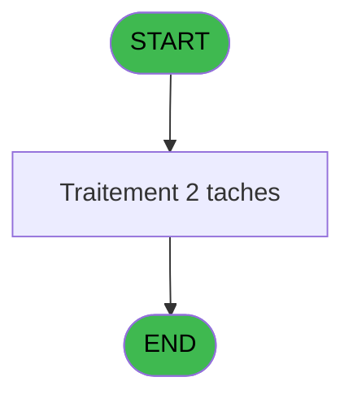

# ADH IDE 162 - Selection filiations

> **Analyse**: Phases 1-4 2026-02-07 03:51 -> 03:51 (27s) | Assemblage 07:19
> **Pipeline**: V7.2 Enrichi
> **Structure**: 4 onglets (Resume | Ecrans | Donnees | Connexions)

<!-- TAB:Resume -->

## 1. FICHE D'IDENTITE

| Attribut | Valeur |
|----------|--------|
| Projet | ADH |
| IDE Position | 162 |
| Nom Programme | Selection filiations |
| Fichier source | `Prg_162.xml` |
| Dossier IDE | Menus |
| Taches | 2 (1 ecrans visibles) |
| Tables modifiees | 1 |
| Programmes appeles | 0 |

## 2. DESCRIPTION FONCTIONNELLE

**Selection filiations** assure la gestion complete de ce processus, accessible depuis [Transaction Nouv vente PMS-710 (IDE 240)](ADH-IDE-240.md).

Le flux de traitement s'organise en **2 blocs fonctionnels** :

- **Consultation** (1 tache) : ecrans de recherche, selection et consultation
- **Traitement** (1 tache) : traitements metier divers

**Donnees modifiees** : 1 tables en ecriture (Table_1047).

**Logique metier** : 2 regles identifiees couvrant conditions metier.

Detail : phases du traitement

#### Phase 1 : Traitement (1 tache)

- **T1** - Sélection filiations **[ECRAN]**

#### Phase 2 : Consultation (1 tache)

- **T2** - Init tmp selections

#### Tables impactees

| Table | Operations | Role metier |
|-------|-----------|-------------|
| Table_1047 | **W**/L (2 usages) |  |

## 3. BLOCS FONCTIONNELS

### 3.1 Traitement (1 tache)

Traitements internes.

---

#### T1 - Sélection filiations [ECRAN]

**Role** : Traitement : Sélection filiations.
**Ecran** : 1238 x 284 DLU (MDI) | [Voir mockup](#ecran-t1)
**Variables liees** : E (P.i.o.Nombre filiations cochées)

### 3.2 Consultation (1 tache)

Ecrans de recherche et consultation.

---

#### T2 - Init tmp selections

**Role** : Selection par l'operateur : Init tmp selections.

## 5. REGLES METIER

2 regles identifiees:

### Autres (2 regles)

#### [RM-001] Traitement conditionnel si [M]>0,Str ([M],'###')&' ans',IF ([N] est a zero

| Element | Detail |
|---------|--------|
| **Condition** | `[M]>0` |
| **Si vrai** | Str ([M] |
| **Si faux** | '###')&' ans',IF ([N]=0,'',Str ([M],'##')&' mois')) |
| **Expression source** | Expression 4 : `IF ([M]>0,Str ([M],'###')&' ans',IF ([N]=0,'',Str ([M],'##')` |
| **Exemple** | Si [M]>0 → Str ([M]. Sinon → '###')&' ans',IF ([N]=0,'',Str ([M],'##')&' mois')) |

#### [RM-002] Traitement si P.i.Texte info [D] est renseigne

| Element | Detail |
|---------|--------|
| **Condition** | `P.i.Texte info [D]<>''` |
| **Si vrai** | P.i.Texte info [D] |
| **Si faux** | 'Veuillez sélectionner les filiations concernées') |
| **Variables** | D (P.i.Texte info) |
| **Expression source** | Expression 9 : `IF(P.i.Texte info [D]<>'',P.i.Texte info [D],'Veuillez sélec` |
| **Exemple** | Si P.i.Texte info [D]<>'' → P.i.Texte info [D]. Sinon → 'Veuillez sélectionner les filiations concernées') |
| **Impact** | [T1 - Sélection filiations](#t1) |

## 6. CONTEXTE

- **Appele par**: [Transaction Nouv vente PMS-710 (IDE 240)](ADH-IDE-240.md)
- **Appelle**: 0 programmes | **Tables**: 2 (W:1 R:1 L:1) | **Taches**: 2 | **Expressions**: 16

<!-- TAB:Ecrans -->

## 8. ECRANS

### 8.1 Forms visibles (1 / 2)

| # | Position | Tache | Nom | Type | Largeur | Hauteur | Bloc |
|---|----------|-------|-----|------|---------|---------|------|
| 1 | 162 | T1 | Sélection filiations | MDI | 1238 | 284 | Traitement |

### 8.2 Mockups Ecrans

---

#### 162 - Sélection filiations
**Tache** : [T1](#t1) | **Type** : MDI | **Dimensions** : 1238 x 284 DLU
**Bloc** : Traitement | **Titre IDE** : Sélection filiations

<!-- FORM-DATA:
{
    "width":  1238,
    "vFactor":  8,
    "type":  "MDI",
    "hFactor":  8,
    "controls":  [
                     {
                         "x":  27,
                         "type":  "label",
                         "var":  "",
                         "y":  250,
                         "w":  1181,
                         "fmt":  "",
                         "name":  "",
                         "h":  24,
                         "color":  "",
                         "text":  "",
                         "parent":  null
                     },
                     {
                         "x":  26,
                         "type":  "table",
                         "var":  "",
                         "name":  "",
                         "titleH":  15,
                         "color":  "110",
                         "w":  1181,
                         "y":  35,
                         "fmt":  "",
                         "parent":  null,
                         "text":  "",
                         "rowH":  18,
                         "h":  197,
                         "cols":  [
                                      {
                                          "title":  "Nom / Prénom",
                                          "layer":  1,
                                          "w":  390
                                      },
                                      {
                                          "title":  "Sexe",
                                          "layer":  2,
                                          "w":  69
                                      },
                                      {
                                          "title":  "Age",
                                          "layer":  3,
                                          "w":  154
                                      },
                                      {
                                          "title":  "Compte / Filiation",
                                          "layer":  4,
                                          "w":  201
                                      },
                                      {
                                          "title":  "Sélectionner",
                                          "layer":  5,
                                          "w":  194
                                      }
                                  ],
                         "rows":  5
                     },
                     {
                         "x":  27,
                         "type":  "label",
                         "var":  "",
                         "y":  6,
                         "w":  1181,
                         "fmt":  "",
                         "name":  "",
                         "h":  16,
                         "color":  "",
                         "text":  "",
                         "parent":  null
                     },
                     {
                         "x":  48,
                         "type":  "edit",
                         "var":  "",
                         "y":  55,
                         "w":  361,
                         "fmt":  "",
                         "name":  "v.nom \u0026 prenom",
                         "h":  10,
                         "color":  "110",
                         "text":  "",
                         "parent":  2
                     },
                     {
                         "x":  653,
                         "type":  "edit",
                         "var":  "",
                         "y":  55,
                         "w":  178,
                         "fmt":  "15",
                         "name":  "gmr_filiation_villag",
                         "h":  10,
                         "color":  "110",
                         "text":  "",
                         "parent":  2
                     },
                     {
                         "x":  438,
                         "type":  "edit",
                         "var":  "",
                         "y":  55,
                         "w":  30,
                         "fmt":  "2",
                         "name":  "gmr_sexe",
                         "h":  10,
                         "color":  "110",
                         "text":  "",
                         "parent":  2
                     },
                     {
                         "x":  496,
                         "type":  "edit",
                         "var":  "",
                         "y":  55,
                         "w":  137,
                         "fmt":  "10",
                         "name":  "",
                         "h":  10,
                         "color":  "110",
                         "text":  "",
                         "parent":  2
                     },
                     {
                         "x":  63,
                         "type":  "button",
                         "var":  "",
                         "y":  253,
                         "w":  168,
                         "fmt":  "\u0026Annuler",
                         "name":  "",
                         "h":  16,
                         "color":  "",
                         "text":  "",
                         "parent":  1
                     },
                     {
                         "x":  938,
                         "type":  "checkbox",
                         "var":  "",
                         "y":  55,
                         "w":  32,
                         "fmt":  "",
                         "name":  "Selectionne",
                         "h":  10,
                         "color":  "110",
                         "text":  "",
                         "parent":  2
                     },
                     {
                         "x":  988,
                         "type":  "button",
                         "var":  "",
                         "y":  253,
                         "w":  168,
                         "fmt":  "\u0026Ok",
                         "name":  "",
                         "h":  16,
                         "color":  "",
                         "text":  "",
                         "parent":  1
                     },
                     {
                         "x":  52,
                         "type":  "edit",
                         "var":  "",
                         "y":  9,
                         "w":  1121,
                         "fmt":  "200",
                         "name":  "",
                         "h":  10,
                         "color":  "143",
                         "text":  "",
                         "parent":  15
                     }
                 ],
    "taskId":  "162",
    "height":  284
}
-->

<strong>Champs : 6 champs</strong>

| Pos (x,y) | Nom | Variable | Type |
|-----------|-----|----------|------|
| 48,55 | v.nom & prenom | - | edit |
| 653,55 | gmr_filiation_villag | - | edit |
| 438,55 | gmr_sexe | - | edit |
| 496,55 | 10 | - | edit |
| 938,55 | Selectionne | - | checkbox |
| 52,9 | 200 | - | edit |

<strong>Boutons : 2 boutons</strong>

| Bouton | Pos (x,y) | Action |
|--------|-----------|--------|
| Annuler | 63,253 | Annule et retour au menu |
| Ok | 988,253 | Valide la saisie et enregistre |

## 9. NAVIGATION

Ecran unique: **Sélection filiations**

### 9.3 Structure hierarchique (2 taches)

| Position | Tache | Type | Dimensions | Bloc |
|----------|-------|------|------------|------|
| **162.1** | [**Sélection filiations** (T1)](#t1) [mockup](#ecran-t1) | MDI | 1238x284 | Traitement |
| **162.2** | [**Init tmp selections** (T2)](#t2) | - | - | Consultation |

### 9.4 Algorigramme

> *algo-data indisponible. Utiliser `/algorigramme` pour generer.*

<!-- TAB:Donnees -->

## 10. TABLES

### Tables utilisees (2)

| ID | Nom | Description | Type | R | W | L | Usages |
|----|-----|-------------|------|---|---|---|--------|
| 30 | gm-recherche_____gmr | Index de recherche | DB | R |   |   | 1 |
| 1047 | Table_1047 |  | MEM |   | **W** | L | 2 |

### Colonnes par table (1 / 2 tables avec colonnes identifiees)

Table 30 - gm-recherche_____gmr (R) - 1 usages

| Lettre | Variable | Acces | Type |
|--------|----------|-------|------|
| A | P.i.Societe | R | Unicode |
| B | P.i.Compte | R | Numeric |
| C | P.i.Filiation | R | Numeric |
| D | P.i.Texte info | R | Alpha |
| E | P.i.o.Nombre filiations cochées | R | Numeric |
| F | v.nom & prenom | R | Alpha |
| G | v.nombre original | R | Numeric |
| H | CHG_REASON_Selectionne | R | Numeric |
| I | CHG_PRV_Selectionne | R | Logical |

Table 1047 - Table_1047 (**W**/L) - 2 usages

*Table utilisee uniquement en Link ou aucune colonne Real identifiee dans le DataView.*

## 11. VARIABLES

### 11.1 Parametres entrants (5)

Variables recues du programme appelant ([Transaction Nouv vente PMS-710 (IDE 240)](ADH-IDE-240.md)).

| Lettre | Nom | Type | Usage dans |
|--------|-----|------|-----------|
| A | P.i.Societe | Unicode | 1x parametre entrant |
| B | P.i.Compte | Numeric | 3x parametre entrant |
| C | P.i.Filiation | Numeric | - |
| D | P.i.Texte info | Alpha | 1x parametre entrant |
| E | P.i.o.Nombre filiations cochées | Numeric | - |

### 11.2 Variables de session (2)

Variables persistantes pendant toute la session.

| Lettre | Nom | Type | Usage dans |
|--------|-----|------|-----------|
| F | v.nom & prenom | Alpha | - |
| G | v.nombre original | Numeric | - |

### 11.3 Autres (2)

Variables diverses.

| Lettre | Nom | Type | Usage dans |
|--------|-----|------|-----------|
| H | CHG_REASON_Selectionne | Numeric | 2x refs |
| I | CHG_PRV_Selectionne | Logical | 1x refs |

## 12. EXPRESSIONS

**16 / 16 expressions decodees (100%)**

### 12.1 Repartition par type

| Type | Expressions | Regles |
|------|-------------|--------|
| FORMAT | 3 | 0 |
| CALCULATION | 2 | 0 |
| CONCATENATION | 2 | 5 |
| CONDITION | 2 | 5 |
| CONSTANTE | 2 | 0 |
| OTHER | 4 | 0 |
| NEGATION | 1 | 0 |

### 12.2 Expressions cles par type

#### FORMAT (3 expressions)

| Type | IDE | Expression | Regle |
|------|-----|------------|-------|
| FORMAT | 8 | `Str(CHG_REASON_Selectionne [H],'3P0')` | - |
| FORMAT | 5 | `'Sélection filiations pour le compte '&Str(P.i.Compte [B],'8P0')` | - |
| FORMAT | 6 | `Str(P.i.Compte [B],'8P0')&' / '&Str(CHG_REASON_Selectionne [H],'3L')` | - |

#### CALCULATION (2 expressions)

| Type | IDE | Expression | Regle |
|------|-----|------------|-------|
| CALCULATION | 12 | `P.i.o.Nombre filiation... [E]-1` | - |
| CALCULATION | 11 | `P.i.o.Nombre filiation... [E]+1` | - |

#### CONCATENATION (2 expressions)

| Type | IDE | Expression | Regle |
|------|-----|------------|-------|
| CONCATENATION | 4 | `IF ([M]>0,Str ([M],'###')&' ans',IF ([N]=0,'',Str ([M],'##')&' mois'))` | [RM-001](#rm-RM-001) |
| CONCATENATION | 3 | `Trim (CHG_PRV_Selectionne [I])&' '&[J]` | - |

#### CONDITION (2 expressions)

| Type | IDE | Expression | Regle |
|------|-----|------------|-------|
| CONDITION | 9 | `IF(P.i.Texte info [D]<>'',P.i.Texte info [D],'Veuillez sélectionner les filiations concernées')` | [RM-002](#rm-RM-002) |
| CONDITION | 16 | `P.i.o.Nombre filiation... [E]<>[R]` | - |

#### CONSTANTE (2 expressions)

| Type | IDE | Expression | Regle |
|------|-----|------------|-------|
| CONSTANTE | 10 | `0` | - |
| CONSTANTE | 7 | `'FILIATION'` | - |

#### OTHER (4 expressions)

| Type | IDE | Expression | Regle |
|------|-----|------------|-------|
| OTHER | 13 | `[Q]` | - |
| OTHER | 15 | `P.i.o.Nombre filiation... [E]` | - |
| OTHER | 1 | `P.i.Societe [A]` | - |
| OTHER | 2 | `P.i.Compte [B]` | - |

#### NEGATION (1 expressions)

| Type | IDE | Expression | Regle |
|------|-----|------------|-------|
| NEGATION | 14 | `NOT [Q]` | - |

<!-- TAB:Connexions -->

## 13. GRAPHE D'APPELS

### 13.1 Chaine depuis Main (Callers)

Main -> ... -> [Transaction Nouv vente PMS-710 (IDE 240)](ADH-IDE-240.md) -> **Selection filiations (IDE 162)**

### 13.2 Callers

| IDE | Nom Programme | Nb Appels |
|-----|---------------|-----------|
| [240](ADH-IDE-240.md) | Transaction Nouv vente PMS-710 | 1 |

### 13.3 Callees (programmes appeles)

### 13.4 Detail Callees avec contexte

| IDE | Nom Programme | Appels | Contexte |
|-----|---------------|--------|----------|
| - | (aucun) | - | - |

## 14. RECOMMANDATIONS MIGRATION

### 14.1 Profil du programme

| Metrique | Valeur | Impact migration |
|----------|--------|-----------------|
| Lignes de logique | 44 | Programme compact |
| Expressions | 16 | Peu de logique |
| Tables WRITE | 1 | Impact faible |
| Sous-programmes | 0 | Peu de dependances |
| Ecrans visibles | 1 | Ecran unique ou traitement batch |
| Code desactive | 0% (0 / 44) | Code sain |
| Regles metier | 2 | Quelques regles a preserver |

### 14.2 Plan de migration par bloc

#### Traitement (1 tache: 1 ecran, 0 traitement)

- **Strategie** : 1 composant(s) UI (Razor/React) avec formulaires et validation.
- Decomposer les taches en services unitaires testables.

#### Consultation (1 tache: 0 ecran, 1 traitement)

- **Strategie** : Composants de recherche/selection en modales.

### 14.3 Dependances critiques

| Dependance | Type | Appels | Impact |
|------------|------|--------|--------|
| Table_1047 | Table WRITE (Memory) | 1x | Schema + repository |

---
*Spec DETAILED generee par Pipeline V7.2 - 2026-02-07 07:19*
