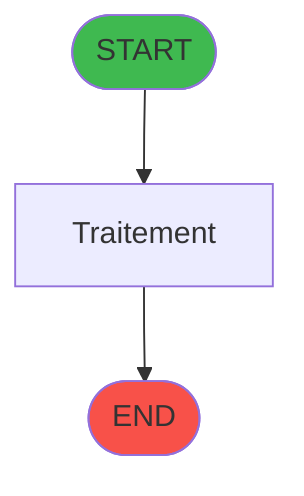
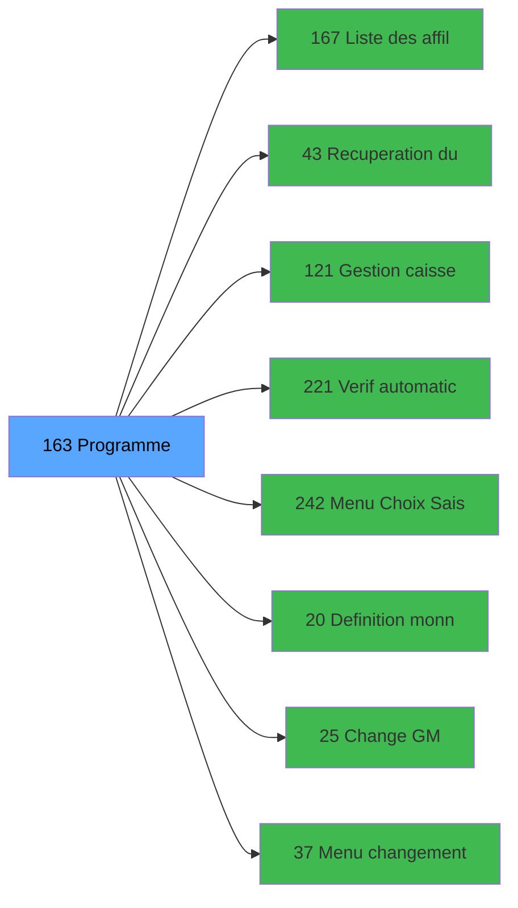

# ADH IDE 163 - Menu caisse GM - scroll

> **Version spec**: 3.5
> **Analyse**: 2026-01-27 17:57
> **Source**: `Prg_XXX.xml`

---

<!-- TAB:Fonctionnel -->

## SPECIFICATION FONCTIONNELLE

### 1.1 Objectif metier

| Element | Description |
|---------|-------------|
| **Qui** | Operateur |
| **Quoi** | Menu caisse GM - scroll
 |
| **Pourquoi** | A documenter |
| **Declencheur** | A identifier |

### 1.2 Regles metier

| Code | Regle | Condition |
|------|-------|-----------|
| RM-001 | A documenter | - |

### 1.3 Flux utilisateur

1. Demarrage programme
2. Traitement principal
3. Fin programme

### 1.4 Cas d'erreur

| Erreur | Comportement |
|--------|--------------|
| - | A documenter |

---

<!-- TAB:Technique -->

## SPECIFICATION TECHNIQUE

### 2.1 Identification

| Attribut | Valeur |
|----------|--------|
| **Format IDE** | ADH IDE 163 |
| **Description** | Menu caisse GM - scroll
 |
| **Module** | ADH |

### 2.2 Tables

| # | Nom physique | Acces | Usage |
|---|--------------|-------|-------|
| #23 | `Table_23` | **W** | 2x |
| #29 | `Table_29` | LINK | 1x |
| #30 | `Table_30` | LINK | 2x |
| #30 | `Table_30` | R | 4x |
| #30 | `Table_30` | **W** | 1x |
| #31 | `Table_31` | LINK | 3x |
| #31 | `Table_31` | **W** | 1x |
| #34 | `Table_34` | LINK | 2x |
| #36 | `Table_36` | LINK | 1x |
| #39 | `Table_39` | LINK | 3x |
| #40 | `Table_40` | LINK | 1x |
| #40 | `Table_40` | R | 2x |
| #41 | `Table_41` | LINK | 1x |
| #43 | `Table_43` | LINK | 1x |
| #47 | `Table_47` | LINK | 2x |
| #47 | `Table_47` | R | 1x |
| #47 | `Table_47` | **W** | 2x |
| #63 | `Table_63` | R | 1x |
| #67 | `Table_67` | R | 2x |
| #69 | `Table_69` | LINK | 2x |
| #78 | `Table_78` | R | 1x |
| #122 | `Table_122` | R | 1x |
| #123 | `Table_123` | LINK | 3x |
| #123 | `Table_123` | R | 1x |
| #130 | `Table_130` | LINK | 1x |
| #152 | `Table_152` | LINK | 1x |
| #219 | `Table_219` | R | 1x |
| #246 | `Table_246` | R | 2x |
| #257 | `Table_257` | R | 2x |
| #263 | `Table_263` | LINK | 1x |
| #268 | `Table_268` | LINK | 1x |
| #280 | `Table_280` | LINK | 1x |
| #285 | `Table_285` | LINK | 1x |
| #285 | `Table_285` | R | 1x |
| #312 | `Table_312` | LINK | 1x |
| #340 | `Table_340` | LINK | 1x |
| #340 | `Table_340` | R | 1x |
| #340 | `Table_340` | **W** | 2x |
| #358 | `Table_358` | LINK | 2x |
| #423 | `Table_423` | LINK | 1x |
| #697 | `Table_697` | R | 1x |
| #720 | `Table_720` | LINK | 1x |
| #728 | `Table_728` | LINK | 2x |
| #740 | `Table_740` | R | 1x |
| #786 | `Table_786` | LINK | 1x |
| #786 | `Table_786` | R | 1x |
| #805 | `Table_805` | LINK | 1x |
| #844 | `Table_844` | LINK | 2x |
| #876 | `Table_876` | LINK | 2x |
| #878 | `Table_878` | R | 2x |
| #911 | `Table_911` | **W** | 1x |
| #934 | `Table_934` | LINK | 1x |
### 2.3 Parametres d'entree

### 2.4 Algorigramme

### 2.5 Expressions cles

### 2.6 Variables importantes

### 2.7 Statistiques

---

<!-- TAB:Cartographie -->

## CARTOGRAPHIE APPLICATIVE

### 3.1 Chaine d'appels depuis Main

### 3.2 Callers directs

| IDE | Programme | Nb appels |
|-----|-----------|-----------|
| 1 | Main Program | 1 |
### 3.3 Callees

| Niv | IDE | Programme | Nb appels |
|-----|-----|-----------|-----------|
| 1 | 167 | Liste des affiliés | 3 |
| 1 | 43 | Recuperation du titre | 2 |
| 1 | 121 | Gestion caisse | 2 |
| 1 | 221 | Verif automatic pooling Tic | 2 |
| 1 | 242 | Menu Choix Saisie/Annul vente | 2 |
| 1 | 20 | Definition monnaie | 1 |
| 1 | 25 | Change GM | 1 |
| 1 | 37 | Menu changement compte | 1 |
| 1 | 40 | Comptes de depôt | 1 |
| 1 | 42 | Controle Login Informaticien | 1 |
| 1 | 44 | Appel programme | 1 |
| 1 | 48 | Contrôles - Integrite dates | 1 |
| 1 | 69 | Extrait de compte | 1 |
| 1 | 77 | Club Med Pass menu | 1 |
| 1 | 80 |    Card scan read | 1 |
| 1 | 97 | Factures (Tble Compta&Vent) V3 | 1 |
| 1 | 111 | Garantie sur compte | 1 |
| 1 | 112 | Garantie sur compte PMS-584 | 1 |
| 1 | 113 | Test Activation ECO | 1 |
| 1 | 114 | Club Med Pass Filiations | 1 |
### 3.4 Verification orphelin

| Critere | Resultat |
|---------|----------|
| Callers actifs | A verifier |
| **Conclusion** | A analyser |

---

## HISTORIQUE

| Date | Action | Auteur |
|------|--------|--------|
| 2026-01-27 19:48 | **DATA POPULATED** - Tables, Callgraph (35 expr) | Script |
| 2026-01-27 17:57 | **Upgrade V3.5** - TAB markers, Mermaid | Claude |

---

*Specification V3.5 - Format avec TAB markers et Mermaid*
