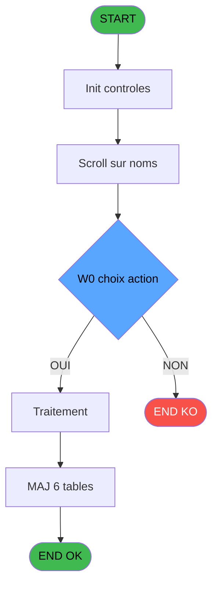
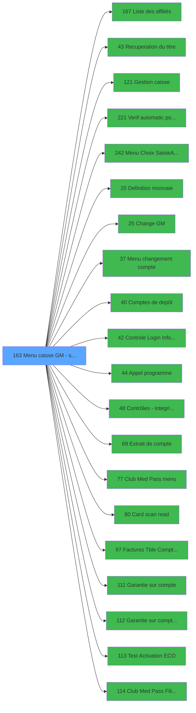

# ADH IDE 163 - Menu caisse GM - scroll

> **Analyse**: Phases 1-4 2026-02-07 03:51 -> 03:46 (23h54min) | Assemblage 03:46
> **Pipeline**: V7.2 Enrichi
> **Structure**: 4 onglets (Resume | Ecrans | Donnees | Connexions)

<!-- TAB:Resume -->

## 1. FICHE D'IDENTITE

| Attribut | Valeur |
|----------|--------|
| Projet | ADH |
| IDE Position | 163 |
| Nom Programme | Menu caisse GM - scroll |
| Fichier source | `Prg_163.xml` |
| Dossier IDE | Caisse |
| Taches | 39 (7 ecrans visibles) |
| Tables modifiees | 6 |
| Programmes appeles | 20 |
| Complexite | **MOYENNE** (score 55/100) |

## 2. DESCRIPTION FONCTIONNELLE

ADH IDE 163 est le menu caisse principal du système de gestion des clubs. C'est un programme de navigation centralisé qui s'exécute après l'authentification utilisateur et propose à l'opérateur l'accès à toutes les fonctionnalités de caisse : gestion des sessions, saisie de ventes, change de devises, gestion des comptes d'adhérents, et accès à divers utilitaires (factures, garanties, impression tickets). Le programme assure aussi des vérifications préalables critiques : détection des stations de travail éteintes, vérification du statut pooling, et validation de l'intégrité des données de session.

Le flux principal du programme implique un menu scrollable d'actions disponibles selon les droits de l'opérateur et l'état du club. Après chaque action (appel à un sous-programme), le menu se réaffiche automatiquement pour permettre une navigation fluide. Le programme gère les cas d'erreur courants : station inactive, données corrompues, sessions concurrentes détectées via la table `histo_fusionseparation`.

Les tables modifiées reflètent la nature transversale du programme : enregistrement de clôtures réseau (`reseau_cloture`), recherche et mise à jour des profils adhérents (`gm-recherche`, `gm-complet`), et suivi des fusions/séparations de comptes pour audite. Le logging dans `log_booker` permet la traçabilité complète des opérations effectuées via ce menu central.

## 3. BLOCS FONCTIONNELS

### 3.1 Traitement (32 taches)

Traitements internes.

---

#### 163 - (sans nom) [[ECRAN]](#ecran-t1)

**Role** : Tache d'orchestration : point d'entree du programme (32 sous-taches). Coordonne l'enchainement des traitements.
**Ecran** : 640 x 184 DLU (SDI) | [Voir mockup](#ecran-t1)

31 sous-taches directes

| Tache | Nom | Bloc |
|-------|-----|------|
| [163.1](#t2) | Station eteinte erreur v1 | Traitement |
| [163.2](#t3) | Station eteinte erreur v1 | Traitement |
| [163.3](#t4) | Scroll sur noms **[[ECRAN]](#ecran-t4)** | Traitement |
| [163.3.1](#t5) | Existe FusSep | Traitement |
| [163.3.2](#t6) | Action | Traitement |
| [163.3.3](#t7) | (sans nom) **[[ECRAN]](#ecran-t7)** | Traitement |
| [163.3.3.1](#t8) | mise a jour des parametres | Traitement |
| [163.3.4](#t9) | Lecture session | Traitement |
| [163.3.5](#t10) | Groupement / Separation **[[ECRAN]](#ecran-t10)** | Traitement |
| [163.3.5.1](#t11) | Detail pour le support **[[ECRAN]](#ecran-t11)** | Traitement |
| [163.3.5.2](#t12) | Detail pour le support **[[ECRAN]](#ecran-t12)** | Traitement |
| [163.4](#t13) | Menu caisse                1.3 **[[ECRAN]](#ecran-t13)** | Traitement |
| [163.4.2](#t15) | GM purge ? | Traitement |
| [163.4.3](#t16) | GM purge ? | Traitement |
| [163.4.4](#t17) | Appel programme | Traitement |
| [163.4.5](#t18) | GESTION RESP? | Traitement |
| [163.4.6](#t19) | Lecture email | Traitement |
| [163.4.7](#t20) | recup terminal | Traitement |
| [163.4.8](#t21) | recup terminal | Traitement |
| [163.4.9](#t22) | Menu caisse                1.3 **[[ECRAN]](#ecran-t22)** | Traitement |
| [163.4.9.1](#t23) | SendMail | Traitement |
| [163.8](#t27) | Lecture paramètres par     1.6 | Traitement |
| [163.8.1](#t28) | Paramètres caisse | Traitement |
| [163.9](#t29) | Lecture Paramètres TEL     1.7 | Traitement |
| [163.10](#t30) | Lecture Parametre Change | Traitement |
| [163.11](#t31) | Messages autres | Traitement |
| [163.12.1](#t33) | Solde GM | Traitement |
| [163.13](#t34) | read FROM_IMS | Traitement |
| [163.14](#t35) | read COFFRE2 | Traitement |
| [163.15](#t36) | read COFFRE2 | Traitement |
| [163.4.11.1](#t51) | Solde GM | Traitement |

---

#### 163.1 - Station eteinte erreur v1

**Role** : Traitement : Station eteinte erreur v1.

---

#### 163.2 - Station eteinte erreur v1

**Role** : Traitement : Station eteinte erreur v1.

---

#### 163.3 - Scroll sur noms [[ECRAN]](#ecran-t4)

**Role** : Traitement : Scroll sur noms.
**Ecran** : 1347 x 271 DLU (MDI) | [Voir mockup](#ecran-t4)

---

#### 163.3.1 - Existe FusSep

**Role** : Traitement : Existe FusSep.

---

#### 163.3.2 - Action

**Role** : Traitement : Action.
**Variables liees** : FH (W0 choix action)

---

#### 163.3.3 - (sans nom) [[ECRAN]](#ecran-t7)

**Role** : Traitement interne.
**Ecran** : 404 x 183 DLU (SDI) | [Voir mockup](#ecran-t7)

---

#### 163.3.3.1 - mise a jour des parametres

**Role** : Traitement : mise a jour des parametres.

---

#### 163.3.4 - Lecture session

**Role** : Traitement : Lecture session.
**Variables liees** : GP (W0 Libelle session caisse)

---

#### 163.3.5 - Groupement / Separation [[ECRAN]](#ecran-t10)

**Role** : Traitement : Groupement / Separation.
**Ecran** : 523 x 112 DLU (SDI) | [Voir mockup](#ecran-t10)

---

#### 163.3.5.1 - Detail pour le support [[ECRAN]](#ecran-t11)

**Role** : Traitement : Detail pour le support.
**Ecran** : 989 x 169 DLU (SDI) | [Voir mockup](#ecran-t11)

---

#### 163.3.5.2 - Detail pour le support [[ECRAN]](#ecran-t12)

**Role** : Traitement : Detail pour le support.
**Ecran** : 989 x 169 DLU (SDI) | [Voir mockup](#ecran-t12)

---

#### 163.4 - Menu caisse                1.3 [[ECRAN]](#ecran-t13)

**Role** : Traitement : Menu caisse                1.3.
**Ecran** : 1238 x 312 DLU (MDI) | [Voir mockup](#ecran-t13)
**Variables liees** : FD (P0 nouvelle gestion caisse), GH (W0 titre menu caisse), GP (W0 Libelle session caisse), GQ (W0 Etat caisse), GZ (v.affichage menu)

---

#### 163.4.2 - GM purge ?

**Role** : Traitement : GM purge ?.

---

#### 163.4.3 - GM purge ?

**Role** : Traitement : GM purge ?.

---

#### 163.4.4 - Appel programme

**Role** : Traitement : Appel programme.
**Variables liees** : FL (WP0 prog d'appel)

---

#### 163.4.5 - GESTION RESP?

**Role** : Gestion du moyen de paiement : GESTION RESP?.
**Variables liees** : FD (P0 nouvelle gestion caisse)

---

#### 163.4.6 - Lecture email

**Role** : Traitement : Lecture email.

---

#### 163.4.7 - recup terminal

**Role** : Consultation/chargement : recup terminal.
**Variables liees** : GU (W0 TERMINAL COFFRE2)

---

#### 163.4.8 - recup terminal

**Role** : Consultation/chargement : recup terminal.
**Variables liees** : GU (W0 TERMINAL COFFRE2)

---

#### 163.4.9 - Menu caisse                1.3 [[ECRAN]](#ecran-t22)

**Role** : Traitement : Menu caisse                1.3.
**Ecran** : 667 x 139 DLU (MDI) | [Voir mockup](#ecran-t22)
**Variables liees** : FD (P0 nouvelle gestion caisse), GH (W0 titre menu caisse), GP (W0 Libelle session caisse), GQ (W0 Etat caisse), GZ (v.affichage menu)

---

#### 163.4.9.1 - SendMail

**Role** : Traitement : SendMail.

---

#### 163.8 - Lecture paramètres par     1.6

**Role** : Traitement : Lecture paramètres par     1.6.

---

#### 163.8.1 - Paramètres caisse

**Role** : Traitement : Paramètres caisse.
**Variables liees** : FD (P0 nouvelle gestion caisse), GH (W0 titre menu caisse), GP (W0 Libelle session caisse), GQ (W0 Etat caisse)

---

#### 163.9 - Lecture Paramètres TEL     1.7

**Role** : Traitement : Lecture Paramètres TEL     1.7.

---

#### 163.10 - Lecture Parametre Change

**Role** : Traitement : Lecture Parametre Change.

---

#### 163.11 - Messages autres

**Role** : Traitement : Messages autres.
**Variables liees** : GM (W0 message autres affilies)

---

#### 163.12.1 - Solde GM

**Role** : Consultation/chargement : Solde GM.

---

#### 163.13 - read FROM_IMS

**Role** : Traitement : read FROM_IMS.

---

#### 163.14 - read COFFRE2

**Role** : Traitement : read COFFRE2.
**Variables liees** : GU (W0 TERMINAL COFFRE2), GV (v.Hostname coffre2), GW (v.Host courant coffre2 ?)

---

#### 163.15 - read COFFRE2

**Role** : Traitement : read COFFRE2.
**Variables liees** : GU (W0 TERMINAL COFFRE2), GV (v.Hostname coffre2), GW (v.Host courant coffre2 ?)

---

#### 163.4.11.1 - Solde GM

**Role** : Consultation/chargement : Solde GM.

### 3.2 Consultation (2 taches)

Ecrans de recherche et consultation.

---

#### 163.4.1 - Affichage donnees adherent [[ECRAN]](#ecran-t14)

**Role** : Reinitialisation : Affichage donnees adherent.
**Ecran** : 1236 x 67 DLU (Modal) | [Voir mockup](#ecran-t14)
**Variables liees** : GF (W0 affichage presence), GZ (v.affichage menu)

---

#### 163.4.10 - Affichage sessions [[ECRAN]](#ecran-t47)

**Role** : Reinitialisation : Affichage sessions.
**Ecran** : 338 x 41 DLU (MDI) | [Voir mockup](#ecran-t47)
**Variables liees** : GF (W0 affichage presence), GZ (v.affichage menu)

### 3.3 Saisie (3 taches)

Ce bloc traite la saisie des donnees de la transaction.

---

#### 163.5 - Saisie nbre decimales

**Role** : Saisie des donnees : Saisie nbre decimales.
**Variables liees** : ET (P0 nbre_de_decimales)
**Delegue a** : [Menu Choix Saisie/Annul vente (IDE 242)](ADH-IDE-242.md)

---

#### 163.6 - Saisie nbre decimales

**Role** : Saisie des donnees : Saisie nbre decimales.
**Variables liees** : ET (P0 nbre_de_decimales)
**Delegue a** : [Menu Choix Saisie/Annul vente (IDE 242)](ADH-IDE-242.md)

---

#### 163.7 - Saisie nbre decimales

**Role** : Saisie des donnees : Saisie nbre decimales.
**Variables liees** : ET (P0 nbre_de_decimales)
**Delegue a** : [Menu Choix Saisie/Annul vente (IDE 242)](ADH-IDE-242.md)

### 3.4 Calcul (2 taches)

Calculs metier : montants, stocks, compteurs.

---

#### 163.12 - Recalcul solde

**Role** : Calcul : Recalcul solde.
**Delegue a** : [Menu changement compte (IDE 37)](ADH-IDE-37.md), [Comptes de depôt (IDE 40)](ADH-IDE-40.md), [Extrait de compte (IDE 69)](ADH-IDE-69.md)

---

#### 163.4.11 - Recalcul solde

**Role** : Calcul : Recalcul solde.
**Delegue a** : [Menu changement compte (IDE 37)](ADH-IDE-37.md), [Comptes de depôt (IDE 40)](ADH-IDE-40.md), [Extrait de compte (IDE 69)](ADH-IDE-69.md)

## 5. REGLES METIER

17 regles identifiees:

### Consultation (1 regles)

#### [RM-013] Condition composite: Counter (0)=1 OR v.affichage menu [CM]

| Element | Detail |
|---------|--------|
| **Condition** | `Counter (0)=1 OR v.affichage menu [CM]` |
| **Si vrai** | Action si vrai |
| **Variables** | GZ (v.affichage menu) |
| **Expression source** | Expression 26 : `Counter (0)=1 OR v.affichage menu [CM]` |
| **Exemple** | Si Counter (0)=1 OR v.affichage menu [CM] → Action si vrai |
| **Impact** | [163.4 - Menu caisse                1.3](#t13) |

### Saisie (12 regles)

#### [RM-001] Condition: W0 choix action [U] egale 'S'

| Element | Detail |
|---------|--------|
| **Condition** | `W0 choix action [U]='S'` |
| **Si vrai** | Action si vrai |
| **Variables** | FH (W0 choix action) |
| **Expression source** | Expression 2 : `W0 choix action [U]='S'` |
| **Exemple** | Si W0 choix action [U]='S' → Action si vrai |
| **Impact** | [163.3.2 - Action](#t6) |

#### [RM-002] Condition: parametre CHANGEAPPLICATION egale 'N'

| Element | Detail |
|---------|--------|
| **Condition** | `W0 choix action [U]='F' AND GetParam ('CHANGEAPPLICATION')='N'` |
| **Si vrai** | Action si CHANGEAPPLICATION = 'N' |
| **Variables** | FH (W0 choix action) |
| **Expression source** | Expression 3 : `W0 choix action [U]='F' AND GetParam ('CHANGEAPPLICATION')='` |
| **Exemple** | Si W0 choix action [U]='F' AND GetParam ('CHANGEAPPLICATION')='N' → Action si CHANGEAPPLICATION = 'N' |
| **Impact** | [163.3.2 - Action](#t6) |

#### [RM-003] Condition: W0 choix action [U] egale 'M'

| Element | Detail |
|---------|--------|
| **Condition** | `W0 choix action [U]='M'` |
| **Si vrai** | Action si vrai |
| **Variables** | FH (W0 choix action) |
| **Expression source** | Expression 4 : `W0 choix action [U]='M'` |
| **Exemple** | Si W0 choix action [U]='M' → Action si vrai |
| **Impact** | [163.3.2 - Action](#t6) |

#### [RM-004] Condition: W0 choix action [U] egale 'A'

| Element | Detail |
|---------|--------|
| **Condition** | `W0 choix action [U]='A'` |
| **Si vrai** | Action si vrai |
| **Variables** | FH (W0 choix action) |
| **Expression source** | Expression 5 : `W0 choix action [U]='A'` |
| **Exemple** | Si W0 choix action [U]='A' → Action si vrai |
| **Impact** | [163.3.2 - Action](#t6) |

#### [RM-005] Condition: W0 choix action [U]='C' OR W0 choix action [U] egale 'A'

| Element | Detail |
|---------|--------|
| **Condition** | `W0 choix action [U]='C' OR W0 choix action [U]='A'` |
| **Si vrai** | Action si vrai |
| **Variables** | FH (W0 choix action) |
| **Expression source** | Expression 6 : `W0 choix action [U]='C' OR W0 choix action [U]='A'` |
| **Exemple** | Si W0 choix action [U]='C' OR W0 choix action [U]='A' → Action si vrai |
| **Impact** | [163.3.2 - Action](#t6) |

#### [RM-006] Condition: W0 choix action [U] egale 'F'

| Element | Detail |
|---------|--------|
| **Condition** | `W0 choix action [U]='F'` |
| **Si vrai** | Action si vrai |
| **Variables** | FH (W0 choix action) |
| **Expression source** | Expression 10 : `W0 choix action [U]='F'` |
| **Exemple** | Si W0 choix action [U]='F' → Action si vrai |
| **Impact** | [163.3.2 - Action](#t6) |

#### [RM-007] Condition: W0 utilisation caiss [BO] egale 'O'

| Element | Detail |
|---------|--------|
| **Condition** | `W0 utilisation caiss [BO]='O'` |
| **Si vrai** | Action si vrai |
| **Variables** | GB (W0 utilisation caiss) |
| **Expression source** | Expression 11 : `W0 utilisation caiss [BO]='O'` |
| **Exemple** | Si W0 utilisation caiss [BO]='O' → Action si vrai |
| **Impact** | Bloc Saisie |

#### [RM-008] Condition: W0 utilisation caiss [BO] different de 'O'

| Element | Detail |
|---------|--------|
| **Condition** | `W0 utilisation caiss [BO]<>'O'` |
| **Si vrai** | Action si vrai |
| **Variables** | GB (W0 utilisation caiss) |
| **Expression source** | Expression 12 : `W0 utilisation caiss [BO]<>'O'` |
| **Exemple** | Si W0 utilisation caiss [BO]<>'O' → Action si vrai |
| **Impact** | Bloc Saisie |

#### [RM-010] Condition: W0 Status Club Med Pass [CA] egale 'O'

| Element | Detail |
|---------|--------|
| **Condition** | `W0 Status Club Med Pass [CA]='O'` |
| **Si vrai** | Action si vrai |
| **Variables** | GN (W0 Status Club Med Pass) |
| **Expression source** | Expression 21 : `W0 Status Club Med Pass [CA]='O'` |
| **Exemple** | Si W0 Status Club Med Pass [CA]='O' → Action si vrai |
| **Impact** | Bloc Saisie |

#### [RM-014] Condition: W0 Etat caisse [CD]='F' OR W0 Etat caisse [CD] egale 'Q'

| Element | Detail |
|---------|--------|
| **Condition** | `W0 Etat caisse [CD]='F' OR W0 Etat caisse [CD]='Q'` |
| **Si vrai** | Action si vrai |
| **Variables** | GQ (W0 Etat caisse) |
| **Expression source** | Expression 27 : `W0 Etat caisse [CD]='F' OR W0 Etat caisse [CD]='Q'` |
| **Exemple** | Si W0 Etat caisse [CD]='F' OR W0 Etat caisse [CD]='Q' → Action si vrai |
| **Impact** | Bloc Saisie |

#### [RM-015] Condition: W0 Etat caisse [CD]='O' OR W0 Etat caisse [CD] egale 'C'

| Element | Detail |
|---------|--------|
| **Condition** | `W0 Etat caisse [CD]='O' OR W0 Etat caisse [CD]='C'` |
| **Si vrai** | Action si vrai |
| **Variables** | GQ (W0 Etat caisse) |
| **Expression source** | Expression 28 : `W0 Etat caisse [CD]='O' OR W0 Etat caisse [CD]='C'` |
| **Exemple** | Si W0 Etat caisse [CD]='O' OR W0 Etat caisse [CD]='C' → Action si vrai |
| **Impact** | Bloc Saisie |

#### [RM-016] Condition: W0 Choix conf quitter [CF] egale 6

| Element | Detail |
|---------|--------|
| **Condition** | `W0 Choix conf quitter [CF]=6` |
| **Si vrai** | Action si vrai |
| **Variables** | GS (W0 Choix conf quitter) |
| **Expression source** | Expression 29 : `W0 Choix conf quitter [CF]=6` |
| **Exemple** | Si W0 Choix conf quitter [CF]=6 → Action si vrai |
| **Impact** | Bloc Saisie |

### Autres (4 regles)

#### [RM-009] Negation de (FileExist ('%club_trav%Connect.dat')) AND P0 village à tel ? [C]='O' (condition inversee)

| Element | Detail |
|---------|--------|
| **Condition** | `NOT (FileExist ('%club_trav%Connect.dat')) AND P0 village à tel ? [C]='O'` |
| **Si vrai** | Action si vrai |
| **Variables** | EP (P0 village à tel ?) |
| **Expression source** | Expression 20 : `NOT (FileExist ('%club_trav%Connect.dat')) AND P0 village à ` |
| **Exemple** | Si NOT (FileExist ('%club_trav%Connect.dat')) AND P0 village à tel ? [C]='O' → Action si vrai |

#### [RM-011] Condition: P0 nouvelle gestion ca... [Q] egale 'N'

| Element | Detail |
|---------|--------|
| **Condition** | `P0 nouvelle gestion ca... [Q]='N'` |
| **Si vrai** | Action si vrai |
| **Expression source** | Expression 24 : `P0 nouvelle gestion ca... [Q]='N'` |
| **Exemple** | Si P0 nouvelle gestion ca... [Q]='N' → Action si vrai |
| **Impact** | [163.4.5 - GESTION RESP?](#t18) |

#### [RM-012] Condition: P0 nouvelle gestion ca... [Q] egale 'O'

| Element | Detail |
|---------|--------|
| **Condition** | `P0 nouvelle gestion ca... [Q]='O'` |
| **Si vrai** | Action si vrai |
| **Expression source** | Expression 25 : `P0 nouvelle gestion ca... [Q]='O'` |
| **Exemple** | Si P0 nouvelle gestion ca... [Q]='O' → Action si vrai |
| **Impact** | [163.4.5 - GESTION RESP?](#t18) |

#### [RM-017] Negation de VG78 (condition inversee)

| Element | Detail |
|---------|--------|
| **Condition** | `NOT VG78` |
| **Si vrai** | Action si vrai |
| **Expression source** | Expression 33 : `NOT VG78` |
| **Exemple** | Si NOT VG78 → Action si vrai |

## 6. CONTEXTE

- **Appele par**: [Main Program (IDE 1)](ADH-IDE-1.md)
- **Appelle**: 20 programmes | **Tables**: 41 (W:6 R:17 L:29) | **Taches**: 39 | **Expressions**: 35

<!-- TAB:Ecrans -->

## 8. ECRANS

### 8.1 Forms visibles (7 / 39)

| # | Position | Tache | Nom | Type | Largeur | Hauteur | Bloc |
|---|----------|-------|-----|------|---------|---------|------|
| 1 | 163.3 | 163.3 | Scroll sur noms | MDI | 1347 | 271 | Traitement |
| 2 | 163.3.3 | 163.3.3 | (sans nom) | SDI | 404 | 183 | Traitement |
| 3 | 163.3.5 | 163.3.5 | Groupement / Separation | SDI | 523 | 112 | Traitement |
| 4 | 163.3.5.1 | 163.3.5.1 | Detail pour le support | SDI | 989 | 169 | Traitement |
| 5 | 163.3.5.2 | 163.3.5.2 | Detail pour le support | SDI | 989 | 169 | Traitement |
| 6 | 163.4 | 163.4 | Menu caisse                1.3 | MDI | 1238 | 312 | Traitement |
| 7 | 163.4.2 | 163.4.1 | Affichage donnees adherent | Modal | 1236 | 67 | Consultation |

### 8.2 Mockups Ecrans

---

#### 163.3 - Scroll sur noms
**Tache** : [163.3](#t4) | **Type** : MDI | **Dimensions** : 1347 x 271 DLU
**Bloc** : Traitement | **Titre IDE** : Scroll sur noms

<!-- FORM-DATA:
{
    "width":  1347,
    "vFactor":  8,
    "type":  "MDI",
    "hFactor":  8,
    "controls":  [
                     {
                         "x":  0,
                         "type":  "label",
                         "var":  "",
                         "y":  0,
                         "w":  1342,
                         "fmt":  "",
                         "name":  "",
                         "h":  21,
                         "color":  "",
                         "text":  "",
                         "parent":  null
                     },
                     {
                         "x":  478,
                         "type":  "label",
                         "var":  "",
                         "y":  6,
                         "w":  365,
                         "fmt":  "",
                         "name":  "",
                         "h":  8,
                         "color":  "143",
                         "text":  "Probleme sur le PC pooling telephone",
                         "parent":  null
                     },
                     {
                         "x":  478,
                         "type":  "label",
                         "var":  "",
                         "y":  6,
                         "w":  365,
                         "fmt":  "",
                         "name":  "",
                         "h":  8,
                         "color":  "142",
                         "text":  "Veuillez verifier le PC pooling telephone",
                         "parent":  1
                     },
                     {
                         "x":  0,
                         "type":  "label",
                         "var":  "",
                         "y":  219,
                         "w":  1342,
                         "fmt":  "",
                         "name":  "",
                         "h":  24,
                         "color":  "",
                         "text":  "",
                         "parent":  null
                     },
                     {
                         "x":  0,
                         "type":  "label",
                         "var":  "",
                         "y":  246,
                         "w":  1342,
                         "fmt":  "",
                         "name":  "",
                         "h":  24,
                         "color":  "",
                         "text":  "",
                         "parent":  null
                     },
                     {
                         "x":  1,
                         "type":  "label",
                         "var":  "",
                         "y":  28,
                         "w":  241,
                         "fmt":  "",
                         "name":  "",
                         "h":  185,
                         "color":  "",
                         "text":  "",
                         "parent":  null
                     },
                     {
                         "x":  3,
                         "type":  "label",
                         "var":  "",
                         "y":  120,
                         "w":  236,
                         "fmt":  "",
                         "name":  "",
                         "h":  10,
                         "color":  "142",
                         "text":  "Nom du GM",
                         "parent":  11
                     },
                     {
                         "x":  245,
                         "type":  "table",
                         "var":  "",
                         "name":  "",
                         "titleH":  12,
                         "color":  "148",
                         "w":  1093,
                         "y":  32,
                         "fmt":  "",
                         "parent":  null,
                         "text":  "",
                         "rowH":  14,
                         "h":  185,
                         "cols":  [
                                      {
                                          "title":  "Nom",
                                          "layer":  1,
                                          "w":  495
                                      },
                                      {
                                          "title":  "Prénom",
                                          "layer":  2,
                                          "w":  121
                                      },
                                      {
                                          "title":  "Sexe",
                                          "layer":  3,
                                          "w":  48
                                      },
                                      {
                                          "title":  "Chambre",
                                          "layer":  4,
                                          "w":  80
                                      },
                                      {
                                          "title":  "Divers",
                                          "layer":  5,
                                          "w":  310
                                      }
                                  ],
                         "rows":  5
                     },
                     {
                         "x":  1224,
                         "type":  "label",
                         "var":  "",
                         "y":  47,
                         "w":  18,
                         "fmt":  "",
                         "name":  "",
                         "h":  8,
                         "color":  "149",
                         "text":  "m",
                         "parent":  16
                     },
                     {
                         "x":  1239,
                         "type":  "label",
                         "var":  "",
                         "y":  47,
                         "w":  29,
                         "fmt":  "",
                         "name":  "",
                         "h":  8,
                         "color":  "149",
                         "text":  "*",
                         "parent":  16
                     },
                     {
                         "x":  252,
                         "type":  "edit",
                         "var":  "",
                         "y":  47,
                         "w":  346,
                         "fmt":  "",
                         "name":  "",
                         "h":  8,
                         "color":  "148",
                         "text":  "",
                         "parent":  16
                     },
                     {
                         "x":  751,
                         "type":  "edit",
                         "var":  "",
                         "y":  47,
                         "w":  109,
                         "fmt":  "",
                         "name":  "",
                         "h":  8,
                         "color":  "148",
                         "text":  "",
                         "parent":  16
                     },
                     {
                         "x":  997,
                         "type":  "edit",
                         "var":  "",
                         "y":  47,
                         "w":  200,
                         "fmt":  "",
                         "name":  "V.Libelle fidelsiation",
                         "h":  8,
                         "color":  "6",
                         "text":  "",
                         "parent":  16
                     },
                     {
                         "x":  916,
                         "type":  "edit",
                         "var":  "",
                         "y":  47,
                         "w":  73,
                         "fmt":  "",
                         "name":  "",
                         "h":  8,
                         "color":  "148",
                         "text":  "",
                         "parent":  16
                     },
                     {
                         "x":  36,
                         "type":  "edit",
                         "var":  "",
                         "y":  133,
                         "w":  171,
                         "fmt":  "",
                         "name":  "W1 chaîne_recherchee",
                         "h":  10,
                         "color":  "6",
                         "text":  "",
                         "parent":  11
                     },
                     {
                         "x":  36,
                         "type":  "edit",
                         "var":  "",
                         "y":  88,
                         "w":  171,
                         "fmt":  "",
                         "name":  "GROUPEMENT",
                         "h":  10,
                         "color":  "6",
                         "text":  "",
                         "parent":  11
                     },
                     {
                         "x":  36,
                         "type":  "edit",
                         "var":  "",
                         "y":  105,
                         "w":  171,
                         "fmt":  "",
                         "name":  "SEPARATION",
                         "h":  10,
                         "color":  "6",
                         "text":  "",
                         "parent":  11
                     },
                     {
                         "x":  5,
                         "type":  "image",
                         "var":  "",
                         "y":  2,
                         "w":  59,
                         "fmt":  "",
                         "name":  "",
                         "h":  18,
                         "color":  "",
                         "text":  "",
                         "parent":  null
                     },
                     {
                         "x":  75,
                         "type":  "edit",
                         "var":  "",
                         "y":  6,
                         "w":  395,
                         "fmt":  "30",
                         "name":  "",
                         "h":  8,
                         "color":  "",
                         "text":  "",
                         "parent":  null
                     },
                     {
                         "x":  1072,
                         "type":  "edit",
                         "var":  "",
                         "y":  6,
                         "w":  259,
                         "fmt":  "WWW DD MMM YYYYT",
                         "name":  "",
                         "h":  8,
                         "color":  "",
                         "text":  "",
                         "parent":  null
                     },
                     {
                         "x":  1269,
                         "type":  "button",
                         "var":  "",
                         "y":  46,
                         "w":  29,
                         "fmt":  "F",
                         "name":  "",
                         "h":  11,
                         "color":  "",
                         "text":  "",
                         "parent":  16
                     },
                     {
                         "x":  603,
                         "type":  "image",
                         "var":  "",
                         "y":  46,
                         "w":  27,
                         "fmt":  "",
                         "name":  "",
                         "h":  10,
                         "color":  "6",
                         "text":  "",
                         "parent":  16
                     },
                     {
                         "x":  1200,
                         "type":  "image",
                         "var":  "",
                         "y":  46,
                         "w":  26,
                         "fmt":  "",
                         "name":  "",
                         "h":  10,
                         "color":  "",
                         "text":  "",
                         "parent":  16
                     },
                     {
                         "x":  872,
                         "type":  "edit",
                         "var":  "",
                         "y":  47,
                         "w":  31,
                         "fmt":  "2",
                         "name":  "",
                         "h":  8,
                         "color":  "148",
                         "text":  "",
                         "parent":  16
                     },
                     {
                         "x":  7,
                         "type":  "image",
                         "var":  "",
                         "y":  31,
                         "w":  78,
                         "fmt":  "",
                         "name":  "",
                         "h":  29,
                         "color":  "",
                         "text":  "",
                         "parent":  null
                     },
                     {
                         "x":  87,
                         "type":  "image",
                         "var":  "",
                         "y":  31,
                         "w":  149,
                         "fmt":  "",
                         "name":  "",
                         "h":  43,
                         "color":  "",
                         "text":  "",
                         "parent":  null
                     },
                     {
                         "x":  9,
                         "type":  "button",
                         "var":  "",
                         "y":  150,
                         "w":  218,
                         "fmt":  "\u0026Prenom",
                         "name":  "PRENOM",
                         "h":  18,
                         "color":  "",
                         "text":  "",
                         "parent":  null
                     },
                     {
                         "x":  9,
                         "type":  "button",
                         "var":  "",
                         "y":  222,
                         "w":  218,
                         "fmt":  "\u0026Quitter",
                         "name":  "",
                         "h":  18,
                         "color":  "",
                         "text":  "",
                         "parent":  null
                     },
                     {
                         "x":  231,
                         "type":  "button",
                         "var":  "",
                         "y":  222,
                         "w":  218,
                         "fmt":  "Comptes speciaux",
                         "name":  "",
                         "h":  18,
                         "color":  "",
                         "text":  "",
                         "parent":  null
                     },
                     {
                         "x":  1113,
                         "type":  "button",
                         "var":  "",
                         "y":  222,
                         "w":  218,
                         "fmt":  "\u0026Scan Club Med Pass",
                         "name":  "",
                         "h":  18,
                         "color":  "",
                         "text":  "",
                         "parent":  null
                     },
                     {
                         "x":  9,
                         "type":  "edit",
                         "var":  "",
                         "y":  250,
                         "w":  1109,
                         "fmt":  "128",
                         "name":  "",
                         "h":  18,
                         "color":  "148",
                         "text":  "",
                         "parent":  null
                     },
                     {
                         "x":  9,
                         "type":  "edit",
                         "var":  "",
                         "y":  250,
                         "w":  1096,
                         "fmt":  "128",
                         "name":  "",
                         "h":  18,
                         "color":  "148",
                         "text":  "",
                         "parent":  null
                     },
                     {
                         "x":  1113,
                         "type":  "button",
                         "var":  "",
                         "y":  250,
                         "w":  218,
                         "fmt":  "Gestion \u0026caisse",
                         "name":  "CONTROLE",
                         "h":  18,
                         "color":  "",
                         "text":  "",
                         "parent":  null
                     },
                     {
                         "x":  638,
                         "type":  "image",
                         "var":  "",
                         "y":  47,
                         "w":  27,
                         "fmt":  "",
                         "name":  "",
                         "h":  10,
                         "color":  "6",
                         "text":  "",
                         "parent":  16
                     },
                     {
                         "x":  677,
                         "type":  "image",
                         "var":  "",
                         "y":  47,
                         "w":  30,
                         "fmt":  "",
                         "name":  "",
                         "h":  11,
                         "color":  "6",
                         "text":  "",
                         "parent":  16
                     },
                     {
                         "x":  707,
                         "type":  "image",
                         "var":  "",
                         "y":  47,
                         "w":  30,
                         "fmt":  "",
                         "name":  "",
                         "h":  11,
                         "color":  "6",
                         "text":  "",
                         "parent":  16
                     },
                     {
                         "x":  453,
                         "type":  "button",
                         "var":  "",
                         "y":  222,
                         "w":  218,
                         "fmt":  "TB_WS",
                         "name":  "",
                         "h":  18,
                         "color":  "",
                         "text":  "",
                         "parent":  null
                     }
                 ],
    "taskId":  "163.3",
    "height":  271
}
-->

<strong>Champs : 12 champs</strong>

| Pos (x,y) | Nom | Variable | Type |
|-----------|-----|----------|------|
| 252,47 | (sans nom) | - | edit |
| 751,47 | (sans nom) | - | edit |
| 997,47 | V.Libelle fidelsiation | - | edit |
| 916,47 | (sans nom) | - | edit |
| 36,133 | W1 chaîne_recherchee | - | edit |
| 36,88 | GROUPEMENT | - | edit |
| 36,105 | SEPARATION | - | edit |
| 75,6 | 30 | - | edit |
| 1072,6 | WWW DD MMM YYYYT | - | edit |
| 872,47 | 2 | - | edit |
| 9,250 | 128 | - | edit |
| 9,250 | 128 | - | edit |

<strong>Boutons : 7 boutons</strong>

| Bouton | Pos (x,y) | Action |
|--------|-----------|--------|
| F | 1269,46 | Bouton fonctionnel |
| Prenom | 9,150 | Identification du client |
| Quitter | 9,222 | Quitte le programme |
| Comptes speciaux | 231,222 | Appel [Menu changement compte (IDE 37)](ADH-IDE-37.md) |
| Scan Club Med Pass | 1113,222 | Appel [   Card scan read (IDE 80)](ADH-IDE-80.md) |
| Gestion caisse | 1113,250 | Appel [Gestion caisse (IDE 121)](ADH-IDE-121.md) |
| TB_WS | 453,222 | Bouton fonctionnel |

---

#### 163.3.3 - (sans nom)
**Tache** : [163.3.3](#t7) | **Type** : SDI | **Dimensions** : 404 x 183 DLU
**Bloc** : Traitement | **Titre IDE** : (sans nom)

<!-- FORM-DATA:
{
    "width":  404,
    "vFactor":  8,
    "type":  "SDI",
    "hFactor":  8,
    "controls":  [
                     {
                         "x":  29,
                         "type":  "table",
                         "var":  "",
                         "name":  "",
                         "titleH":  12,
                         "color":  "110",
                         "w":  347,
                         "y":  24,
                         "fmt":  "",
                         "parent":  null,
                         "text":  "",
                         "rowH":  14,
                         "h":  132,
                         "cols":  [
                                      {
                                          "title":  "",
                                          "layer":  1,
                                          "w":  314
                                      }
                                  ],
                         "rows":  1
                     },
                     {
                         "x":  34,
                         "type":  "edit",
                         "var":  "",
                         "y":  8,
                         "w":  336,
                         "fmt":  "",
                         "name":  "",
                         "h":  16,
                         "color":  "142",
                         "text":  "",
                         "parent":  null
                     },
                     {
                         "x":  35,
                         "type":  "edit",
                         "var":  "",
                         "y":  26,
                         "w":  309,
                         "fmt":  "UXXXXXXXXX",
                         "name":  "GMR prenom (8)",
                         "h":  10,
                         "color":  "110",
                         "text":  "",
                         "parent":  2
                     },
                     {
                         "x":  32,
                         "type":  "button",
                         "var":  "",
                         "y":  160,
                         "w":  152,
                         "fmt":  "",
                         "name":  "B. Valider",
                         "h":  14,
                         "color":  "",
                         "text":  "",
                         "parent":  null
                     },
                     {
                         "x":  208,
                         "type":  "button",
                         "var":  "",
                         "y":  160,
                         "w":  168,
                         "fmt":  "",
                         "name":  "B. Quitter",
                         "h":  14,
                         "color":  "",
                         "text":  "",
                         "parent":  null
                     }
                 ],
    "taskId":  "163.3.3",
    "height":  183
}
-->

<strong>Champs : 2 champs</strong>

| Pos (x,y) | Nom | Variable | Type |
|-----------|-----|----------|------|
| 34,8 | (sans nom) | - | edit |
| 35,26 | GMR prenom (8) | - | edit |

<strong>Boutons : 2 boutons</strong>

| Bouton | Pos (x,y) | Action |
|--------|-----------|--------|
| B. Valider | 32,160 | Valide la saisie et enregistre |
| B. Quitter | 208,160 | Quitte le programme |

---

#### 163.3.5 - Groupement / Separation
**Tache** : [163.3.5](#t10) | **Type** : SDI | **Dimensions** : 523 x 112 DLU
**Bloc** : Traitement | **Titre IDE** : Groupement / Separation

<!-- FORM-DATA:
{
    "width":  523,
    "vFactor":  8,
    "type":  "SDI",
    "hFactor":  8,
    "controls":  [
                     {
                         "x":  0,
                         "type":  "label",
                         "var":  "",
                         "y":  87,
                         "w":  523,
                         "fmt":  "",
                         "name":  "",
                         "h":  24,
                         "color":  "",
                         "text":  "",
                         "parent":  null
                     },
                     {
                         "x":  7,
                         "type":  "table",
                         "var":  "",
                         "name":  "",
                         "titleH":  12,
                         "color":  "196",
                         "w":  510,
                         "y":  3,
                         "fmt":  "",
                         "parent":  null,
                         "text":  "",
                         "rowH":  13,
                         "h":  78,
                         "cols":  [
                                      {
                                          "title":  "Compte",
                                          "layer":  1,
                                          "w":  162
                                      },
                                      {
                                          "title":  "Nom",
                                          "layer":  2,
                                          "w":  348
                                      }
                                  ],
                         "rows":  2
                     },
                     {
                         "x":  13,
                         "type":  "edit",
                         "var":  "",
                         "y":  17,
                         "w":  80,
                         "fmt":  "",
                         "name":  "",
                         "h":  10,
                         "color":  "196",
                         "text":  "",
                         "parent":  3
                     },
                     {
                         "x":  103,
                         "type":  "edit",
                         "var":  "",
                         "y":  17,
                         "w":  40,
                         "fmt":  "",
                         "name":  "",
                         "h":  10,
                         "color":  "196",
                         "text":  "",
                         "parent":  3
                     },
                     {
                         "x":  232,
                         "type":  "image",
                         "var":  "",
                         "y":  90,
                         "w":  58,
                         "fmt":  "",
                         "name":  "LOUPE",
                         "h":  18,
                         "color":  "",
                         "text":  "",
                         "parent":  null
                     },
                     {
                         "x":  7,
                         "type":  "button",
                         "var":  "",
                         "y":  90,
                         "w":  160,
                         "fmt":  "\u0026Selectionner",
                         "name":  "",
                         "h":  18,
                         "color":  "",
                         "text":  "",
                         "parent":  null
                     },
                     {
                         "x":  357,
                         "type":  "button",
                         "var":  "",
                         "y":  90,
                         "w":  160,
                         "fmt":  "\u0026Quitter",
                         "name":  "",
                         "h":  18,
                         "color":  "",
                         "text":  "",
                         "parent":  null
                     },
                     {
                         "x":  169,
                         "type":  "edit",
                         "var":  "",
                         "y":  17,
                         "w":  339,
                         "fmt":  "30",
                         "name":  "",
                         "h":  10,
                         "color":  "196",
                         "text":  "",
                         "parent":  3
                     }
                 ],
    "taskId":  "163.3.5",
    "height":  112
}
-->

<strong>Champs : 3 champs</strong>

| Pos (x,y) | Nom | Variable | Type |
|-----------|-----|----------|------|
| 13,17 | (sans nom) | - | edit |
| 103,17 | (sans nom) | - | edit |
| 169,17 | 30 | - | edit |

<strong>Boutons : 2 boutons</strong>

| Bouton | Pos (x,y) | Action |
|--------|-----------|--------|
| Selectionner | 7,90 | Ouvre la selection |
| Quitter | 357,90 | Quitte le programme |

---

#### 163.3.5.1 - Detail pour le support
**Tache** : [163.3.5.1](#t11) | **Type** : SDI | **Dimensions** : 989 x 169 DLU
**Bloc** : Traitement | **Titre IDE** : Detail pour le support

<!-- FORM-DATA:
{
    "width":  989,
    "vFactor":  8,
    "type":  "SDI",
    "hFactor":  8,
    "controls":  [
                     {
                         "x":  14,
                         "type":  "label",
                         "var":  "",
                         "y":  5,
                         "w":  61,
                         "fmt":  "",
                         "name":  "",
                         "h":  8,
                         "color":  "",
                         "text":  "chrono",
                         "parent":  null
                     },
                     {
                         "x":  610,
                         "type":  "label",
                         "var":  "",
                         "y":  11,
                         "w":  150,
                         "fmt":  "",
                         "name":  "",
                         "h":  8,
                         "color":  "",
                         "text":  "runAfterCrash",
                         "parent":  null
                     },
                     {
                         "x":  14,
                         "type":  "label",
                         "var":  "",
                         "y":  18,
                         "w":  61,
                         "fmt":  "",
                         "name":  "",
                         "h":  10,
                         "color":  "144",
                         "text":  "done",
                         "parent":  null
                     },
                     {
                         "x":  610,
                         "type":  "label",
                         "var":  "",
                         "y":  27,
                         "w":  150,
                         "fmt":  "",
                         "name":  "",
                         "h":  8,
                         "color":  "",
                         "text":  "Valide",
                         "parent":  null
                     },
                     {
                         "x":  14,
                         "type":  "label",
                         "var":  "",
                         "y":  33,
                         "w":  61,
                         "fmt":  "",
                         "name":  "",
                         "h":  8,
                         "color":  "",
                         "text":  "type",
                         "parent":  null
                     },
                     {
                         "x":  610,
                         "type":  "label",
                         "var":  "",
                         "y":  43,
                         "w":  150,
                         "fmt":  "",
                         "name":  "",
                         "h":  8,
                         "color":  "",
                         "text":  "Compte Reference",
                         "parent":  null
                     },
                     {
                         "x":  14,
                         "type":  "label",
                         "var":  "",
                         "y":  57,
                         "w":  147,
                         "fmt":  "",
                         "name":  "",
                         "h":  8,
                         "color":  "",
                         "text":  "date start",
                         "parent":  null
                     },
                     {
                         "x":  327,
                         "type":  "label",
                         "var":  "",
                         "y":  57,
                         "w":  146,
                         "fmt":  "",
                         "name":  "",
                         "h":  8,
                         "color":  "",
                         "text":  "time start",
                         "parent":  null
                     },
                     {
                         "x":  610,
                         "type":  "label",
                         "var":  "",
                         "y":  57,
                         "w":  150,
                         "fmt":  "",
                         "name":  "",
                         "h":  8,
                         "color":  "",
                         "text":  "Filiation Reference",
                         "parent":  null
                     },
                     {
                         "x":  327,
                         "type":  "label",
                         "var":  "",
                         "y":  73,
                         "w":  146,
                         "fmt":  "",
                         "name":  "",
                         "h":  8,
                         "color":  "",
                         "text":  "time firstUpdate",
                         "parent":  null
                     },
                     {
                         "x":  618,
                         "type":  "label",
                         "var":  "",
                         "y":  73,
                         "w":  146,
                         "fmt":  "",
                         "name":  "",
                         "h":  8,
                         "color":  "",
                         "text":  "Qualite Reference",
                         "parent":  null
                     },
                     {
                         "x":  14,
                         "type":  "label",
                         "var":  "",
                         "y":  74,
                         "w":  147,
                         "fmt":  "",
                         "name":  "",
                         "h":  8,
                         "color":  "",
                         "text":  "date firstUpdate",
                         "parent":  null
                     },
                     {
                         "x":  14,
                         "type":  "label",
                         "var":  "",
                         "y":  89,
                         "w":  147,
                         "fmt":  "",
                         "name":  "",
                         "h":  8,
                         "color":  "",
                         "text":  "date tablesUpdate",
                         "parent":  null
                     },
                     {
                         "x":  327,
                         "type":  "label",
                         "var":  "",
                         "y":  90,
                         "w":  146,
                         "fmt":  "",
                         "name":  "",
                         "h":  8,
                         "color":  "",
                         "text":  "time tablesUpdate",
                         "parent":  null
                     },
                     {
                         "x":  610,
                         "type":  "label",
                         "var":  "",
                         "y":  90,
                         "w":  150,
                         "fmt":  "",
                         "name":  "",
                         "h":  8,
                         "color":  "",
                         "text":  "Etat Reseau",
                         "parent":  null
                     },
                     {
                         "x":  14,
                         "type":  "label",
                         "var":  "",
                         "y":  104,
                         "w":  147,
                         "fmt":  "",
                         "name":  "",
                         "h":  8,
                         "color":  "",
                         "text":  "date endUpdate",
                         "parent":  null
                     },
                     {
                         "x":  327,
                         "type":  "label",
                         "var":  "",
                         "y":  105,
                         "w":  146,
                         "fmt":  "",
                         "name":  "",
                         "h":  8,
                         "color":  "",
                         "text":  "time endUpdate",
                         "parent":  null
                     },
                     {
                         "x":  613,
                         "type":  "label",
                         "var":  "",
                         "y":  105,
                         "w":  168,
                         "fmt":  "",
                         "name":  "",
                         "h":  8,
                         "color":  "",
                         "text":  "Separation N compte",
                         "parent":  null
                     },
                     {
                         "x":  14,
                         "type":  "label",
                         "var":  "",
                         "y":  121,
                         "w":  147,
                         "fmt":  "",
                         "name":  "",
                         "h":  8,
                         "color":  "",
                         "text":  "date end",
                         "parent":  null
                     },
                     {
                         "x":  327,
                         "type":  "label",
                         "var":  "",
                         "y":  122,
                         "w":  146,
                         "fmt":  "",
                         "name":  "",
                         "h":  8,
                         "color":  "",
                         "text":  "time end",
                         "parent":  null
                     },
                     {
                         "x":  610,
                         "type":  "label",
                         "var":  "",
                         "y":  122,
                         "w":  150,
                         "fmt":  "",
                         "name":  "",
                         "h":  8,
                         "color":  "",
                         "text":  "Terminal",
                         "parent":  null
                     },
                     {
                         "x":  610,
                         "type":  "label",
                         "var":  "",
                         "y":  139,
                         "w":  150,
                         "fmt":  "",
                         "name":  "",
                         "h":  8,
                         "color":  "",
                         "text":  "Utilisateur",
                         "parent":  null
                     },
                     {
                         "x":  92,
                         "type":  "edit",
                         "var":  "",
                         "y":  5,
                         "w":  149,
                         "fmt":  "",
                         "name":  "",
                         "h":  10,
                         "color":  "6",
                         "text":  "",
                         "parent":  null
                     },
                     {
                         "x":  92,
                         "type":  "edit",
                         "var":  "",
                         "y":  18,
                         "w":  70,
                         "fmt":  "",
                         "name":  "",
                         "h":  10,
                         "color":  "6",
                         "text":  "",
                         "parent":  null
                     },
                     {
                         "x":  92,
                         "type":  "edit",
                         "var":  "",
                         "y":  33,
                         "w":  26,
                         "fmt":  "",
                         "name":  "",
                         "h":  10,
                         "color":  "6",
                         "text":  "",
                         "parent":  null
                     },
                     {
                         "x":  184,
                         "type":  "edit",
                         "var":  "",
                         "y":  57,
                         "w":  126,
                         "fmt":  "",
                         "name":  "",
                         "h":  10,
                         "color":  "6",
                         "text":  "",
                         "parent":  null
                     },
                     {
                         "x":  476,
                         "type":  "edit",
                         "var":  "",
                         "y":  57,
                         "w":  104,
                         "fmt":  "",
                         "name":  "",
                         "h":  10,
                         "color":  "6",
                         "text":  "",
                         "parent":  null
                     },
                     {
                         "x":  184,
                         "type":  "edit",
                         "var":  "",
                         "y":  74,
                         "w":  126,
                         "fmt":  "",
                         "name":  "",
                         "h":  10,
                         "color":  "6",
                         "text":  "",
                         "parent":  null
                     },
                     {
                         "x":  476,
                         "type":  "edit",
                         "var":  "",
                         "y":  73,
                         "w":  104,
                         "fmt":  "",
                         "name":  "",
                         "h":  10,
                         "color":  "6",
                         "text":  "",
                         "parent":  null
                     },
                     {
                         "x":  184,
                         "type":  "edit",
                         "var":  "",
                         "y":  89,
                         "w":  126,
                         "fmt":  "",
                         "name":  "",
                         "h":  10,
                         "color":  "6",
                         "text":  "",
                         "parent":  null
                     },
                     {
                         "x":  476,
                         "type":  "edit",
                         "var":  "",
                         "y":  90,
                         "w":  104,
                         "fmt":  "",
                         "name":  "",
                         "h":  10,
                         "color":  "6",
                         "text":  "",
                         "parent":  null
                     },
                     {
                         "x":  184,
                         "type":  "edit",
                         "var":  "",
                         "y":  104,
                         "w":  126,
                         "fmt":  "",
                         "name":  "",
                         "h":  10,
                         "color":  "6",
                         "text":  "",
                         "parent":  null
                     },
                     {
                         "x":  476,
                         "type":  "edit",
                         "var":  "",
                         "y":  105,
                         "w":  104,
                         "fmt":  "",
                         "name":  "",
                         "h":  10,
                         "color":  "6",
                         "text":  "",
                         "parent":  null
                     },
                     {
                         "x":  184,
                         "type":  "edit",
                         "var":  "",
                         "y":  121,
                         "w":  126,
                         "fmt":  "",
                         "name":  "",
                         "h":  10,
                         "color":  "6",
                         "text":  "",
                         "parent":  null
                     },
                     {
                         "x":  476,
                         "type":  "edit",
                         "var":  "",
                         "y":  122,
                         "w":  104,
                         "fmt":  "",
                         "name":  "",
                         "h":  10,
                         "color":  "6",
                         "text":  "",
                         "parent":  null
                     },
                     {
                         "x":  782,
                         "type":  "edit",
                         "var":  "",
                         "y":  11,
                         "w":  70,
                         "fmt":  "",
                         "name":  "",
                         "h":  10,
                         "color":  "6",
                         "text":  "",
                         "parent":  null
                     },
                     {
                         "x":  782,
                         "type":  "edit",
                         "var":  "",
                         "y":  27,
                         "w":  70,
                         "fmt":  "",
                         "name":  "",
                         "h":  10,
                         "color":  "6",
                         "text":  "",
                         "parent":  null
                     },
                     {
                         "x":  782,
                         "type":  "edit",
                         "var":  "",
                         "y":  43,
                         "w":  104,
                         "fmt":  "",
                         "name":  "",
                         "h":  10,
                         "color":  "6",
                         "text":  "",
                         "parent":  null
                     },
                     {
                         "x":  782,
                         "type":  "edit",
                         "var":  "",
                         "y":  57,
                         "w":  48,
                         "fmt":  "",
                         "name":  "",
                         "h":  10,
                         "color":  "6",
                         "text":  "",
                         "parent":  null
                     },
                     {
                         "x":  782,
                         "type":  "edit",
                         "var":  "",
                         "y":  73,
                         "w":  37,
                         "fmt":  "",
                         "name":  "",
                         "h":  10,
                         "color":  "6",
                         "text":  "",
                         "parent":  null
                     },
                     {
                         "x":  782,
                         "type":  "edit",
                         "var":  "",
                         "y":  90,
                         "w":  26,
                         "fmt":  "",
                         "name":  "",
                         "h":  10,
                         "color":  "6",
                         "text":  "",
                         "parent":  null
                     },
                     {
                         "x":  782,
                         "type":  "edit",
                         "var":  "",
                         "y":  105,
                         "w":  70,
                         "fmt":  "",
                         "name":  "",
                         "h":  10,
                         "color":  "6",
                         "text":  "",
                         "parent":  null
                     },
                     {
                         "x":  782,
                         "type":  "edit",
                         "var":  "",
                         "y":  122,
                         "w":  48,
                         "fmt":  "",
                         "name":  "",
                         "h":  10,
                         "color":  "6",
                         "text":  "",
                         "parent":  null
                     },
                     {
                         "x":  782,
                         "type":  "edit",
                         "var":  "",
                         "y":  139,
                         "w":  104,
                         "fmt":  "",
                         "name":  "",
                         "h":  10,
                         "color":  "6",
                         "text":  "",
                         "parent":  null
                     },
                     {
                         "x":  827,
                         "type":  "button",
                         "var":  "",
                         "y":  153,
                         "w":  154,
                         "fmt":  "Exit",
                         "name":  "",
                         "h":  14,
                         "color":  "",
                         "text":  "",
                         "parent":  null
                     }
                 ],
    "taskId":  "163.3.5.1",
    "height":  169
}
-->

<strong>Champs : 22 champs</strong>

| Pos (x,y) | Nom | Variable | Type |
|-----------|-----|----------|------|
| 92,5 | (sans nom) | - | edit |
| 92,18 | (sans nom) | - | edit |
| 92,33 | (sans nom) | - | edit |
| 184,57 | (sans nom) | - | edit |
| 476,57 | (sans nom) | - | edit |
| 184,74 | (sans nom) | - | edit |
| 476,73 | (sans nom) | - | edit |
| 184,89 | (sans nom) | - | edit |
| 476,90 | (sans nom) | - | edit |
| 184,104 | (sans nom) | - | edit |
| 476,105 | (sans nom) | - | edit |
| 184,121 | (sans nom) | - | edit |
| 476,122 | (sans nom) | - | edit |
| 782,11 | (sans nom) | - | edit |
| 782,27 | (sans nom) | - | edit |
| 782,43 | (sans nom) | - | edit |
| 782,57 | (sans nom) | - | edit |
| 782,73 | (sans nom) | - | edit |
| 782,90 | (sans nom) | - | edit |
| 782,105 | (sans nom) | - | edit |
| 782,122 | (sans nom) | - | edit |
| 782,139 | (sans nom) | - | edit |

<strong>Boutons : 1 boutons</strong>

| Bouton | Pos (x,y) | Action |
|--------|-----------|--------|
| Exit | 827,153 | Quitte le programme |

---

#### 163.3.5.2 - Detail pour le support
**Tache** : [163.3.5.2](#t12) | **Type** : SDI | **Dimensions** : 989 x 169 DLU
**Bloc** : Traitement | **Titre IDE** : Detail pour le support

<!-- FORM-DATA:
{
    "width":  989,
    "vFactor":  8,
    "type":  "SDI",
    "hFactor":  8,
    "controls":  [
                     {
                         "x":  14,
                         "type":  "label",
                         "var":  "",
                         "y":  5,
                         "w":  61,
                         "fmt":  "",
                         "name":  "",
                         "h":  8,
                         "color":  "",
                         "text":  "chrono",
                         "parent":  null
                     },
                     {
                         "x":  610,
                         "type":  "label",
                         "var":  "",
                         "y":  11,
                         "w":  150,
                         "fmt":  "",
                         "name":  "",
                         "h":  8,
                         "color":  "",
                         "text":  "runAfterCrash",
                         "parent":  null
                     },
                     {
                         "x":  14,
                         "type":  "label",
                         "var":  "",
                         "y":  18,
                         "w":  61,
                         "fmt":  "",
                         "name":  "",
                         "h":  10,
                         "color":  "144",
                         "text":  "done",
                         "parent":  null
                     },
                     {
                         "x":  610,
                         "type":  "label",
                         "var":  "",
                         "y":  27,
                         "w":  150,
                         "fmt":  "",
                         "name":  "",
                         "h":  8,
                         "color":  "",
                         "text":  "Valide",
                         "parent":  null
                     },
                     {
                         "x":  14,
                         "type":  "label",
                         "var":  "",
                         "y":  33,
                         "w":  61,
                         "fmt":  "",
                         "name":  "",
                         "h":  8,
                         "color":  "",
                         "text":  "type",
                         "parent":  null
                     },
                     {
                         "x":  610,
                         "type":  "label",
                         "var":  "",
                         "y":  43,
                         "w":  150,
                         "fmt":  "",
                         "name":  "",
                         "h":  8,
                         "color":  "",
                         "text":  "Compte Reference",
                         "parent":  null
                     },
                     {
                         "x":  14,
                         "type":  "label",
                         "var":  "",
                         "y":  57,
                         "w":  147,
                         "fmt":  "",
                         "name":  "",
                         "h":  8,
                         "color":  "",
                         "text":  "date start",
                         "parent":  null
                     },
                     {
                         "x":  327,
                         "type":  "label",
                         "var":  "",
                         "y":  57,
                         "w":  146,
                         "fmt":  "",
                         "name":  "",
                         "h":  8,
                         "color":  "",
                         "text":  "time start",
                         "parent":  null
                     },
                     {
                         "x":  610,
                         "type":  "label",
                         "var":  "",
                         "y":  57,
                         "w":  150,
                         "fmt":  "",
                         "name":  "",
                         "h":  8,
                         "color":  "",
                         "text":  "Filiation Reference",
                         "parent":  null
                     },
                     {
                         "x":  327,
                         "type":  "label",
                         "var":  "",
                         "y":  73,
                         "w":  146,
                         "fmt":  "",
                         "name":  "",
                         "h":  8,
                         "color":  "",
                         "text":  "time firstUpdate",
                         "parent":  null
                     },
                     {
                         "x":  618,
                         "type":  "label",
                         "var":  "",
                         "y":  73,
                         "w":  146,
                         "fmt":  "",
                         "name":  "",
                         "h":  8,
                         "color":  "",
                         "text":  "Qualite Reference",
                         "parent":  null
                     },
                     {
                         "x":  14,
                         "type":  "label",
                         "var":  "",
                         "y":  74,
                         "w":  147,
                         "fmt":  "",
                         "name":  "",
                         "h":  8,
                         "color":  "",
                         "text":  "date firstUpdate",
                         "parent":  null
                     },
                     {
                         "x":  14,
                         "type":  "label",
                         "var":  "",
                         "y":  89,
                         "w":  147,
                         "fmt":  "",
                         "name":  "",
                         "h":  8,
                         "color":  "",
                         "text":  "date tablesUpdate",
                         "parent":  null
                     },
                     {
                         "x":  327,
                         "type":  "label",
                         "var":  "",
                         "y":  90,
                         "w":  146,
                         "fmt":  "",
                         "name":  "",
                         "h":  8,
                         "color":  "",
                         "text":  "time tablesUpdate",
                         "parent":  null
                     },
                     {
                         "x":  610,
                         "type":  "label",
                         "var":  "",
                         "y":  90,
                         "w":  150,
                         "fmt":  "",
                         "name":  "",
                         "h":  8,
                         "color":  "",
                         "text":  "Etat Reseau",
                         "parent":  null
                     },
                     {
                         "x":  14,
                         "type":  "label",
                         "var":  "",
                         "y":  104,
                         "w":  147,
                         "fmt":  "",
                         "name":  "",
                         "h":  8,
                         "color":  "",
                         "text":  "date endUpdate",
                         "parent":  null
                     },
                     {
                         "x":  327,
                         "type":  "label",
                         "var":  "",
                         "y":  105,
                         "w":  146,
                         "fmt":  "",
                         "name":  "",
                         "h":  8,
                         "color":  "",
                         "text":  "time endUpdate",
                         "parent":  null
                     },
                     {
                         "x":  613,
                         "type":  "label",
                         "var":  "",
                         "y":  105,
                         "w":  168,
                         "fmt":  "",
                         "name":  "",
                         "h":  8,
                         "color":  "",
                         "text":  "Separation N compte",
                         "parent":  null
                     },
                     {
                         "x":  14,
                         "type":  "label",
                         "var":  "",
                         "y":  121,
                         "w":  147,
                         "fmt":  "",
                         "name":  "",
                         "h":  8,
                         "color":  "",
                         "text":  "date end",
                         "parent":  null
                     },
                     {
                         "x":  327,
                         "type":  "label",
                         "var":  "",
                         "y":  122,
                         "w":  146,
                         "fmt":  "",
                         "name":  "",
                         "h":  8,
                         "color":  "",
                         "text":  "time end",
                         "parent":  null
                     },
                     {
                         "x":  610,
                         "type":  "label",
                         "var":  "",
                         "y":  122,
                         "w":  150,
                         "fmt":  "",
                         "name":  "",
                         "h":  8,
                         "color":  "",
                         "text":  "Poste",
                         "parent":  null
                     },
                     {
                         "x":  610,
                         "type":  "label",
                         "var":  "",
                         "y":  139,
                         "w":  150,
                         "fmt":  "",
                         "name":  "",
                         "h":  8,
                         "color":  "",
                         "text":  "Utilisateur",
                         "parent":  null
                     },
                     {
                         "x":  92,
                         "type":  "edit",
                         "var":  "",
                         "y":  5,
                         "w":  149,
                         "fmt":  "",
                         "name":  "",
                         "h":  10,
                         "color":  "6",
                         "text":  "",
                         "parent":  null
                     },
                     {
                         "x":  92,
                         "type":  "edit",
                         "var":  "",
                         "y":  18,
                         "w":  70,
                         "fmt":  "",
                         "name":  "",
                         "h":  10,
                         "color":  "6",
                         "text":  "",
                         "parent":  null
                     },
                     {
                         "x":  92,
                         "type":  "edit",
                         "var":  "",
                         "y":  33,
                         "w":  26,
                         "fmt":  "",
                         "name":  "",
                         "h":  10,
                         "color":  "6",
                         "text":  "",
                         "parent":  null
                     },
                     {
                         "x":  184,
                         "type":  "edit",
                         "var":  "",
                         "y":  57,
                         "w":  126,
                         "fmt":  "",
                         "name":  "",
                         "h":  10,
                         "color":  "6",
                         "text":  "",
                         "parent":  null
                     },
                     {
                         "x":  476,
                         "type":  "edit",
                         "var":  "",
                         "y":  57,
                         "w":  104,
                         "fmt":  "",
                         "name":  "",
                         "h":  10,
                         "color":  "6",
                         "text":  "",
                         "parent":  null
                     },
                     {
                         "x":  184,
                         "type":  "edit",
                         "var":  "",
                         "y":  74,
                         "w":  126,
                         "fmt":  "",
                         "name":  "",
                         "h":  10,
                         "color":  "6",
                         "text":  "",
                         "parent":  null
                     },
                     {
                         "x":  476,
                         "type":  "edit",
                         "var":  "",
                         "y":  73,
                         "w":  104,
                         "fmt":  "",
                         "name":  "",
                         "h":  10,
                         "color":  "6",
                         "text":  "",
                         "parent":  null
                     },
                     {
                         "x":  184,
                         "type":  "edit",
                         "var":  "",
                         "y":  89,
                         "w":  126,
                         "fmt":  "",
                         "name":  "",
                         "h":  10,
                         "color":  "6",
                         "text":  "",
                         "parent":  null
                     },
                     {
                         "x":  476,
                         "type":  "edit",
                         "var":  "",
                         "y":  90,
                         "w":  104,
                         "fmt":  "",
                         "name":  "",
                         "h":  10,
                         "color":  "6",
                         "text":  "",
                         "parent":  null
                     },
                     {
                         "x":  184,
                         "type":  "edit",
                         "var":  "",
                         "y":  104,
                         "w":  126,
                         "fmt":  "",
                         "name":  "",
                         "h":  10,
                         "color":  "6",
                         "text":  "",
                         "parent":  null
                     },
                     {
                         "x":  476,
                         "type":  "edit",
                         "var":  "",
                         "y":  105,
                         "w":  104,
                         "fmt":  "",
                         "name":  "",
                         "h":  10,
                         "color":  "6",
                         "text":  "",
                         "parent":  null
                     },
                     {
                         "x":  184,
                         "type":  "edit",
                         "var":  "",
                         "y":  121,
                         "w":  126,
                         "fmt":  "",
                         "name":  "",
                         "h":  10,
                         "color":  "6",
                         "text":  "",
                         "parent":  null
                     },
                     {
                         "x":  476,
                         "type":  "edit",
                         "var":  "",
                         "y":  122,
                         "w":  104,
                         "fmt":  "",
                         "name":  "",
                         "h":  10,
                         "color":  "6",
                         "text":  "",
                         "parent":  null
                     },
                     {
                         "x":  782,
                         "type":  "edit",
                         "var":  "",
                         "y":  11,
                         "w":  70,
                         "fmt":  "",
                         "name":  "",
                         "h":  10,
                         "color":  "6",
                         "text":  "",
                         "parent":  null
                     },
                     {
                         "x":  782,
                         "type":  "edit",
                         "var":  "",
                         "y":  27,
                         "w":  70,
                         "fmt":  "",
                         "name":  "",
                         "h":  10,
                         "color":  "6",
                         "text":  "",
                         "parent":  null
                     },
                     {
                         "x":  782,
                         "type":  "edit",
                         "var":  "",
                         "y":  43,
                         "w":  104,
                         "fmt":  "",
                         "name":  "",
                         "h":  10,
                         "color":  "6",
                         "text":  "",
                         "parent":  null
                     },
                     {
                         "x":  782,
                         "type":  "edit",
                         "var":  "",
                         "y":  57,
                         "w":  48,
                         "fmt":  "",
                         "name":  "",
                         "h":  10,
                         "color":  "6",
                         "text":  "",
                         "parent":  null
                     },
                     {
                         "x":  782,
                         "type":  "edit",
                         "var":  "",
                         "y":  73,
                         "w":  37,
                         "fmt":  "",
                         "name":  "",
                         "h":  10,
                         "color":  "6",
                         "text":  "",
                         "parent":  null
                     },
                     {
                         "x":  782,
                         "type":  "edit",
                         "var":  "",
                         "y":  90,
                         "w":  26,
                         "fmt":  "",
                         "name":  "",
                         "h":  10,
                         "color":  "6",
                         "text":  "",
                         "parent":  null
                     },
                     {
                         "x":  782,
                         "type":  "edit",
                         "var":  "",
                         "y":  105,
                         "w":  70,
                         "fmt":  "",
                         "name":  "",
                         "h":  10,
                         "color":  "6",
                         "text":  "",
                         "parent":  null
                     },
                     {
                         "x":  782,
                         "type":  "edit",
                         "var":  "",
                         "y":  122,
                         "w":  176,
                         "fmt":  "",
                         "name":  "",
                         "h":  10,
                         "color":  "6",
                         "text":  "",
                         "parent":  null
                     },
                     {
                         "x":  782,
                         "type":  "edit",
                         "var":  "",
                         "y":  139,
                         "w":  104,
                         "fmt":  "",
                         "name":  "",
                         "h":  10,
                         "color":  "6",
                         "text":  "",
                         "parent":  null
                     },
                     {
                         "x":  827,
                         "type":  "button",
                         "var":  "",
                         "y":  153,
                         "w":  154,
                         "fmt":  "Exit",
                         "name":  "",
                         "h":  14,
                         "color":  "",
                         "text":  "",
                         "parent":  null
                     }
                 ],
    "taskId":  "163.3.5.2",
    "height":  169
}
-->

<strong>Champs : 22 champs</strong>

| Pos (x,y) | Nom | Variable | Type |
|-----------|-----|----------|------|
| 92,5 | (sans nom) | - | edit |
| 92,18 | (sans nom) | - | edit |
| 92,33 | (sans nom) | - | edit |
| 184,57 | (sans nom) | - | edit |
| 476,57 | (sans nom) | - | edit |
| 184,74 | (sans nom) | - | edit |
| 476,73 | (sans nom) | - | edit |
| 184,89 | (sans nom) | - | edit |
| 476,90 | (sans nom) | - | edit |
| 184,104 | (sans nom) | - | edit |
| 476,105 | (sans nom) | - | edit |
| 184,121 | (sans nom) | - | edit |
| 476,122 | (sans nom) | - | edit |
| 782,11 | (sans nom) | - | edit |
| 782,27 | (sans nom) | - | edit |
| 782,43 | (sans nom) | - | edit |
| 782,57 | (sans nom) | - | edit |
| 782,73 | (sans nom) | - | edit |
| 782,90 | (sans nom) | - | edit |
| 782,105 | (sans nom) | - | edit |
| 782,122 | (sans nom) | - | edit |
| 782,139 | (sans nom) | - | edit |

<strong>Boutons : 1 boutons</strong>

| Bouton | Pos (x,y) | Action |
|--------|-----------|--------|
| Exit | 827,153 | Quitte le programme |

---

#### 163.4 - Menu caisse                1.3
**Tache** : [163.4](#t13) | **Type** : MDI | **Dimensions** : 1238 x 312 DLU
**Bloc** : Traitement | **Titre IDE** : Menu caisse                1.3

<!-- FORM-DATA:
{
    "width":  1238,
    "vFactor":  8,
    "type":  "MDI",
    "hFactor":  8,
    "controls":  [
                     {
                         "x":  0,
                         "type":  "label",
                         "var":  "",
                         "y":  0,
                         "w":  1234,
                         "fmt":  "",
                         "name":  "",
                         "h":  21,
                         "color":  "",
                         "text":  "",
                         "parent":  null
                     },
                     {
                         "x":  426,
                         "type":  "label",
                         "var":  "",
                         "y":  5,
                         "w":  472,
                         "fmt":  "",
                         "name":  "",
                         "h":  10,
                         "color":  "143",
                         "text":  "** PROBLEME DE NUMERO DE TERMINAL **\u0027",
                         "parent":  null
                     },
                     {
                         "x":  662,
                         "type":  "label",
                         "var":  "",
                         "y":  88,
                         "w":  557,
                         "fmt":  "",
                         "name":  "",
                         "h":  27,
                         "color":  "155",
                         "text":  "",
                         "parent":  null
                     },
                     {
                         "x":  135,
                         "type":  "label",
                         "var":  "",
                         "y":  91,
                         "w":  479,
                         "fmt":  "",
                         "name":  "",
                         "h":  8,
                         "color":  "142",
                         "text":  "Veuillez vérifier le PC pooling téléphone",
                         "parent":  null
                     },
                     {
                         "x":  135,
                         "type":  "label",
                         "var":  "",
                         "y":  101,
                         "w":  479,
                         "fmt":  "",
                         "name":  "",
                         "h":  8,
                         "color":  "143",
                         "text":  "Problème sur le PC pooling téléphone",
                         "parent":  null
                     },
                     {
                         "x":  35,
                         "type":  "label",
                         "var":  "",
                         "y":  126,
                         "w":  199,
                         "fmt":  "",
                         "name":  "",
                         "h":  8,
                         "color":  "143",
                         "text":  "Caution",
                         "parent":  null
                     },
                     {
                         "x":  35,
                         "type":  "label",
                         "var":  "",
                         "y":  138,
                         "w":  199,
                         "fmt":  "",
                         "name":  "",
                         "h":  8,
                         "color":  "143",
                         "text":  "Serviette",
                         "parent":  null
                     },
                     {
                         "x":  35,
                         "type":  "label",
                         "var":  "",
                         "y":  149,
                         "w":  199,
                         "fmt":  "",
                         "name":  "",
                         "h":  8,
                         "color":  "143",
                         "text":  "Clef du coffre de la chambre",
                         "parent":  null
                     },
                     {
                         "x":  35,
                         "type":  "label",
                         "var":  "",
                         "y":  160,
                         "w":  199,
                         "fmt":  "",
                         "name":  "",
                         "h":  8,
                         "color":  "143",
                         "text":  "Telecommande television",
                         "parent":  null
                     },
                     {
                         "x":  35,
                         "type":  "label",
                         "var":  "",
                         "y":  171,
                         "w":  199,
                         "fmt":  "",
                         "name":  "",
                         "h":  8,
                         "color":  "143",
                         "text":  "Jeux",
                         "parent":  null
                     },
                     {
                         "x":  504,
                         "type":  "label",
                         "var":  "",
                         "y":  265,
                         "w":  123,
                         "fmt":  "",
                         "name":  "",
                         "h":  8,
                         "color":  "",
                         "text":  "Votre choix",
                         "parent":  null
                     },
                     {
                         "x":  0,
                         "type":  "label",
                         "var":  "",
                         "y":  283,
                         "w":  1233,
                         "fmt":  "",
                         "name":  "",
                         "h":  24,
                         "color":  "",
                         "text":  "",
                         "parent":  null
                     },
                     {
                         "x":  245,
                         "type":  "label",
                         "var":  "",
                         "y":  115,
                         "w":  748,
                         "fmt":  "",
                         "name":  "",
                         "h":  143,
                         "color":  "",
                         "text":  "",
                         "parent":  null
                     },
                     {
                         "x":  314,
                         "type":  "label",
                         "var":  "",
                         "y":  122,
                         "w":  300,
                         "fmt":  "",
                         "name":  "",
                         "h":  131,
                         "color":  "6",
                         "text":  "",
                         "parent":  30
                     },
                     {
                         "x":  664,
                         "type":  "label",
                         "var":  "",
                         "y":  122,
                         "w":  318,
                         "fmt":  "",
                         "name":  "",
                         "h":  131,
                         "color":  "6",
                         "text":  "",
                         "parent":  30
                     },
                     {
                         "x":  323,
                         "type":  "label",
                         "var":  "",
                         "y":  133,
                         "w":  282,
                         "fmt":  "",
                         "name":  "",
                         "h":  8,
                         "color":  "146",
                         "text":  "Solde du compte",
                         "parent":  31
                     },
                     {
                         "x":  323,
                         "type":  "label",
                         "var":  "",
                         "y":  146,
                         "w":  282,
                         "fmt":  "",
                         "name":  "",
                         "h":  8,
                         "color":  "146",
                         "text":  "Versement / Retrait",
                         "parent":  31
                     },
                     {
                         "x":  675,
                         "type":  "label",
                         "var":  "",
                         "y":  146,
                         "w":  297,
                         "fmt":  "",
                         "name":  "",
                         "h":  8,
                         "color":  "146",
                         "text":  "Groupem./separation compte",
                         "parent":  32
                     },
                     {
                         "x":  323,
                         "type":  "label",
                         "var":  "",
                         "y":  158,
                         "w":  282,
                         "fmt":  "",
                         "name":  "",
                         "h":  8,
                         "color":  "146",
                         "text":  "Change GM",
                         "parent":  31
                     },
                     {
                         "x":  675,
                         "type":  "label",
                         "var":  "",
                         "y":  158,
                         "w":  297,
                         "fmt":  "",
                         "name":  "",
                         "h":  8,
                         "color":  "146",
                         "text":  "Gratuités",
                         "parent":  32
                     },
                     {
                         "x":  323,
                         "type":  "label",
                         "var":  "",
                         "y":  170,
                         "w":  282,
                         "fmt":  "",
                         "name":  "",
                         "h":  8,
                         "color":  "146",
                         "text":  "Dépôt devises et valeurs",
                         "parent":  31
                     },
                     {
                         "x":  675,
                         "type":  "label",
                         "var":  "",
                         "y":  170,
                         "w":  297,
                         "fmt":  "",
                         "name":  "",
                         "h":  8,
                         "color":  "146",
                         "text":  "Messages",
                         "parent":  32
                     },
                     {
                         "x":  323,
                         "type":  "label",
                         "var":  "",
                         "y":  182,
                         "w":  282,
                         "fmt":  "",
                         "name":  "",
                         "h":  8,
                         "color":  "146",
                         "text":  "Extrait de compte",
                         "parent":  31
                     },
                     {
                         "x":  323,
                         "type":  "label",
                         "var":  "",
                         "y":  194,
                         "w":  282,
                         "fmt":  "",
                         "name":  "",
                         "h":  8,
                         "color":  "146",
                         "text":  "Filiations",
                         "parent":  31
                     },
                     {
                         "x":  323,
                         "type":  "label",
                         "var":  "",
                         "y":  206,
                         "w":  282,
                         "fmt":  "",
                         "name":  "",
                         "h":  8,
                         "color":  "146",
                         "text":  "Garantie sur compte",
                         "parent":  31
                     },
                     {
                         "x":  323,
                         "type":  "label",
                         "var":  "",
                         "y":  218,
                         "w":  282,
                         "fmt":  "",
                         "name":  "",
                         "h":  8,
                         "color":  "146",
                         "text":  "Informations Transfert",
                         "parent":  31
                     },
                     {
                         "x":  326,
                         "type":  "label",
                         "var":  "",
                         "y":  229,
                         "w":  282,
                         "fmt":  "",
                         "name":  "",
                         "h":  8,
                         "color":  "146",
                         "text":  "Factures avec Tva",
                         "parent":  45
                     },
                     {
                         "x":  675,
                         "type":  "label",
                         "var":  "",
                         "y":  229,
                         "w":  297,
                         "fmt":  "",
                         "name":  "",
                         "h":  8,
                         "color":  "146",
                         "text":  "Gift Pass / Purchase potential",
                         "parent":  32
                     },
                     {
                         "x":  246,
                         "type":  "edit",
                         "var":  "",
                         "y":  287,
                         "w":  727,
                         "fmt":  "",
                         "name":  "",
                         "h":  14,
                         "color":  "143",
                         "text":  "",
                         "parent":  null
                     },
                     {
                         "x":  635,
                         "type":  "edit",
                         "var":  "",
                         "y":  264,
                         "w":  26,
                         "fmt":  "",
                         "name":  "W1 choix action",
                         "h":  10,
                         "color":  "6",
                         "text":  "",
                         "parent":  null
                     },
                     {
                         "x":  669,
                         "type":  "edit",
                         "var":  "",
                         "y":  90,
                         "w":  536,
                         "fmt":  "",
                         "name":  "W1 Email texte",
                         "h":  9,
                         "color":  "2",
                         "text":  "",
                         "parent":  null
                     },
                     {
                         "x":  666,
                         "type":  "combobox",
                         "var":  "",
                         "y":  102,
                         "w":  120,
                         "fmt":  "",
                         "name":  "W1 Email cnil",
                         "h":  12,
                         "color":  "110",
                         "text":  "Accepte,Refuse",
                         "parent":  null
                     },
                     {
                         "x":  788,
                         "type":  "checkbox",
                         "var":  "",
                         "y":  102,
                         "w":  176,
                         "fmt":  "",
                         "name":  "W1 Email report filiations",
                         "h":  12,
                         "color":  "",
                         "text":  "Report sur filiations",
                         "parent":  null
                     },
                     {
                         "x":  966,
                         "type":  "edit",
                         "var":  "",
                         "y":  102,
                         "w":  136,
                         "fmt":  "",
                         "name":  "W1 Email libelle etat",
                         "h":  12,
                         "color":  "2",
                         "text":  "",
                         "parent":  null
                     },
                     {
                         "x":  375,
                         "type":  "image",
                         "var":  "",
                         "y":  1,
                         "w":  51,
                         "fmt":  "",
                         "name":  "",
                         "h":  18,
                         "color":  "",
                         "text":  "",
                         "parent":  null
                     },
                     {
                         "x":  5,
                         "type":  "image",
                         "var":  "",
                         "y":  2,
                         "w":  59,
                         "fmt":  "",
                         "name":  "",
                         "h":  18,
                         "color":  "",
                         "text":  "",
                         "parent":  null
                     },
                     {
                         "x":  77,
                         "type":  "edit",
                         "var":  "",
                         "y":  6,
                         "w":  267,
                         "fmt":  "20",
                         "name":  "",
                         "h":  8,
                         "color":  "",
                         "text":  "",
                         "parent":  null
                     },
                     {
                         "x":  963,
                         "type":  "edit",
                         "var":  "",
                         "y":  6,
                         "w":  259,
                         "fmt":  "WWW DD MMM YYYYT",
                         "name":  "",
                         "h":  8,
                         "color":  "",
                         "text":  "",
                         "parent":  null
                     },
                     {
                         "x":  70,
                         "type":  "image",
                         "var":  "",
                         "y":  91,
                         "w":  51,
                         "fmt":  "",
                         "name":  "",
                         "h":  18,
                         "color":  "",
                         "text":  "",
                         "parent":  null
                     },
                     {
                         "x":  1105,
                         "type":  "button",
                         "var":  "",
                         "y":  102,
                         "w":  104,
                         "fmt":  "Email",
                         "name":  "",
                         "h":  12,
                         "color":  "",
                         "text":  "",
                         "parent":  null
                     },
                     {
                         "x":  1011,
                         "type":  "image",
                         "var":  "",
                         "y":  121,
                         "w":  163,
                         "fmt":  "",
                         "name":  "",
                         "h":  60,
                         "color":  "",
                         "text":  "",
                         "parent":  null
                     },
                     {
                         "x":  274,
                         "type":  "button",
                         "var":  "",
                         "y":  132,
                         "w":  28,
                         "fmt":  "A",
                         "name":  "A",
                         "h":  10,
                         "color":  "",
                         "text":  "",
                         "parent":  30
                     },
                     {
                         "x":  624,
                         "type":  "button",
                         "var":  "",
                         "y":  132,
                         "w":  28,
                         "fmt":  "J",
                         "name":  "J",
                         "h":  10,
                         "color":  "",
                         "text":  "",
                         "parent":  30
                     },
                     {
                         "x":  675,
                         "type":  "edit",
                         "var":  "",
                         "y":  133,
                         "w":  297,
                         "fmt":  "50",
                         "name":  "",
                         "h":  8,
                         "color":  "146",
                         "text":  "",
                         "parent":  32
                     },
                     {
                         "x":  274,
                         "type":  "button",
                         "var":  "",
                         "y":  146,
                         "w":  28,
                         "fmt":  "B",
                         "name":  "B",
                         "h":  8,
                         "color":  "",
                         "text":  "",
                         "parent":  30
                     },
                     {
                         "x":  624,
                         "type":  "button",
                         "var":  "",
                         "y":  146,
                         "w":  28,
                         "fmt":  "K",
                         "name":  "K",
                         "h":  8,
                         "color":  "",
                         "text":  "",
                         "parent":  30
                     },
                     {
                         "x":  274,
                         "type":  "button",
                         "var":  "",
                         "y":  158,
                         "w":  28,
                         "fmt":  "C",
                         "name":  "C",
                         "h":  8,
                         "color":  "",
                         "text":  "",
                         "parent":  30
                     },
                     {
                         "x":  624,
                         "type":  "button",
                         "var":  "",
                         "y":  158,
                         "w":  28,
                         "fmt":  "L",
                         "name":  "L",
                         "h":  8,
                         "color":  "",
                         "text":  "",
                         "parent":  30
                     },
                     {
                         "x":  274,
                         "type":  "button",
                         "var":  "",
                         "y":  170,
                         "w":  28,
                         "fmt":  "D",
                         "name":  "D",
                         "h":  8,
                         "color":  "",
                         "text":  "",
                         "parent":  30
                     },
                     {
                         "x":  624,
                         "type":  "button",
                         "var":  "",
                         "y":  170,
                         "w":  28,
                         "fmt":  "M",
                         "name":  "M",
                         "h":  8,
                         "color":  "",
                         "text":  "",
                         "parent":  30
                     },
                     {
                         "x":  630,
                         "type":  "edit",
                         "var":  "",
                         "y":  170,
                         "w":  22,
                         "fmt":  "1",
                         "name":  "",
                         "h":  9,
                         "color":  "",
                         "text":  "",
                         "parent":  null
                     },
                     {
                         "x":  274,
                         "type":  "button",
                         "var":  "",
                         "y":  182,
                         "w":  28,
                         "fmt":  "E",
                         "name":  "E",
                         "h":  8,
                         "color":  "",
                         "text":  "",
                         "parent":  30
                     },
                     {
                         "x":  624,
                         "type":  "button",
                         "var":  "",
                         "y":  182,
                         "w":  28,
                         "fmt":  "N",
                         "name":  "N",
                         "h":  8,
                         "color":  "",
                         "text":  "",
                         "parent":  30
                     },
                     {
                         "x":  675,
                         "type":  "edit",
                         "var":  "",
                         "y":  182,
                         "w":  297,
                         "fmt":  "30",
                         "name":  "",
                         "h":  8,
                         "color":  "146",
                         "text":  "",
                         "parent":  32
                     },
                     {
                         "x":  630,
                         "type":  "edit",
                         "var":  "",
                         "y":  181,
                         "w":  22,
                         "fmt":  "1",
                         "name":  "",
                         "h":  9,
                         "color":  "",
                         "text":  "",
                         "parent":  null
                     },
                     {
                         "x":  274,
                         "type":  "button",
                         "var":  "",
                         "y":  194,
                         "w":  28,
                         "fmt":  "F",
                         "name":  "F",
                         "h":  8,
                         "color":  "",
                         "text":  "",
                         "parent":  30
                     },
                     {
                         "x":  624,
                         "type":  "button",
                         "var":  "",
                         "y":  194,
                         "w":  28,
                         "fmt":  "O",
                         "name":  "O",
                         "h":  8,
                         "color":  "",
                         "text":  "",
                         "parent":  30
                     },
                     {
                         "x":  675,
                         "type":  "edit",
                         "var":  "",
                         "y":  194,
                         "w":  297,
                         "fmt":  "30",
                         "name":  "",
                         "h":  8,
                         "color":  "146",
                         "text":  "",
                         "parent":  32
                     },
                     {
                         "x":  30,
                         "type":  "image",
                         "var":  "",
                         "y":  183,
                         "w":  163,
                         "fmt":  "",
                         "name":  "",
                         "h":  60,
                         "color":  "",
                         "text":  "",
                         "parent":  null
                     },
                     {
                         "x":  274,
                         "type":  "button",
                         "var":  "",
                         "y":  206,
                         "w":  28,
                         "fmt":  "G",
                         "name":  "G",
                         "h":  8,
                         "color":  "",
                         "text":  "",
                         "parent":  30
                     },
                     {
                         "x":  274,
                         "type":  "button",
                         "var":  "",
                         "y":  218,
                         "w":  28,
                         "fmt":  "H",
                         "name":  "H",
                         "h":  8,
                         "color":  "",
                         "text":  "",
                         "parent":  30
                     },
                     {
                         "x":  675,
                         "type":  "edit",
                         "var":  "",
                         "y":  206,
                         "w":  297,
                         "fmt":  "30",
                         "name":  "",
                         "h":  10,
                         "color":  "146",
                         "text":  "",
                         "parent":  32
                     },
                     {
                         "x":  624,
                         "type":  "button",
                         "var":  "",
                         "y":  206,
                         "w":  28,
                         "fmt":  "Q",
                         "name":  "Q",
                         "h":  8,
                         "color":  "",
                         "text":  "",
                         "parent":  30
                     },
                     {
                         "x":  675,
                         "type":  "edit",
                         "var":  "",
                         "y":  218,
                         "w":  297,
                         "fmt":  "30",
                         "name":  "",
                         "h":  10,
                         "color":  "146",
                         "text":  "",
                         "parent":  32
                     },
                     {
                         "x":  1134,
                         "type":  "image",
                         "var":  "",
                         "y":  227,
                         "w":  86,
                         "fmt":  "",
                         "name":  "",
                         "h":  32,
                         "color":  "",
                         "text":  "",
                         "parent":  null
                     },
                     {
                         "x":  624,
                         "type":  "button",
                         "var":  "",
                         "y":  218,
                         "w":  28,
                         "fmt":  "R",
                         "name":  "R",
                         "h":  8,
                         "color":  "",
                         "text":  "",
                         "parent":  30
                     },
                     {
                         "x":  7,
                         "type":  "button",
                         "var":  "",
                         "y":  286,
                         "w":  168,
                         "fmt":  "\u0026Quitter",
                         "name":  "",
                         "h":  18,
                         "color":  "",
                         "text":  "",
                         "parent":  null
                     },
                     {
                         "x":  1059,
                         "type":  "button",
                         "var":  "",
                         "y":  286,
                         "w":  168,
                         "fmt":  "\u0026Caution",
                         "name":  "",
                         "h":  18,
                         "color":  "",
                         "text":  "",
                         "parent":  null
                     },
                     {
                         "x":  274,
                         "type":  "button",
                         "var":  "",
                         "y":  229,
                         "w":  28,
                         "fmt":  "I",
                         "name":  "I",
                         "h":  8,
                         "color":  "",
                         "text":  "",
                         "parent":  null
                     },
                     {
                         "x":  624,
                         "type":  "button",
                         "var":  "",
                         "y":  229,
                         "w":  28,
                         "fmt":  "S",
                         "name":  "S",
                         "h":  8,
                         "color":  "",
                         "text":  "",
                         "parent":  null
                     },
                     {
                         "x":  624,
                         "type":  "button",
                         "var":  "",
                         "y":  240,
                         "w":  28,
                         "fmt":  "T",
                         "name":  "T",
                         "h":  8,
                         "color":  "",
                         "text":  "",
                         "parent":  null
                     },
                     {
                         "x":  675,
                         "type":  "edit",
                         "var":  "",
                         "y":  239,
                         "w":  297,
                         "fmt":  "30",
                         "name":  "",
                         "h":  10,
                         "color":  "146",
                         "text":  "",
                         "parent":  32
                     }
                 ],
    "taskId":  "163.4",
    "height":  312
}
-->

<strong>Champs : 16 champs</strong>

| Pos (x,y) | Nom | Variable | Type |
|-----------|-----|----------|------|
| 246,287 | (sans nom) | - | edit |
| 635,264 | W1 choix action | - | edit |
| 669,90 | W1 Email texte | - | edit |
| 666,102 | W1 Email cnil | - | combobox |
| 788,102 | W1 Email report filiations | - | checkbox |
| 966,102 | W1 Email libelle etat | - | edit |
| 77,6 | 20 | - | edit |
| 963,6 | WWW DD MMM YYYYT | - | edit |
| 675,133 | 50 | - | edit |
| 630,170 | 1 | - | edit |
| 675,182 | 30 | - | edit |
| 630,181 | 1 | - | edit |
| 675,194 | 30 | - | edit |
| 675,206 | 30 | - | edit |
| 675,218 | 30 | - | edit |
| 675,239 | 30 | - | edit |

<strong>Boutons : 22 boutons</strong>

| Bouton | Pos (x,y) | Action |
|--------|-----------|--------|
| Email | 1105,102 | Bouton fonctionnel |
| A | 274,132 | Bouton fonctionnel |
| J | 624,132 | Bouton fonctionnel |
| B | 274,146 | Bouton fonctionnel |
| K | 624,146 | Bouton fonctionnel |
| C | 274,158 | Bouton fonctionnel |
| L | 624,158 | Bouton fonctionnel |
| D | 274,170 | Bouton fonctionnel |
| M | 624,170 | Bouton fonctionnel |
| E | 274,182 | Bouton fonctionnel |
| N | 624,182 | Bouton fonctionnel |
| F | 274,194 | Bouton fonctionnel |
| O | 624,194 | Bouton fonctionnel |
| G | 274,206 | Bouton fonctionnel |
| H | 274,218 | Bouton fonctionnel |
| Q | 624,206 | Bouton fonctionnel |
| R | 624,218 | Bouton fonctionnel |
| Quitter | 7,286 | Quitte le programme |
| Caution | 1059,286 | Bouton fonctionnel |
| I | 274,229 | Bouton fonctionnel |
| S | 624,229 | Bouton fonctionnel |
| T | 624,240 | Bouton fonctionnel |

---

#### 163.4.2 - Affichage donnees adherent
**Tache** : [163.4.1](#t14) | **Type** : Modal | **Dimensions** : 1236 x 67 DLU
**Bloc** : Consultation | **Titre IDE** : Affichage donnees adherent

<!-- FORM-DATA:
{
    "width":  1236,
    "vFactor":  8,
    "type":  "Modal",
    "hFactor":  8,
    "controls":  [
                     {
                         "x":  2,
                         "type":  "label",
                         "var":  "",
                         "y":  1,
                         "w":  1220,
                         "fmt":  "",
                         "name":  "",
                         "h":  64,
                         "color":  "",
                         "text":  "",
                         "parent":  null
                     },
                     {
                         "x":  728,
                         "type":  "label",
                         "var":  "",
                         "y":  13,
                         "w":  492,
                         "fmt":  "",
                         "name":  "",
                         "h":  49,
                         "color":  "195",
                         "text":  "Compte",
                         "parent":  null
                     },
                     {
                         "x":  979,
                         "type":  "label",
                         "var":  "",
                         "y":  19,
                         "w":  29,
                         "fmt":  "",
                         "name":  "",
                         "h":  8,
                         "color":  "158",
                         "text":  "*",
                         "parent":  23
                     },
                     {
                         "x":  1019,
                         "type":  "label",
                         "var":  "",
                         "y":  19,
                         "w":  29,
                         "fmt":  "",
                         "name":  "",
                         "h":  8,
                         "color":  "154",
                         "text":  "*",
                         "parent":  23
                     },
                     {
                         "x":  965,
                         "type":  "label",
                         "var":  "",
                         "y":  41,
                         "w":  138,
                         "fmt":  "",
                         "name":  "",
                         "h":  10,
                         "color":  "7",
                         "text":  "Donateur",
                         "parent":  23
                     },
                     {
                         "x":  10,
                         "type":  "edit",
                         "var":  "",
                         "y":  3,
                         "w":  706,
                         "fmt":  "48",
                         "name":  "",
                         "h":  10,
                         "color":  "7",
                         "text":  "",
                         "parent":  null
                     },
                     {
                         "x":  722,
                         "type":  "edit",
                         "var":  "",
                         "y":  3,
                         "w":  230,
                         "fmt":  "15",
                         "name":  "",
                         "h":  10,
                         "color":  "7",
                         "text":  "",
                         "parent":  null
                     },
                     {
                         "x":  952,
                         "type":  "edit",
                         "var":  "",
                         "y":  3,
                         "w":  158,
                         "fmt":  "",
                         "name":  "",
                         "h":  10,
                         "color":  "7",
                         "text":  "",
                         "parent":  null
                     },
                     {
                         "x":  1110,
                         "type":  "edit",
                         "var":  "",
                         "y":  3,
                         "w":  29,
                         "fmt":  "1",
                         "name":  "",
                         "h":  10,
                         "color":  "7",
                         "text":  "",
                         "parent":  null
                     },
                     {
                         "x":  1146,
                         "type":  "edit",
                         "var":  "",
                         "y":  3,
                         "w":  58,
                         "fmt":  "",
                         "name":  "",
                         "h":  10,
                         "color":  "7",
                         "text":  "",
                         "parent":  null
                     },
                     {
                         "x":  6,
                         "type":  "image",
                         "var":  "",
                         "y":  15,
                         "w":  158,
                         "fmt":  "",
                         "name":  "",
                         "h":  46,
                         "color":  "",
                         "text":  "",
                         "parent":  null
                     },
                     {
                         "x":  190,
                         "type":  "edit",
                         "var":  "",
                         "y":  15,
                         "w":  386,
                         "fmt":  "30",
                         "name":  "",
                         "h":  8,
                         "color":  "7",
                         "text":  "",
                         "parent":  null
                     },
                     {
                         "x":  629,
                         "type":  "edit",
                         "var":  "",
                         "y":  15,
                         "w":  87,
                         "fmt":  "",
                         "name":  "",
                         "h":  8,
                         "color":  "7",
                         "text":  "",
                         "parent":  null
                     },
                     {
                         "x":  1158,
                         "type":  "image",
                         "var":  "",
                         "y":  18,
                         "w":  54,
                         "fmt":  "",
                         "name":  "",
                         "h":  20,
                         "color":  "",
                         "text":  "",
                         "parent":  23
                     },
                     {
                         "x":  1059,
                         "type":  "edit",
                         "var":  "",
                         "y":  19,
                         "w":  80,
                         "fmt":  "30",
                         "name":  "",
                         "h":  9,
                         "color":  "180",
                         "text":  "",
                         "parent":  23
                     },
                     {
                         "x":  1116,
                         "type":  "image",
                         "var":  "",
                         "y":  19,
                         "w":  26,
                         "fmt":  "",
                         "name":  "",
                         "h":  10,
                         "color":  "",
                         "text":  "",
                         "parent":  null
                     },
                     {
                         "x":  190,
                         "type":  "edit",
                         "var":  "",
                         "y":  25,
                         "w":  101,
                         "fmt":  "7",
                         "name":  "",
                         "h":  8,
                         "color":  "7",
                         "text":  "",
                         "parent":  null
                     },
                     {
                         "x":  304,
                         "type":  "edit",
                         "var":  "",
                         "y":  25,
                         "w":  412,
                         "fmt":  "U30",
                         "name":  "",
                         "h":  8,
                         "color":  "7",
                         "text":  "",
                         "parent":  null
                     },
                     {
                         "x":  738,
                         "type":  "edit",
                         "var":  "",
                         "y":  26,
                         "w":  114,
                         "fmt":  "",
                         "name":  "",
                         "h":  8,
                         "color":  "",
                         "text":  "",
                         "parent":  23
                     },
                     {
                         "x":  869,
                         "type":  "edit",
                         "var":  "",
                         "y":  26,
                         "w":  24,
                         "fmt":  "",
                         "name":  "",
                         "h":  8,
                         "color":  "",
                         "text":  "",
                         "parent":  23
                     },
                     {
                         "x":  896,
                         "type":  "edit",
                         "var":  "",
                         "y":  32,
                         "w":  160,
                         "fmt":  "15",
                         "name":  "",
                         "h":  8,
                         "color":  "2",
                         "text":  "",
                         "parent":  23
                     },
                     {
                         "x":  1067,
                         "type":  "edit",
                         "var":  "",
                         "y":  32,
                         "w":  75,
                         "fmt":  "6",
                         "name":  "",
                         "h":  8,
                         "color":  "",
                         "text":  "",
                         "parent":  23
                     },
                     {
                         "x":  190,
                         "type":  "edit",
                         "var":  "",
                         "y":  35,
                         "w":  101,
                         "fmt":  "6",
                         "name":  "",
                         "h":  8,
                         "color":  "7",
                         "text":  "",
                         "parent":  null
                     },
                     {
                         "x":  304,
                         "type":  "edit",
                         "var":  "",
                         "y":  35,
                         "w":  124,
                         "fmt":  "30",
                         "name":  "",
                         "h":  8,
                         "color":  "7",
                         "text":  "",
                         "parent":  null
                     },
                     {
                         "x":  432,
                         "type":  "edit",
                         "var":  "",
                         "y":  35,
                         "w":  50,
                         "fmt":  "U3",
                         "name":  "",
                         "h":  8,
                         "color":  "7",
                         "text":  "",
                         "parent":  null
                     },
                     {
                         "x":  492,
                         "type":  "edit",
                         "var":  "",
                         "y":  35,
                         "w":  62,
                         "fmt":  "",
                         "name":  "",
                         "h":  8,
                         "color":  "7",
                         "text":  "",
                         "parent":  null
                     },
                     {
                         "x":  570,
                         "type":  "edit",
                         "var":  "",
                         "y":  35,
                         "w":  146,
                         "fmt":  "30",
                         "name":  "",
                         "h":  8,
                         "color":  "4",
                         "text":  "",
                         "parent":  null
                     },
                     {
                         "x":  1158,
                         "type":  "image",
                         "var":  "",
                         "y":  39,
                         "w":  54,
                         "fmt":  "",
                         "name":  "",
                         "h":  20,
                         "color":  "",
                         "text":  "",
                         "parent":  23
                     },
                     {
                         "x":  738,
                         "type":  "edit",
                         "var":  "",
                         "y":  41,
                         "w":  227,
                         "fmt":  "",
                         "name":  "libelle",
                         "h":  10,
                         "color":  "7",
                         "text":  "",
                         "parent":  23
                     },
                     {
                         "x":  1103,
                         "type":  "image",
                         "var":  "",
                         "y":  41,
                         "w":  27,
                         "fmt":  "",
                         "name":  "",
                         "h":  10,
                         "color":  "6",
                         "text":  "",
                         "parent":  23
                     },
                     {
                         "x":  190,
                         "type":  "edit",
                         "var":  "",
                         "y":  45,
                         "w":  54,
                         "fmt":  "10",
                         "name":  "",
                         "h":  8,
                         "color":  "7",
                         "text":  "",
                         "parent":  null
                     },
                     {
                         "x":  242,
                         "type":  "edit",
                         "var":  "",
                         "y":  45,
                         "w":  190,
                         "fmt":  "WWW DD/MM/YYYYZ",
                         "name":  "",
                         "h":  8,
                         "color":  "7",
                         "text":  "",
                         "parent":  null
                     },
                     {
                         "x":  442,
                         "type":  "edit",
                         "var":  "",
                         "y":  45,
                         "w":  37,
                         "fmt":  "2",
                         "name":  "",
                         "h":  8,
                         "color":  "7",
                         "text":  "",
                         "parent":  null
                     },
                     {
                         "x":  490,
                         "type":  "edit",
                         "var":  "",
                         "y":  45,
                         "w":  190,
                         "fmt":  "WWW DD/MM/YYYYZ",
                         "name":  "",
                         "h":  8,
                         "color":  "7",
                         "text":  "",
                         "parent":  null
                     },
                     {
                         "x":  738,
                         "type":  "edit",
                         "var":  "",
                         "y":  52,
                         "w":  395,
                         "fmt":  "30",
                         "name":  "",
                         "h":  8,
                         "color":  "7",
                         "text":  "",
                         "parent":  23
                     },
                     {
                         "x":  190,
                         "type":  "edit",
                         "var":  "",
                         "y":  55,
                         "w":  526,
                         "fmt":  "60",
                         "name":  "",
                         "h":  8,
                         "color":  "7",
                         "text":  "",
                         "parent":  null
                     }
                 ],
    "taskId":  "163.4.2",
    "height":  67
}
-->

<strong>Champs : 26 champs</strong>

| Pos (x,y) | Nom | Variable | Type |
|-----------|-----|----------|------|
| 10,3 | 48 | - | edit |
| 722,3 | 15 | - | edit |
| 952,3 | (sans nom) | - | edit |
| 1110,3 | 1 | - | edit |
| 1146,3 | (sans nom) | - | edit |
| 190,15 | 30 | - | edit |
| 629,15 | (sans nom) | - | edit |
| 1059,19 | 30 | - | edit |
| 190,25 | 7 | - | edit |
| 304,25 | U30 | - | edit |
| 738,26 | (sans nom) | - | edit |
| 869,26 | (sans nom) | - | edit |
| 896,32 | 15 | - | edit |
| 1067,32 | 6 | - | edit |
| 190,35 | 6 | - | edit |
| 304,35 | 30 | - | edit |
| 432,35 | U3 | - | edit |
| 492,35 | (sans nom) | - | edit |
| 570,35 | 30 | - | edit |
| 738,41 | libelle | - | edit |
| 190,45 | 10 | - | edit |
| 242,45 | WWW DD/MM/YYYYZ | - | edit |
| 442,45 | 2 | - | edit |
| 490,45 | WWW DD/MM/YYYYZ | - | edit |
| 738,52 | 30 | - | edit |
| 190,55 | 60 | - | edit |

## 9. NAVIGATION

### 9.1 Enchainement des ecrans

```mermaid
flowchart TD
    START([Entree])
    style START fill:#3fb950
    VF4[163.3 Scroll sur noms]
    style VF4 fill:#58a6ff
    VF7[163.3.3 sans nom]
    style VF7 fill:#58a6ff
    VF10[163.3.5 Groupement Separation]
    style VF10 fill:#58a6ff
    VF11[163.3.5.1 Detail pour le sup...]
    style VF11 fill:#58a6ff
    VF12[163.3.5.2 Detail pour le sup...]
    style VF12 fill:#58a6ff
    VF13[163.4 Menu caisse 1.3]
    style VF13 fill:#58a6ff
    VF14[163.4.1 Affichage donnees ...]
    style VF14 fill:#58a6ff
    EXT167[IDE 167 Liste des affi...]
    style EXT167 fill:#3fb950
    EXT43[IDE 43 Recuperation du...]
    style EXT43 fill:#3fb950
    EXT121[IDE 121 Gestion caisse]
    style EXT121 fill:#3fb950
    EXT221[IDE 221 Verif automati...]
    style EXT221 fill:#3fb950
    EXT242[IDE 242 Menu Choix Sai...]
    style EXT242 fill:#3fb950
    EXT20[IDE 20 Definition monnaie]
    style EXT20 fill:#3fb950
    EXT25[IDE 25 Change GM]
    style EXT25 fill:#3fb950
    EXT37[IDE 37 Menu changement...]
    style EXT37 fill:#3fb950
    EXT40[IDE 40 Comptes de depôt]
    style EXT40 fill:#3fb950
    EXT42[IDE 42 Controle Login ...]
    style EXT42 fill:#3fb950
    EXT44[IDE 44 Appel programme]
    style EXT44 fill:#3fb950
    EXT48[IDE 48 Contrôles - Int...]
    style EXT48 fill:#3fb950
    EXT69[IDE 69 Extrait de compte]
    style EXT69 fill:#3fb950
    EXT77[IDE 77 Club Med Pass menu]
    style EXT77 fill:#3fb950
    EXT80[IDE 80 Card scan read]
    style EXT80 fill:#3fb950
    EXT97[IDE 97 Factures Tble C...]
    style EXT97 fill:#3fb950
    EXT111[IDE 111 Garantie sur c...]
    style EXT111 fill:#3fb950
    EXT112[IDE 112 Garantie sur c...]
    style EXT112 fill:#3fb950
    EXT113[IDE 113 Test Activatio...]
    style EXT113 fill:#3fb950
    EXT114[IDE 114 Club Med Pass ...]
    style EXT114 fill:#3fb950
    FIN([Sortie])
    style FIN fill:#f85149
    START --> VF4
    VF4 -->|Configuration impression| EXT167
    VF4 -->|Recuperation donnees| EXT43
    VF4 -->|Gestion moyens paiement| EXT121
    VF4 -->|Controle/validation| EXT221
    VF4 -->|Selection/consultation| EXT242
    VF4 -->|Reinitialisation| EXT20
    VF4 -->|Sous-programme| EXT25
    VF4 -->|Navigation menu| EXT37
    EXT114 --> FIN
```

**Detail par enchainement :**

| Depuis | Action | Vers | Retour |
|--------|--------|------|--------|
| Scroll sur noms | Configuration impression | [Liste des affiliés (IDE 167)](ADH-IDE-167.md) | Retour ecran |
| Scroll sur noms | Recuperation donnees | [Recuperation du titre (IDE 43)](ADH-IDE-43.md) | Retour ecran |
| Scroll sur noms | Gestion moyens paiement | [Gestion caisse (IDE 121)](ADH-IDE-121.md) | Retour ecran |
| Scroll sur noms | Controle/validation | [Verif automatic pooling Tic (IDE 221)](ADH-IDE-221.md) | Retour ecran |
| Scroll sur noms | Selection/consultation | [Menu Choix Saisie/Annul vente (IDE 242)](ADH-IDE-242.md) | Retour ecran |
| Scroll sur noms | Reinitialisation | [Definition monnaie (IDE 20)](ADH-IDE-20.md) | Retour ecran |
| Scroll sur noms | Sous-programme | [Change GM (IDE 25)](ADH-IDE-25.md) | Retour ecran |
| Scroll sur noms | Navigation menu | [Menu changement compte (IDE 37)](ADH-IDE-37.md) | Retour ecran |
| Scroll sur noms | Sous-programme | [Comptes de depôt (IDE 40)](ADH-IDE-40.md) | Retour ecran |
| Scroll sur noms | Controle/validation | [Controle Login Informaticien (IDE 42)](ADH-IDE-42.md) | Retour ecran |
| Scroll sur noms | Sous-programme | [Appel programme (IDE 44)](ADH-IDE-44.md) | Retour ecran |
| Scroll sur noms | Sous-programme | [Contrôles - Integrite dates (IDE 48)](ADH-IDE-48.md) | Retour ecran |
| Scroll sur noms | Sous-programme | [Extrait de compte (IDE 69)](ADH-IDE-69.md) | Retour ecran |
| Scroll sur noms | Navigation menu | [Club Med Pass menu (IDE 77)](ADH-IDE-77.md) | Retour ecran |
| Scroll sur noms | Sous-programme | [   Card scan read (IDE 80)](ADH-IDE-80.md) | Retour ecran |
| Scroll sur noms | Sous-programme | [Factures (Tble Compta&Vent) V3 (IDE 97)](ADH-IDE-97.md) | Retour ecran |
| Scroll sur noms | Sous-programme | [Garantie sur compte (IDE 111)](ADH-IDE-111.md) | Retour ecran |
| Scroll sur noms | Sous-programme | [Garantie sur compte PMS-584 (IDE 112)](ADH-IDE-112.md) | Retour ecran |
| Scroll sur noms | Sous-programme | [Test Activation ECO (IDE 113)](ADH-IDE-113.md) | Retour ecran |
| Scroll sur noms | Sous-programme | [Club Med Pass Filiations (IDE 114)](ADH-IDE-114.md) | Retour ecran |

### 9.3 Structure hierarchique (39 taches)

| Position | Tache | Type | Dimensions | Bloc |
|----------|-------|------|------------|------|
| **163.1** | [**(sans nom)** (163)](#t1) [mockup](#ecran-t1) | SDI | 640x184 | Traitement |
| 163.1.1 | [Station eteinte erreur v1 (163.1)](#t2) | MDI | - | |
| 163.1.2 | [Station eteinte erreur v1 (163.2)](#t3) | MDI | - | |
| 163.1.3 | [Scroll sur noms (163.3)](#t4) [mockup](#ecran-t4) | MDI | 1347x271 | |
| 163.1.4 | [Existe FusSep (163.3.1)](#t5) | SDI | - | |
| 163.1.5 | [Action (163.3.2)](#t6) | SDI | - | |
| 163.1.6 | [(sans nom) (163.3.3)](#t7) [mockup](#ecran-t7) | SDI | 404x183 | |
| 163.1.7 | [mise a jour des parametres (163.3.3.1)](#t8) | SDI | - | |
| 163.1.8 | [Lecture session (163.3.4)](#t9) | SDI | - | |
| 163.1.9 | [Groupement / Separation (163.3.5)](#t10) [mockup](#ecran-t10) | SDI | 523x112 | |
| 163.1.10 | [Detail pour le support (163.3.5.1)](#t11) [mockup](#ecran-t11) | SDI | 989x169 | |
| 163.1.11 | [Detail pour le support (163.3.5.2)](#t12) [mockup](#ecran-t12) | SDI | 989x169 | |
| 163.1.12 | [Menu caisse                1.3 (163.4)](#t13) [mockup](#ecran-t13) | MDI | 1238x312 | |
| 163.1.13 | [GM purge ? (163.4.2)](#t15) | SDI | - | |
| 163.1.14 | [GM purge ? (163.4.3)](#t16) | SDI | - | |
| 163.1.15 | [Appel programme (163.4.4)](#t17) | SDI | - | |
| 163.1.16 | [GESTION RESP? (163.4.5)](#t18) | SDI | - | |
| 163.1.17 | [Lecture email (163.4.6)](#t19) | SDI | - | |
| 163.1.18 | [recup terminal (163.4.7)](#t20) | - | - | |
| 163.1.19 | [recup terminal (163.4.8)](#t21) | - | - | |
| 163.1.20 | [Menu caisse                1.3 (163.4.9)](#t22) [mockup](#ecran-t22) | MDI | 667x139 | |
| 163.1.21 | [SendMail (163.4.9.1)](#t23) | - | - | |
| 163.1.22 | [Lecture paramètres par     1.6 (163.8)](#t27) | SDI | - | |
| 163.1.23 | [Paramètres caisse (163.8.1)](#t28) | SDI | - | |
| 163.1.24 | [Lecture Paramètres TEL     1.7 (163.9)](#t29) | MDI | - | |
| 163.1.25 | [Lecture Parametre Change (163.10)](#t30) | SDI | - | |
| 163.1.26 | [Messages autres (163.11)](#t31) | SDI | - | |
| 163.1.27 | [Solde GM (163.12.1)](#t33) | SDI | - | |
| 163.1.28 | [read FROM_IMS (163.13)](#t34) | SDI | - | |
| 163.1.29 | [read COFFRE2 (163.14)](#t35) | SDI | - | |
| 163.1.30 | [read COFFRE2 (163.15)](#t36) | SDI | - | |
| 163.1.31 | [Solde GM (163.4.11.1)](#t51) | SDI | - | |
| **163.2** | [**Affichage donnees adherent** (163.4.1)](#t14) [mockup](#ecran-t14) | Modal | 1236x67 | Consultation |
| 163.2.1 | [Affichage sessions (163.4.10)](#t47) [mockup](#ecran-t47) | MDI | 338x41 | |
| **163.3** | [**Saisie nbre decimales** (163.5)](#t24) | Modal | - | Saisie |
| 163.3.1 | [Saisie nbre decimales (163.6)](#t25) | Modal | - | |
| 163.3.2 | [Saisie nbre decimales (163.7)](#t26) | Modal | - | |
| **163.4** | [**Recalcul solde** (163.12)](#t32) | SDI | - | Calcul |
| 163.4.1 | [Recalcul solde (163.4.11)](#t50) | SDI | - | |

### 9.4 Algorigramme

> **Legende**: Vert = START/END OK | Rouge = END KO | Bleu = Decisions
> *Algorigramme auto-genere. Utiliser `/algorigramme` pour une synthese metier detaillee.*

<!-- TAB:Donnees -->

## 10. TABLES

### Tables utilisees (41)

| ID | Nom | Description | Type | R | W | L | Usages |
|----|-----|-------------|------|---|---|---|--------|
| 30 | gm-recherche_____gmr | Index de recherche | DB | R | **W** | L | 7 |
| 47 | compte_gm________cgm | Comptes GM (generaux) | DB | R | **W** | L | 5 |
| 340 | histo_fusionseparation | Historique / journal | DB | R | **W** | L | 4 |
| 31 | gm-complet_______gmc |  | DB |   | **W** | L | 4 |
| 23 | reseau_cloture___rec | Donnees reseau/cloture | DB |   | **W** |   | 2 |
| 911 | log_booker |  | DB |   | **W** |   | 1 |
| 123 | fichier_messagerie |  | DB | R |   | L | 4 |
| 40 | comptable________cte |  | DB | R |   | L | 3 |
| 285 | email |  | DB | R |   | L | 2 |
| 786 | qualite_avant_reprise |  | DB | R |   | L | 2 |
| 246 | histo_sessions_caisse | Sessions de caisse | DB | R |   |   | 2 |
| 878 | categorie_operation_mw | Operations comptables | DB | R |   |   | 2 |
| 67 | tables___________tab |  | DB | R |   |   | 2 |
| 257 | numero_des_terminaux_ims |  | DB | R |   |   | 2 |
| 78 | param__telephone_tel |  | DB | R |   |   | 1 |
| 63 | parametres___par |  | DB | R |   |   | 1 |
| 219 | communication_ims |  | DB | R |   |   | 1 |
| 740 | pv_stock_movements | Articles et stock | DB | R |   |   | 1 |
| 697 | droits_applications | Droits operateur | DB | R |   |   | 1 |
| 122 | unilateral_bilateral |  | DB | R |   |   | 1 |
| 39 | depot_garantie___dga | Depots et garanties | DB |   |   | L | 3 |
| 69 | initialisation___ini |  | DB |   |   | L | 2 |
| 844 | stat_vendeur |  | TMP |   |   | L | 2 |
| 728 | arc_cc_total |  | DB |   |   | L | 2 |
| 34 | hebergement______heb | Hebergement (chambres) | DB |   |   | L | 2 |
| 358 | import_mod |  | DB |   |   | L | 2 |
| 876 | log_express_co |  | DB |   |   | L | 2 |
| 280 | cotion_par_adherent |  | DB |   |   | L | 1 |
| 934 | selection enregistrement diver |  | DB |   |   | L | 1 |
| 41 | depot_objets_____doa | Depots et garanties | DB |   |   | L | 1 |
| 423 | req_param |  | DB |   |   | L | 1 |
| 720 | arc_transac_entete_bar |  | DB |   |   | L | 1 |
| 312 | ez_card |  | DB |   |   | L | 1 |
| 29 | voyages__________voy |  | DB |   |   | L | 1 |
| 152 | parametres_pour_pabx |  | DB |   |   | L | 1 |
| 268 | cc_total_par_type |  | DB |   |   | L | 1 |
| 805 | vente_par_moyen_paiement | Donnees de ventes | DB |   |   | L | 1 |
| 43 | solde_devises____sda | Devises / taux de change | DB |   |   | L | 1 |
| 263 | vente | Donnees de ventes | DB |   |   | L | 1 |
| 130 | fichier_langue |  | DB |   |   | L | 1 |
| 36 | client_gm |  | DB |   |   | L | 1 |

### Colonnes par table (17 / 20 tables avec colonnes identifiees)

Table 30 - gm-recherche_____gmr (R/**W**/L) - 7 usages

| Lettre | Variable | Acces | Type |
|--------|----------|-------|------|
| A | B. Valider | W | Alpha |
| B | B. Quitter | W | Alpha |
| C | WP1 etat compte | W | Alpha |
| D | WP1 date du solde | W | Date |
| E | WP1 garanti O/N | W | Alpha |
| F | WP1 date deb sejour | W | Date |
| G | WP1 date fin sejour | W | Date |
| H | WP1 position-menu | W | Numeric |
| I | WP1 nom-prog | W | Alpha |
| J | W1 message | W | Alpha |
| K | W1 GM purge ! | W | Numeric |
| L | W1 GM valide ? | W | Numeric |
| M | W1 ret lien message | W | Numeric |
| N | W1 affiche message | W | Numeric |
| O | W1 Test NETPOOL | W | Alpha |
| P | W1 test pooling autocom | W | Logical |
| Q | W1 test pooling monetique | W | Logical |
| R | W1 Nom Prenom | W | Alpha |
| S | W1 Age | W | Alpha |
| T | W1 Age num | W | Numeric |
| U | W1 Nb mois | W | Numeric |
| V | r.compte special | W | Logical |
| W | W1 Score ? | W | Logical |
| X | Tpe ICMP ? | W | Logical |
| Y | W1 Existe caution new | W | Logical |
| Z | Retour GP | W | Logical |
| BA | W1 Retour Comptable | W | Logical |
| BB | W1 Retour Ventes | W | Logical |
| BC | W1 choix action | W | Alpha |
| BD | W1 choix action garantie | W | Alpha |
| BE | W1 param autocom code | W | Numeric |
| BF | W1 param autocom ligne | W | Numeric |
| BG | W1 param autocom poste | W | Numeric |
| BH | W1 existe à P | W | Logical |
| BI | W1 code groupe | W | Alpha |
| BJ | W1 flag responsable | W | Alpha |
| BK | W1 Email texte | W | Alpha |
| BL | W1 Email cnil | W | Alpha |
| BM | W1 Email report filiations | W | Logical |
| BN | W1 Email libelle etat | W | Alpha |
| BO | W1 Email couleur | W | Numeric |
| BP | Email Existe | W | Logical |
| BQ | L Contrôle OK | W | Logical |
| BR | v.Retour_Message_1 | W | Numeric |
| BS | v.Retour_Message_2 | W | Numeric |
| BT | v.MailFihcierPDF | W | Unicode |
| BU | v.Mail Deja Envoyé | W | Logical |
| BV | v.Garantie trouvée | W | Logical |

Table 47 - compte_gm________cgm (R/**W**/L) - 5 usages

| Lettre | Variable | Acces | Type |
|--------|----------|-------|------|
| A | W2 ret lien heberg. | W | Logical |
| B | W2 Heb Deb à DatJour | W | Numeric |
| C | W2 Heb Fin à DatJour | W | Numeric |
| D | W2 age | W | Alpha |
| E | dates__sejour__du__GM | W | Alpha |
| F | V.Libelle fidelisation | W | Alpha |
| G | V Existe Objet depose | W | Logical |
| H | V Existe Devise deposee | W | Logical |
| I | V.Existe ECI (Q60 Location) | W | Logical |
| J | V.Existe ECI (Q61 Cours) | W | Logical |
| K | V.Existe ECI (Q62 Enfant) | W | Logical |
| L | v Libelle affichage ECI | W | Alpha |

Table 340 - histo_fusionseparation (R/**W**/L) - 4 usages

*Table utilisee uniquement en Link ou aucune colonne Real identifiee dans le DataView.*

Table 31 - gm-complet_______gmc (**W**/L) - 4 usages

*Table utilisee uniquement en Link ou aucune colonne Real identifiee dans le DataView.*

Table 23 - reseau_cloture___rec (**W**) - 2 usages

*Table utilisee uniquement en Link ou aucune colonne Real identifiee dans le DataView.*

Table 911 - log_booker (**W**) - 1 usages

*Table utilisee uniquement en Link ou aucune colonne Real identifiee dans le DataView.*

Table 123 - fichier_messagerie (R/L) - 4 usages

*Table utilisee uniquement en Link ou aucune colonne Real identifiee dans le DataView.*

Table 40 - comptable________cte (R/L) - 3 usages

| Lettre | Variable | Acces | Type |
|--------|----------|-------|------|
| FN | W1 Retour Comptable | R | Logical |

Table 285 - email (R/L) - 2 usages

| Lettre | Variable | Acces | Type |
|--------|----------|-------|------|
| FX | W1 Email texte | R | Alpha |
| FY | W1 Email cnil | R | Alpha |
| FZ | W1 Email report filiations | R | Logical |
| GA | W1 Email libelle etat | R | Alpha |
| GB | W1 Email couleur | R | Numeric |
| GC | Email Existe | R | Logical |

Table 786 - qualite_avant_reprise (R/L) - 2 usages

| Lettre | Variable | Acces | Type |
|--------|----------|-------|------|
| A | v. code gm | R | Numeric |
| B | v. prenom | R | Alpha |
| C | V.Libelle fidelisation | R | Alpha |
| D | v.AVANT sejour? | R | Logical |
| E | v.PENDANT sejour? | R | Logical |
| F | v.APRES sejour? | R | Logical |
| G | heb_nom_logement | R | Unicode |
| H | Bouton Taux de Change | R | Alpha |
| I | W1 control_fin | R | Alpha |
| J | W1 detecte '*' | R | Alpha |
| K | W1 chaîne_recherchee | R | Alpha |
| L | W1 ret lien message | R | Numeric |
| M | V. select recherche | R | Logical |
| N | V est un compte special | R | Logical |
| O | V session chrono | R | Numeric |
| P | V session date ouverture | R | Date |
| Q | V session heure ouverture | R | Time |
| R | V groupement en cours | R | Alpha |
| S | V separation en cours | R | Alpha |

Table 246 - histo_sessions_caisse (R) - 2 usages

| Lettre | Variable | Acces | Type |
|--------|----------|-------|------|
| GH | W0 titre menu caisse | R | Alpha |
| GP | W0 Libelle session caisse | R | Alpha |
| GQ | W0 Etat caisse | R | Alpha |
| FD | P0 nouvelle gestion caisse | R | Alpha |

Table 878 - categorie_operation_mw (R) - 2 usages

*Table utilisee uniquement en Link ou aucune colonne Real identifiee dans le DataView.*

Table 67 - tables___________tab (R) - 2 usages

*Table utilisee uniquement en Link ou aucune colonne Real identifiee dans le DataView.*

Table 257 - numero_des_terminaux_ims (R) - 2 usages

| Lettre | Variable | Acces | Type |
|--------|----------|-------|------|
| FN | WP0 numero CAM | R | Numeric |
| FO | WP0 numero PME | R | Numeric |

Table 78 - param__telephone_tel (R) - 1 usages

| Lettre | Variable | Acces | Type |
|--------|----------|-------|------|
| FR | W1 param autocom code | R | Numeric |
| FS | W1 param autocom ligne | R | Numeric |
| FT | W1 param autocom poste | R | Numeric |
| GJ | W0 verif ticket telephone | R | Logical |
| FA | P0 telephone village | R | Alpha |

Table 63 - parametres___par (R) - 1 usages

*Table utilisee uniquement en Link ou aucune colonne Real identifiee dans le DataView.*

Table 219 - communication_ims (R) - 1 usages

*Table utilisee uniquement en Link ou aucune colonne Real identifiee dans le DataView.*

Table 740 - pv_stock_movements (R) - 1 usages

*Table utilisee uniquement en Link ou aucune colonne Real identifiee dans le DataView.*

Table 697 - droits_applications (R) - 1 usages

*Table utilisee uniquement en Link ou aucune colonne Real identifiee dans le DataView.*

Table 122 - unilateral_bilateral (R) - 1 usages

*Table utilisee uniquement en Link ou aucune colonne Real identifiee dans le DataView.*

## 11. VARIABLES

### 11.1 Parametres entrants (19)

Variables recues du programme appelant ([Main Program (IDE 1)](ADH-IDE-1.md)).

| Lettre | Nom | Type | Usage dans |
|--------|-----|------|-----------|
| EN | P0 societe | Alpha | - |
| EO | P0 village_à_CAM ? | Alpha | - |
| EP | P0 village à tel ? | Alpha | 1x parametre entrant |
| EQ | P0 parking ? | Alpha | - |
| ER | P0 village BiBop ? | Alpha | - |
| ES | P0 village PME | Alpha | - |
| ET | P0 nbre_de_decimales | Numeric | - |
| EU | P0 masque montant | Alpha | - |
| EV | P0 masque cumul | Alpha | - |
| EW | P0 devise locale | Alpha | - |
| EX | P0 tel cam | Alpha | - |
| EY | P0 code village | Alpha | - |
| EZ | P0 nom village | Alpha | - |
| FA | P0 telephone village | Alpha | - |
| FB | P0 fax village | Alpha | - |
| FC | P0 village TAI | Alpha | - |
| FD | P0 nouvelle gestion caisse | Alpha | - |
| FE | P0 Village CIA Pack | Alpha | - |
| FF | P0 GPIN Limit (cia Pack) | Numeric | - |

### 11.2 Variables de session (5)

Variables persistantes pendant toute la session.

| Lettre | Nom | Type | Usage dans |
|--------|-----|------|-----------|
| FG | V.Mode Consultation ? | Logical | - |
| GV | v.Hostname coffre2 | Unicode | - |
| GW | v.Host courant coffre2 ? | Logical | - |
| GY | v.garantie à verifier | Logical | - |
| GZ | v.affichage menu | Logical | [163.4](#t13), [163.4.9](#t22) |

### 11.3 Variables de travail (21)

Variables internes au programme.

| Lettre | Nom | Type | Usage dans |
|--------|-----|------|-----------|
| FH | W0 choix action | Alpha | [163.3.2](#t6) |
| GB | W0 utilisation caiss | Alpha | [163.4](#t13), [163.4.9](#t22), [163.8.1](#t28) |
| GC | W0 code retour | Alpha | - |
| GD | W0 Uni/Bi-Lateral | Alpha | - |
| GE | W0 code village PME | Numeric | - |
| GF | W0 affichage presence | Logical | - |
| GG | W0 titre gm | Alpha | - |
| GH | W0 titre menu caisse | Alpha | - |
| GI | W0 club card number | Numeric | - |
| GJ | W0 verif ticket telephone | Logical | - |
| GK | W0 verif pooling magic | Logical | - |
| GL | W0 test room status | Alpha | - |
| GM | W0 message autres affilies | Logical | - |
| GN | W0 Status Club Med Pass | Alpha | 1x calcul interne |
| GO | W0 message | Logical | - |
| GP | W0 Libelle session caisse | Alpha | - |
| GQ | W0 Etat caisse | Alpha | [163.4](#t13), [163.4.9](#t22), [163.8.1](#t28) |
| GR | W0 Mode consultation | Logical | - |
| GS | W0 Choix conf quitter | Numeric | 1x calcul interne |
| GT | W0 FROM IMS | Alpha | - |
| GU | W0 TERMINAL COFFRE2 | Numeric | - |

### 11.4 Autres (20)

Variables diverses.

| Lettre | Nom | Type | Usage dans |
|--------|-----|------|-----------|
| FI | WP0 chaîne recherche | Alpha | - |
| FJ | WP0 code GM | Numeric | - |
| FK | WP0 filiation | Numeric | - |
| FL | WP0 prog d'appel | Alpha | - |
| FM | WP0 fonction-call | Alpha | - |
| FN | WP0 numero CAM | Numeric | - |
| FO | WP0 numero PME | Numeric | - |
| FP | WP0 code secret PME | Numeric | - |
| FQ | WP0 type carte | Alpha | - |
| FR | WP0 longueur code | Numeric | - |
| FS | WP0 nb code accepte | Numeric | - |
| FT | WP0 borne min | Numeric | - |
| FU | WP0 type triplet | Alpha | - |
| FV | WP0 interface PABX | Alpha | - |
| FW | WP0 Max Ligne/poste | Numeric | - |
| FX | WP0 S.D.A | Alpha | - |
| FY | WP0 longueur poste | Numeric | - |
| FZ | WP0 montant carte PM | Numeric | - |
| GA | WP0 carte bloquee | Alpha | - |
| GX | L.Recherche prenom | Logical | 1x refs |

Toutes les 65 variables (liste complete)

| Cat | Lettre | Nom Variable | Type |
|-----|--------|--------------|------|
| P0 | **EN** | P0 societe | Alpha |
| P0 | **EO** | P0 village_à_CAM ? | Alpha |
| P0 | **EP** | P0 village à tel ? | Alpha |
| P0 | **EQ** | P0 parking ? | Alpha |
| P0 | **ER** | P0 village BiBop ? | Alpha |
| P0 | **ES** | P0 village PME | Alpha |
| P0 | **ET** | P0 nbre_de_decimales | Numeric |
| P0 | **EU** | P0 masque montant | Alpha |
| P0 | **EV** | P0 masque cumul | Alpha |
| P0 | **EW** | P0 devise locale | Alpha |
| P0 | **EX** | P0 tel cam | Alpha |
| P0 | **EY** | P0 code village | Alpha |
| P0 | **EZ** | P0 nom village | Alpha |
| P0 | **FA** | P0 telephone village | Alpha |
| P0 | **FB** | P0 fax village | Alpha |
| P0 | **FC** | P0 village TAI | Alpha |
| P0 | **FD** | P0 nouvelle gestion caisse | Alpha |
| P0 | **FE** | P0 Village CIA Pack | Alpha |
| P0 | **FF** | P0 GPIN Limit (cia Pack) | Numeric |
| W0 | **FH** | W0 choix action | Alpha |
| W0 | **GB** | W0 utilisation caiss | Alpha |
| W0 | **GC** | W0 code retour | Alpha |
| W0 | **GD** | W0 Uni/Bi-Lateral | Alpha |
| W0 | **GE** | W0 code village PME | Numeric |
| W0 | **GF** | W0 affichage presence | Logical |
| W0 | **GG** | W0 titre gm | Alpha |
| W0 | **GH** | W0 titre menu caisse | Alpha |
| W0 | **GI** | W0 club card number | Numeric |
| W0 | **GJ** | W0 verif ticket telephone | Logical |
| W0 | **GK** | W0 verif pooling magic | Logical |
| W0 | **GL** | W0 test room status | Alpha |
| W0 | **GM** | W0 message autres affilies | Logical |
| W0 | **GN** | W0 Status Club Med Pass | Alpha |
| W0 | **GO** | W0 message | Logical |
| W0 | **GP** | W0 Libelle session caisse | Alpha |
| W0 | **GQ** | W0 Etat caisse | Alpha |
| W0 | **GR** | W0 Mode consultation | Logical |
| W0 | **GS** | W0 Choix conf quitter | Numeric |
| W0 | **GT** | W0 FROM IMS | Alpha |
| W0 | **GU** | W0 TERMINAL COFFRE2 | Numeric |
| V. | **FG** | V.Mode Consultation ? | Logical |
| V. | **GV** | v.Hostname coffre2 | Unicode |
| V. | **GW** | v.Host courant coffre2 ? | Logical |
| V. | **GY** | v.garantie à verifier | Logical |
| V. | **GZ** | v.affichage menu | Logical |
| Autre | **FI** | WP0 chaîne recherche | Alpha |
| Autre | **FJ** | WP0 code GM | Numeric |
| Autre | **FK** | WP0 filiation | Numeric |
| Autre | **FL** | WP0 prog d'appel | Alpha |
| Autre | **FM** | WP0 fonction-call | Alpha |
| Autre | **FN** | WP0 numero CAM | Numeric |
| Autre | **FO** | WP0 numero PME | Numeric |
| Autre | **FP** | WP0 code secret PME | Numeric |
| Autre | **FQ** | WP0 type carte | Alpha |
| Autre | **FR** | WP0 longueur code | Numeric |
| Autre | **FS** | WP0 nb code accepte | Numeric |
| Autre | **FT** | WP0 borne min | Numeric |
| Autre | **FU** | WP0 type triplet | Alpha |
| Autre | **FV** | WP0 interface PABX | Alpha |
| Autre | **FW** | WP0 Max Ligne/poste | Numeric |
| Autre | **FX** | WP0 S.D.A | Alpha |
| Autre | **FY** | WP0 longueur poste | Numeric |
| Autre | **FZ** | WP0 montant carte PM | Numeric |
| Autre | **GA** | WP0 carte bloquee | Alpha |
| Autre | **GX** | L.Recherche prenom | Logical |

## 12. EXPRESSIONS

**35 / 35 expressions decodees (100%)**

### 12.1 Repartition par type

| Type | Expressions | Regles |
|------|-------------|--------|
| CONDITION | 15 | 15 |
| NEGATION | 2 | 2 |
| CONSTANTE | 13 | 0 |
| CAST_LOGIQUE | 2 | 0 |
| OTHER | 2 | 0 |
| REFERENCE_VG | 1 | 0 |

### 12.2 Expressions cles par type

#### CONDITION (15 expressions)

| Type | IDE | Expression | Regle |
|------|-----|------------|-------|
| CONDITION | 25 | `P0 nouvelle gestion ca... [Q]='O'` | [RM-012](#rm-RM-012) |
| CONDITION | 24 | `P0 nouvelle gestion ca... [Q]='N'` | [RM-011](#rm-RM-011) |
| CONDITION | 21 | `W0 Status Club Med Pass [CA]='O'` | [RM-010](#rm-RM-010) |
| CONDITION | 26 | `Counter (0)=1 OR v.affichage menu [CM]` | [RM-013](#rm-RM-013) |
| CONDITION | 29 | `W0 Choix conf quitter [CF]=6` | [RM-016](#rm-RM-016) |
| ... | | *+10 autres* | |

#### NEGATION (2 expressions)

| Type | IDE | Expression | Regle |
|------|-----|------------|-------|
| NEGATION | 33 | `NOT VG78` | [RM-017](#rm-RM-017) |
| NEGATION | 20 | `NOT (FileExist ('%club_trav%Connect.dat')) AND P0 village à tel ? [C]='O'` | [RM-009](#rm-RM-009) |

#### CONSTANTE (13 expressions)

| Type | IDE | Expression | Regle |
|------|-----|------------|-------|
| CONSTANTE | 18 | `14` | - |
| CONSTANTE | 17 | `12` | - |
| CONSTANTE | 16 | `0` | - |
| CONSTANTE | 30 | `'N'` | - |
| CONSTANTE | 23 | `'O'` | - |
| ... | | *+8 autres* | |

#### CAST_LOGIQUE (2 expressions)

| Type | IDE | Expression | Regle |
|------|-----|------------|-------|
| CAST_LOGIQUE | 32 | `'FALSE'LOG` | - |
| CAST_LOGIQUE | 19 | `'TRUE'LOG` | - |

#### OTHER (2 expressions)

| Type | IDE | Expression | Regle |
|------|-----|------------|-------|
| OTHER | 35 | `v.affichage menu [CM]` | - |
| OTHER | 31 | `L.Recherche prenom [CK]` | - |

#### REFERENCE_VG (1 expressions)

| Type | IDE | Expression | Regle |
|------|-----|------------|-------|
| REFERENCE_VG | 34 | `VG78` | - |

### 12.3 Toutes les expressions (35)

Voir les 35 expressions

#### CONDITION (15)

| IDE | Expression Decodee |
|-----|-------------------|
| 2 | `W0 choix action [U]='S'` |
| 3 | `W0 choix action [U]='F' AND GetParam ('CHANGEAPPLICATION')='N'` |
| 4 | `W0 choix action [U]='M'` |
| 5 | `W0 choix action [U]='A'` |
| 6 | `W0 choix action [U]='C' OR W0 choix action [U]='A'` |
| 10 | `W0 choix action [U]='F'` |
| 11 | `W0 utilisation caiss [BO]='O'` |
| 12 | `W0 utilisation caiss [BO]<>'O'` |
| 21 | `W0 Status Club Med Pass [CA]='O'` |
| 24 | `P0 nouvelle gestion ca... [Q]='N'` |
| 25 | `P0 nouvelle gestion ca... [Q]='O'` |
| 26 | `Counter (0)=1 OR v.affichage menu [CM]` |
| 27 | `W0 Etat caisse [CD]='F' OR W0 Etat caisse [CD]='Q'` |
| 28 | `W0 Etat caisse [CD]='O' OR W0 Etat caisse [CD]='C'` |
| 29 | `W0 Choix conf quitter [CF]=6` |

#### NEGATION (2)

| IDE | Expression Decodee |
|-----|-------------------|
| 20 | `NOT (FileExist ('%club_trav%Connect.dat')) AND P0 village à tel ? [C]='O'` |
| 33 | `NOT VG78` |

#### CONSTANTE (13)

| IDE | Expression Decodee |
|-----|-------------------|
| 1 | `'C'` |
| 7 | `'M'` |
| 8 | `'L'` |
| 9 | `'S'` |
| 13 | `'F'` |
| 14 | `'00'` |
| 15 | `''` |
| 16 | `0` |
| 17 | `12` |
| 18 | `14` |
| 22 | `''` |
| 23 | `'O'` |
| 30 | `'N'` |

#### CAST_LOGIQUE (2)

| IDE | Expression Decodee |
|-----|-------------------|
| 19 | `'TRUE'LOG` |
| 32 | `'FALSE'LOG` |

#### OTHER (2)

| IDE | Expression Decodee |
|-----|-------------------|
| 31 | `L.Recherche prenom [CK]` |
| 35 | `v.affichage menu [CM]` |

#### REFERENCE_VG (1)

| IDE | Expression Decodee |
|-----|-------------------|
| 34 | `VG78` |

<!-- TAB:Connexions -->

## 13. GRAPHE D'APPELS

### 13.1 Chaine depuis Main (Callers)

Main -> ... -> [Main Program (IDE 1)](ADH-IDE-1.md) -> **Menu caisse GM - scroll (IDE 163)**

### 13.2 Callers

| IDE | Nom Programme | Nb Appels |
|-----|---------------|-----------|
| [1](ADH-IDE-1.md) | Main Program | 1 |

### 13.3 Callees (programmes appeles)

### 13.4 Detail Callees avec contexte

| IDE | Nom Programme | Appels | Contexte |
|-----|---------------|--------|----------|
| [167](ADH-IDE-167.md) | Liste des affiliés | 3 | Configuration impression |
| [43](ADH-IDE-43.md) | Recuperation du titre | 2 | Recuperation donnees |
| [121](ADH-IDE-121.md) | Gestion caisse | 2 | Gestion moyens paiement |
| [221](ADH-IDE-221.md) | Verif automatic pooling Tic | 2 | Controle/validation |
| [242](ADH-IDE-242.md) | Menu Choix Saisie/Annul vente | 2 | Selection/consultation |
| [20](ADH-IDE-20.md) | Definition monnaie | 1 | Reinitialisation |
| [25](ADH-IDE-25.md) | Change GM | 1 | Sous-programme |
| [37](ADH-IDE-37.md) | Menu changement compte | 1 | Navigation menu |
| [40](ADH-IDE-40.md) | Comptes de depôt | 1 | Sous-programme |
| [42](ADH-IDE-42.md) | Controle Login Informaticien | 1 | Controle/validation |
| [44](ADH-IDE-44.md) | Appel programme | 1 | Sous-programme |
| [48](ADH-IDE-48.md) | Contrôles - Integrite dates | 1 | Sous-programme |
| [69](ADH-IDE-69.md) | Extrait de compte | 1 | Sous-programme |
| [77](ADH-IDE-77.md) | Club Med Pass menu | 1 | Navigation menu |
| [80](ADH-IDE-80.md) |    Card scan read | 1 | Sous-programme |
| [97](ADH-IDE-97.md) | Factures (Tble Compta&Vent) V3 | 1 | Sous-programme |
| [111](ADH-IDE-111.md) | Garantie sur compte | 1 | Sous-programme |
| [112](ADH-IDE-112.md) | Garantie sur compte PMS-584 | 1 | Sous-programme |
| [113](ADH-IDE-113.md) | Test Activation ECO | 1 | Sous-programme |
| [114](ADH-IDE-114.md) | Club Med Pass Filiations | 1 | Sous-programme |

## 14. RECOMMANDATIONS MIGRATION

### 14.1 Profil du programme

| Metrique | Valeur | Impact migration |
|----------|--------|-----------------|
| Lignes de logique | 1507 | Programme volumineux |
| Expressions | 35 | Peu de logique |
| Tables WRITE | 6 | Fort impact donnees |
| Sous-programmes | 20 | Forte dependance |
| Ecrans visibles | 7 | Interface complexe multi-ecrans |
| Code desactive | 0.1% (1 / 1507) | Code sain |
| Regles metier | 17 | Logique metier riche |

### 14.2 Plan de migration par bloc

#### Traitement (32 taches: 8 ecrans, 24 traitements)

- **Strategie** : Orchestrateur avec 8 ecrans (Razor/React) et 24 traitements backend (services).
- Les ecrans deviennent des composants UI, les traitements invisibles deviennent des services injectables.
- 20 sous-programme(s) a migrer ou a reutiliser depuis les services existants.
- Decomposer les taches en services unitaires testables.

#### Consultation (2 taches: 2 ecrans, 0 traitement)

- **Strategie** : Composants de recherche/selection en modales.
- 2 ecrans : Affichage donnees adherent, Affichage sessions

#### Saisie (3 taches: 0 ecran, 3 traitements)

- **Strategie** : Formulaire React/Blazor avec validation Zod/FluentValidation.
- Validation temps reel cote client + serveur

#### Calcul (2 taches: 0 ecran, 2 traitements)

- **Strategie** : Services de calcul purs (Domain Services).
- Migrer la logique de calcul (stock, compteurs, montants)

### 14.3 Dependances critiques

| Dependance | Type | Appels | Impact |
|------------|------|--------|--------|
| reseau_cloture___rec | Table WRITE (Database) | 2x | Schema + repository |
| gm-recherche_____gmr | Table WRITE (Database) | 1x | Schema + repository |
| gm-complet_______gmc | Table WRITE (Database) | 1x | Schema + repository |
| compte_gm________cgm | Table WRITE (Database) | 2x | Schema + repository |
| histo_fusionseparation | Table WRITE (Database) | 2x | Schema + repository |
| log_booker | Table WRITE (Database) | 1x | Schema + repository |
| [Liste des affiliés (IDE 167)](ADH-IDE-167.md) | Sous-programme | 3x | **CRITIQUE** - Configuration impression |
| [Verif automatic pooling Tic (IDE 221)](ADH-IDE-221.md) | Sous-programme | 2x | Haute - Controle/validation |
| [Menu Choix Saisie/Annul vente (IDE 242)](ADH-IDE-242.md) | Sous-programme | 2x | Haute - Selection/consultation |
| [Recuperation du titre (IDE 43)](ADH-IDE-43.md) | Sous-programme | 2x | Haute - Recuperation donnees |
| [Gestion caisse (IDE 121)](ADH-IDE-121.md) | Sous-programme | 2x | Haute - Gestion moyens paiement |
| [Factures (Tble Compta&Vent) V3 (IDE 97)](ADH-IDE-97.md) | Sous-programme | 1x | Normale - Sous-programme |
| [   Card scan read (IDE 80)](ADH-IDE-80.md) | Sous-programme | 1x | Normale - Sous-programme |
| [Club Med Pass menu (IDE 77)](ADH-IDE-77.md) | Sous-programme | 1x | Normale - Navigation menu |
| [Garantie sur compte (IDE 111)](ADH-IDE-111.md) | Sous-programme | 1x | Normale - Sous-programme |
| [Club Med Pass Filiations (IDE 114)](ADH-IDE-114.md) | Sous-programme | 1x | Normale - Sous-programme |

---
*Spec DETAILED generee par Pipeline V7.2 - 2026-02-08 03:46*
