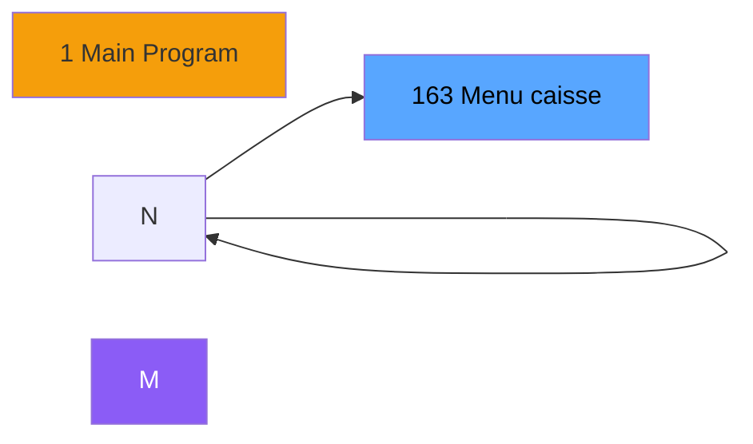
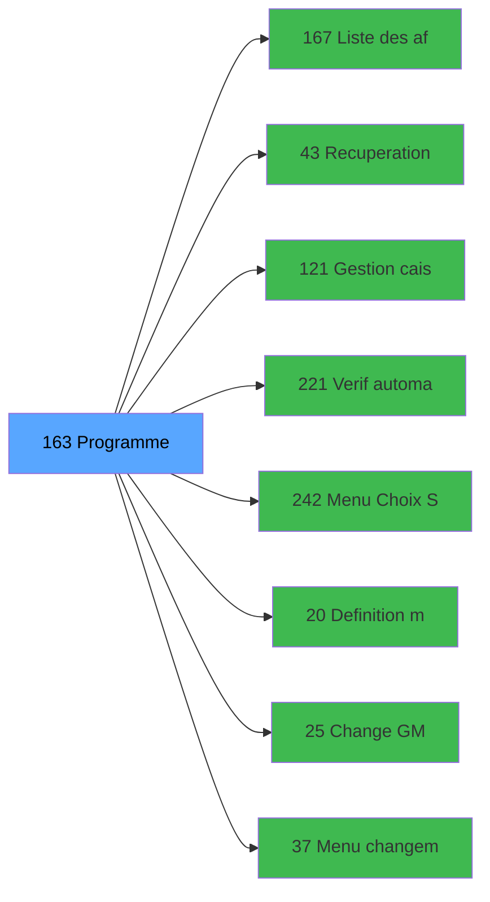

# ADH IDE 163 - Menu caisse GM - scroll

> **Version spec**: 3.5
> **Analyse**: 2026-01-27 17:57
> **Source**: `Prg_XXX.xml`

---

<!-- TAB:Fonctionnel -->

## SPECIFICATION FONCTIONNELLE

### 1.1 Objectif metier

| Element | Description |
|---------|-------------|
| **Qui** | Operateur |
| **Quoi** | Menu caisse GM - scroll
 |
| **Pourquoi** | A documenter |
| **Declencheur** | A identifier |

### 1.2 Regles metier

| Code | Regle | Condition |
|------|-------|-----------|
| RM-001 | A documenter | - |

### 1.3 Flux utilisateur

1. Demarrage programme
2. Traitement principal
3. Fin programme

### 1.4 Cas d'erreur

| Erreur | Comportement |
|--------|--------------|
| - | A documenter |

---

<!-- TAB:Technique -->

## SPECIFICATION TECHNIQUE

### 2.1 Identification

| Attribut | Valeur |
|----------|--------|
| **Format IDE** | ADH IDE 163 |
| **Description** | Menu caisse GM - scroll
 |
| **Module** | ADH |

### 2.2 Tables

| # | Nom logique | Nom physique | Acces | Usage |
|---|-------------|--------------|-------|-------|
| 23 | reseau_cloture___rec | `cafil001_dat` | **W** | 2x |
| 29 | voyages__________voy | `cafil007_dat` | L | 1x |
| 30 | gm-recherche_____gmr | `cafil008_dat` | L | 2x |
| 30 | gm-recherche_____gmr | `cafil008_dat` | R | 4x |
| 30 | gm-recherche_____gmr | `cafil008_dat` | **W** | 1x |
| 31 | gm-complet_______gmc | `cafil009_dat` | L | 3x |
| 31 | gm-complet_______gmc | `cafil009_dat` | **W** | 1x |
| 34 | hebergement______heb | `cafil012_dat` | L | 2x |
| 36 | client_gm | `cafil014_dat` | L | 1x |
| 39 | depot_garantie___dga | `cafil017_dat` | L | 3x |
| 40 | comptable________cte | `cafil018_dat` | L | 1x |
| 40 | comptable________cte | `cafil018_dat` | R | 2x |
| 41 | depot_objets_____doa | `cafil019_dat` | L | 1x |
| 43 | solde_devises____sda | `cafil021_dat` | L | 1x |
| 47 | compte_gm________cgm | `cafil025_dat` | L | 2x |
| 47 | compte_gm________cgm | `cafil025_dat` | R | 1x |
| 47 | compte_gm________cgm | `cafil025_dat` | **W** | 2x |
| 63 | parametres___par | `cafil041_dat` | R | 1x |
| 67 | tables___________tab | `cafil045_dat` | R | 2x |
| 69 | initialisation___ini | `cafil047_dat` | L | 2x |
| 78 | param__telephone_tel | `cafil056_dat` | R | 1x |
| 122 | unilateral_bilateral | `cafil100_dat` | R | 1x |
| 123 | fichier_messagerie | `cafil101_dat` | L | 3x |
| 123 | fichier_messagerie | `cafil101_dat` | R | 1x |
| 130 | fichier_langue | `cafil108_dat` | L | 1x |
| 152 | parametres_pour_pabx | `cafil130_dat` | L | 1x |
| 219 | communication_ims | `caisse_com_ims` | R | 1x |
| 246 | histo_sessions_caisse | `caisse_session` | R | 2x |
| 257 | numero_des_terminaux_ims | `caisse_terminaux_ims` | R | 2x |
| 263 | vente | `caisse_vente` | L | 1x |
| 268 | cc_total_par_type | `ccpartyp` | L | 1x |
| 280 | cotion_par_adherent | `cotionadh_dat` | L | 1x |
| 285 | email | `email` | L | 1x |
| 285 | email | `email` | R | 1x |
| 312 | ez_card | `ezcard` | L | 1x |
| 340 | histo_fusionseparation | `histo_fus_sep` | L | 1x |
| 340 | histo_fusionseparation | `histo_fus_sep` | R | 1x |
| 340 | histo_fusionseparation | `histo_fus_sep` | **W** | 2x |
| 358 | import_mod | `moddossier_dat` | L | 2x |
| 423 | req_param | `req_param_dat` | L | 1x |
| 697 | droits_applications | `droits` | R | 1x |
| 720 | arc_transac_entete_bar | `arc_bartransacent` | L | 1x |
| 728 | arc_cc_total | `arc_cctotal` | L | 2x |
| 740 | pv_stock_movements | `pv_stockmvt_dat` | R | 1x |
| 786 | qualite_avant_reprise | `qualite_avant_reprise` | L | 1x |
| 786 | qualite_avant_reprise | `qualite_avant_reprise` | R | 1x |
| 805 | vente_par_moyen_paiement | `vente_par_moyen_paiement` | L | 1x |
| 844 | stat_vendeur | `%club_user%_stat_vendeur` | L | 2x |
| 876 | log_express_co | `log_express_co` | L | 2x |
| 878 | categorie_operation_mw | `categorie_operation_mw` | R | 2x |
| 911 | log_booker | `log_booker` | **W** | 1x |
| 934 | selection enregistrement diver | `selection_enregistrement_div` | L | 1x |
### 2.3 Parametres d'entree

| Variable | Nom | Type | Picture |
|----------|-----|------|---------|
| - | Aucun parametre | - | - |
### 2.4 Algorigramme

### 2.5 Expressions cles

| IDE | Expression | Commentaire |
|-----|------------|-------------|
| 1 | `'C'` | - |
| 2 | `{0,21}='S'` | - |
| 3 | `{0,21}='F' AND GetParam ('CHANGEAPPLICATION')='N'` | - |
| 4 | `{0,21}='M'` | - |
| 5 | `{0,21}='A'` | - |
| 6 | `{0,21}='C' OR {0,21}='A'` | - |
| 7 | `'M'` | - |
| 8 | `'L'` | - |
| 9 | `'S'` | - |
| 10 | `{0,21}='F'` | - |
| 11 | `{0,41}='O'` | - |
| 12 | `{0,41}<>'O'` | - |
| 13 | `'F'` | - |
| 14 | `'00'` | - |
| 15 | `''` | - |
| 16 | `0` | - |
| 17 | `12` | - |
| 18 | `14` | - |
| 19 | `'TRUE'LOG` | - |
| 20 | `NOT (FileExist ('%club_trav%Connect.dat')) AND ...` | - |

> **Total**: 35 expressions (affichees: 20)
### 2.6 Variables importantes

### 2.7 Statistiques

| Metrique | Valeur |
|----------|--------|
| **Taches** | 39 |
| **Lignes logique** | 1507 |
| **Lignes desactivees** | 0 |
---

<!-- TAB:Cartographie -->

## CARTOGRAPHIE APPLICATIVE

### 3.1 Chaine d'appels depuis Main

### 3.2 Callers directs

| IDE | Programme | Nb appels |
|-----|-----------|-----------|
| 1 | Main Program | 1 |
### 3.3 Callees

| Niv | IDE | Programme | Nb appels |
|-----|-----|-----------|-----------|
| 1 | 167 | Liste des affiliés | 3 |
| 1 | 43 | Recuperation du titre | 2 |
| 1 | 121 | Gestion caisse | 2 |
| 1 | 221 | Verif automatic pooling Tic | 2 |
| 1 | 242 | Menu Choix Saisie/Annul vente | 2 |
| 1 | 20 | Definition monnaie | 1 |
| 1 | 25 | Change GM | 1 |
| 1 | 37 | Menu changement compte | 1 |
| 1 | 40 | Comptes de depôt | 1 |
| 1 | 42 | Controle Login Informaticien | 1 |
| 1 | 44 | Appel programme | 1 |
| 1 | 48 | Contrôles - Integrite dates | 1 |
| 1 | 69 | Extrait de compte | 1 |
| 1 | 77 | Club Med Pass menu | 1 |
| 1 | 80 |    Card scan read | 1 |
| 1 | 97 | Factures (Tble Compta&Vent) V3 | 1 |
| 1 | 111 | Garantie sur compte | 1 |
| 1 | 112 | Garantie sur compte PMS-584 | 1 |
| 1 | 113 | Test Activation ECO | 1 |
| 1 | 114 | Club Med Pass Filiations | 1 |
### 3.4 Verification orphelin

| Critere | Resultat |
|---------|----------|
| Callers actifs | A verifier |
| **Conclusion** | A analyser |

---

## HISTORIQUE

| Date | Action | Auteur |
|------|--------|--------|
| 2026-01-27 20:22 | **DATA V2** - Tables reelles, Expressions, Stats, CallChain | Script |
| 2026-01-27 19:48 | **DATA POPULATED** - Tables, Callgraph (35 expr) | Script |
| 2026-01-27 17:57 | **Upgrade V3.5** - TAB markers, Mermaid | Claude |

---

*Specification V3.5 - Format avec TAB markers et Mermaid*
