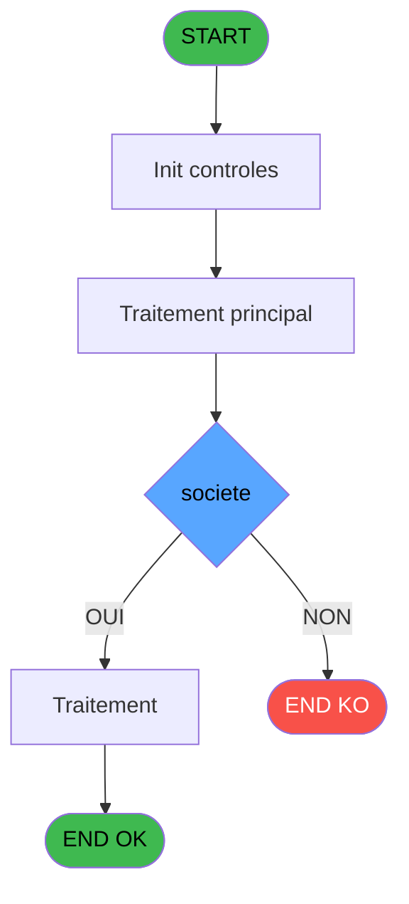
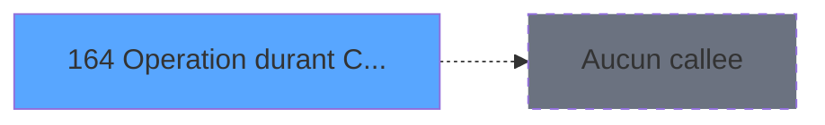

# ADH IDE 164 - Operation durant Cloture

> **Analyse**: Phases 1-4 2026-02-07 07:20 -> 03:47 (20h26min) | Assemblage 03:47
> **Pipeline**: V7.2 Enrichi
> **Structure**: 4 onglets (Resume | Ecrans | Donnees | Connexions)

<!-- TAB:Resume -->

## 1. FICHE D'IDENTITE

| Attribut | Valeur |
|----------|--------|
| Projet | ADH |
| IDE Position | 164 |
| Nom Programme | Operation durant Cloture |
| Fichier source | `Prg_164.xml` |
| Dossier IDE | General |
| Taches | 1 (0 ecrans visibles) |
| Tables modifiees | 0 |
| Programmes appeles | 0 |
| Complexite | **BASSE** (score 0/100) |

## 2. DESCRIPTION FONCTIONNELLE

# ADH IDE 164 - Opération Cloture Caisse

Programme de gestion des opérations effectuées durant la phase de clôture de caisse. Affiche une liste des mouvements enregistrés (dépôts, retraits, ajustements) avec leurs détails (montant, devise, opérateur, horodatage). Permet la consultation et l'audit des actions réalisées lors de la fermeture quotidienne du coffre.

Intégré dans le flux principal de gestion de caisse (ADH IDE 121 - CA0142). Appelé depuis le menu de navigation ADH IDE 163 par scroll sur la zone opérations. Travaille sur les tables de mouvements comptables (operations_dat) et les détails de fermeture de session pour tracer complètement l'historique des manipulations financières.

Logique métier centrée sur la validation et l'affichage des écritures comptables générées durant la clôture. Les opérations sont filtrées par session active et période de temps, avec possibilité de détail/zoom sur chaque mouvement pour vérifier les justificatifs et les contre-passations éventuelles.

## 3. BLOCS FONCTIONNELS

## 5. REGLES METIER

1 regles identifiees:

### Autres (1 regles)

#### [RM-001] Condition: > societe [A] egale

| Element | Detail |
|---------|--------|
| **Condition** | `> societe [A]=''` |
| **Si vrai** | Action si vrai |
| **Variables** | EN (> societe) |
| **Expression source** | Expression 1 : `> societe [A]=''` |
| **Exemple** | Si > societe [A]='' → Action si vrai |

## 6. CONTEXTE

- **Appele par**: [Menu caisse GM - scroll (IDE 163)](ADH-IDE-163.md)
- **Appelle**: 0 programmes | **Tables**: 1 (W:0 R:1 L:0) | **Taches**: 1 | **Expressions**: 4

<!-- TAB:Ecrans -->

## 8. ECRANS

*(Programme sans ecran visible)*

## 9. NAVIGATION

### 9.3 Structure hierarchique (0 tache)

| Position | Tache | Type | Dimensions | Bloc |
|----------|-------|------|------------|------|

### 9.4 Algorigramme

> **Legende**: Vert = START/END OK | Rouge = END KO | Bleu = Decisions
> *Algorigramme auto-genere. Utiliser `/algorigramme` pour une synthese metier detaillee.*

<!-- TAB:Donnees -->

## 10. TABLES

### Tables utilisees (1)

| ID | Nom | Description | Type | R | W | L | Usages |
|----|-----|-------------|------|---|---|---|--------|
| 728 | arc_cc_total |  | DB | R |   |   | 1 |

### Colonnes par table (0 / 1 tables avec colonnes identifiees)

Table 728 - arc_cc_total (R) - 1 usages

*Table utilisee uniquement en Link ou aucune colonne Real identifiee dans le DataView.*

## 11. VARIABLES

*(Programme sans variables locales mappees)*

## 12. EXPRESSIONS

**4 / 4 expressions decodees (100%)**

### 12.1 Repartition par type

| Type | Expressions | Regles |
|------|-------------|--------|
| CONDITION | 2 | 5 |
| CONSTANTE | 1 | 0 |
| OTHER | 1 | 0 |

### 12.2 Expressions cles par type

#### CONDITION (2 expressions)

| Type | IDE | Expression | Regle |
|------|-----|------------|-------|
| CONDITION | 1 | `> societe [A]=''` | [RM-001](#rm-RM-001) |
| CONDITION | 3 | `> societe [A]` | - |

#### CONSTANTE (1 expressions)

| Type | IDE | Expression | Regle |
|------|-----|------------|-------|
| CONSTANTE | 2 | `'C'` | - |

#### OTHER (1 expressions)

| Type | IDE | Expression | Regle |
|------|-----|------------|-------|
| OTHER | 4 | `SetParam ('OPERATION_CLOTURE',IF ([D],'O','N'))` | - |

<!-- TAB:Connexions -->

## 13. GRAPHE D'APPELS

### 13.1 Chaine depuis Main (Callers)

Main -> ... -> [Menu caisse GM - scroll (IDE 163)](ADH-IDE-163.md) -> **Operation durant Cloture (IDE 164)**

### 13.2 Callers

| IDE | Nom Programme | Nb Appels |
|-----|---------------|-----------|
| [163](ADH-IDE-163.md) | Menu caisse GM - scroll | 1 |

### 13.3 Callees (programmes appeles)

### 13.4 Detail Callees avec contexte

| IDE | Nom Programme | Appels | Contexte |
|-----|---------------|--------|----------|
| - | (aucun) | - | - |

## 14. RECOMMANDATIONS MIGRATION

### 14.1 Profil du programme

| Metrique | Valeur | Impact migration |
|----------|--------|-----------------|
| Lignes de logique | 12 | Programme compact |
| Expressions | 4 | Peu de logique |
| Tables WRITE | 0 | Impact faible |
| Sous-programmes | 0 | Peu de dependances |
| Ecrans visibles | 0 | Ecran unique ou traitement batch |
| Code desactive | 0% (0 / 12) | Code sain |
| Regles metier | 1 | Quelques regles a preserver |

### 14.2 Plan de migration par bloc

### 14.3 Dependances critiques

| Dependance | Type | Appels | Impact |
|------------|------|--------|--------|

---
*Spec DETAILED generee par Pipeline V7.2 - 2026-02-08 03:47*
