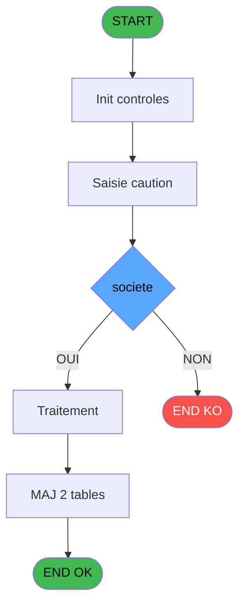

# ADH IDE 165 - Saisies cautions

> **Analyse**: Phases 1-4 2026-02-07 03:52 -> 03:47 (23h55min) | Assemblage 03:47
> **Pipeline**: V7.2 Enrichi
> **Structure**: 4 onglets (Resume | Ecrans | Donnees | Connexions)

<!-- TAB:Resume -->

## 1. FICHE D'IDENTITE

| Attribut | Valeur |
|----------|--------|
| Projet | ADH |
| IDE Position | 165 |
| Nom Programme | Saisies cautions |
| Fichier source | `Prg_165.xml` |
| Dossier IDE | Garanties |
| Taches | 7 (1 ecrans visibles) |
| Tables modifiees | 2 |
| Programmes appeles | 1 |
| Complexite | **BASSE** (score 19/100) |

## 2. DESCRIPTION FONCTIONNELLE

ADH IDE 165 - Saisies cautions est un programme de gestion des dépôts de garantie des adhérents. Il permet l'enregistrement et la modification des cautions versées par les clients, avec deux modes operatoires : versement de nouveaux dépôts et retrait (partiel ou total) de garanties existantes. Le programme valide les montants saisis et met à jour les tables de reference cautions avant la finalisation.

La logique s'articule autour du chargement initial de l'adhérent via le titre (IDE 43), suivi de la récupération des cautions existantes depuis la base de données. Le programme structure les saisies en deux volets distincts : d'un côté les versements (ajout de nouvelles garanties avec types et montants), de l'autre les retraits (sélection d'une caution existante et déduction du montant à reprendre). Chaque opération déclenche une validation des règles métier avant enregistrement.

La finalisation met à jour deux tables critiques - `req_param` pour l'historique des opérations et `tempo_anniversaires` pour les données temporaires de session. Le programme retourne au menu caisse (IDE 163) avec un statut de succès/erreur permettant l'affichage d'un message utilisateur approprié.

## 3. BLOCS FONCTIONNELS

### 3.1 Traitement (6 taches)

Traitements internes.

---

#### 165 - Versement/Retrait [[ECRAN]](#ecran-t1)

**Role** : Tache d'orchestration : point d'entree du programme (6 sous-taches). Coordonne l'enchainement des traitements.
**Ecran** : 166 x 14 DLU (MDI) | [Voir mockup](#ecran-t1)

5 sous-taches directes

| Tache | Nom | Bloc |
|-------|-----|------|
| [165.1](#t2) | Charge table caution | Traitement |
| [165.2](#t3) | Charge existant | Traitement |
| [165.4](#t5) | MAJ caution | Traitement |
| [165.4.1](#t6) | MAJ | Traitement |
| [165.4.2](#t7) | DELETE | Traitement |

**Delegue a** : [Recuperation du titre (IDE 43)](ADH-IDE-43.md)

---

#### 165.1 - Charge table caution

**Role** : Traitement : Charge table caution.
**Delegue a** : [Recuperation du titre (IDE 43)](ADH-IDE-43.md)

---

#### 165.2 - Charge existant

**Role** : Traitement : Charge existant.
**Delegue a** : [Recuperation du titre (IDE 43)](ADH-IDE-43.md)

---

#### 165.4 - MAJ caution

**Role** : Traitement : MAJ caution.
**Delegue a** : [Recuperation du titre (IDE 43)](ADH-IDE-43.md)

---

#### 165.4.1 - MAJ

**Role** : Traitement interne.

---

#### 165.4.2 - DELETE

**Role** : Traitement : DELETE.
**Delegue a** : [Recuperation du titre (IDE 43)](ADH-IDE-43.md)

### 3.2 Saisie (1 tache)

L'operateur saisit les donnees de la transaction via 1 ecran (Saisie caution).

---

#### 165.3 - Saisie caution [[ECRAN]](#ecran-t4)

**Role** : Saisie des donnees : Saisie caution.
**Ecran** : 380 x 159 DLU (MDI) | [Voir mockup](#ecran-t4)
**Variables liees** : EQ (V Validation saisie)

## 5. REGLES METIER

1 regles identifiees:

### Autres (1 regles)

#### [RM-001] Condition: > societe [A] egale

| Element | Detail |
|---------|--------|
| **Condition** | `> societe [A]=''` |
| **Si vrai** | Action si vrai |
| **Variables** | EN (> societe) |
| **Expression source** | Expression 1 : `> societe [A]=''` |
| **Exemple** | Si > societe [A]='' → Action si vrai |

## 6. CONTEXTE

- **Appele par**: [Menu caisse GM - scroll (IDE 163)](ADH-IDE-163.md)
- **Appelle**: 1 programmes | **Tables**: 3 (W:2 R:2 L:2) | **Taches**: 7 | **Expressions**: 5

<!-- TAB:Ecrans -->

## 8. ECRANS

### 8.1 Forms visibles (1 / 7)

| # | Position | Tache | Nom | Type | Largeur | Hauteur | Bloc |
|---|----------|-------|-----|------|---------|---------|------|
| 1 | 165.3 | 165.3 | Saisie caution | MDI | 380 | 159 | Saisie |

### 8.2 Mockups Ecrans

---

#### 165.3 - Saisie caution
**Tache** : [165.3](#t4) | **Type** : MDI | **Dimensions** : 380 x 159 DLU
**Bloc** : Saisie | **Titre IDE** : Saisie caution

<!-- FORM-DATA:
{
    "width":  380,
    "vFactor":  8,
    "type":  "MDI",
    "hFactor":  4,
    "controls":  [
                     {
                         "x":  76,
                         "type":  "label",
                         "var":  "",
                         "y":  7,
                         "w":  304,
                         "fmt":  "",
                         "name":  "",
                         "h":  21,
                         "color":  "",
                         "text":  "",
                         "parent":  null
                     },
                     {
                         "x":  76,
                         "type":  "label",
                         "var":  "",
                         "y":  129,
                         "w":  304,
                         "fmt":  "",
                         "name":  "",
                         "h":  24,
                         "color":  "",
                         "text":  "",
                         "parent":  null
                     },
                     {
                         "x":  76,
                         "type":  "table",
                         "var":  "",
                         "name":  "",
                         "titleH":  11,
                         "color":  "110",
                         "w":  304,
                         "y":  34,
                         "fmt":  "",
                         "parent":  null,
                         "text":  "",
                         "rowH":  11,
                         "h":  91,
                         "cols":  [
                                      {
                                          "title":  "Société",
                                          "layer":  1,
                                          "w":  39
                                      },
                                      {
                                          "title":  "Article",
                                          "layer":  2,
                                          "w":  38
                                      },
                                      {
                                          "title":  "Libellé",
                                          "layer":  3,
                                          "w":  167
                                      },
                                      {
                                          "title":  "Pointage",
                                          "layer":  4,
                                          "w":  44
                                      }
                                  ],
                         "rows":  4
                     },
                     {
                         "x":  78,
                         "type":  "edit",
                         "var":  "",
                         "y":  47,
                         "w":  36,
                         "fmt":  "",
                         "name":  "",
                         "h":  8,
                         "color":  "110",
                         "text":  "",
                         "parent":  6
                     },
                     {
                         "x":  118,
                         "type":  "edit",
                         "var":  "",
                         "y":  47,
                         "w":  26,
                         "fmt":  "",
                         "name":  "",
                         "h":  8,
                         "color":  "110",
                         "text":  "",
                         "parent":  6
                     },
                     {
                         "x":  156,
                         "type":  "edit",
                         "var":  "",
                         "y":  47,
                         "w":  162,
                         "fmt":  "",
                         "name":  "",
                         "h":  8,
                         "color":  "110",
                         "text":  "",
                         "parent":  6
                     },
                     {
                         "x":  340,
                         "type":  "checkbox",
                         "var":  "",
                         "y":  47,
                         "w":  11,
                         "fmt":  "",
                         "name":  "PAC Pointage",
                         "h":  8,
                         "color":  "110",
                         "text":  "",
                         "parent":  6
                     },
                     {
                         "x":  88,
                         "type":  "button",
                         "var":  "",
                         "y":  133,
                         "w":  80,
                         "fmt":  "",
                         "name":  "Validation",
                         "h":  18,
                         "color":  "",
                         "text":  "",
                         "parent":  null
                     },
                     {
                         "x":  291,
                         "type":  "button",
                         "var":  "",
                         "y":  133,
                         "w":  80,
                         "fmt":  "",
                         "name":  "Abandon",
                         "h":  18,
                         "color":  "",
                         "text":  "",
                         "parent":  null
                     },
                     {
                         "x":  81,
                         "type":  "edit",
                         "var":  "",
                         "y":  14,
                         "w":  113,
                         "fmt":  "30",
                         "name":  "",
                         "h":  8,
                         "color":  "",
                         "text":  "",
                         "parent":  null
                     },
                     {
                         "x":  257,
                         "type":  "edit",
                         "var":  "",
                         "y":  14,
                         "w":  118,
                         "fmt":  "WWW DD MMM YYYYT",
                         "name":  "",
                         "h":  8,
                         "color":  "",
                         "text":  "",
                         "parent":  null
                     },
                     {
                         "x":  8,
                         "type":  "image",
                         "var":  "",
                         "y":  51,
                         "w":  65,
                         "fmt":  "",
                         "name":  "",
                         "h":  62,
                         "color":  "",
                         "text":  "",
                         "parent":  null
                     }
                 ],
    "taskId":  "165.3",
    "height":  159
}
-->

<strong>Champs : 6 champs</strong>

| Pos (x,y) | Nom | Variable | Type |
|-----------|-----|----------|------|
| 78,47 | (sans nom) | - | edit |
| 118,47 | (sans nom) | - | edit |
| 156,47 | (sans nom) | - | edit |
| 340,47 | PAC Pointage | - | checkbox |
| 81,14 | 30 | - | edit |
| 257,14 | WWW DD MMM YYYYT | - | edit |

<strong>Boutons : 2 boutons</strong>

| Bouton | Pos (x,y) | Action |
|--------|-----------|--------|
| Validation | 88,133 | Valide la saisie et enregistre |
| Abandon | 291,133 | Annule et retour au menu |

## 9. NAVIGATION

Ecran unique: **Saisie caution**

### 9.3 Structure hierarchique (7 taches)

| Position | Tache | Type | Dimensions | Bloc |
|----------|-------|------|------------|------|
| **165.1** | [**Versement/Retrait** (165)](#t1) [mockup](#ecran-t1) | MDI | 166x14 | Traitement |
| 165.1.1 | [Charge table caution (165.1)](#t2) | MDI | - | |
| 165.1.2 | [Charge existant (165.2)](#t3) | MDI | - | |
| 165.1.3 | [MAJ caution (165.4)](#t5) | MDI | - | |
| 165.1.4 | [MAJ (165.4.1)](#t6) | MDI | - | |
| 165.1.5 | [DELETE (165.4.2)](#t7) | MDI | - | |
| **165.2** | [**Saisie caution** (165.3)](#t4) [mockup](#ecran-t4) | MDI | 380x159 | Saisie |

### 9.4 Algorigramme

> **Legende**: Vert = START/END OK | Rouge = END KO | Bleu = Decisions
> *Algorigramme auto-genere. Utiliser `/algorigramme` pour une synthese metier detaillee.*

<!-- TAB:Donnees -->

## 10. TABLES

### Tables utilisees (3)

| ID | Nom | Description | Type | R | W | L | Usages |
|----|-----|-------------|------|---|---|---|--------|
| 587 | tempo_anniversaires | Table temporaire ecran | TMP | R | **W** | L | 4 |
| 423 | req_param |  | DB |   | **W** | L | 4 |
| 735 | arc_pv_cust_rentals |  | DB | R |   |   | 1 |

### Colonnes par table (1 / 3 tables avec colonnes identifiees)

Table 587 - tempo_anniversaires (R/**W**/L) - 4 usages

| Lettre | Variable | Acces | Type |
|--------|----------|-------|------|
| A | V Existe | W | Logical |
| B | Abandon | W | Alpha |

Table 423 - req_param (**W**/L) - 4 usages

*Table utilisee uniquement en Link ou aucune colonne Real identifiee dans le DataView.*

Table 735 - arc_pv_cust_rentals (R) - 1 usages

*Table utilisee uniquement en Link ou aucune colonne Real identifiee dans le DataView.*

## 11. VARIABLES

### 11.1 Variables de session (2)

Variables persistantes pendant toute la session.

| Lettre | Nom | Type | Usage dans |
|--------|-----|------|-----------|
| EQ | V Validation saisie | Logical | [165.3](#t4) |
| ER | v.titre | Alpha | 1x session |

### 11.2 Autres (3)

Variables diverses.

| Lettre | Nom | Type | Usage dans |
|--------|-----|------|-----------|
| EN | > societe | Alpha | 1x refs |
| EO | > code GM | Numeric | - |
| EP | > filiation | Numeric | - |

## 12. EXPRESSIONS

**5 / 5 expressions decodees (100%)**

### 12.1 Repartition par type

| Type | Expressions | Regles |
|------|-------------|--------|
| CONDITION | 1 | 5 |
| CONSTANTE | 2 | 0 |
| OTHER | 1 | 0 |
| STRING | 1 | 0 |

### 12.2 Expressions cles par type

#### CONDITION (1 expressions)

| Type | IDE | Expression | Regle |
|------|-----|------------|-------|
| CONDITION | 1 | `> societe [A]=''` | [RM-001](#rm-RM-001) |

#### CONSTANTE (2 expressions)

| Type | IDE | Expression | Regle |
|------|-----|------------|-------|
| CONSTANTE | 4 | `123` | - |
| CONSTANTE | 2 | `'C'` | - |

#### OTHER (1 expressions)

| Type | IDE | Expression | Regle |
|------|-----|------------|-------|
| OTHER | 5 | `V Validation saisie [D]` | - |

#### STRING (1 expressions)

| Type | IDE | Expression | Regle |
|------|-----|------------|-------|
| STRING | 3 | `Trim (v.titre [E])` | - |

<!-- TAB:Connexions -->

## 13. GRAPHE D'APPELS

### 13.1 Chaine depuis Main (Callers)

Main -> ... -> [Menu caisse GM - scroll (IDE 163)](ADH-IDE-163.md) -> **Saisies cautions (IDE 165)**

### 13.2 Callers

| IDE | Nom Programme | Nb Appels |
|-----|---------------|-----------|
| [163](ADH-IDE-163.md) | Menu caisse GM - scroll | 1 |

### 13.3 Callees (programmes appeles)

### 13.4 Detail Callees avec contexte

| IDE | Nom Programme | Appels | Contexte |
|-----|---------------|--------|----------|
| [43](ADH-IDE-43.md) | Recuperation du titre | 1 | Recuperation donnees |

## 14. RECOMMANDATIONS MIGRATION

### 14.1 Profil du programme

| Metrique | Valeur | Impact migration |
|----------|--------|-----------------|
| Lignes de logique | 81 | Programme compact |
| Expressions | 5 | Peu de logique |
| Tables WRITE | 2 | Impact faible |
| Sous-programmes | 1 | Peu de dependances |
| Ecrans visibles | 1 | Ecran unique ou traitement batch |
| Code desactive | 0% (0 / 81) | Code sain |
| Regles metier | 1 | Quelques regles a preserver |

### 14.2 Plan de migration par bloc

#### Traitement (6 taches: 1 ecran, 5 traitements)

- **Strategie** : Orchestrateur avec 1 ecrans (Razor/React) et 5 traitements backend (services).
- Les ecrans deviennent des composants UI, les traitements invisibles deviennent des services injectables.
- 1 sous-programme(s) a migrer ou a reutiliser depuis les services existants.
- Decomposer les taches en services unitaires testables.

#### Saisie (1 tache: 1 ecran, 0 traitement)

- **Strategie** : Formulaire React/Blazor avec validation Zod/FluentValidation.
- Reproduire 1 ecran : Saisie caution
- Validation temps reel cote client + serveur

### 14.3 Dependances critiques

| Dependance | Type | Appels | Impact |
|------------|------|--------|--------|
| req_param | Table WRITE (Database) | 2x | Schema + repository |
| tempo_anniversaires | Table WRITE (Temp) | 2x | Schema + repository |
| [Recuperation du titre (IDE 43)](ADH-IDE-43.md) | Sous-programme | 1x | Normale - Recuperation donnees |

---
*Spec DETAILED generee par Pipeline V7.2 - 2026-02-08 03:48*
