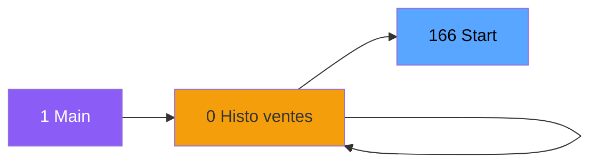
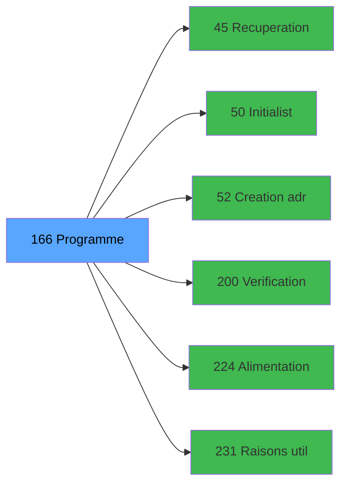

# ADH IDE 166 - Start

> **Version spec**: 3.5
> **Analyse**: 2026-01-27 17:57
> **Source**: `Prg_XXX.xml`

---

<!-- TAB:Fonctionnel -->

## SPECIFICATION FONCTIONNELLE

### 1.1 Objectif metier

| Element | Description |
|---------|-------------|
| **Qui** | Operateur |
| **Quoi** | Start
 |
| **Pourquoi** | A documenter |
| **Declencheur** | A identifier |

### 1.2 Regles metier

| Code | Regle | Condition |
|------|-------|-----------|
| RM-001 | A documenter | - |

### 1.3 Flux utilisateur

1. Demarrage programme
2. Traitement principal
3. Fin programme

### 1.4 Cas d'erreur

| Erreur | Comportement |
|--------|--------------|
| - | A documenter |

---

<!-- TAB:Technique -->

## SPECIFICATION TECHNIQUE

### 2.1 Identification

| Attribut | Valeur |
|----------|--------|
| **Format IDE** | ADH IDE 166 |
| **Description** | Start
 |
| **Module** | ADH |

### 2.2 Tables

| # | Nom logique | Nom physique | Acces | Usage |
|---|-------------|--------------|-------|-------|
| 67 | tables___________tab | `cafil045_dat` | R | 1x |
| 69 | initialisation___ini | `cafil047_dat` | L | 1x |
| 81 | societe__________soc | `cafil059_dat` | R | 1x |
| 118 | tables_imports | `cafil096_dat` | L | 1x |
| 219 | communication_ims | `caisse_com_ims` | R | 1x |
| 728 | arc_cc_total | `arc_cctotal` | L | 1x |
| 740 | pv_stock_movements | `pv_stockmvt_dat` | R | 1x |
| 878 | categorie_operation_mw | `categorie_operation_mw` | R | 1x |
| 878 | categorie_operation_mw | `categorie_operation_mw` | **W** | 1x |
### 2.3 Parametres d'entree

| Variable | Nom | Type | Picture |
|----------|-----|------|---------|
| - | Aucun parametre | - | - |
### 2.4 Algorigramme

### 2.5 Expressions cles

| IDE | Expression | Commentaire |
|-----|------------|-------------|
| 1 | `SetParam ('VERIF_USERB','O')` | - |
| 2 | `{0,1}` | - |
| 3 | `IF({0,8}<>0,'N11.'&Trim(Str({0,8},'#'))&'CZ','N...` | - |
| 4 | `NOT ({0,1}) AND NOT(IsComponent())` | - |
| 5 | `SetParam ('SPECIFICPRINT','VOID')` | - |
| 6 | `SetParam ('CURRENTPRINTERNUM',0)` | - |
| 7 | `SetParam ('CURRENTPRINTERNAME','VOID')` | - |
| 8 | `SetParam ('NUMBERCOPIES',0)` | - |
| 9 | `SetParam ('LISTINGNUMPRINTERCHOICE',0)` | - |
| 10 | `SetParam ('CHAINEDLISTING','NO')` | - |
| 11 | `NOT ({32768,4} OR IsComponent() OR INIGet ('[MA...` | - |
| 12 | `Trim(INIGet('[MAGIC_LOGICAL_NAMES]RunMode'))<>'B'` | - |
| 13 | `'CA'` | - |
| 14 | `{32768,17}` | - |
| 15 | `{32768,23}` | - |
| 16 | `{0,4}` | - |
| 17 | `Trim({0,5})` | - |
| 18 | `{32768,8}` | - |
| 19 | `NOT(IsComponent())` | - |
| 20 | `NOT(IsComponent()) AND {32768,111} AND Range(Te...` | - |

> **Total**: 30 expressions (affichees: 20)
### 2.6 Variables importantes

### 2.7 Statistiques

| Metrique | Valeur |
|----------|--------|
| **Taches** | 7 |
| **Lignes logique** | 123 |
| **Lignes desactivees** | 0 |
---

<!-- TAB:Cartographie -->

## CARTOGRAPHIE APPLICATIVE

### 3.1 Chaine d'appels depuis Main

### 3.2 Callers directs

| IDE | Programme | Nb appels |
|-----|-----------|-----------|
| 0 | VAD validés à imprimer | 2 |
| 0 | Histo ventes Gratuités | 1 |
| 0 | Histo ventes IGR | 1 |
| 0 | Histo ventes payantes /PMS-605 | 1 |
| 0 | Histo ventes payantes /PMS-623 | 1 |
| 0 | Print extrait compte /Service | 1 |
| 0 | Transaction Nouv vente PMS-584 | 1 |
| 0 | Transaction Nouv vente PMS-710 | 1 |
| 0 | Transaction Nouv vente PMS-721 | 1 |
| 0 | Transferts | 1 |
| 1 | Main Program | 1 |
### 3.3 Callees

| Niv | IDE | Programme | Nb appels |
|-----|-----|-----------|-----------|
| 1 | 45 | Recuperation langue | 1 |
| 1 | 50 |   Initialistaion Easy Arrival | 1 |
| 1 | 52 | Creation adresse_village | 1 |
| 1 | 200 | Verification si client/serveur | 1 |
| 1 | 224 | Alimentation Combos LIEU SEJ | 1 |
| 1 | 231 | Raisons utilisation ADH | 1 |
### 3.4 Verification orphelin

| Critere | Resultat |
|---------|----------|
| Callers actifs | A verifier |
| **Conclusion** | A analyser |

---

## HISTORIQUE

| Date | Action | Auteur |
|------|--------|--------|
| 2026-01-27 20:22 | **DATA V2** - Tables reelles, Expressions, Stats, CallChain | Script |
| 2026-01-27 19:48 | **DATA POPULATED** - Tables, Callgraph (30 expr) | Script |
| 2026-01-27 17:57 | **Upgrade V3.5** - TAB markers, Mermaid | Claude |

---

*Specification V3.5 - Format avec TAB markers et Mermaid*
