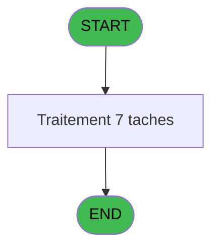
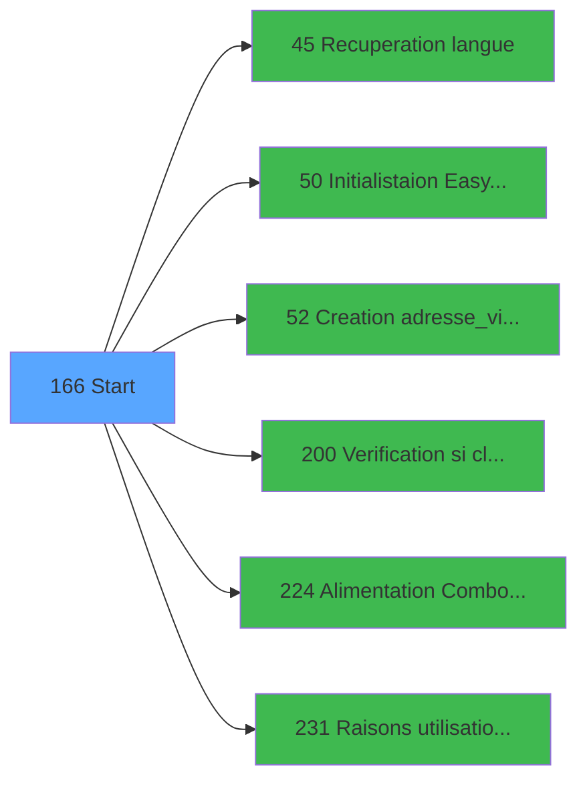

# ADH IDE 166 - Start

> **Analyse**: Phases 1-4 2026-02-07 03:51 -> 03:52 (29s) | Assemblage 07:21
> **Pipeline**: V7.2 Enrichi
> **Structure**: 4 onglets (Resume | Ecrans | Donnees | Connexions)

<!-- TAB:Resume -->

## 1. FICHE D'IDENTITE

| Attribut | Valeur |
|----------|--------|
| Projet | ADH |
| IDE Position | 166 |
| Nom Programme | Start |
| Fichier source | `Prg_166.xml` |
| Dossier IDE | Menus |
| Taches | 7 (0 ecrans visibles) |
| Tables modifiees | 1 |
| Programmes appeles | 6 |

## 2. DESCRIPTION FONCTIONNELLE

**Start** assure la gestion complete de ce processus, accessible depuis [VAD validés à imprimer (IDE 0)](ADH-IDE-0.md), [Histo ventes Gratuités (IDE 0)](ADH-IDE-0.md), [Histo ventes IGR (IDE 0)](ADH-IDE-0.md), [Histo ventes payantes /PMS-605 (IDE 0)](ADH-IDE-0.md), [Histo ventes payantes /PMS-623 (IDE 0)](ADH-IDE-0.md), [Print extrait compte /Service (IDE 0)](ADH-IDE-0.md), [Transaction Nouv vente PMS-584 (IDE 0)](ADH-IDE-0.md), [Transaction Nouv vente PMS-710 (IDE 0)](ADH-IDE-0.md), [Transaction Nouv vente PMS-721 (IDE 0)](ADH-IDE-0.md), [Transferts (IDE 0)](ADH-IDE-0.md), [Main Program (IDE 1)](ADH-IDE-1.md).

Le flux de traitement s'organise en **3 blocs fonctionnels** :

- **Traitement** (5 taches) : traitements metier divers
- **Initialisation** (1 tache) : reinitialisation d'etats et de variables de travail
- **Calcul** (1 tache) : calculs de montants, stocks ou compteurs

**Donnees modifiees** : 1 tables en ecriture (categorie_operation_mw).

**Logique metier** : 1 regles identifiees couvrant conditions metier.

Detail : phases du traitement

#### Phase 1 : Traitement (5 taches)

- **T1** - Start
- **T2** - read FROM_IMS
- **T4** - Recup Logins avec matricule
- **T5** - read FROM_IMS
- **T6** - read FROM_IMS

Delegue a : [Recuperation langue (IDE 45)](ADH-IDE-45.md), [Alimentation Combos LIEU SEJ (IDE 224)](ADH-IDE-224.md), [Raisons utilisation ADH (IDE 231)](ADH-IDE-231.md)

#### Phase 2 : Calcul (1 tache)

- **T3** - comptage lieu sejour

#### Phase 3 : Initialisation (1 tache)

- **T7** - reset log_initialisation_tpe

Delegue a : [  Initialistaion Easy Arrival (IDE 50)](ADH-IDE-50.md)

#### Tables impactees

| Table | Operations | Role metier |
|-------|-----------|-------------|
| categorie_operation_mw | R/**W** (2 usages) | Operations comptables |

## 3. BLOCS FONCTIONNELS

### 3.1 Traitement (5 taches)

Traitements internes.

---

#### T1 - Start

**Role** : Traitement : Start.

4 sous-taches directes

| Tache | Nom | Bloc |
|-------|-----|------|
| [T2](#t2) | read FROM_IMS | Traitement |
| [T4](#t4) | Recup Logins avec matricule | Traitement |
| [T5](#t5) | read FROM_IMS | Traitement |
| [T6](#t6) | read FROM_IMS | Traitement |

**Delegue a** : [Recuperation langue (IDE 45)](ADH-IDE-45.md), [Alimentation Combos LIEU SEJ (IDE 224)](ADH-IDE-224.md), [Raisons utilisation ADH (IDE 231)](ADH-IDE-231.md)

---

#### T2 - read FROM_IMS

**Role** : Traitement : read FROM_IMS.
**Variables liees** : B (FROM_IMS)
**Delegue a** : [Recuperation langue (IDE 45)](ADH-IDE-45.md), [Alimentation Combos LIEU SEJ (IDE 224)](ADH-IDE-224.md), [Raisons utilisation ADH (IDE 231)](ADH-IDE-231.md)

---

#### T4 - Recup Logins avec matricule

**Role** : Consultation/chargement : Recup Logins avec matricule.
**Delegue a** : [Recuperation langue (IDE 45)](ADH-IDE-45.md), [Alimentation Combos LIEU SEJ (IDE 224)](ADH-IDE-224.md), [Raisons utilisation ADH (IDE 231)](ADH-IDE-231.md)

---

#### T5 - read FROM_IMS

**Role** : Traitement : read FROM_IMS.
**Variables liees** : B (FROM_IMS)
**Delegue a** : [Recuperation langue (IDE 45)](ADH-IDE-45.md), [Alimentation Combos LIEU SEJ (IDE 224)](ADH-IDE-224.md), [Raisons utilisation ADH (IDE 231)](ADH-IDE-231.md)

---

#### T6 - read FROM_IMS

**Role** : Traitement : read FROM_IMS.
**Variables liees** : B (FROM_IMS)
**Delegue a** : [Recuperation langue (IDE 45)](ADH-IDE-45.md), [Alimentation Combos LIEU SEJ (IDE 224)](ADH-IDE-224.md), [Raisons utilisation ADH (IDE 231)](ADH-IDE-231.md)

### 3.2 Calcul (1 tache)

Calculs metier : montants, stocks, compteurs.

---

#### T3 - comptage lieu sejour

**Role** : Traitement : comptage lieu sejour.

### 3.3 Initialisation (1 tache)

Reinitialisation d'etats et variables de travail.

---

#### T7 - reset log_initialisation_tpe

**Role** : Reinitialisation : reset log_initialisation_tpe.
**Delegue a** : [  Initialistaion Easy Arrival (IDE 50)](ADH-IDE-50.md)

## 5. REGLES METIER

1 regles identifiees:

### Autres (1 regles)

#### [RM-001] Traitement si [H] est non nul

| Element | Detail |
|---------|--------|
| **Condition** | `[H]<>0` |
| **Si vrai** | 'N11.'&Trim(Str([H] |
| **Si faux** | '#'))&'CZ','N13CZ') |
| **Expression source** | Expression 3 : `IF([H]<>0,'N11.'&Trim(Str([H],'#'))&'CZ','N13CZ')` |
| **Exemple** | Si [H]<>0 → 'N11.'&Trim(Str([H]. Sinon → '#'))&'CZ','N13CZ') |

## 6. CONTEXTE

- **Appele par**: [VAD validés à imprimer (IDE 0)](ADH-IDE-0.md), [Histo ventes Gratuités (IDE 0)](ADH-IDE-0.md), [Histo ventes IGR (IDE 0)](ADH-IDE-0.md), [Histo ventes payantes /PMS-605 (IDE 0)](ADH-IDE-0.md), [Histo ventes payantes /PMS-623 (IDE 0)](ADH-IDE-0.md), [Print extrait compte /Service (IDE 0)](ADH-IDE-0.md), [Transaction Nouv vente PMS-584 (IDE 0)](ADH-IDE-0.md), [Transaction Nouv vente PMS-710 (IDE 0)](ADH-IDE-0.md), [Transaction Nouv vente PMS-721 (IDE 0)](ADH-IDE-0.md), [Transferts (IDE 0)](ADH-IDE-0.md), [Main Program (IDE 1)](ADH-IDE-1.md)
- **Appelle**: 6 programmes | **Tables**: 8 (W:1 R:5 L:3) | **Taches**: 7 | **Expressions**: 30

<!-- TAB:Ecrans -->

## 8. ECRANS

*(Programme sans ecran visible)*

## 9. NAVIGATION

### 9.3 Structure hierarchique (7 taches)

| Position | Tache | Type | Dimensions | Bloc |
|----------|-------|------|------------|------|
| **166.1** | [**Start** (T1)](#t1) | MDI | - | Traitement |
| 166.1.1 | [read FROM_IMS (T2)](#t2) | MDI | - | |
| 166.1.2 | [Recup Logins avec matricule (T4)](#t4) | - | - | |
| 166.1.3 | [read FROM_IMS (T5)](#t5) | MDI | - | |
| 166.1.4 | [read FROM_IMS (T6)](#t6) | MDI | - | |
| **166.2** | [**comptage lieu sejour** (T3)](#t3) | - | - | Calcul |
| **166.3** | [**reset log_initialisation_tpe** (T7)](#t7) | - | - | Initialisation |

### 9.4 Algorigramme

> *algo-data indisponible. Utiliser `/algorigramme` pour generer.*

<!-- TAB:Donnees -->

## 10. TABLES

### Tables utilisees (8)

| ID | Nom | Description | Type | R | W | L | Usages |
|----|-----|-------------|------|---|---|---|--------|
| 67 | tables___________tab |  | DB | R |   |   | 1 |
| 69 | initialisation___ini |  | DB |   |   | L | 1 |
| 81 | societe__________soc |  | DB | R |   |   | 1 |
| 118 | tables_imports |  | DB |   |   | L | 1 |
| 219 | communication_ims |  | DB | R |   |   | 1 |
| 728 | arc_cc_total |  | DB |   |   | L | 1 |
| 740 | pv_stock_movements | Articles et stock | DB | R |   |   | 1 |
| 878 | categorie_operation_mw | Operations comptables | DB | R | **W** |   | 2 |

### Colonnes par table (2 / 5 tables avec colonnes identifiees)

Table 67 - tables___________tab (R) - 1 usages

| Lettre | Variable | Acces | Type |
|--------|----------|-------|------|
| A | W0 connection ? | R | Logical |
| B | FROM_IMS | R | Alpha |
| C | L Contrôle date OK | R | Logical |
| D | v.Tpt_interface ? | R | Logical |
| E | v.Code TPE | R | Unicode |

Table 81 - societe__________soc (R) - 1 usages

| Lettre | Variable | Acces | Type |
|--------|----------|-------|------|
| A | V.Cpt lieu sejour | R | Numeric |
| B | v Retour Lieu sejour defaut | R | Logical |

Table 219 - communication_ims (R) - 1 usages

*Table utilisee uniquement en Link ou aucune colonne Real identifiee dans le DataView.*

Table 740 - pv_stock_movements (R) - 1 usages

*Table utilisee uniquement en Link ou aucune colonne Real identifiee dans le DataView.*

Table 878 - categorie_operation_mw (R/**W**) - 2 usages

*Table utilisee uniquement en Link ou aucune colonne Real identifiee dans le DataView.*

## 11. VARIABLES

### 11.1 Variables de session (2)

Variables persistantes pendant toute la session.

| Lettre | Nom | Type | Usage dans |
|--------|-----|------|-----------|
| D | v.Tpt_interface ? | Logical | 1x session |
| E | v.Code TPE | Unicode | 1x session |

### 11.2 Variables de travail (1)

Variables internes au programme.

| Lettre | Nom | Type | Usage dans |
|--------|-----|------|-----------|
| A | W0 connection ? | Logical | 2x calcul interne |

### 11.3 Autres (2)

Variables diverses.

| Lettre | Nom | Type | Usage dans |
|--------|-----|------|-----------|
| B | FROM_IMS | Alpha | - |
| C | L Contrôle date OK | Logical | - |

## 12. EXPRESSIONS

**30 / 30 expressions decodees (100%)**

### 12.1 Repartition par type

| Type | Expressions | Regles |
|------|-------------|--------|
| CONCATENATION | 1 | 0 |
| CONDITION | 2 | 5 |
| CONSTANTE | 2 | 0 |
| OTHER | 15 | 0 |
| NEGATION | 3 | 0 |
| REFERENCE_VG | 4 | 0 |
| STRING | 2 | 0 |
| FORMAT | 1 | 0 |

### 12.2 Expressions cles par type

#### CONCATENATION (1 expressions)

| Type | IDE | Expression | Regle |
|------|-----|------------|-------|
| CONCATENATION | 21 | `'cmd /c mkdir '&Translate('%club_exportdata%')&'Easy_Check_Out'` | - |

#### CONDITION (2 expressions)

| Type | IDE | Expression | Regle |
|------|-----|------------|-------|
| CONDITION | 3 | `IF([H]<>0,'N11.'&Trim(Str([H],'#'))&'CZ','N13CZ')` | [RM-001](#rm-RM-001) |
| CONDITION | 12 | `Trim(INIGet('[MAGIC_LOGICAL_NAMES]RunMode'))<>'B'` | - |

#### CONSTANTE (2 expressions)

| Type | IDE | Expression | Regle |
|------|-----|------------|-------|
| CONSTANTE | 27 | `'BDEV'` | - |
| CONSTANTE | 13 | `'CA'` | - |

#### OTHER (15 expressions)

| Type | IDE | Expression | Regle |
|------|-----|------------|-------|
| OTHER | 20 | `NOT(IsComponent()) AND VG111 AND Range(Term(),430,450)` | - |
| OTHER | 19 | `NOT(IsComponent())` | - |
| OTHER | 16 | `v.Tpt_interface ? [D]` | - |
| OTHER | 22 | `NOT(FileExist(Translate('%club_exportdata%')&'Easy_Check_Out'))` | - |
| OTHER | 30 | `[F]` | - |
| ... | | *+10 autres* | |

#### NEGATION (3 expressions)

| Type | IDE | Expression | Regle |
|------|-----|------------|-------|
| NEGATION | 25 | `NOT VG78` | - |
| NEGATION | 11 | `NOT (VG4 OR IsComponent() OR INIGet ('[MAGIC_LOGICAL_NAMES]RunMode')='B')` | - |
| NEGATION | 4 | `NOT (W0 connection ? [A]) AND NOT(IsComponent())` | - |

#### REFERENCE_VG (4 expressions)

| Type | IDE | Expression | Regle |
|------|-----|------------|-------|
| REFERENCE_VG | 18 | `VG8` | - |
| REFERENCE_VG | 26 | `VG78` | - |
| REFERENCE_VG | 14 | `VG17` | - |
| REFERENCE_VG | 15 | `VG23` | - |

#### STRING (2 expressions)

| Type | IDE | Expression | Regle |
|------|-----|------------|-------|
| STRING | 24 | `Val([J], '3')` | - |
| STRING | 17 | `Trim(v.Code TPE [E])` | - |

#### FORMAT (1 expressions)

| Type | IDE | Expression | Regle |
|------|-----|------------|-------|
| FORMAT | 29 | `Str([M],'3')` | - |

### 12.3 Toutes les expressions (30)

Voir les 30 expressions

#### CONCATENATION (1)

| IDE | Expression Decodee |
|-----|-------------------|
| 21 | `'cmd /c mkdir '&Translate('%club_exportdata%')&'Easy_Check_Out'` |

#### CONDITION (2)

| IDE | Expression Decodee |
|-----|-------------------|
| 3 | `IF([H]<>0,'N11.'&Trim(Str([H],'#'))&'CZ','N13CZ')` |
| 12 | `Trim(INIGet('[MAGIC_LOGICAL_NAMES]RunMode'))<>'B'` |

#### CONSTANTE (2)

| IDE | Expression Decodee |
|-----|-------------------|
| 13 | `'CA'` |
| 27 | `'BDEV'` |

#### OTHER (15)

| IDE | Expression Decodee |
|-----|-------------------|
| 1 | `SetParam ('VERIF_USERB','O')` |
| 2 | `W0 connection ? [A]` |
| 5 | `SetParam ('SPECIFICPRINT','VOID')` |
| 6 | `SetParam ('CURRENTPRINTERNUM',0)` |
| 7 | `SetParam ('CURRENTPRINTERNAME','VOID')` |
| 8 | `SetParam ('NUMBERCOPIES',0)` |
| 9 | `SetParam ('LISTINGNUMPRINTERCHOICE',0)` |
| 10 | `SetParam ('CHAINEDLISTING','NO')` |
| 16 | `v.Tpt_interface ? [D]` |
| 19 | `NOT(IsComponent())` |
| 20 | `NOT(IsComponent()) AND VG111 AND Range(Term(),430,450)` |
| 22 | `NOT(FileExist(Translate('%club_exportdata%')&'Easy_Check_Out'))` |
| 23 | `MnuShow('ID_CMP',VG3 OR VG74)` |
| 28 | `[G]` |
| 30 | `[F]` |

#### NEGATION (3)

| IDE | Expression Decodee |
|-----|-------------------|
| 4 | `NOT (W0 connection ? [A]) AND NOT(IsComponent())` |
| 11 | `NOT (VG4 OR IsComponent() OR INIGet ('[MAGIC_LOGICAL_NAMES]RunMode')='B')` |
| 25 | `NOT VG78` |

#### REFERENCE_VG (4)

| IDE | Expression Decodee |
|-----|-------------------|
| 14 | `VG17` |
| 15 | `VG23` |
| 18 | `VG8` |
| 26 | `VG78` |

#### STRING (2)

| IDE | Expression Decodee |
|-----|-------------------|
| 17 | `Trim(v.Code TPE [E])` |
| 24 | `Val([J], '3')` |

#### FORMAT (1)

| IDE | Expression Decodee |
|-----|-------------------|
| 29 | `Str([M],'3')` |

<!-- TAB:Connexions -->

## 13. GRAPHE D'APPELS

### 13.1 Chaine depuis Main (Callers)

Main -> ... -> [VAD validés à imprimer (IDE 0)](ADH-IDE-0.md) -> **Start (IDE 166)**

Main -> ... -> [Histo ventes Gratuités (IDE 0)](ADH-IDE-0.md) -> **Start (IDE 166)**

Main -> ... -> [Histo ventes IGR (IDE 0)](ADH-IDE-0.md) -> **Start (IDE 166)**

Main -> ... -> [Histo ventes payantes /PMS-605 (IDE 0)](ADH-IDE-0.md) -> **Start (IDE 166)**

Main -> ... -> [Histo ventes payantes /PMS-623 (IDE 0)](ADH-IDE-0.md) -> **Start (IDE 166)**

Main -> ... -> [Print extrait compte /Service (IDE 0)](ADH-IDE-0.md) -> **Start (IDE 166)**

Main -> ... -> [Transaction Nouv vente PMS-584 (IDE 0)](ADH-IDE-0.md) -> **Start (IDE 166)**

Main -> ... -> [Transaction Nouv vente PMS-710 (IDE 0)](ADH-IDE-0.md) -> **Start (IDE 166)**

Main -> ... -> [Transaction Nouv vente PMS-721 (IDE 0)](ADH-IDE-0.md) -> **Start (IDE 166)**

Main -> ... -> [Transferts (IDE 0)](ADH-IDE-0.md) -> **Start (IDE 166)**

Main -> ... -> [Main Program (IDE 1)](ADH-IDE-1.md) -> **Start (IDE 166)**

### 13.2 Callers

| IDE | Nom Programme | Nb Appels |
|-----|---------------|-----------|
| [0](ADH-IDE-0.md) | VAD validés à imprimer | 2 |
| [0](ADH-IDE-0.md) | Histo ventes Gratuités | 1 |
| [0](ADH-IDE-0.md) | Histo ventes IGR | 1 |
| [0](ADH-IDE-0.md) | Histo ventes payantes /PMS-605 | 1 |
| [0](ADH-IDE-0.md) | Histo ventes payantes /PMS-623 | 1 |
| [0](ADH-IDE-0.md) | Print extrait compte /Service | 1 |
| [0](ADH-IDE-0.md) | Transaction Nouv vente PMS-584 | 1 |
| [0](ADH-IDE-0.md) | Transaction Nouv vente PMS-710 | 1 |
| [0](ADH-IDE-0.md) | Transaction Nouv vente PMS-721 | 1 |
| [0](ADH-IDE-0.md) | Transferts | 1 |
| [1](ADH-IDE-1.md) | Main Program | 1 |

### 13.3 Callees (programmes appeles)

### 13.4 Detail Callees avec contexte

| IDE | Nom Programme | Appels | Contexte |
|-----|---------------|--------|----------|
| [45](ADH-IDE-45.md) | Recuperation langue | 1 | Recuperation donnees |
| [50](ADH-IDE-50.md) |   Initialistaion Easy Arrival | 1 | Reinitialisation |
| [52](ADH-IDE-52.md) | Creation adresse_village | 1 | Sous-programme |
| [200](ADH-IDE-200.md) | Verification si client/serveur | 1 | Controle/validation |
| [224](ADH-IDE-224.md) | Alimentation Combos LIEU SEJ | 1 | Sous-programme |
| [231](ADH-IDE-231.md) | Raisons utilisation ADH | 1 | Parametrage |

## 14. RECOMMANDATIONS MIGRATION

### 14.1 Profil du programme

| Metrique | Valeur | Impact migration |
|----------|--------|-----------------|
| Lignes de logique | 123 | Programme compact |
| Expressions | 30 | Peu de logique |
| Tables WRITE | 1 | Impact faible |
| Sous-programmes | 6 | Dependances moderees |
| Ecrans visibles | 0 | Ecran unique ou traitement batch |
| Code desactive | 0.8% (1 / 123) | Code sain |
| Regles metier | 1 | Quelques regles a preserver |

### 14.2 Plan de migration par bloc

#### Traitement (5 taches: 0 ecran, 5 traitements)

- **Strategie** : 5 service(s) backend injectable(s) (Domain Services).
- 6 sous-programme(s) a migrer ou a reutiliser depuis les services existants.
- Decomposer les taches en services unitaires testables.

#### Calcul (1 tache: 0 ecran, 1 traitement)

- **Strategie** : Services de calcul purs (Domain Services).
- Migrer la logique de calcul (stock, compteurs, montants)

#### Initialisation (1 tache: 0 ecran, 1 traitement)

- **Strategie** : Constructeur/methode `InitAsync()` dans l'orchestrateur.

### 14.3 Dependances critiques

| Dependance | Type | Appels | Impact |
|------------|------|--------|--------|
| categorie_operation_mw | Table WRITE (Database) | 1x | Schema + repository |
| [Verification si client/serveur (IDE 200)](ADH-IDE-200.md) | Sous-programme | 1x | Normale - Controle/validation |
| [Alimentation Combos LIEU SEJ (IDE 224)](ADH-IDE-224.md) | Sous-programme | 1x | Normale - Sous-programme |
| [Raisons utilisation ADH (IDE 231)](ADH-IDE-231.md) | Sous-programme | 1x | Normale - Parametrage |
| [Recuperation langue (IDE 45)](ADH-IDE-45.md) | Sous-programme | 1x | Normale - Recuperation donnees |
| [  Initialistaion Easy Arrival (IDE 50)](ADH-IDE-50.md) | Sous-programme | 1x | Normale - Reinitialisation |
| [Creation adresse_village (IDE 52)](ADH-IDE-52.md) | Sous-programme | 1x | Normale - Sous-programme |

---
*Spec DETAILED generee par Pipeline V7.2 - 2026-02-07 07:21*
