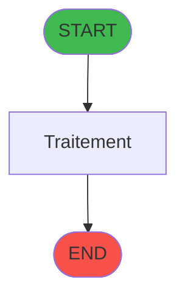
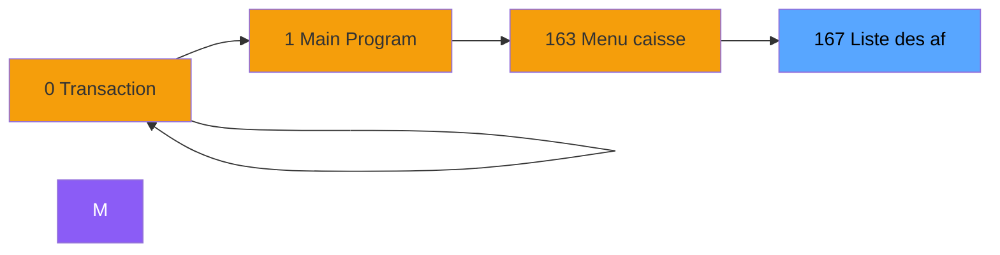
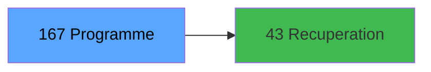

# ADH IDE 167 - Liste des affiliés

> **Version spec**: 3.5
> **Analyse**: 2026-01-27 17:57
> **Source**: `Prg_XXX.xml`

---

<!-- TAB:Fonctionnel -->

## SPECIFICATION FONCTIONNELLE

### 1.1 Objectif metier

| Element | Description |
|---------|-------------|
| **Qui** | Operateur |
| **Quoi** | Liste des affiliés
 |
| **Pourquoi** | A documenter |
| **Declencheur** | A identifier |

### 1.2 Regles metier

| Code | Regle | Condition |
|------|-------|-----------|
| RM-001 | A documenter | - |

### 1.3 Flux utilisateur

1. Demarrage programme
2. Traitement principal
3. Fin programme

### 1.4 Cas d'erreur

| Erreur | Comportement |
|--------|--------------|
| - | A documenter |

---

<!-- TAB:Technique -->

## SPECIFICATION TECHNIQUE

### 2.1 Identification

| Attribut | Valeur |
|----------|--------|
| **Format IDE** | ADH IDE 167 |
| **Description** | Liste des affiliés
 |
| **Module** | ADH |

### 2.2 Tables

| # | Nom logique | Nom physique | Acces | Usage |
|---|-------------|--------------|-------|-------|
| 30 | gm-recherche_____gmr | `cafil008_dat` | R | 1x |
| 47 | compte_gm________cgm | `cafil025_dat` | R | 1x |
### 2.3 Parametres d'entree

| Variable | Nom | Type | Picture |
|----------|-----|------|---------|
| - | Aucun parametre | - | - |
### 2.4 Algorigramme

### 2.5 Expressions cles

| IDE | Expression | Commentaire |
|-----|------------|-------------|
| 1 | `{0,1}=''` | - |
| 2 | `'C'` | - |
| 3 | `Trim ({0,8})` | - |
| 4 | `Date ()` | - |
| 5 | `{32768,2}` | - |
| 6 | `{0,1}` | - |
| 7 | `{0,2}` | - |
| 8 | `Stat (0,'C'MODE)` | - |
| 9 | `Trim ({0,11})&' '&{0,12}` | - |
| 10 | `IF ({0,22}>0,Str ({0,22},'###'),IF ({0,23}=0,''...` | - |
| 11 | `IF ({0,22}>0,'ans',IF ({0,23}=0,'','mois'))` | - |
| 12 | `'-'` | - |
| 13 | `IF ({0,21}<Date (),MlsTrans ('dernier sejour :'...` | - |
| 14 | `MlsTrans ('du')` | - |
| 15 | `MlsTrans ('au')` | - |
| 16 | `1` | - |
| 17 | `{0,17}=0` | - |
| 18 | `NOT(Stat(0,'M'MODE))` | - |

> **Total**: 18 expressions (affichees: 18)
### 2.6 Variables importantes

### 2.7 Statistiques

| Metrique | Valeur |
|----------|--------|
| **Taches** | 2 |
| **Lignes logique** | 45 |
| **Lignes desactivees** | 0 |
---

<!-- TAB:Cartographie -->

## CARTOGRAPHIE APPLICATIVE

### 3.1 Chaine d'appels depuis Main

### 3.2 Callers directs

| IDE | Programme | Nb appels |
|-----|-----------|-----------|
| 163 | Menu caisse GM - scroll | 3 |
| 0 | Transaction Nouv vente PMS-584 | 1 |
| 0 | Transaction Nouv vente PMS-710 | 1 |
| 0 | Transaction Nouv vente PMS-721 | 1 |
| 0 | Transferts | 1 |
### 3.3 Callees

| Niv | IDE | Programme | Nb appels |
|-----|-----|-----------|-----------|
| 1 | 43 | Recuperation du titre | 1 |
### 3.4 Verification orphelin

| Critere | Resultat |
|---------|----------|
| Callers actifs | A verifier |
| **Conclusion** | A analyser |

---

## HISTORIQUE

| Date | Action | Auteur |
|------|--------|--------|
| 2026-01-27 20:22 | **DATA V2** - Tables reelles, Expressions, Stats, CallChain | Script |
| 2026-01-27 19:48 | **DATA POPULATED** - Tables, Callgraph (18 expr) | Script |
| 2026-01-27 17:57 | **Upgrade V3.5** - TAB markers, Mermaid | Claude |

---

*Specification V3.5 - Format avec TAB markers et Mermaid*
