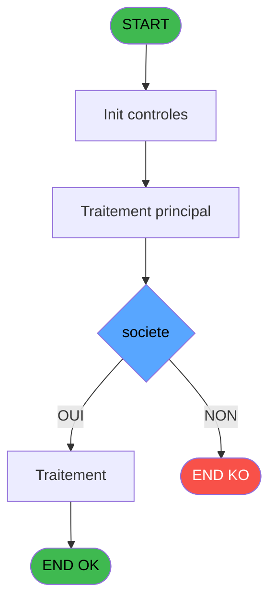
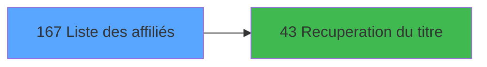

# ADH IDE 167 - Liste des affiliés

> **Analyse**: Phases 1-4 2026-02-07 03:52 -> 03:49 (23h57min) | Assemblage 03:49
> **Pipeline**: V7.2 Enrichi
> **Structure**: 4 onglets (Resume | Ecrans | Donnees | Connexions)

<!-- TAB:Resume -->

## 1. FICHE D'IDENTITE

| Attribut | Valeur |
|----------|--------|
| Projet | ADH |
| IDE Position | 167 |
| Nom Programme | Liste des affiliés |
| Fichier source | `Prg_167.xml` |
| Dossier IDE | General |
| Taches | 2 (1 ecrans visibles) |
| Tables modifiees | 0 |
| Programmes appeles | 1 |
| Complexite | **BASSE** (score 5/100) |

## 2. DESCRIPTION FONCTIONNELLE

# ADH IDE 167 - Liste des affiliés

Programme de sélection d'affilié accessible depuis le menu caisse. Affiche une grille des comptes affiliés (dépendants) rattachés au compte principal, permettant à l'opérateur de consulter et sélectionner rapidement un affilié pour les opérations de caisse (ventes, transferts, transactions).

La tâche **Ecran** gère l'affichage de la liste avec recherche/filtrage des affiliés, tandis que la tâche **Reaffichage infos compte** met à jour les informations du compte sélectionné après une action. Le programme appelle systématiquement **ADH IDE 43** (Récupération du titre) pour afficher le nom/titre de l'affilié sélectionné.

Fréquemment appelé depuis les flux de transaction (PMS-584, PMS-710, PMS-721) et les transferts inter-comptes, ce programme est un point d'entrée critique pour la gestion multi-affiliés dans la caisse.

## 3. BLOCS FONCTIONNELS

### 3.1 Traitement (1 tache)

Traitements internes.

---

#### 167 - Ecran [[ECRAN]](#ecran-t1)

**Role** : Traitement : Ecran.
**Ecran** : 1010 x 227 DLU (MDI) | [Voir mockup](#ecran-t1)
**Delegue a** : [Recuperation du titre (IDE 43)](ADH-IDE-43.md)

### 3.2 Calcul (1 tache)

Calculs metier : montants, stocks, compteurs.

---

#### 167.1 - Reaffichage infos compte

**Role** : Reinitialisation : Reaffichage infos compte.
**Variables liees** : EQ (< solde compte), ER (< etat compte)

## 5. REGLES METIER

4 regles identifiees:

### Autres (4 regles)

#### [RM-001] Condition: > societe [A] egale

| Element | Detail |
|---------|--------|
| **Condition** | `> societe [A]=''` |
| **Si vrai** | Action si vrai |
| **Variables** | EN (> societe) |
| **Expression source** | Expression 1 : `> societe [A]=''` |
| **Exemple** | Si > societe [A]='' → Action si vrai |

#### [RM-002] Traitement conditionnel si [V]>0,Str ([V],'###'),IF ([W] est a zero

| Element | Detail |
|---------|--------|
| **Condition** | `[V]>0` |
| **Si vrai** | Str ([V] |
| **Si faux** | '###'),IF ([W]=0,'',Str ([W],'##'))) |
| **Expression source** | Expression 10 : `IF ([V]>0,Str ([V],'###'),IF ([W]=0,'',Str ([W],'##')))` |
| **Exemple** | Si [V]>0 → Str ([V]. Sinon → '###'),IF ([W]=0,'',Str ([W],'##'))) |

#### [RM-003] Si [U]<Date () alors MlsTrans ('dernier sejour :') sinon IF ([T]>Date (),MlsTrans ('prochain sejour :'),MlsTrans ('sejour en cours')))

| Element | Detail |
|---------|--------|
| **Condition** | `[U]<Date ()` |
| **Si vrai** | MlsTrans ('dernier sejour :') |
| **Si faux** | IF ([T]>Date (),MlsTrans ('prochain sejour :'),MlsTrans ('sejour en cours'))) |
| **Expression source** | Expression 13 : `IF ([U]<Date (),MlsTrans ('dernier sejour :'),IF ([T]>Date (` |
| **Exemple** | Si [U]<Date () → MlsTrans ('dernier sejour :') |

#### [RM-004] Condition: [Q] egale 0

| Element | Detail |
|---------|--------|
| **Condition** | `[Q]=0` |
| **Si vrai** | Action si vrai |
| **Expression source** | Expression 17 : `[Q]=0` |
| **Exemple** | Si [Q]=0 → Action si vrai |

## 6. CONTEXTE

- **Appele par**: [Menu caisse GM - scroll (IDE 163)](ADH-IDE-163.md), [Transaction Nouv vente PMS-584 (IDE 0)](ADH-IDE-0.md), [Transaction Nouv vente PMS-710 (IDE 0)](ADH-IDE-0.md), [Transaction Nouv vente PMS-721 (IDE 0)](ADH-IDE-0.md), [Transferts (IDE 0)](ADH-IDE-0.md)
- **Appelle**: 1 programmes | **Tables**: 2 (W:0 R:2 L:0) | **Taches**: 2 | **Expressions**: 18

<!-- TAB:Ecrans -->

## 8. ECRANS

### 8.1 Forms visibles (1 / 2)

| # | Position | Tache | Nom | Type | Largeur | Hauteur | Bloc |
|---|----------|-------|-----|------|---------|---------|------|
| 1 | 167 | 167 | Ecran | MDI | 1010 | 227 | Traitement |

### 8.2 Mockups Ecrans

---

#### 167 - Ecran
**Tache** : [167](#t1) | **Type** : MDI | **Dimensions** : 1010 x 227 DLU
**Bloc** : Traitement | **Titre IDE** : Ecran

<!-- FORM-DATA:
{
    "width":  1010,
    "vFactor":  8,
    "type":  "MDI",
    "hFactor":  8,
    "controls":  [
                     {
                         "x":  0,
                         "type":  "label",
                         "var":  "",
                         "y":  0,
                         "w":  1010,
                         "fmt":  "",
                         "name":  "",
                         "h":  18,
                         "color":  "",
                         "text":  "",
                         "parent":  null
                     },
                     {
                         "x":  0,
                         "type":  "label",
                         "var":  "",
                         "y":  203,
                         "w":  1008,
                         "fmt":  "",
                         "name":  "",
                         "h":  24,
                         "color":  "",
                         "text":  "",
                         "parent":  null
                     },
                     {
                         "x":  1,
                         "type":  "table",
                         "var":  "",
                         "name":  "",
                         "titleH":  15,
                         "color":  "110",
                         "w":  814,
                         "y":  27,
                         "fmt":  "",
                         "parent":  null,
                         "text":  "",
                         "rowH":  24,
                         "h":  170,
                         "cols":  [
                                      {
                                          "title":  "Nom / Prénom",
                                          "layer":  1,
                                          "w":  310
                                      },
                                      {
                                          "title":  "Sexe",
                                          "layer":  2,
                                          "w":  141
                                      },
                                      {
                                          "title":  "Age",
                                          "layer":  3,
                                          "w":  122
                                      },
                                      {
                                          "title":  "Numéro",
                                          "layer":  4,
                                          "w":  210
                                      }
                                  ],
                         "rows":  4
                     },
                     {
                         "x":  758,
                         "type":  "label",
                         "var":  "",
                         "y":  57,
                         "w":  20,
                         "fmt":  "",
                         "name":  "",
                         "h":  8,
                         "color":  "149",
                         "text":  "m",
                         "parent":  6
                     },
                     {
                         "x":  10,
                         "type":  "edit",
                         "var":  "",
                         "y":  47,
                         "w":  295,
                         "fmt":  "",
                         "name":  "",
                         "h":  8,
                         "color":  "110",
                         "text":  "",
                         "parent":  6
                     },
                     {
                         "x":  578,
                         "type":  "edit",
                         "var":  "",
                         "y":  47,
                         "w":  120,
                         "fmt":  "",
                         "name":  "",
                         "h":  8,
                         "color":  "110",
                         "text":  "",
                         "parent":  6
                     },
                     {
                         "x":  698,
                         "type":  "edit",
                         "var":  "",
                         "y":  47,
                         "w":  20,
                         "fmt":  "1",
                         "name":  "",
                         "h":  8,
                         "color":  "110",
                         "text":  "",
                         "parent":  6
                     },
                     {
                         "x":  736,
                         "type":  "edit",
                         "var":  "",
                         "y":  47,
                         "w":  42,
                         "fmt":  "",
                         "name":  "",
                         "h":  8,
                         "color":  "110",
                         "text":  "",
                         "parent":  6
                     },
                     {
                         "x":  317,
                         "type":  "edit",
                         "var":  "",
                         "y":  58,
                         "w":  135,
                         "fmt":  "WWW DD MMMMZ",
                         "name":  "",
                         "h":  8,
                         "color":  "110",
                         "text":  "",
                         "parent":  6
                     },
                     {
                         "x":  581,
                         "type":  "edit",
                         "var":  "",
                         "y":  58,
                         "w":  132,
                         "fmt":  "WWW DD MMMMZ",
                         "name":  "",
                         "h":  8,
                         "color":  "110",
                         "text":  "",
                         "parent":  6
                     },
                     {
                         "x":  6,
                         "type":  "edit",
                         "var":  "",
                         "y":  4,
                         "w":  267,
                         "fmt":  "20",
                         "name":  "",
                         "h":  8,
                         "color":  "",
                         "text":  "",
                         "parent":  1
                     },
                     {
                         "x":  800,
                         "type":  "edit",
                         "var":  "",
                         "y":  4,
                         "w":  203,
                         "fmt":  "WWW DD MMM YYYYT",
                         "name":  "",
                         "h":  8,
                         "color":  "",
                         "text":  "",
                         "parent":  1
                     },
                     {
                         "x":  368,
                         "type":  "edit",
                         "var":  "",
                         "y":  47,
                         "w":  30,
                         "fmt":  "2",
                         "name":  "gmr_sexe",
                         "h":  8,
                         "color":  "110",
                         "text":  "",
                         "parent":  6
                     },
                     {
                         "x":  464,
                         "type":  "edit",
                         "var":  "",
                         "y":  47,
                         "w":  34,
                         "fmt":  "3",
                         "name":  "",
                         "h":  8,
                         "color":  "110",
                         "text":  "",
                         "parent":  6
                     },
                     {
                         "x":  515,
                         "type":  "edit",
                         "var":  "",
                         "y":  47,
                         "w":  52,
                         "fmt":  "4",
                         "name":  "",
                         "h":  8,
                         "color":  "110",
                         "text":  "",
                         "parent":  6
                     },
                     {
                         "x":  715,
                         "type":  "edit",
                         "var":  "",
                         "y":  47,
                         "w":  20,
                         "fmt":  "1",
                         "name":  "",
                         "h":  8,
                         "color":  "110",
                         "text":  "",
                         "parent":  6
                     },
                     {
                         "x":  824,
                         "type":  "image",
                         "var":  "",
                         "y":  67,
                         "w":  182,
                         "fmt":  "",
                         "name":  "",
                         "h":  92,
                         "color":  "",
                         "text":  "",
                         "parent":  null
                     },
                     {
                         "x":  10,
                         "type":  "edit",
                         "var":  "",
                         "y":  58,
                         "w":  198,
                         "fmt":  "17",
                         "name":  "",
                         "h":  8,
                         "color":  "110",
                         "text":  "",
                         "parent":  6
                     },
                     {
                         "x":  221,
                         "type":  "edit",
                         "var":  "",
                         "y":  58,
                         "w":  53,
                         "fmt":  "4",
                         "name":  "",
                         "h":  8,
                         "color":  "110",
                         "text":  "",
                         "parent":  6
                     },
                     {
                         "x":  496,
                         "type":  "edit",
                         "var":  "",
                         "y":  58,
                         "w":  52,
                         "fmt":  "4",
                         "name":  "",
                         "h":  8,
                         "color":  "110",
                         "text":  "",
                         "parent":  6
                     },
                     {
                         "x":  9,
                         "type":  "button",
                         "var":  "",
                         "y":  206,
                         "w":  168,
                         "fmt":  "\u0026Quitter",
                         "name":  "",
                         "h":  18,
                         "color":  "",
                         "text":  "",
                         "parent":  null
                     }
                 ],
    "taskId":  "167",
    "height":  227
}
-->

<strong>Champs : 15 champs</strong>

| Pos (x,y) | Nom | Variable | Type |
|-----------|-----|----------|------|
| 10,47 | (sans nom) | - | edit |
| 578,47 | (sans nom) | - | edit |
| 698,47 | 1 | - | edit |
| 736,47 | (sans nom) | - | edit |
| 317,58 | WWW DD MMMMZ | - | edit |
| 581,58 | WWW DD MMMMZ | - | edit |
| 6,4 | 20 | - | edit |
| 800,4 | WWW DD MMM YYYYT | - | edit |
| 368,47 | gmr_sexe | - | edit |
| 464,47 | 3 | - | edit |
| 515,47 | 4 | - | edit |
| 715,47 | 1 | - | edit |
| 10,58 | 17 | - | edit |
| 221,58 | 4 | - | edit |
| 496,58 | 4 | - | edit |

<strong>Boutons : 1 boutons</strong>

| Bouton | Pos (x,y) | Action |
|--------|-----------|--------|
| Quitter | 9,206 | Quitte le programme |

## 9. NAVIGATION

Ecran unique: **Ecran**

### 9.3 Structure hierarchique (2 taches)

| Position | Tache | Type | Dimensions | Bloc |
|----------|-------|------|------------|------|
| **167.1** | [**Ecran** (167)](#t1) [mockup](#ecran-t1) | MDI | 1010x227 | Traitement |
| **167.2** | [**Reaffichage infos compte** (167.1)](#t2) | MDI | - | Calcul |

### 9.4 Algorigramme

> **Legende**: Vert = START/END OK | Rouge = END KO | Bleu = Decisions
> *Algorigramme auto-genere. Utiliser `/algorigramme` pour une synthese metier detaillee.*

<!-- TAB:Donnees -->

## 10. TABLES

### Tables utilisees (2)

| ID | Nom | Description | Type | R | W | L | Usages |
|----|-----|-------------|------|---|---|---|--------|
| 47 | compte_gm________cgm | Comptes GM (generaux) | DB | R |   |   | 1 |
| 30 | gm-recherche_____gmr | Index de recherche | DB | R |   |   | 1 |

### Colonnes par table (2 / 2 tables avec colonnes identifiees)

Table 47 - compte_gm________cgm (R) - 1 usages

| Lettre | Variable | Acces | Type |
|--------|----------|-------|------|
| EQ | < solde compte | R | Numeric |
| ER | < etat compte | R | Alpha |

Table 30 - gm-recherche_____gmr (R) - 1 usages

| Lettre | Variable | Acces | Type |
|--------|----------|-------|------|
| A | > societe | R | Alpha |
| B | > code adherent | R | Numeric |
| C | > filiation | R | Numeric |
| D | < solde compte | R | Numeric |
| E | < etat compte | R | Alpha |
| F | < date solde | R | Date |
| G | < garanti O/N | R | Alpha |
| H | v. titre | R | Alpha |
| I | v. nom & prenom | R | Alpha |

## 11. VARIABLES

### 11.1 Variables de session (2)

Variables persistantes pendant toute la session.

| Lettre | Nom | Type | Usage dans |
|--------|-----|------|-----------|
| EU | v. titre | Alpha | 1x session |
| EV | v. nom & prenom | Alpha | - |

### 11.2 Autres (7)

Variables diverses.

| Lettre | Nom | Type | Usage dans |
|--------|-----|------|-----------|
| EN | > societe | Alpha | 2x refs |
| EO | > code adherent | Numeric | 1x refs |
| EP | > filiation | Numeric | - |
| EQ | < solde compte | Numeric | - |
| ER | < etat compte | Alpha | - |
| ES | < date solde | Date | - |
| ET | < garanti O/N | Alpha | - |

## 12. EXPRESSIONS

**18 / 18 expressions decodees (100%)**

### 12.1 Repartition par type

| Type | Expressions | Regles |
|------|-------------|--------|
| CONDITION | 7 | 4 |
| CONSTANTE | 3 | 0 |
| DATE | 1 | 0 |
| REFERENCE_VG | 1 | 0 |
| OTHER | 4 | 0 |
| STRING | 1 | 0 |
| CONCATENATION | 1 | 0 |

### 12.2 Expressions cles par type

#### CONDITION (7 expressions)

| Type | IDE | Expression | Regle |
|------|-----|------------|-------|
| CONDITION | 13 | `IF ([U]<Date (),MlsTrans ('dernier sejour :'),IF ([T]>Date (),MlsTrans ('prochain sejour :'),MlsTrans ('sejour en cours')))` | [RM-003](#rm-RM-003) |
| CONDITION | 17 | `[Q]=0` | [RM-004](#rm-RM-004) |
| CONDITION | 10 | `IF ([V]>0,Str ([V],'###'),IF ([W]=0,'',Str ([W],'##')))` | [RM-002](#rm-RM-002) |
| CONDITION | 1 | `> societe [A]=''` | [RM-001](#rm-RM-001) |
| CONDITION | 7 | `> code adherent [B]` | - |
| ... | | *+2 autres* | |

#### CONSTANTE (3 expressions)

| Type | IDE | Expression | Regle |
|------|-----|------------|-------|
| CONSTANTE | 16 | `1` | - |
| CONSTANTE | 12 | `'-'` | - |
| CONSTANTE | 2 | `'C'` | - |

#### DATE (1 expressions)

| Type | IDE | Expression | Regle |
|------|-----|------------|-------|
| DATE | 4 | `Date ()` | - |

#### REFERENCE_VG (1 expressions)

| Type | IDE | Expression | Regle |
|------|-----|------------|-------|
| REFERENCE_VG | 5 | `VG2` | - |

#### OTHER (4 expressions)

| Type | IDE | Expression | Regle |
|------|-----|------------|-------|
| OTHER | 15 | `MlsTrans ('au')` | - |
| OTHER | 18 | `NOT(Stat(0,'M'MODE))` | - |
| OTHER | 8 | `Stat (0,'C'MODE)` | - |
| OTHER | 14 | `MlsTrans ('du')` | - |

#### STRING (1 expressions)

| Type | IDE | Expression | Regle |
|------|-----|------------|-------|
| STRING | 3 | `Trim (v. titre [H])` | - |

#### CONCATENATION (1 expressions)

| Type | IDE | Expression | Regle |
|------|-----|------------|-------|
| CONCATENATION | 9 | `Trim ([K])&' '&[L]` | - |

<!-- TAB:Connexions -->

## 13. GRAPHE D'APPELS

### 13.1 Chaine depuis Main (Callers)

Main -> ... -> [Menu caisse GM - scroll (IDE 163)](ADH-IDE-163.md) -> **Liste des affiliés (IDE 167)**

Main -> ... -> [Transaction Nouv vente PMS-584 (IDE 0)](ADH-IDE-0.md) -> **Liste des affiliés (IDE 167)**

Main -> ... -> [Transaction Nouv vente PMS-710 (IDE 0)](ADH-IDE-0.md) -> **Liste des affiliés (IDE 167)**

Main -> ... -> [Transaction Nouv vente PMS-721 (IDE 0)](ADH-IDE-0.md) -> **Liste des affiliés (IDE 167)**

Main -> ... -> [Transferts (IDE 0)](ADH-IDE-0.md) -> **Liste des affiliés (IDE 167)**

### 13.2 Callers

| IDE | Nom Programme | Nb Appels |
|-----|---------------|-----------|
| [163](ADH-IDE-163.md) | Menu caisse GM - scroll | 3 |
| [0](ADH-IDE-0.md) | Transaction Nouv vente PMS-584 | 1 |
| [0](ADH-IDE-0.md) | Transaction Nouv vente PMS-710 | 1 |
| [0](ADH-IDE-0.md) | Transaction Nouv vente PMS-721 | 1 |
| [0](ADH-IDE-0.md) | Transferts | 1 |

### 13.3 Callees (programmes appeles)

### 13.4 Detail Callees avec contexte

| IDE | Nom Programme | Appels | Contexte |
|-----|---------------|--------|----------|
| [43](ADH-IDE-43.md) | Recuperation du titre | 1 | Recuperation donnees |

## 14. RECOMMANDATIONS MIGRATION

### 14.1 Profil du programme

| Metrique | Valeur | Impact migration |
|----------|--------|-----------------|
| Lignes de logique | 45 | Programme compact |
| Expressions | 18 | Peu de logique |
| Tables WRITE | 0 | Impact faible |
| Sous-programmes | 1 | Peu de dependances |
| Ecrans visibles | 1 | Ecran unique ou traitement batch |
| Code desactive | 0% (0 / 45) | Code sain |
| Regles metier | 4 | Quelques regles a preserver |

### 14.2 Plan de migration par bloc

#### Traitement (1 tache: 1 ecran, 0 traitement)

- **Strategie** : 1 composant(s) UI (Razor/React) avec formulaires et validation.
- 1 sous-programme(s) a migrer ou a reutiliser depuis les services existants.
- Decomposer les taches en services unitaires testables.

#### Calcul (1 tache: 0 ecran, 1 traitement)

- **Strategie** : Services de calcul purs (Domain Services).
- Migrer la logique de calcul (stock, compteurs, montants)

### 14.3 Dependances critiques

| Dependance | Type | Appels | Impact |
|------------|------|--------|--------|
| [Recuperation du titre (IDE 43)](ADH-IDE-43.md) | Sous-programme | 1x | Normale - Recuperation donnees |

---
*Spec DETAILED generee par Pipeline V7.2 - 2026-02-08 03:49*
