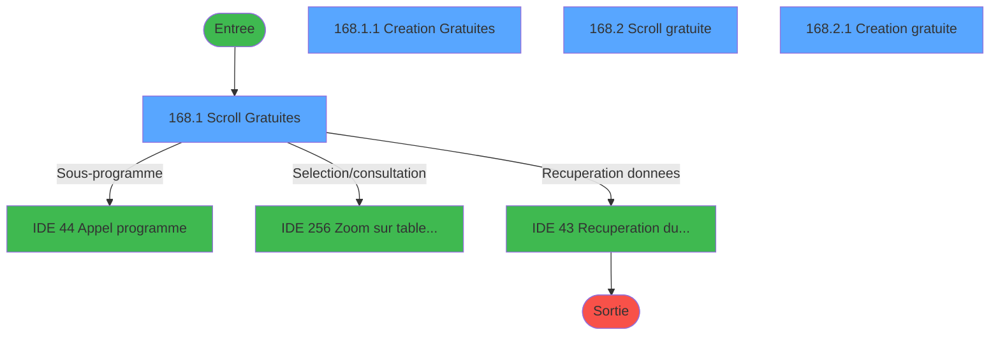
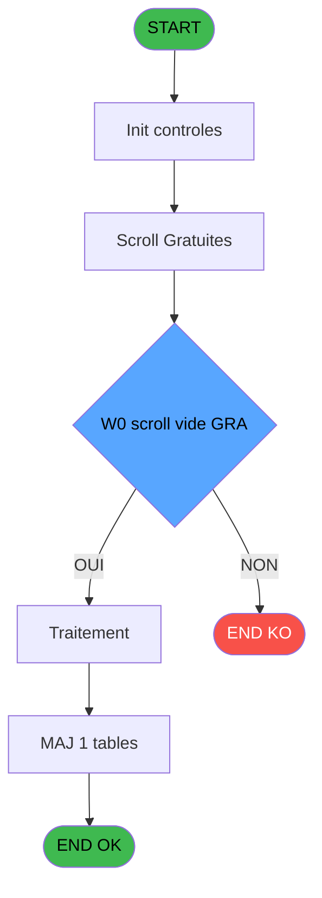
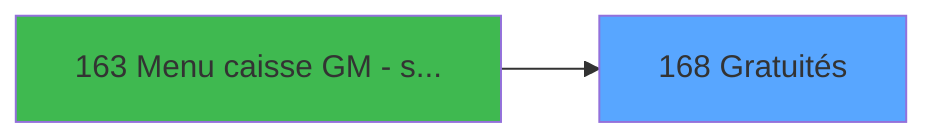
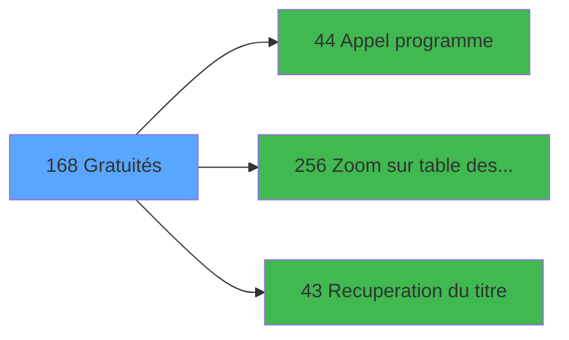

# ADH IDE 168 - Gratuités

> **Analyse**: Phases 1-4 2026-02-07 03:52 -> 03:49 (23h57min) | Assemblage 03:49
> **Pipeline**: V7.2 Enrichi
> **Structure**: 4 onglets (Resume | Ecrans | Donnees | Connexions)

<!-- TAB:Resume -->

## 1. FICHE D'IDENTITE

| Attribut | Valeur |
|----------|--------|
| Projet | ADH |
| IDE Position | 168 |
| Nom Programme | Gratuités |
| Fichier source | `Prg_168.xml` |
| Dossier IDE | General |
| Taches | 9 (4 ecrans visibles) |
| Tables modifiees | 1 |
| Programmes appeles | 3 |
| Complexite | **BASSE** (score 19/100) |

## 2. DESCRIPTION FONCTIONNELLE

# ADH IDE 168 - Gratuités

ADH IDE 168 gère l'ensemble du cycle de vie des gratuités (services offerts sans frais) dans le système de caisse. Le programme permet de consulter l'historique des gratuités appliquées aux comptes, d'accéder aux détails des transactions gratuites et de modifier la table centralisée des gratuités. Il s'articule autour de 6 tâches principales : visualisation des opérations gratuites existantes, parcours scroll de la liste, création de nouvelles entrées, gestion des enregistrements de caisse associés (CAG), suppression d'enregistrements, et synchronisation du flag gratuité dans la table des mouvements (CAM).

Le programme interagit fortement avec l'écosystème de gestion de caisse. Il est appelé depuis 12 contextes différents (garanties, ventes, extraits, transactions, transferts) et dépend de 3 programmes externes pour ses opérations clés : le programme IDE 44 pour les appels génériques, IDE 256 pour les zooms sur la table des gratuités, et IDE 43 pour la récupération des libellés. Toutes les modifications sont écrites dans la table `gratuites________gra`, la seule table modifiée par ce programme.

Ce programme représente un nœud critique pour l'audit des services offerts : chaque gratuité laisse une trace dans le système, permettant un suivi complet des réductions commerciales appliquées aux clients et une réconciliation précise avec les mouvements de caisse.

## 3. BLOCS FONCTIONNELS

### 3.1 Traitement (5 taches)

Traitements internes.

---

#### 168 - Operations GRA [[ECRAN]](#ecran-t1)

**Role** : Traitement : Operations GRA.
**Ecran** : 750 x 203 DLU (MDI) | [Voir mockup](#ecran-t1)

4 sous-taches directes

| Tache | Nom | Bloc |
|-------|-----|------|
| [168.1](#t2) | Scroll Gratuites **[[ECRAN]](#ecran-t2)** | Traitement |
| [168.1.2](#t5) | Suppression enreg CAG | Traitement |
| [168.1.3](#t6) | MAJ flag gratuite dans CAM | Traitement |
| [168.2](#t7) | Scroll gratuite **[[ECRAN]](#ecran-t7)** | Traitement |

**Delegue a** : [Appel programme (IDE 44)](ADH-IDE-44.md), [Recuperation du titre (IDE 43)](ADH-IDE-43.md)

---

#### 168.1 - Scroll Gratuites [[ECRAN]](#ecran-t2)

**Role** : Traitement : Scroll Gratuites.
**Ecran** : 750 x 189 DLU (MDI) | [Voir mockup](#ecran-t2)
**Variables liees** : EQ (W0 scroll vide GRA)
**Delegue a** : [Appel programme (IDE 44)](ADH-IDE-44.md), [Recuperation du titre (IDE 43)](ADH-IDE-43.md)

---

#### 168.1.2 - Suppression enreg CAG

**Role** : Traitement : Suppression enreg CAG.
**Delegue a** : [Appel programme (IDE 44)](ADH-IDE-44.md), [Recuperation du titre (IDE 43)](ADH-IDE-43.md)

---

#### 168.1.3 - MAJ flag gratuite dans CAM

**Role** : Traitement : MAJ flag gratuite dans CAM.
**Delegue a** : [Appel programme (IDE 44)](ADH-IDE-44.md), [Recuperation du titre (IDE 43)](ADH-IDE-43.md)

---

#### 168.2 - Scroll gratuite [[ECRAN]](#ecran-t7)

**Role** : Traitement : Scroll gratuite.
**Ecran** : 610 x 126 DLU (MDI) | [Voir mockup](#ecran-t7)
**Variables liees** : EQ (W0 scroll vide GRA)
**Delegue a** : [Appel programme (IDE 44)](ADH-IDE-44.md), [Recuperation du titre (IDE 43)](ADH-IDE-43.md)

### 3.2 Creation (4 taches)

Insertion de nouveaux enregistrements en base.

---

#### 168.1.1 - Creation Gratuites [[ECRAN]](#ecran-t3)

**Role** : Creation d'enregistrement : Creation Gratuites.
**Ecran** : 664 x 76 DLU (MDI) | [Voir mockup](#ecran-t3)

---

#### 168.1.1.1 - Creation enreg CAG

**Role** : Creation d'enregistrement : Creation enreg CAG.

---

#### 168.2.1 - Creation gratuite [[ECRAN]](#ecran-t8)

**Role** : Creation d'enregistrement : Creation gratuite.
**Ecran** : 669 x 76 DLU (MDI) | [Voir mockup](#ecran-t8)

---

#### 168.2.1.1 - Creation enreg CAG

**Role** : Creation d'enregistrement : Creation enreg CAG.

## 5. REGLES METIER

3 regles identifiees:

### Autres (3 regles)

#### [RM-001] Condition: >societe [A] egale

| Element | Detail |
|---------|--------|
| **Condition** | `>societe [A]=''` |
| **Si vrai** | Action si vrai |
| **Variables** | EN (>societe) |
| **Expression source** | Expression 1 : `>societe [A]=''` |
| **Exemple** | Si >societe [A]='' → Action si vrai |

#### [RM-002] Condition: W0 fin tache [E] egale 'F'

| Element | Detail |
|---------|--------|
| **Condition** | `W0 fin tache [E]='F'` |
| **Si vrai** | Action si vrai |
| **Variables** | ER (W0 fin tache) |
| **Expression source** | Expression 5 : `W0 fin tache [E]='F'` |
| **Exemple** | Si W0 fin tache [E]='F' → Action si vrai |

#### [RM-003] Condition: W0 scroll vide GRA [D] egale 'O'

| Element | Detail |
|---------|--------|
| **Condition** | `W0 scroll vide GRA [D]='O'` |
| **Si vrai** | Action si vrai |
| **Variables** | EQ (W0 scroll vide GRA) |
| **Expression source** | Expression 6 : `W0 scroll vide GRA [D]='O'` |
| **Exemple** | Si W0 scroll vide GRA [D]='O' → Action si vrai |
| **Impact** | [168.1 - Scroll Gratuites](#t2) |

## 6. CONTEXTE

- **Appele par**: [Garantie sur compte PMS-584 (IDE 0)](ADH-IDE-0.md), [VAD validés à imprimer (IDE 0)](ADH-IDE-0.md), [Histo ventes Gratuités (IDE 0)](ADH-IDE-0.md), [Histo ventes IGR (IDE 0)](ADH-IDE-0.md), [Histo ventes payantes /PMS-605 (IDE 0)](ADH-IDE-0.md), [Histo ventes payantes /PMS-623 (IDE 0)](ADH-IDE-0.md), [Print extrait compte /Service (IDE 0)](ADH-IDE-0.md), [Transaction Nouv vente PMS-584 (IDE 0)](ADH-IDE-0.md), [Transaction Nouv vente PMS-710 (IDE 0)](ADH-IDE-0.md), [Transaction Nouv vente PMS-721 (IDE 0)](ADH-IDE-0.md), [Transferts (IDE 0)](ADH-IDE-0.md), [Menu caisse GM - scroll (IDE 163)](ADH-IDE-163.md)
- **Appelle**: 3 programmes | **Tables**: 2 (W:1 R:1 L:1) | **Taches**: 9 | **Expressions**: 6

<!-- TAB:Ecrans -->

## 8. ECRANS

### 8.1 Forms visibles (4 / 9)

| # | Position | Tache | Nom | Type | Largeur | Hauteur | Bloc |
|---|----------|-------|-----|------|---------|---------|------|
| 1 | 168.1 | 168.1 | Scroll Gratuites | MDI | 750 | 189 | Traitement |
| 2 | 168.1.1 | 168.1.1 | Creation Gratuites | MDI | 664 | 76 | Creation |
| 3 | 168.2 | 168.2 | Scroll gratuite | MDI | 610 | 126 | Traitement |
| 4 | 168.2.1 | 168.2.1 | Creation gratuite | MDI | 669 | 76 | Creation |

### 8.2 Mockups Ecrans

---

#### 168.1 - Scroll Gratuites
**Tache** : [168.1](#t2) | **Type** : MDI | **Dimensions** : 750 x 189 DLU
**Bloc** : Traitement | **Titre IDE** : Scroll Gratuites

<!-- FORM-DATA:
{
    "width":  750,
    "vFactor":  8,
    "type":  "MDI",
    "hFactor":  8,
    "controls":  [
                     {
                         "x":  2,
                         "type":  "label",
                         "var":  "",
                         "y":  0,
                         "w":  746,
                         "fmt":  "",
                         "name":  "",
                         "h":  19,
                         "color":  "",
                         "text":  "",
                         "parent":  null
                     },
                     {
                         "x":  2,
                         "type":  "label",
                         "var":  "",
                         "y":  26,
                         "w":  744,
                         "fmt":  "",
                         "name":  "",
                         "h":  131,
                         "color":  "",
                         "text":  "",
                         "parent":  null
                     },
                     {
                         "x":  259,
                         "type":  "label",
                         "var":  "",
                         "y":  97,
                         "w":  231,
                         "fmt":  "",
                         "name":  "",
                         "h":  54,
                         "color":  "",
                         "text":  "",
                         "parent":  null
                     },
                     {
                         "x":  262,
                         "type":  "label",
                         "var":  "",
                         "y":  98,
                         "w":  226,
                         "fmt":  "",
                         "name":  "",
                         "h":  52,
                         "color":  "",
                         "text":  "",
                         "parent":  null
                     },
                     {
                         "x":  280,
                         "type":  "label",
                         "var":  "",
                         "y":  101,
                         "w":  186,
                         "fmt":  "",
                         "name":  "",
                         "h":  31,
                         "color":  "",
                         "text":  "",
                         "parent":  null
                     },
                     {
                         "x":  283,
                         "type":  "label",
                         "var":  "",
                         "y":  102,
                         "w":  42,
                         "fmt":  "",
                         "name":  "",
                         "h":  29,
                         "color":  "",
                         "text":  "",
                         "parent":  null
                     },
                     {
                         "x":  336,
                         "type":  "label",
                         "var":  "",
                         "y":  106,
                         "w":  117,
                         "fmt":  "",
                         "name":  "",
                         "h":  8,
                         "color":  "7",
                         "text":  "Création",
                         "parent":  null
                     },
                     {
                         "x":  336,
                         "type":  "label",
                         "var":  "",
                         "y":  119,
                         "w":  117,
                         "fmt":  "",
                         "name":  "",
                         "h":  8,
                         "color":  "7",
                         "text":  "Annulation",
                         "parent":  null
                     },
                     {
                         "x":  305,
                         "type":  "label",
                         "var":  "",
                         "y":  137,
                         "w":  120,
                         "fmt":  "",
                         "name":  "",
                         "h":  9,
                         "color":  "",
                         "text":  "Votre choix",
                         "parent":  null
                     },
                     {
                         "x":  0,
                         "type":  "label",
                         "var":  "",
                         "y":  163,
                         "w":  749,
                         "fmt":  "",
                         "name":  "",
                         "h":  24,
                         "color":  "",
                         "text":  "",
                         "parent":  null
                     },
                     {
                         "x":  20,
                         "type":  "table",
                         "var":  "",
                         "name":  "",
                         "titleH":  12,
                         "color":  "110",
                         "w":  706,
                         "y":  32,
                         "fmt":  "",
                         "parent":  null,
                         "text":  "",
                         "rowH":  11,
                         "h":  62,
                         "cols":  [
                                      {
                                          "title":  "Imputation",
                                          "layer":  1,
                                          "w":  196
                                      },
                                      {
                                          "title":  "Gratuité",
                                          "layer":  2,
                                          "w":  170
                                      },
                                      {
                                          "title":  "Motif",
                                          "layer":  3,
                                          "w":  194
                                      },
                                      {
                                          "title":  "Utilisateur",
                                          "layer":  4,
                                          "w":  115
                                      }
                                  ],
                         "rows":  4
                     },
                     {
                         "x":  157,
                         "type":  "label",
                         "var":  "",
                         "y":  46,
                         "w":  12,
                         "fmt":  "",
                         "name":  "",
                         "h":  8,
                         "color":  "110",
                         "text":  "-",
                         "parent":  14
                     },
                     {
                         "x":  29,
                         "type":  "edit",
                         "var":  "",
                         "y":  46,
                         "w":  126,
                         "fmt":  "",
                         "name":  "",
                         "h":  8,
                         "color":  "110",
                         "text":  "",
                         "parent":  14
                     },
                     {
                         "x":  165,
                         "type":  "edit",
                         "var":  "",
                         "y":  46,
                         "w":  48,
                         "fmt":  "",
                         "name":  "",
                         "h":  8,
                         "color":  "110",
                         "text":  "",
                         "parent":  14
                     },
                     {
                         "x":  222,
                         "type":  "edit",
                         "var":  "",
                         "y":  46,
                         "w":  154,
                         "fmt":  "13",
                         "name":  "",
                         "h":  8,
                         "color":  "110",
                         "text":  "",
                         "parent":  14
                     },
                     {
                         "x":  397,
                         "type":  "edit",
                         "var":  "",
                         "y":  46,
                         "w":  176,
                         "fmt":  "",
                         "name":  "",
                         "h":  8,
                         "color":  "110",
                         "text":  "",
                         "parent":  14
                     },
                     {
                         "x":  587,
                         "type":  "edit",
                         "var":  "",
                         "y":  46,
                         "w":  98,
                         "fmt":  "",
                         "name":  "",
                         "h":  8,
                         "color":  "110",
                         "text":  "",
                         "parent":  14
                     },
                     {
                         "x":  425,
                         "type":  "edit",
                         "var":  "",
                         "y":  136,
                         "w":  26,
                         "fmt":  "",
                         "name":  "",
                         "h":  10,
                         "color":  "6",
                         "text":  "",
                         "parent":  null
                     },
                     {
                         "x":  541,
                         "type":  "edit",
                         "var":  "",
                         "y":  5,
                         "w":  203,
                         "fmt":  "WWW DD MMM YYYYT",
                         "name":  "",
                         "h":  8,
                         "color":  "",
                         "text":  "",
                         "parent":  null
                     },
                     {
                         "x":  294,
                         "type":  "button",
                         "var":  "",
                         "y":  106,
                         "w":  20,
                         "fmt":  "C",
                         "name":  "C",
                         "h":  8,
                         "color":  "",
                         "text":  "",
                         "parent":  null
                     },
                     {
                         "x":  294,
                         "type":  "button",
                         "var":  "",
                         "y":  119,
                         "w":  20,
                         "fmt":  "A",
                         "name":  "A",
                         "h":  8,
                         "color":  "",
                         "text":  "",
                         "parent":  null
                     },
                     {
                         "x":  6,
                         "type":  "button",
                         "var":  "",
                         "y":  166,
                         "w":  154,
                         "fmt":  "\u0026Quitter",
                         "name":  "",
                         "h":  18,
                         "color":  "",
                         "text":  "",
                         "parent":  13
                     },
                     {
                         "x":  8,
                         "type":  "edit",
                         "var":  "",
                         "y":  5,
                         "w":  267,
                         "fmt":  "20",
                         "name":  "",
                         "h":  8,
                         "color":  "",
                         "text":  "",
                         "parent":  null
                     }
                 ],
    "taskId":  "168.1",
    "height":  189
}
-->

<strong>Champs : 8 champs</strong>

| Pos (x,y) | Nom | Variable | Type |
|-----------|-----|----------|------|
| 29,46 | (sans nom) | - | edit |
| 165,46 | (sans nom) | - | edit |
| 222,46 | 13 | - | edit |
| 397,46 | (sans nom) | - | edit |
| 587,46 | (sans nom) | - | edit |
| 425,136 | (sans nom) | - | edit |
| 541,5 | WWW DD MMM YYYYT | - | edit |
| 8,5 | 20 | - | edit |

<strong>Boutons : 3 boutons</strong>

| Bouton | Pos (x,y) | Action |
|--------|-----------|--------|
| C | 294,106 | Bouton fonctionnel |
| A | 294,119 | Bouton fonctionnel |
| Quitter | 6,166 | Quitte le programme |

---

#### 168.1.1 - Creation Gratuites
**Tache** : [168.1.1](#t3) | **Type** : MDI | **Dimensions** : 664 x 76 DLU
**Bloc** : Creation | **Titre IDE** : Creation Gratuites

<!-- FORM-DATA:
{
    "width":  664,
    "vFactor":  8,
    "type":  "MDI",
    "hFactor":  8,
    "controls":  [
                     {
                         "x":  0,
                         "type":  "label",
                         "var":  "",
                         "y":  1,
                         "w":  663,
                         "fmt":  "",
                         "name":  "",
                         "h":  45,
                         "color":  "",
                         "text":  "",
                         "parent":  null
                     },
                     {
                         "x":  52,
                         "type":  "label",
                         "var":  "",
                         "y":  11,
                         "w":  120,
                         "fmt":  "",
                         "name":  "",
                         "h":  8,
                         "color":  "",
                         "text":  "Imputation",
                         "parent":  null
                     },
                     {
                         "x":  249,
                         "type":  "label",
                         "var":  "",
                         "y":  11,
                         "w":  173,
                         "fmt":  "",
                         "name":  "",
                         "h":  8,
                         "color":  "",
                         "text":  "Libellé",
                         "parent":  null
                     },
                     {
                         "x":  436,
                         "type":  "label",
                         "var":  "",
                         "y":  11,
                         "w":  117,
                         "fmt":  "",
                         "name":  "",
                         "h":  8,
                         "color":  "",
                         "text":  "Motif",
                         "parent":  null
                     },
                     {
                         "x":  2,
                         "type":  "label",
                         "var":  "",
                         "y":  51,
                         "w":  658,
                         "fmt":  "",
                         "name":  "",
                         "h":  24,
                         "color":  "",
                         "text":  "",
                         "parent":  null
                     },
                     {
                         "x":  49,
                         "type":  "edit",
                         "var":  "",
                         "y":  25,
                         "w":  126,
                         "fmt":  "",
                         "name":  "W2 imputation",
                         "h":  10,
                         "color":  "6",
                         "text":  "",
                         "parent":  null
                     },
                     {
                         "x":  185,
                         "type":  "edit",
                         "var":  "",
                         "y":  26,
                         "w":  42,
                         "fmt":  "",
                         "name":  "",
                         "h":  8,
                         "color":  "7",
                         "text":  "",
                         "parent":  null
                     },
                     {
                         "x":  249,
                         "type":  "edit",
                         "var":  "",
                         "y":  26,
                         "w":  179,
                         "fmt":  "",
                         "name":  "",
                         "h":  9,
                         "color":  "7",
                         "text":  "",
                         "parent":  null
                     },
                     {
                         "x":  433,
                         "type":  "edit",
                         "var":  "",
                         "y":  25,
                         "w":  182,
                         "fmt":  "",
                         "name":  "W2 motif",
                         "h":  10,
                         "color":  "6",
                         "text":  "",
                         "parent":  null
                     },
                     {
                         "x":  8,
                         "type":  "button",
                         "var":  "",
                         "y":  54,
                         "w":  154,
                         "fmt":  "\u0026Ok",
                         "name":  "Btn valider",
                         "h":  18,
                         "color":  "",
                         "text":  "",
                         "parent":  9
                     },
                     {
                         "x":  169,
                         "type":  "button",
                         "var":  "",
                         "y":  54,
                         "w":  154,
                         "fmt":  "A\u0026bandonner",
                         "name":  "",
                         "h":  18,
                         "color":  "",
                         "text":  "",
                         "parent":  null
                     }
                 ],
    "taskId":  "168.1.1",
    "height":  76
}
-->

<strong>Champs : 4 champs</strong>

| Pos (x,y) | Nom | Variable | Type |
|-----------|-----|----------|------|
| 49,25 | W2 imputation | - | edit |
| 185,26 | (sans nom) | - | edit |
| 249,26 | (sans nom) | - | edit |
| 433,25 | W2 motif | - | edit |

<strong>Boutons : 2 boutons</strong>

| Bouton | Pos (x,y) | Action |
|--------|-----------|--------|
| Ok | 8,54 | Valide la saisie et enregistre |
| Abandonner | 169,54 | Annule et retour au menu |

---

#### 168.2 - Scroll gratuite
**Tache** : [168.2](#t7) | **Type** : MDI | **Dimensions** : 610 x 126 DLU
**Bloc** : Traitement | **Titre IDE** : Scroll gratuite

<!-- FORM-DATA:
{
    "width":  610,
    "vFactor":  8,
    "type":  "MDI",
    "hFactor":  8,
    "controls":  [
                     {
                         "x":  0,
                         "type":  "label",
                         "var":  "",
                         "y":  1,
                         "w":  605,
                         "fmt":  "",
                         "name":  "",
                         "h":  19,
                         "color":  "",
                         "text":  "",
                         "parent":  null
                     },
                     {
                         "x":  187,
                         "type":  "label",
                         "var":  "",
                         "y":  34,
                         "w":  255,
                         "fmt":  "",
                         "name":  "",
                         "h":  51,
                         "color":  "",
                         "text":  "",
                         "parent":  null
                     },
                     {
                         "x":  190,
                         "type":  "label",
                         "var":  "",
                         "y":  35,
                         "w":  250,
                         "fmt":  "",
                         "name":  "",
                         "h":  49,
                         "color":  "",
                         "text":  "",
                         "parent":  null
                     },
                     {
                         "x":  208,
                         "type":  "label",
                         "var":  "",
                         "y":  40,
                         "w":  208,
                         "fmt":  "",
                         "name":  "",
                         "h":  21,
                         "color":  "",
                         "text":  "",
                         "parent":  null
                     },
                     {
                         "x":  211,
                         "type":  "label",
                         "var":  "",
                         "y":  41,
                         "w":  32,
                         "fmt":  "",
                         "name":  "",
                         "h":  19,
                         "color":  "",
                         "text":  "",
                         "parent":  null
                     },
                     {
                         "x":  264,
                         "type":  "label",
                         "var":  "",
                         "y":  45,
                         "w":  96,
                         "fmt":  "",
                         "name":  "",
                         "h":  8,
                         "color":  "7",
                         "text":  "Création",
                         "parent":  null
                     },
                     {
                         "x":  233,
                         "type":  "label",
                         "var":  "",
                         "y":  69,
                         "w":  120,
                         "fmt":  "",
                         "name":  "",
                         "h":  9,
                         "color":  "",
                         "text":  "Votre choix",
                         "parent":  null
                     },
                     {
                         "x":  0,
                         "type":  "label",
                         "var":  "",
                         "y":  100,
                         "w":  604,
                         "fmt":  "",
                         "name":  "",
                         "h":  24,
                         "color":  "",
                         "text":  "",
                         "parent":  null
                     },
                     {
                         "x":  353,
                         "type":  "edit",
                         "var":  "",
                         "y":  68,
                         "w":  26,
                         "fmt":  "",
                         "name":  "",
                         "h":  10,
                         "color":  "6",
                         "text":  "",
                         "parent":  null
                     },
                     {
                         "x":  352,
                         "type":  "edit",
                         "var":  "",
                         "y":  6,
                         "w":  246,
                         "fmt":  "WWW DD MMM YYYYT",
                         "name":  "",
                         "h":  8,
                         "color":  "",
                         "text":  "",
                         "parent":  null
                     },
                     {
                         "x":  215,
                         "type":  "button",
                         "var":  "",
                         "y":  45,
                         "w":  20,
                         "fmt":  "C",
                         "name":  "C",
                         "h":  8,
                         "color":  "",
                         "text":  "",
                         "parent":  null
                     },
                     {
                         "x":  7,
                         "type":  "button",
                         "var":  "",
                         "y":  103,
                         "w":  154,
                         "fmt":  "\u0026Quitter",
                         "name":  "",
                         "h":  18,
                         "color":  "",
                         "text":  "",
                         "parent":  11
                     },
                     {
                         "x":  6,
                         "type":  "edit",
                         "var":  "",
                         "y":  6,
                         "w":  267,
                         "fmt":  "20",
                         "name":  "",
                         "h":  8,
                         "color":  "",
                         "text":  "",
                         "parent":  null
                     }
                 ],
    "taskId":  "168.2",
    "height":  126
}
-->

<strong>Champs : 3 champs</strong>

| Pos (x,y) | Nom | Variable | Type |
|-----------|-----|----------|------|
| 353,68 | (sans nom) | - | edit |
| 352,6 | WWW DD MMM YYYYT | - | edit |
| 6,6 | 20 | - | edit |

<strong>Boutons : 2 boutons</strong>

| Bouton | Pos (x,y) | Action |
|--------|-----------|--------|
| C | 215,45 | Bouton fonctionnel |
| Quitter | 7,103 | Quitte le programme |

---

#### 168.2.1 - Creation gratuite
**Tache** : [168.2.1](#t8) | **Type** : MDI | **Dimensions** : 669 x 76 DLU
**Bloc** : Creation | **Titre IDE** : Creation gratuite

<!-- FORM-DATA:
{
    "width":  669,
    "vFactor":  8,
    "type":  "MDI",
    "hFactor":  8,
    "controls":  [
                     {
                         "x":  2,
                         "type":  "label",
                         "var":  "",
                         "y":  1,
                         "w":  663,
                         "fmt":  "",
                         "name":  "",
                         "h":  45,
                         "color":  "",
                         "text":  "",
                         "parent":  null
                     },
                     {
                         "x":  46,
                         "type":  "label",
                         "var":  "",
                         "y":  13,
                         "w":  107,
                         "fmt":  "",
                         "name":  "",
                         "h":  8,
                         "color":  "",
                         "text":  "Imputation",
                         "parent":  null
                     },
                     {
                         "x":  233,
                         "type":  "label",
                         "var":  "",
                         "y":  13,
                         "w":  172,
                         "fmt":  "",
                         "name":  "",
                         "h":  8,
                         "color":  "",
                         "text":  "Libellé",
                         "parent":  null
                     },
                     {
                         "x":  436,
                         "type":  "label",
                         "var":  "",
                         "y":  13,
                         "w":  179,
                         "fmt":  "",
                         "name":  "",
                         "h":  8,
                         "color":  "",
                         "text":  "Motif",
                         "parent":  null
                     },
                     {
                         "x":  0,
                         "type":  "label",
                         "var":  "",
                         "y":  49,
                         "w":  665,
                         "fmt":  "",
                         "name":  "",
                         "h":  24,
                         "color":  "",
                         "text":  "",
                         "parent":  null
                     },
                     {
                         "x":  40,
                         "type":  "edit",
                         "var":  "",
                         "y":  25,
                         "w":  126,
                         "fmt":  "",
                         "name":  "W2 imputation",
                         "h":  10,
                         "color":  "6",
                         "text":  "",
                         "parent":  null
                     },
                     {
                         "x":  176,
                         "type":  "edit",
                         "var":  "",
                         "y":  26,
                         "w":  45,
                         "fmt":  "",
                         "name":  "",
                         "h":  9,
                         "color":  "7",
                         "text":  "",
                         "parent":  null
                     },
                     {
                         "x":  243,
                         "type":  "edit",
                         "var":  "",
                         "y":  26,
                         "w":  176,
                         "fmt":  "",
                         "name":  "",
                         "h":  8,
                         "color":  "7",
                         "text":  "",
                         "parent":  null
                     },
                     {
                         "x":  444,
                         "type":  "edit",
                         "var":  "",
                         "y":  25,
                         "w":  182,
                         "fmt":  "",
                         "name":  "W2 motif",
                         "h":  10,
                         "color":  "6",
                         "text":  "",
                         "parent":  null
                     },
                     {
                         "x":  6,
                         "type":  "button",
                         "var":  "",
                         "y":  52,
                         "w":  154,
                         "fmt":  "\u0026Ok",
                         "name":  "Btn valider",
                         "h":  18,
                         "color":  "",
                         "text":  "",
                         "parent":  null
                     },
                     {
                         "x":  167,
                         "type":  "button",
                         "var":  "",
                         "y":  52,
                         "w":  154,
                         "fmt":  "A\u0026bandonner",
                         "name":  "",
                         "h":  18,
                         "color":  "",
                         "text":  "",
                         "parent":  null
                     }
                 ],
    "taskId":  "168.2.1",
    "height":  76
}
-->

<strong>Champs : 4 champs</strong>

| Pos (x,y) | Nom | Variable | Type |
|-----------|-----|----------|------|
| 40,25 | W2 imputation | - | edit |
| 176,26 | (sans nom) | - | edit |
| 243,26 | (sans nom) | - | edit |
| 444,25 | W2 motif | - | edit |

<strong>Boutons : 2 boutons</strong>

| Bouton | Pos (x,y) | Action |
|--------|-----------|--------|
| Ok | 6,52 | Valide la saisie et enregistre |
| Abandonner | 167,52 | Annule et retour au menu |

## 9. NAVIGATION

### 9.1 Enchainement des ecrans

**Detail par enchainement :**

| Depuis | Action | Vers | Retour |
|--------|--------|------|--------|
| Scroll Gratuites | Sous-programme | [Appel programme (IDE 44)](ADH-IDE-44.md) | Retour ecran |
| Scroll Gratuites | Selection/consultation | [Zoom sur table des gratuites (IDE 256)](ADH-IDE-256.md) | Retour ecran |
| Scroll Gratuites | Recuperation donnees | [Recuperation du titre (IDE 43)](ADH-IDE-43.md) | Retour ecran |

### 9.3 Structure hierarchique (9 taches)

| Position | Tache | Type | Dimensions | Bloc |
|----------|-------|------|------------|------|
| **168.1** | [**Operations GRA** (168)](#t1) [mockup](#ecran-t1) | MDI | 750x203 | Traitement |
| 168.1.1 | [Scroll Gratuites (168.1)](#t2) [mockup](#ecran-t2) | MDI | 750x189 | |
| 168.1.2 | [Suppression enreg CAG (168.1.2)](#t5) | MDI | - | |
| 168.1.3 | [MAJ flag gratuite dans CAM (168.1.3)](#t6) | MDI | - | |
| 168.1.4 | [Scroll gratuite (168.2)](#t7) [mockup](#ecran-t7) | MDI | 610x126 | |
| **168.2** | [**Creation Gratuites** (168.1.1)](#t3) [mockup](#ecran-t3) | MDI | 664x76 | Creation |
| 168.2.1 | [Creation enreg CAG (168.1.1.1)](#t4) | MDI | - | |
| 168.2.2 | [Creation gratuite (168.2.1)](#t8) [mockup](#ecran-t8) | MDI | 669x76 | |
| 168.2.3 | [Creation enreg CAG (168.2.1.1)](#t9) | MDI | - | |

### 9.4 Algorigramme

> **Legende**: Vert = START/END OK | Rouge = END KO | Bleu = Decisions
> *Algorigramme auto-genere. Utiliser `/algorigramme` pour une synthese metier detaillee.*

<!-- TAB:Donnees -->

## 10. TABLES

### Tables utilisees (2)

| ID | Nom | Description | Type | R | W | L | Usages |
|----|-----|-------------|------|---|---|---|--------|
| 79 | gratuites________gra |  | DB | R | **W** |   | 5 |
| 30 | gm-recherche_____gmr | Index de recherche | DB |   |   | L | 2 |

### Colonnes par table (1 / 1 tables avec colonnes identifiees)

Table 79 - gratuites________gra (R/**W**) - 5 usages

| Lettre | Variable | Acces | Type |
|--------|----------|-------|------|
| A | W1 choix action | W | Alpha |
| B | W1 confirmation | W | Numeric |

## 11. VARIABLES

### 11.1 Variables de session (1)

Variables persistantes pendant toute la session.

| Lettre | Nom | Type | Usage dans |
|--------|-----|------|-----------|
| ES | V. titre | Alpha | 1x session |

### 11.2 Variables de travail (2)

Variables internes au programme.

| Lettre | Nom | Type | Usage dans |
|--------|-----|------|-----------|
| EQ | W0 scroll vide GRA | Alpha | [168.1](#t2), [168.2](#t7) |
| ER | W0 fin tache | Alpha | 1x calcul interne |

### 11.3 Autres (3)

Variables diverses.

| Lettre | Nom | Type | Usage dans |
|--------|-----|------|-----------|
| EN | >societe | Alpha | 1x refs |
| EO | > code GM | Numeric | - |
| EP | > filiation | Numeric | - |

## 12. EXPRESSIONS

**6 / 6 expressions decodees (100%)**

### 12.1 Repartition par type

| Type | Expressions | Regles |
|------|-------------|--------|
| CONDITION | 3 | 3 |
| CONSTANTE | 2 | 0 |
| STRING | 1 | 0 |

### 12.2 Expressions cles par type

#### CONDITION (3 expressions)

| Type | IDE | Expression | Regle |
|------|-----|------------|-------|
| CONDITION | 6 | `W0 scroll vide GRA [D]='O'` | [RM-003](#rm-RM-003) |
| CONDITION | 5 | `W0 fin tache [E]='F'` | [RM-002](#rm-RM-002) |
| CONDITION | 1 | `>societe [A]=''` | [RM-001](#rm-RM-001) |

#### CONSTANTE (2 expressions)

| Type | IDE | Expression | Regle |
|------|-----|------------|-------|
| CONSTANTE | 4 | `18` | - |
| CONSTANTE | 2 | `'C'` | - |

#### STRING (1 expressions)

| Type | IDE | Expression | Regle |
|------|-----|------------|-------|
| STRING | 3 | `Trim (V. titre [F])` | - |

<!-- TAB:Connexions -->

## 13. GRAPHE D'APPELS

### 13.1 Chaine depuis Main (Callers)

Main -> ... -> [Garantie sur compte PMS-584 (IDE 0)](ADH-IDE-0.md) -> **Gratuités (IDE 168)**

Main -> ... -> [VAD validés à imprimer (IDE 0)](ADH-IDE-0.md) -> **Gratuités (IDE 168)**

Main -> ... -> [Histo ventes Gratuités (IDE 0)](ADH-IDE-0.md) -> **Gratuités (IDE 168)**

Main -> ... -> [Histo ventes IGR (IDE 0)](ADH-IDE-0.md) -> **Gratuités (IDE 168)**

Main -> ... -> [Histo ventes payantes /PMS-605 (IDE 0)](ADH-IDE-0.md) -> **Gratuités (IDE 168)**

Main -> ... -> [Histo ventes payantes /PMS-623 (IDE 0)](ADH-IDE-0.md) -> **Gratuités (IDE 168)**

Main -> ... -> [Print extrait compte /Service (IDE 0)](ADH-IDE-0.md) -> **Gratuités (IDE 168)**

Main -> ... -> [Transaction Nouv vente PMS-584 (IDE 0)](ADH-IDE-0.md) -> **Gratuités (IDE 168)**

Main -> ... -> [Transaction Nouv vente PMS-710 (IDE 0)](ADH-IDE-0.md) -> **Gratuités (IDE 168)**

Main -> ... -> [Transaction Nouv vente PMS-721 (IDE 0)](ADH-IDE-0.md) -> **Gratuités (IDE 168)**

Main -> ... -> [Transferts (IDE 0)](ADH-IDE-0.md) -> **Gratuités (IDE 168)**

Main -> ... -> [Menu caisse GM - scroll (IDE 163)](ADH-IDE-163.md) -> **Gratuités (IDE 168)**

### 13.2 Callers

| IDE | Nom Programme | Nb Appels |
|-----|---------------|-----------|
| [0](ADH-IDE-0.md) | Garantie sur compte PMS-584 | 4 |
| [0](ADH-IDE-0.md) | VAD validés à imprimer | 3 |
| [0](ADH-IDE-0.md) | Histo ventes Gratuités | 1 |
| [0](ADH-IDE-0.md) | Histo ventes IGR | 1 |
| [0](ADH-IDE-0.md) | Histo ventes payantes /PMS-605 | 1 |
| [0](ADH-IDE-0.md) | Histo ventes payantes /PMS-623 | 1 |
| [0](ADH-IDE-0.md) | Print extrait compte /Service | 1 |
| [0](ADH-IDE-0.md) | Transaction Nouv vente PMS-584 | 1 |
| [0](ADH-IDE-0.md) | Transaction Nouv vente PMS-710 | 1 |
| [0](ADH-IDE-0.md) | Transaction Nouv vente PMS-721 | 1 |
| [0](ADH-IDE-0.md) | Transferts | 1 |
| [163](ADH-IDE-163.md) | Menu caisse GM - scroll | 1 |

### 13.3 Callees (programmes appeles)

### 13.4 Detail Callees avec contexte

| IDE | Nom Programme | Appels | Contexte |
|-----|---------------|--------|----------|
| [44](ADH-IDE-44.md) | Appel programme | 2 | Sous-programme |
| [256](ADH-IDE-256.md) | Zoom sur table des gratuites | 2 | Selection/consultation |
| [43](ADH-IDE-43.md) | Recuperation du titre | 1 | Recuperation donnees |

## 14. RECOMMANDATIONS MIGRATION

### 14.1 Profil du programme

| Metrique | Valeur | Impact migration |
|----------|--------|-----------------|
| Lignes de logique | 144 | Programme compact |
| Expressions | 6 | Peu de logique |
| Tables WRITE | 1 | Impact faible |
| Sous-programmes | 3 | Peu de dependances |
| Ecrans visibles | 4 | Quelques ecrans |
| Code desactive | 0% (0 / 144) | Code sain |
| Regles metier | 3 | Quelques regles a preserver |

### 14.2 Plan de migration par bloc

#### Traitement (5 taches: 3 ecrans, 2 traitements)

- **Strategie** : Orchestrateur avec 3 ecrans (Razor/React) et 2 traitements backend (services).
- Les ecrans deviennent des composants UI, les traitements invisibles deviennent des services injectables.
- 3 sous-programme(s) a migrer ou a reutiliser depuis les services existants.
- Decomposer les taches en services unitaires testables.

#### Creation (4 taches: 2 ecrans, 2 traitements)

- **Strategie** : Repository pattern avec Entity Framework Core.
- Insertion via `IRepository<T>.CreateAsync()`

### 14.3 Dependances critiques

| Dependance | Type | Appels | Impact |
|------------|------|--------|--------|
| gratuites________gra | Table WRITE (Database) | 4x | Schema + repository |
| [Zoom sur table des gratuites (IDE 256)](ADH-IDE-256.md) | Sous-programme | 2x | Haute - Selection/consultation |
| [Appel programme (IDE 44)](ADH-IDE-44.md) | Sous-programme | 2x | Haute - Sous-programme |
| [Recuperation du titre (IDE 43)](ADH-IDE-43.md) | Sous-programme | 1x | Normale - Recuperation donnees |

---
*Spec DETAILED generee par Pipeline V7.2 - 2026-02-08 03:50*
