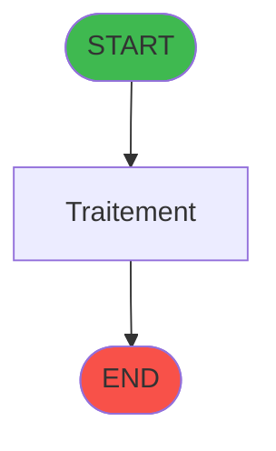
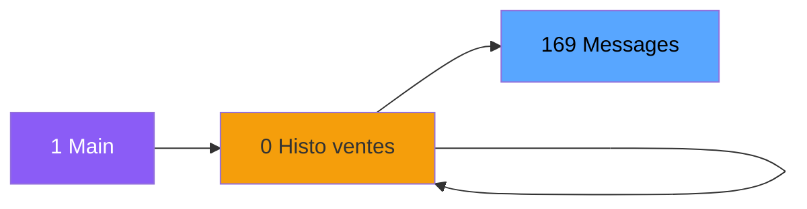
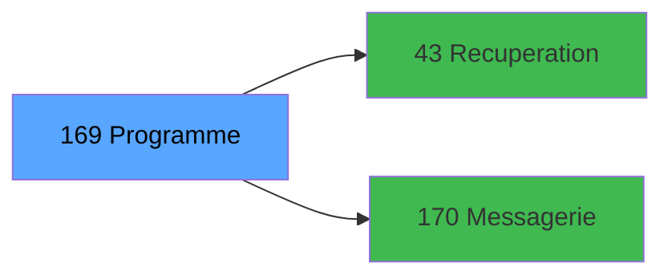

# ADH IDE 169 - Messages

> **Version spec**: 3.5
> **Analyse**: 2026-01-27 17:57
> **Source**: `Prg_XXX.xml`

---

<!-- TAB:Fonctionnel -->

## SPECIFICATION FONCTIONNELLE

### 1.1 Objectif metier

| Element | Description |
|---------|-------------|
| **Qui** | Operateur |
| **Quoi** | Messages
 |
| **Pourquoi** | A documenter |
| **Declencheur** | A identifier |

### 1.2 Regles metier

| Code | Regle | Condition |
|------|-------|-----------|
| RM-001 | A documenter | - |

### 1.3 Flux utilisateur

1. Demarrage programme
2. Traitement principal
3. Fin programme

### 1.4 Cas d'erreur

| Erreur | Comportement |
|--------|--------------|
| - | A documenter |

---

<!-- TAB:Technique -->

## SPECIFICATION TECHNIQUE

### 2.1 Identification

| Attribut | Valeur |
|----------|--------|
| **Format IDE** | ADH IDE 169 |
| **Description** | Messages
 |
| **Module** | ADH |

### 2.2 Tables

| # | Nom logique | Nom physique | Acces | Usage |
|---|-------------|--------------|-------|-------|
| 36 | client_gm | `cafil014_dat` | R | 1x |
| 47 | compte_gm________cgm | `cafil025_dat` | **W** | 2x |
| 80 | codes_autocom____aut | `cafil058_dat` | R | 1x |
| 88 | historik_station | `cafil066_dat` | **W** | 2x |
| 123 | fichier_messagerie | `cafil101_dat` | L | 3x |
| 123 | fichier_messagerie | `cafil101_dat` | R | 1x |
| 131 | fichier_validation | `cafil109_dat` | **W** | 1x |
| 136 | fichier_echanges | `cafil114_dat` | **W** | 2x |
### 2.3 Parametres d'entree

| Variable | Nom | Type | Picture |
|----------|-----|------|---------|
| - | Aucun parametre | - | - |
### 2.4 Algorigramme

### 2.5 Expressions cles

| IDE | Expression | Commentaire |
|-----|------------|-------------|
| 1 | `Trim ({0,12})` | - |
| 2 | `124` | - |
| 3 | `{0,7}<>'R'` | - |
| 4 | `{0,11}='F'` | - |
| 5 | `'F'` | - |
| 6 | `{0,4}='O' AND {0,6}='CLUB' AND {0,5}='1'` | - |

> **Total**: 6 expressions (affichees: 6)
### 2.6 Variables importantes

### 2.7 Statistiques

| Metrique | Valeur |
|----------|--------|
| **Taches** | 11 |
| **Lignes logique** | 179 |
| **Lignes desactivees** | 0 |
---

<!-- TAB:Cartographie -->

## CARTOGRAPHIE APPLICATIVE

### 3.1 Chaine d'appels depuis Main

### 3.2 Callers directs

| IDE | Programme | Nb appels |
|-----|-----------|-----------|
| 0 |  Print ticket vente LEX | 1 |
| 0 | Garantie sur compte PMS-584 | 1 |
| 0 | Histo ventes Gratuités | 1 |
| 0 | Histo ventes IGR | 1 |
| 0 | Histo ventes payantes /PMS-605 | 1 |
| 0 | Histo ventes payantes /PMS-623 | 1 |
| 0 | Print creation garanti PMS-584 | 1 |
| 0 | Print extrait compte /Service | 1 |
| 0 | Print transferts | 1 |
| 0 | Transaction Nouv vente PMS-584 | 1 |
| 0 | Transaction Nouv vente PMS-710 | 1 |
| 0 | Transaction Nouv vente PMS-721 | 1 |
| 163 | Menu caisse GM - scroll | 1 |
### 3.3 Callees

| Niv | IDE | Programme | Nb appels |
|-----|-----|-----------|-----------|
| 1 | 43 | Recuperation du titre | 1 |
| 1 | 170 | Messagerie | 1 |
### 3.4 Verification orphelin

| Critere | Resultat |
|---------|----------|
| Callers actifs | A verifier |
| **Conclusion** | A analyser |

---

## HISTORIQUE

| Date | Action | Auteur |
|------|--------|--------|
| 2026-01-27 20:22 | **DATA V2** - Tables reelles, Expressions, Stats, CallChain | Script |
| 2026-01-27 19:48 | **DATA POPULATED** - Tables, Callgraph (6 expr) | Script |
| 2026-01-27 17:57 | **Upgrade V3.5** - TAB markers, Mermaid | Claude |

---

*Specification V3.5 - Format avec TAB markers et Mermaid*
