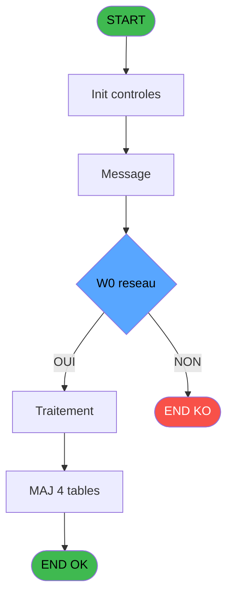
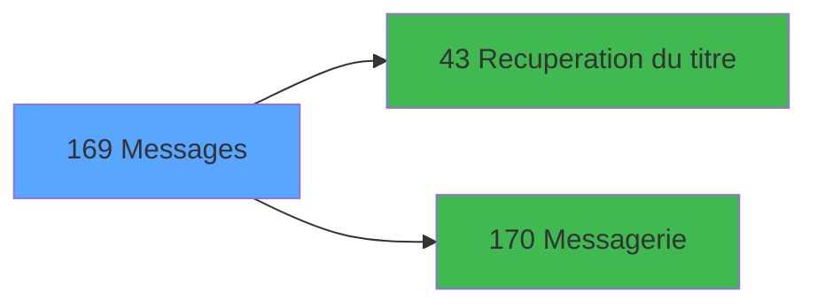

# ADH IDE 169 - Messages

> **Analyse**: Phases 1-4 2026-02-07 03:52 -> 03:50 (23h57min) | Assemblage 03:50
> **Pipeline**: V7.2 Enrichi
> **Structure**: 4 onglets (Resume | Ecrans | Donnees | Connexions)

<!-- TAB:Resume -->

## 1. FICHE D'IDENTITE

| Attribut | Valeur |
|----------|--------|
| Projet | ADH |
| IDE Position | 169 |
| Nom Programme | Messages |
| Fichier source | `Prg_169.xml` |
| Dossier IDE | General |
| Taches | 11 (1 ecrans visibles) |
| Tables modifiees | 4 |
| Programmes appeles | 2 |
| Complexite | **BASSE** (score 25/100) |

## 2. DESCRIPTION FONCTIONNELLE

ADH IDE 169 est un programme de gestion des messages de système. Il assure la récupération et l'affichage de messages provenant de différentes sources (validations, échanges, transactions) en fonction du contexte applicatif. Le programme récupère le titre du message via ADH IDE 43, puis utilise la messagerie ADH IDE 170 pour traiter les communications. Il s'intègre dans le flux de caisse en captant les événements critiques (nouvelles ventes, garanties, extraits de compte) et en informant l'utilisateur via des messages contextualisés.

Le cœur du programme repose sur trois tâches principales : la détection des messages à traiter (Test si message), la vérification de la disponibilité réseau (Test réseau), et la gestion de l'historique (Écriture Historique). Ces tâches modifient quatre tables critiques : `compte_gm________cgm` (gestion de compte), `historik_station` (traçabilité station), `fichier_validation` (logs de validation), et `fichier_echanges` (logs d'échanges). Ce design modulaire permet d'intégrer des notifications dans chaque flux métier sans dupliquer la logique de messagerie.

ADH IDE 169 est appelé par 11 programmes distincts couvrant l'ensemble de la chaîne caisse : impressions de tickets, gestion des garanties, historiques de ventes (gratuits, IGR, payants), créations de garanties, extraits de compte et transferts. Cette centralisation garantit une cohérence des notifications et facilite le maintien d'une audit trail complète via les tables d'historique.

## 3. BLOCS FONCTIONNELS

### 3.1 Traitement (7 taches)

Traitements internes.

---

#### 169 - message [[ECRAN]](#ecran-t1)

**Role** : Tache d'orchestration : point d'entree du programme (7 sous-taches). Coordonne l'enchainement des traitements.
**Ecran** : 352 x 122 DLU (MDI) | [Voir mockup](#ecran-t1)

6 sous-taches directes

| Tache | Nom | Bloc |
|-------|-----|------|
| [169.1](#t2) | Recup. poste et ligne | Traitement |
| [169.2](#t3) | Test reseau | Traitement |
| [169.3](#t4) | Test si message | Traitement |
| [169.4](#t5) | Message **[[ECRAN]](#ecran-t5)** | Traitement |
| [169.4.1](#t6) | Ecriture Historique | Traitement |
| [169.4.2](#t7) | Ecriture Historique | Traitement |

**Variables liees** : EU (W0 message ?)
**Delegue a** : [Recuperation du titre (IDE 43)](ADH-IDE-43.md), [Messagerie (IDE 170)](ADH-IDE-170.md)

---

#### 169.1 - Recup. poste et ligne

**Role** : Consultation/chargement : Recup. poste et ligne.
**Variables liees** : EV (W0 n° poste), EW (W0 n° ligne)
**Delegue a** : [Recuperation du titre (IDE 43)](ADH-IDE-43.md), [Messagerie (IDE 170)](ADH-IDE-170.md)

---

#### 169.2 - Test reseau

**Role** : Verification : Test reseau.
**Variables liees** : ET (W0 reseau)
**Delegue a** : [Recuperation du titre (IDE 43)](ADH-IDE-43.md), [Messagerie (IDE 170)](ADH-IDE-170.md)

---

#### 169.3 - Test si message

**Role** : Verification : Test si message.
**Variables liees** : EU (W0 message ?)
**Delegue a** : [Recuperation du titre (IDE 43)](ADH-IDE-43.md), [Messagerie (IDE 170)](ADH-IDE-170.md)

---

#### 169.4 - Message [[ECRAN]](#ecran-t5)

**Role** : Traitement : Message.
**Ecran** : 1066 x 209 DLU (MDI) | [Voir mockup](#ecran-t5)
**Variables liees** : EU (W0 message ?)
**Delegue a** : [Recuperation du titre (IDE 43)](ADH-IDE-43.md), [Messagerie (IDE 170)](ADH-IDE-170.md)

---

#### 169.4.1 - Ecriture Historique

**Role** : Consultation/chargement : Ecriture Historique.
**Delegue a** : [Recuperation du titre (IDE 43)](ADH-IDE-43.md), [Messagerie (IDE 170)](ADH-IDE-170.md)

---

#### 169.4.2 - Ecriture Historique

**Role** : Consultation/chargement : Ecriture Historique.
**Delegue a** : [Recuperation du titre (IDE 43)](ADH-IDE-43.md), [Messagerie (IDE 170)](ADH-IDE-170.md)

### 3.2 Validation (1 tache)

Controles de coherence : 1 tache verifie les donnees et conditions.

---

#### 169.4.3 - Maj Validation

**Role** : Verification : Maj Validation.

### 3.3 Creation (2 taches)

Insertion de nouveaux enregistrements en base.

---

#### 169.4.4 - Creation Echange

**Role** : Creation d'enregistrement : Creation Echange.

---

#### 169.4.5 - Creation Echange

**Role** : Creation d'enregistrement : Creation Echange.

### 3.4 Calcul (1 tache)

Calculs metier : montants, stocks, compteurs.

---

#### 169.5 - Deblocage compte

**Role** : Traitement : Deblocage compte.
**Variables liees** : EO (> compte)

## 5. REGLES METIER

3 regles identifiees:

### Autres (3 regles)

#### [RM-001] Condition: W0 reseau [G] different de 'R'

| Element | Detail |
|---------|--------|
| **Condition** | `W0 reseau [G]<>'R'` |
| **Si vrai** | Action si vrai |
| **Variables** | ET (W0 reseau) |
| **Expression source** | Expression 3 : `W0 reseau [G]<>'R'` |
| **Exemple** | Si W0 reseau [G]<>'R' → Action si vrai |

#### [RM-002] Condition: W0 fin tache [K] egale 'F'

| Element | Detail |
|---------|--------|
| **Condition** | `W0 fin tache [K]='F'` |
| **Si vrai** | Action si vrai |
| **Variables** | EX (W0 fin tache) |
| **Expression source** | Expression 4 : `W0 fin tache [K]='F'` |
| **Exemple** | Si W0 fin tache [K]='F' → Action si vrai |

#### [RM-003] Condition: > village tel [D]='O' AND > Interface [F]='CLUB' AND > type triplet [E] egale '1'

| Element | Detail |
|---------|--------|
| **Condition** | `> village tel [D]='O' AND > Interface [F]='CLUB' AND > type triplet [E]='1'` |
| **Si vrai** | Action si vrai |
| **Variables** | EQ (> village tel), ER (> type triplet), ES (> Interface) |
| **Expression source** | Expression 6 : `> village tel [D]='O' AND > Interface [F]='CLUB' AND > type ` |
| **Exemple** | Si > village tel [D]='O' AND > Interface [F]='CLUB' AND > type triplet [E]='1' → Action si vrai |

## 6. CONTEXTE

- **Appele par**: [ Print ticket vente LEX (IDE 0)](ADH-IDE-0.md), [Garantie sur compte PMS-584 (IDE 0)](ADH-IDE-0.md), [Histo ventes Gratuités (IDE 0)](ADH-IDE-0.md), [Histo ventes IGR (IDE 0)](ADH-IDE-0.md), [Histo ventes payantes /PMS-605 (IDE 0)](ADH-IDE-0.md), [Histo ventes payantes /PMS-623 (IDE 0)](ADH-IDE-0.md), [Print creation garanti PMS-584 (IDE 0)](ADH-IDE-0.md), [Print extrait compte /Service (IDE 0)](ADH-IDE-0.md), [Print transferts (IDE 0)](ADH-IDE-0.md), [Transaction Nouv vente PMS-584 (IDE 0)](ADH-IDE-0.md), [Transaction Nouv vente PMS-710 (IDE 0)](ADH-IDE-0.md), [Transaction Nouv vente PMS-721 (IDE 0)](ADH-IDE-0.md), [Menu caisse GM - scroll (IDE 163)](ADH-IDE-163.md)
- **Appelle**: 2 programmes | **Tables**: 7 (W:4 R:3 L:1) | **Taches**: 11 | **Expressions**: 6

<!-- TAB:Ecrans -->

## 8. ECRANS

### 8.1 Forms visibles (1 / 11)

| # | Position | Tache | Nom | Type | Largeur | Hauteur | Bloc |
|---|----------|-------|-----|------|---------|---------|------|
| 1 | 169.4 | 169.4 | Message | MDI | 1066 | 209 | Traitement |

### 8.2 Mockups Ecrans

---

#### 169.4 - Message
**Tache** : [169.4](#t5) | **Type** : MDI | **Dimensions** : 1066 x 209 DLU
**Bloc** : Traitement | **Titre IDE** : Message

<!-- FORM-DATA:
{
    "width":  1066,
    "vFactor":  8,
    "type":  "MDI",
    "hFactor":  8,
    "controls":  [
                     {
                         "x":  1,
                         "type":  "label",
                         "var":  "",
                         "y":  2,
                         "w":  1063,
                         "fmt":  "",
                         "name":  "",
                         "h":  17,
                         "color":  "",
                         "text":  "",
                         "parent":  null
                     },
                     {
                         "x":  5,
                         "type":  "label",
                         "var":  "",
                         "y":  32,
                         "w":  1058,
                         "fmt":  "",
                         "name":  "",
                         "h":  21,
                         "color":  "",
                         "text":  "",
                         "parent":  null
                     },
                     {
                         "x":  295,
                         "type":  "label",
                         "var":  "",
                         "y":  38,
                         "w":  42,
                         "fmt":  "",
                         "name":  "",
                         "h":  8,
                         "color":  "7",
                         "text":  "Par",
                         "parent":  null
                     },
                     {
                         "x":  507,
                         "type":  "label",
                         "var":  "",
                         "y":  38,
                         "w":  27,
                         "fmt":  "",
                         "name":  "",
                         "h":  8,
                         "color":  "7",
                         "text":  "le",
                         "parent":  null
                     },
                     {
                         "x":  5,
                         "type":  "label",
                         "var":  "",
                         "y":  53,
                         "w":  1058,
                         "fmt":  "",
                         "name":  "",
                         "h":  120,
                         "color":  "",
                         "text":  "",
                         "parent":  null
                     },
                     {
                         "x":  0,
                         "type":  "label",
                         "var":  "",
                         "y":  185,
                         "w":  1064,
                         "fmt":  "",
                         "name":  "",
                         "h":  24,
                         "color":  "",
                         "text":  "",
                         "parent":  null
                     },
                     {
                         "x":  15,
                         "type":  "table",
                         "var":  "",
                         "name":  "",
                         "titleH":  12,
                         "color":  "110",
                         "w":  874,
                         "y":  62,
                         "fmt":  "",
                         "parent":  null,
                         "text":  "",
                         "rowH":  14,
                         "h":  99,
                         "cols":  [
                                      {
                                          "title":  "Messages",
                                          "layer":  1,
                                          "w":  843
                                      }
                                  ],
                         "rows":  1
                     },
                     {
                         "x":  546,
                         "type":  "edit",
                         "var":  "",
                         "y":  38,
                         "w":  139,
                         "fmt":  "",
                         "name":  "",
                         "h":  8,
                         "color":  "7",
                         "text":  "",
                         "parent":  null
                     },
                     {
                         "x":  695,
                         "type":  "edit",
                         "var":  "",
                         "y":  38,
                         "w":  75,
                         "fmt":  "HH:MM",
                         "name":  "",
                         "h":  8,
                         "color":  "7",
                         "text":  "",
                         "parent":  null
                     },
                     {
                         "x":  349,
                         "type":  "edit",
                         "var":  "",
                         "y":  38,
                         "w":  139,
                         "fmt":  "",
                         "name":  "",
                         "h":  8,
                         "color":  "7",
                         "text":  "",
                         "parent":  null
                     },
                     {
                         "x":  19,
                         "type":  "edit",
                         "var":  "",
                         "y":  77,
                         "w":  826,
                         "fmt":  "",
                         "name":  "",
                         "h":  11,
                         "color":  "110",
                         "text":  "",
                         "parent":  14
                     },
                     {
                         "x":  8,
                         "type":  "button",
                         "var":  "",
                         "y":  189,
                         "w":  226,
                         "fmt":  "\\A\u0026bandonner",
                         "name":  "Btn Abandonner",
                         "h":  18,
                         "color":  "",
                         "text":  "",
                         "parent":  null
                     },
                     {
                         "x":  242,
                         "type":  "button",
                         "var":  "",
                         "y":  189,
                         "w":  280,
                         "fmt":  "\u0026Suppression Tous Messages",
                         "name":  "Btn Supprimer",
                         "h":  18,
                         "color":  "",
                         "text":  "",
                         "parent":  null
                     },
                     {
                         "x":  824,
                         "type":  "button",
                         "var":  "",
                         "y":  189,
                         "w":  226,
                         "fmt":  "\u0026Gestion Messages",
                         "name":  "Btn Maj",
                         "h":  18,
                         "color":  "",
                         "text":  "",
                         "parent":  null
                     },
                     {
                         "x":  7,
                         "type":  "edit",
                         "var":  "",
                         "y":  6,
                         "w":  267,
                         "fmt":  "20",
                         "name":  "",
                         "h":  8,
                         "color":  "",
                         "text":  "",
                         "parent":  1
                     },
                     {
                         "x":  779,
                         "type":  "edit",
                         "var":  "",
                         "y":  6,
                         "w":  278,
                         "fmt":  "WWW DD MMM YYYYT",
                         "name":  "",
                         "h":  8,
                         "color":  "",
                         "text":  "",
                         "parent":  1
                     },
                     {
                         "x":  896,
                         "type":  "image",
                         "var":  "",
                         "y":  85,
                         "w":  160,
                         "fmt":  "",
                         "name":  "",
                         "h":  53,
                         "color":  "",
                         "text":  "",
                         "parent":  null
                     },
                     {
                         "x":  19,
                         "type":  "edit",
                         "var":  "",
                         "y":  174,
                         "w":  826,
                         "fmt":  "30",
                         "name":  "",
                         "h":  10,
                         "color":  "2",
                         "text":  "",
                         "parent":  null
                     }
                 ],
    "taskId":  "169.4",
    "height":  209
}
-->

<strong>Champs : 7 champs</strong>

| Pos (x,y) | Nom | Variable | Type |
|-----------|-----|----------|------|
| 546,38 | (sans nom) | - | edit |
| 695,38 | HH:MM | - | edit |
| 349,38 | (sans nom) | - | edit |
| 19,77 | (sans nom) | - | edit |
| 7,6 | 20 | - | edit |
| 779,6 | WWW DD MMM YYYYT | - | edit |
| 19,174 | 30 | - | edit |

<strong>Boutons : 3 boutons</strong>

| Bouton | Pos (x,y) | Action |
|--------|-----------|--------|
| \Abandonner | 8,189 | Annule et retour au menu |
| Suppression Tous Messages | 242,189 | Supprime l'element selectionne |
| Gestion Messages | 824,189 | Bouton fonctionnel |

## 9. NAVIGATION

Ecran unique: **Message**

### 9.3 Structure hierarchique (11 taches)

| Position | Tache | Type | Dimensions | Bloc |
|----------|-------|------|------------|------|
| **169.1** | [**message** (169)](#t1) [mockup](#ecran-t1) | MDI | 352x122 | Traitement |
| 169.1.1 | [Recup. poste et ligne (169.1)](#t2) | MDI | - | |
| 169.1.2 | [Test reseau (169.2)](#t3) | MDI | - | |
| 169.1.3 | [Test si message (169.3)](#t4) | MDI | - | |
| 169.1.4 | [Message (169.4)](#t5) [mockup](#ecran-t5) | MDI | 1066x209 | |
| 169.1.5 | [Ecriture Historique (169.4.1)](#t6) | MDI | - | |
| 169.1.6 | [Ecriture Historique (169.4.2)](#t7) | MDI | - | |
| **169.2** | [**Maj Validation** (169.4.3)](#t8) | MDI | - | Validation |
| **169.3** | [**Creation Echange** (169.4.4)](#t9) | MDI | - | Creation |
| 169.3.1 | [Creation Echange (169.4.5)](#t10) | MDI | - | |
| **169.4** | [**Deblocage compte** (169.5)](#t11) | MDI | - | Calcul |

### 9.4 Algorigramme

> **Legende**: Vert = START/END OK | Rouge = END KO | Bleu = Decisions
> *Algorigramme auto-genere. Utiliser `/algorigramme` pour une synthese metier detaillee.*

<!-- TAB:Donnees -->

## 10. TABLES

### Tables utilisees (7)

| ID | Nom | Description | Type | R | W | L | Usages |
|----|-----|-------------|------|---|---|---|--------|
| 47 | compte_gm________cgm | Comptes GM (generaux) | DB |   | **W** |   | 2 |
| 136 | fichier_echanges |  | DB |   | **W** |   | 2 |
| 88 | historik_station | Historique / journal | DB |   | **W** |   | 2 |
| 131 | fichier_validation |  | DB |   | **W** |   | 1 |
| 123 | fichier_messagerie |  | DB | R |   | L | 4 |
| 80 | codes_autocom____aut |  | DB | R |   |   | 1 |
| 36 | client_gm |  | DB | R |   |   | 1 |

### Colonnes par table (3 / 7 tables avec colonnes identifiees)

Table 47 - compte_gm________cgm (**W**) - 2 usages

| Lettre | Variable | Acces | Type |
|--------|----------|-------|------|
| EO | > compte | W | Numeric |

Table 136 - fichier_echanges (**W**) - 2 usages

*Table utilisee uniquement en Link ou aucune colonne Real identifiee dans le DataView.*

Table 88 - historik_station (**W**) - 2 usages

*Table utilisee uniquement en Link ou aucune colonne Real identifiee dans le DataView.*

Table 131 - fichier_validation (**W**) - 1 usages

*Table utilisee uniquement en Link ou aucune colonne Real identifiee dans le DataView.*

Table 123 - fichier_messagerie (R/L) - 4 usages

| Lettre | Variable | Acces | Type |
|--------|----------|-------|------|
| A | W1 ret lien message | R | Numeric |
| B | W1 fin tache | R | Alpha |

Table 80 - codes_autocom____aut (R) - 1 usages

*Table utilisee uniquement en Link ou aucune colonne Real identifiee dans le DataView.*

Table 36 - client_gm (R) - 1 usages

| Lettre | Variable | Acces | Type |
|--------|----------|-------|------|
| A | W1 effacement | R | Alpha |
| B | W1 fin tache | R | Alpha |
| C | Btn Abandonner | R | Alpha |
| D | Btn Supprimer | R | Alpha |
| E | Btn Maj | R | Alpha |

## 11. VARIABLES

### 11.1 Variables de session (1)

Variables persistantes pendant toute la session.

| Lettre | Nom | Type | Usage dans |
|--------|-----|------|-----------|
| EY | v. titre | Alpha | 1x session |

### 11.2 Variables de travail (5)

Variables internes au programme.

| Lettre | Nom | Type | Usage dans |
|--------|-----|------|-----------|
| ET | W0 reseau | Alpha | [169.2](#t3) |
| EU | W0 message ? | Alpha | - |
| EV | W0 n° poste | Numeric | - |
| EW | W0 n° ligne | Numeric | - |
| EX | W0 fin tache | Alpha | 1x calcul interne |

### 11.3 Autres (6)

Variables diverses.

| Lettre | Nom | Type | Usage dans |
|--------|-----|------|-----------|
| EN | > societe | Alpha | - |
| EO | > compte | Numeric | - |
| EP | > filiation | Numeric | - |
| EQ | > village tel | Alpha | 1x refs |
| ER | > type triplet | Alpha | 1x refs |
| ES | > Interface | Alpha | 1x refs |

## 12. EXPRESSIONS

**6 / 6 expressions decodees (100%)**

### 12.1 Repartition par type

| Type | Expressions | Regles |
|------|-------------|--------|
| CONDITION | 3 | 3 |
| CONSTANTE | 2 | 0 |
| STRING | 1 | 0 |

### 12.2 Expressions cles par type

#### CONDITION (3 expressions)

| Type | IDE | Expression | Regle |
|------|-----|------------|-------|
| CONDITION | 6 | `> village tel [D]='O' AND > Interface [F]='CLUB' AND > type triplet [E]='1'` | [RM-003](#rm-RM-003) |
| CONDITION | 4 | `W0 fin tache [K]='F'` | [RM-002](#rm-RM-002) |
| CONDITION | 3 | `W0 reseau [G]<>'R'` | [RM-001](#rm-RM-001) |

#### CONSTANTE (2 expressions)

| Type | IDE | Expression | Regle |
|------|-----|------------|-------|
| CONSTANTE | 5 | `'F'` | - |
| CONSTANTE | 2 | `124` | - |

#### STRING (1 expressions)

| Type | IDE | Expression | Regle |
|------|-----|------------|-------|
| STRING | 1 | `Trim (v. titre [L])` | - |

<!-- TAB:Connexions -->

## 13. GRAPHE D'APPELS

### 13.1 Chaine depuis Main (Callers)

Main -> ... -> [ Print ticket vente LEX (IDE 0)](ADH-IDE-0.md) -> **Messages (IDE 169)**

Main -> ... -> [Garantie sur compte PMS-584 (IDE 0)](ADH-IDE-0.md) -> **Messages (IDE 169)**

Main -> ... -> [Histo ventes Gratuités (IDE 0)](ADH-IDE-0.md) -> **Messages (IDE 169)**

Main -> ... -> [Histo ventes IGR (IDE 0)](ADH-IDE-0.md) -> **Messages (IDE 169)**

Main -> ... -> [Histo ventes payantes /PMS-605 (IDE 0)](ADH-IDE-0.md) -> **Messages (IDE 169)**

Main -> ... -> [Histo ventes payantes /PMS-623 (IDE 0)](ADH-IDE-0.md) -> **Messages (IDE 169)**

Main -> ... -> [Print creation garanti PMS-584 (IDE 0)](ADH-IDE-0.md) -> **Messages (IDE 169)**

Main -> ... -> [Print extrait compte /Service (IDE 0)](ADH-IDE-0.md) -> **Messages (IDE 169)**

Main -> ... -> [Print transferts (IDE 0)](ADH-IDE-0.md) -> **Messages (IDE 169)**

Main -> ... -> [Transaction Nouv vente PMS-584 (IDE 0)](ADH-IDE-0.md) -> **Messages (IDE 169)**

Main -> ... -> [Transaction Nouv vente PMS-710 (IDE 0)](ADH-IDE-0.md) -> **Messages (IDE 169)**

Main -> ... -> [Transaction Nouv vente PMS-721 (IDE 0)](ADH-IDE-0.md) -> **Messages (IDE 169)**

Main -> ... -> [Menu caisse GM - scroll (IDE 163)](ADH-IDE-163.md) -> **Messages (IDE 169)**

### 13.2 Callers

| IDE | Nom Programme | Nb Appels |
|-----|---------------|-----------|
| [0](ADH-IDE-0.md) |  Print ticket vente LEX | 1 |
| [0](ADH-IDE-0.md) | Garantie sur compte PMS-584 | 1 |
| [0](ADH-IDE-0.md) | Histo ventes Gratuités | 1 |
| [0](ADH-IDE-0.md) | Histo ventes IGR | 1 |
| [0](ADH-IDE-0.md) | Histo ventes payantes /PMS-605 | 1 |
| [0](ADH-IDE-0.md) | Histo ventes payantes /PMS-623 | 1 |
| [0](ADH-IDE-0.md) | Print creation garanti PMS-584 | 1 |
| [0](ADH-IDE-0.md) | Print extrait compte /Service | 1 |
| [0](ADH-IDE-0.md) | Print transferts | 1 |
| [0](ADH-IDE-0.md) | Transaction Nouv vente PMS-584 | 1 |
| [0](ADH-IDE-0.md) | Transaction Nouv vente PMS-710 | 1 |
| [0](ADH-IDE-0.md) | Transaction Nouv vente PMS-721 | 1 |
| [163](ADH-IDE-163.md) | Menu caisse GM - scroll | 1 |

### 13.3 Callees (programmes appeles)

### 13.4 Detail Callees avec contexte

| IDE | Nom Programme | Appels | Contexte |
|-----|---------------|--------|----------|
| [43](ADH-IDE-43.md) | Recuperation du titre | 1 | Recuperation donnees |
| [170](ADH-IDE-170.md) | Messagerie | 1 | Sous-programme |

## 14. RECOMMANDATIONS MIGRATION

### 14.1 Profil du programme

| Metrique | Valeur | Impact migration |
|----------|--------|-----------------|
| Lignes de logique | 179 | Programme compact |
| Expressions | 6 | Peu de logique |
| Tables WRITE | 4 | Impact modere |
| Sous-programmes | 2 | Peu de dependances |
| Ecrans visibles | 1 | Ecran unique ou traitement batch |
| Code desactive | 0% (0 / 179) | Code sain |
| Regles metier | 3 | Quelques regles a preserver |

### 14.2 Plan de migration par bloc

#### Traitement (7 taches: 2 ecrans, 5 traitements)

- **Strategie** : Orchestrateur avec 2 ecrans (Razor/React) et 5 traitements backend (services).
- Les ecrans deviennent des composants UI, les traitements invisibles deviennent des services injectables.
- 2 sous-programme(s) a migrer ou a reutiliser depuis les services existants.
- Decomposer les taches en services unitaires testables.

#### Validation (1 tache: 0 ecran, 1 traitement)

- **Strategie** : FluentValidation avec validators specifiques.
- Chaque tache de validation -> un validator injectable

#### Creation (2 taches: 0 ecran, 2 traitements)

- **Strategie** : Repository pattern avec Entity Framework Core.
- Insertion via `IRepository<T>.CreateAsync()`

#### Calcul (1 tache: 0 ecran, 1 traitement)

- **Strategie** : Services de calcul purs (Domain Services).
- Migrer la logique de calcul (stock, compteurs, montants)

### 14.3 Dependances critiques

| Dependance | Type | Appels | Impact |
|------------|------|--------|--------|
| compte_gm________cgm | Table WRITE (Database) | 2x | Schema + repository |
| historik_station | Table WRITE (Database) | 2x | Schema + repository |
| fichier_validation | Table WRITE (Database) | 1x | Schema + repository |
| fichier_echanges | Table WRITE (Database) | 2x | Schema + repository |
| [Messagerie (IDE 170)](ADH-IDE-170.md) | Sous-programme | 1x | Normale - Sous-programme |
| [Recuperation du titre (IDE 43)](ADH-IDE-43.md) | Sous-programme | 1x | Normale - Recuperation donnees |

---
*Spec DETAILED generee par Pipeline V7.2 - 2026-02-08 03:50*
