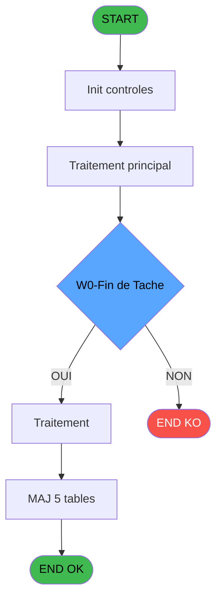

# ADH IDE 170 - Messagerie

> **Analyse**: Phases 1-4 2026-02-08 03:50 -> 03:50 (4s) | Assemblage 03:50
> **Pipeline**: V7.2 Enrichi
> **Structure**: 4 onglets (Resume | Ecrans | Donnees | Connexions)

<!-- TAB:Resume -->

## 1. FICHE D'IDENTITE

| Attribut | Valeur |
|----------|--------|
| Projet | ADH |
| IDE Position | 170 |
| Nom Programme | Messagerie |
| Fichier source | `Prg_170.xml` |
| Dossier IDE | General |
| Taches | 27 (0 ecrans visibles) |
| Tables modifiees | 5 |
| Programmes appeles | 1 |
| Complexite | **BASSE** (score 31/100) |

## 2. DESCRIPTION FONCTIONNELLE

Ce programme gère la messagerie interne du système de gestion de club. Il traite l'affichage, la création et la manipulation des messages stockés dans les tables de messagerie (`fichier_messagerie`, `fichier_validation`, `fichier_echanges`). Le programme récupère les informations contextuelles (titre du message via ADH IDE 43) et maintient à jour les compteurs et l'historique des stations pour suivre l'activité de messagerie.

La logique principale repose sur une gestion d'état des messages : création, lecture, validation et archivage. Les modifications apportées aux tables compteurs et historique permettent de tracer les actions utilisateur et de synchroniser l'état de la messagerie across les différentes stations. Le programme s'insère dans un flux d'appels depuis le menu Messages (ADH IDE 169), formant ainsi une chaîne cohérente de gestion des communications internes.

Le processus implique probablement des validations sur les droits d'accès, les permissions de lecture/écriture et la gestion des statuts de message (nouveau, lu, validé, etc.). Les interactions avec les tables d'historique et de compteurs garantissent une cohérence des données et permettent un suivi précis des activités de messagerie dans le système.

## 3. BLOCS FONCTIONNELS

## 5. REGLES METIER

2 regles identifiees:

### Autres (2 regles)

#### [RM-001] Condition: W0-Fin de Tache [D] egale 'F'

| Element | Detail |
|---------|--------|
| **Condition** | `W0-Fin de Tache [D]='F'` |
| **Si vrai** | Action si vrai |
| **Variables** | EQ (W0-Fin de Tache) |
| **Expression source** | Expression 2 : `W0-Fin de Tache [D]='F'` |
| **Exemple** | Si W0-Fin de Tache [D]='F' → Action si vrai |

#### [RM-002] Condition: W0 village TEL [K]='O' AND W0 interface [L]='CLUB' AND W0 type triplet [M] egale '1'

| Element | Detail |
|---------|--------|
| **Condition** | `W0 village TEL [K]='O' AND W0 interface [L]='CLUB' AND W0 type triplet [M]='1'` |
| **Si vrai** | Action si vrai |
| **Variables** | EX (W0 village TEL), EY (W0 interface), EZ (W0 type triplet) |
| **Expression source** | Expression 3 : `W0 village TEL [K]='O' AND W0 interface [L]='CLUB' AND W0 ty` |
| **Exemple** | Si W0 village TEL [K]='O' AND W0 interface [L]='CLUB' AND W0 type triplet [M]='1' → Action si vrai |

## 6. CONTEXTE

- **Appele par**: [Messages (IDE 169)](ADH-IDE-169.md)
- **Appelle**: 1 programmes | **Tables**: 8 (W:5 R:4 L:2) | **Taches**: 27 | **Expressions**: 3

<!-- TAB:Ecrans -->

## 8. ECRANS

*(Programme sans ecran visible)*

## 9. NAVIGATION

### 9.3 Structure hierarchique (0 tache)

| Position | Tache | Type | Dimensions | Bloc |
|----------|-------|------|------------|------|

### 9.4 Algorigramme

> **Legende**: Vert = START/END OK | Rouge = END KO | Bleu = Decisions
> *Algorigramme auto-genere. Utiliser `/algorigramme` pour une synthese metier detaillee.*

<!-- TAB:Donnees -->

## 10. TABLES

### Tables utilisees (8)

| ID | Nom | Description | Type | R | W | L | Usages |
|----|-----|-------------|------|---|---|---|--------|
| 123 | fichier_messagerie |  | DB | R | **W** |   | 7 |
| 131 | fichier_validation |  | DB | R | **W** |   | 3 |
| 88 | historik_station | Historique / journal | DB |   | **W** | L | 3 |
| 136 | fichier_echanges |  | DB |   | **W** |   | 4 |
| 68 | compteurs________cpt | Comptes GM (generaux) | DB |   | **W** |   | 1 |
| 78 | param__telephone_tel |  | DB | R |   |   | 1 |
| 80 | codes_autocom____aut |  | DB | R |   |   | 1 |
| 63 | parametres___par |  | DB |   |   | L | 1 |

### Colonnes par table (1 / 7 tables avec colonnes identifiees)

Table 123 - fichier_messagerie (R/**W**) - 7 usages

| Lettre | Variable | Acces | Type |
|--------|----------|-------|------|
| A | W1-Code Retour | W | Numeric |
| B | W2 passage prefixe | W | Logical |
| C | W2-Selection Choix | W | Alpha |
| D | W2-bouton creation | W | Alpha |
| E | W2-bouton annulation | W | Alpha |
| F | v. titre | W | Alpha |

Table 131 - fichier_validation (R/**W**) - 3 usages

*Table utilisee uniquement en Link ou aucune colonne Real identifiee dans le DataView.*

Table 88 - historik_station (**W**/L) - 3 usages

*Table utilisee uniquement en Link ou aucune colonne Real identifiee dans le DataView.*

Table 136 - fichier_echanges (**W**) - 4 usages

*Table utilisee uniquement en Link ou aucune colonne Real identifiee dans le DataView.*

Table 68 - compteurs________cpt (**W**) - 1 usages

*Table utilisee uniquement en Link ou aucune colonne Real identifiee dans le DataView.*

Table 78 - param__telephone_tel (R) - 1 usages

*Table utilisee uniquement en Link ou aucune colonne Real identifiee dans le DataView.*

Table 80 - codes_autocom____aut (R) - 1 usages

*Table utilisee uniquement en Link ou aucune colonne Real identifiee dans le DataView.*

## 11. VARIABLES

### 11.1 Variables de travail (3)

Variables internes au programme.

| Lettre | Nom | Type | Usage dans |
|--------|-----|------|-----------|
| EX | W0 village TEL | Alpha | 1x calcul interne |
| EY | W0 interface | Alpha | 1x calcul interne |
| EZ | W0 type triplet | Alpha | 1x calcul interne |

### 11.2 Autres (12)

Variables diverses.

| Lettre | Nom | Type | Usage dans |
|--------|-----|------|-----------|
| EN | P0-Societe | Alpha | - |
| EO | P0-Numero Compte | Numeric | - |
| EP | P0-Filiation Compte | Numeric | - |
| EQ | W0-Fin de Tache | Alpha | 1x refs |
| ER | W0-Accord Suite | Alpha | - |
| ES | W0-Nom Personne | Alpha | - |
| ET | W0-Prenom Personne | Alpha | - |
| EU | W0-Provenance | Alpha | - |
| EV | W0-Date | Date | - |
| EW | W0-Heure | Time | - |
| FA | W0-n° poste | Numeric | - |
| FB | W0-n° ligne | Numeric | - |

## 12. EXPRESSIONS

**3 / 3 expressions decodees (100%)**

### 12.1 Repartition par type

| Type | Expressions | Regles |
|------|-------------|--------|
| CONDITION | 2 | 2 |
| CONSTANTE | 1 | 0 |

### 12.2 Expressions cles par type

#### CONDITION (2 expressions)

| Type | IDE | Expression | Regle |
|------|-----|------------|-------|
| CONDITION | 3 | `W0 village TEL [K]='O' AND W0 interface [L]='CLUB' AND W0 type triplet [M]='1'` | [RM-002](#rm-RM-002) |
| CONDITION | 2 | `W0-Fin de Tache [D]='F'` | [RM-001](#rm-RM-001) |

#### CONSTANTE (1 expressions)

| Type | IDE | Expression | Regle |
|------|-----|------------|-------|
| CONSTANTE | 1 | `'F'` | - |

<!-- TAB:Connexions -->

## 13. GRAPHE D'APPELS

### 13.1 Chaine depuis Main (Callers)

Main -> ... -> [Messages (IDE 169)](ADH-IDE-169.md) -> **Messagerie (IDE 170)**

### 13.2 Callers

| IDE | Nom Programme | Nb Appels |
|-----|---------------|-----------|
| [169](ADH-IDE-169.md) | Messages | 1 |

### 13.3 Callees (programmes appeles)

### 13.4 Detail Callees avec contexte

| IDE | Nom Programme | Appels | Contexte |
|-----|---------------|--------|----------|
| [43](ADH-IDE-43.md) | Recuperation du titre | 2 | Recuperation donnees |

## 14. RECOMMANDATIONS MIGRATION

### 14.1 Profil du programme

| Metrique | Valeur | Impact migration |
|----------|--------|-----------------|
| Lignes de logique | 380 | Taille moyenne |
| Expressions | 3 | Peu de logique |
| Tables WRITE | 5 | Impact modere |
| Sous-programmes | 1 | Peu de dependances |
| Ecrans visibles | 0 | Ecran unique ou traitement batch |
| Code desactive | 0% (0 / 380) | Code sain |
| Regles metier | 2 | Quelques regles a preserver |

### 14.2 Plan de migration par bloc

### 14.3 Dependances critiques

| Dependance | Type | Appels | Impact |
|------------|------|--------|--------|
| compteurs________cpt | Table WRITE (Database) | 1x | Schema + repository |
| historik_station | Table WRITE (Database) | 2x | Schema + repository |
| fichier_messagerie | Table WRITE (Database) | 2x | Schema + repository |
| fichier_validation | Table WRITE (Database) | 2x | Schema + repository |
| fichier_echanges | Table WRITE (Database) | 4x | Schema + repository |
| [Recuperation du titre (IDE 43)](ADH-IDE-43.md) | Sous-programme | 2x | Haute - Recuperation donnees |

---
*Spec DETAILED generee par Pipeline V7.2 - 2026-02-08 03:51*
