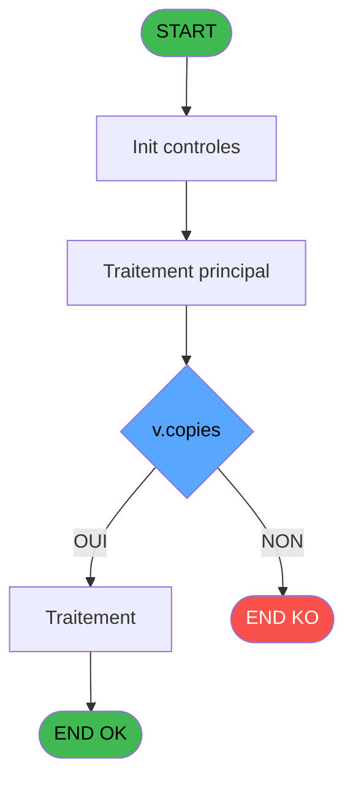
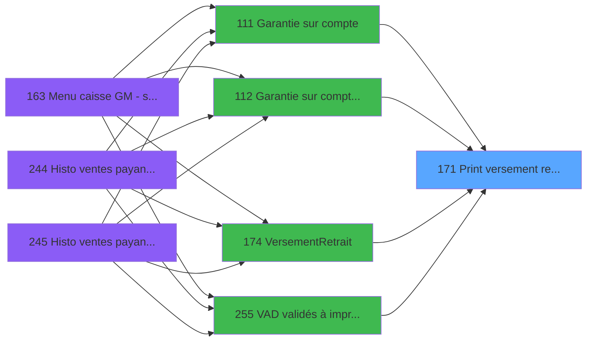

# ADH IDE 171 - Print versement retrait

> **Analyse**: Phases 1-4 2026-02-08 03:51 -> 03:51 (4s) | Assemblage 03:51
> **Pipeline**: V7.2 Enrichi
> **Structure**: 4 onglets (Resume | Ecrans | Donnees | Connexions)

<!-- TAB:Resume -->

## 1. FICHE D'IDENTITE

| Attribut | Valeur |
|----------|--------|
| Projet | ADH |
| IDE Position | 171 |
| Nom Programme | Print versement retrait |
| Fichier source | `Prg_171.xml` |
| Dossier IDE | Impression |
| Taches | 14 (0 ecrans visibles) |
| Tables modifiees | 0 |
| Programmes appeles | 1 |
| Complexite | **BASSE** (score 12/100) |

## 2. DESCRIPTION FONCTIONNELLE

Le programme ADH IDE 171 (Print versement retrait) gère l'impression de reçus de transactions financières (versements, retraits, garanties) pour les clients. Le flux principal initialise les curseurs d'imprimante, puis achemine l'impression vers l'une des 5 imprimantes disponibles (numéros 1, 4, 5, 8, 9) en fonction du paramètre système CURRENTPRINTERNUM. Chaque branche d'imprimante configure les propriétés spécifiques de périphérique (largeur papier, format, massicot, etc.) stockées dans la table comptable.

L'impression conditionnelle déclenche si le nombre de copies est non-vide ET si la variable globale VG106 est activée, auquel cas le programme affiche deux étiquettes clés : "File Number : [nombre copies]" et "Autorisation Number : [montant]", puis imprime le nombre de copies défini par le paramètre NUMBERCOPIES. Les données imprimées incluent le numéro de ticket, identité du client, dates du service, montant, libelé transaction et numéro d'autorisation, tous extraits des tables de recherche client et hebergement.

À la fin du processus, le programme appelle ADH IDE 182 (Raz Current Printer) pour réinitialiser l'état de l'imprimante. Le code est complètement read-only (aucune modification de données persistantes) et se positionne comme un service d'impression pur, appelé depuis 6 programmes différents : principalement IDE 174 (Versement/Retrait) mais aussi via plusieurs variantes de garantie (IDE 0, 111, 112, 288) et VAD validée (IDE 255).

## 3. BLOCS FONCTIONNELS

## 5. REGLES METIER

6 regles identifiees:

### Autres (6 regles)

#### [RM-001] Verification que l'imprimante courante est la n1

| Element | Detail |
|---------|--------|
| **Condition** | `GetParam ('CURRENTPRINTERNUM')=1` |
| **Si vrai** | Action si CURRENTPRINTERNUM = 1 |
| **Expression source** | Expression 3 : `GetParam ('CURRENTPRINTERNUM')=1` |
| **Exemple** | Si GetParam ('CURRENTPRINTERNUM')=1 → Action si CURRENTPRINTERNUM = 1 |

#### [RM-002] Verification que l'imprimante courante est la n4

| Element | Detail |
|---------|--------|
| **Condition** | `GetParam ('CURRENTPRINTERNUM')=4` |
| **Si vrai** | Action si CURRENTPRINTERNUM = 4 |
| **Expression source** | Expression 4 : `GetParam ('CURRENTPRINTERNUM')=4` |
| **Exemple** | Si GetParam ('CURRENTPRINTERNUM')=4 → Action si CURRENTPRINTERNUM = 4 |

#### [RM-003] Verification que l'imprimante courante est la n5

| Element | Detail |
|---------|--------|
| **Condition** | `GetParam ('CURRENTPRINTERNUM')=5` |
| **Si vrai** | Action si CURRENTPRINTERNUM = 5 |
| **Expression source** | Expression 5 : `GetParam ('CURRENTPRINTERNUM')=5` |
| **Exemple** | Si GetParam ('CURRENTPRINTERNUM')=5 → Action si CURRENTPRINTERNUM = 5 |

#### [RM-004] Verification que l'imprimante courante est la n8

| Element | Detail |
|---------|--------|
| **Condition** | `GetParam ('CURRENTPRINTERNUM')=8` |
| **Si vrai** | Action si CURRENTPRINTERNUM = 8 |
| **Expression source** | Expression 6 : `GetParam ('CURRENTPRINTERNUM')=8` |
| **Exemple** | Si GetParam ('CURRENTPRINTERNUM')=8 → Action si CURRENTPRINTERNUM = 8 |

#### [RM-005] Verification que l'imprimante courante est la n9

| Element | Detail |
|---------|--------|
| **Condition** | `GetParam ('CURRENTPRINTERNUM')=9` |
| **Si vrai** | Action si CURRENTPRINTERNUM = 9 |
| **Expression source** | Expression 7 : `GetParam ('CURRENTPRINTERNUM')=9` |
| **Exemple** | Si GetParam ('CURRENTPRINTERNUM')=9 → Action si CURRENTPRINTERNUM = 9 |

#### [RM-006] Condition composite: Trim(v.copies [U])<>'' AND VG106

| Element | Detail |
|---------|--------|
| **Condition** | `Trim(v.copies [U])<>'' AND VG106` |
| **Si vrai** | Action si vrai |
| **Variables** | FH (v.copies) |
| **Expression source** | Expression 12 : `Trim(v.copies [U])<>'' AND VG106` |
| **Exemple** | Si Trim(v.copies [U])<>'' AND VG106 → Action si vrai |

## 6. CONTEXTE

- **Appele par**: [Garantie sur compte PMS-584 (IDE 0)](ADH-IDE-0.md), [Garantie sur compte (IDE 111)](ADH-IDE-111.md), [Garantie sur compte PMS-584 (IDE 112)](ADH-IDE-112.md), [Garantie sur compte (IDE 288)](ADH-IDE-288.md), [Versement/Retrait (IDE 174)](ADH-IDE-174.md), [VAD validés à imprimer (IDE 255)](ADH-IDE-255.md)
- **Appelle**: 1 programmes | **Tables**: 4 (W:0 R:2 L:3) | **Taches**: 14 | **Expressions**: 12

<!-- TAB:Ecrans -->

## 8. ECRANS

*(Programme sans ecran visible)*

## 9. NAVIGATION

### 9.3 Structure hierarchique (0 tache)

| Position | Tache | Type | Dimensions | Bloc |
|----------|-------|------|------------|------|

### 9.4 Algorigramme

> **Legende**: Vert = START/END OK | Rouge = END KO | Bleu = Decisions
> *Algorigramme auto-genere. Utiliser `/algorigramme` pour une synthese metier detaillee.*

<!-- TAB:Donnees -->

## 10. TABLES

### Tables utilisees (4)

| ID | Nom | Description | Type | R | W | L | Usages |
|----|-----|-------------|------|---|---|---|--------|
| 30 | gm-recherche_____gmr | Index de recherche | DB | R |   | L | 7 |
| 40 | comptable________cte |  | DB | R |   |   | 7 |
| 31 | gm-complet_______gmc |  | DB |   |   | L | 1 |
| 34 | hebergement______heb | Hebergement (chambres) | DB |   |   | L | 1 |

### Colonnes par table (1 / 2 tables avec colonnes identifiees)

Table 30 - gm-recherche_____gmr (R/L) - 7 usages

*Table utilisee uniquement en Link ou aucune colonne Real identifiee dans le DataView.*

Table 40 - comptable________cte (R) - 7 usages

| Lettre | Variable | Acces | Type |
|--------|----------|-------|------|
| A | W1 imprimante | R | Alpha |
| B | W1 large | R | Alpha |
| C | W1 normal | R | Alpha |
| D | W1 condense | R | Alpha |
| E | W1 detection papier | R | Alpha |
| F | W1 inhibe panel | R | Alpha |
| G | W1 massicot | R | Alpha |
| H | W1 selection feuille | R | Alpha |
| I | W1 selection rouleau | R | Alpha |
| J | W1 ejection | R | Alpha |

## 11. VARIABLES

### 11.1 Parametres entrants (14)

Variables recues du programme appelant ([Garantie sur compte PMS-584 (IDE 0)](ADH-IDE-0.md)).

| Lettre | Nom | Type | Usage dans |
|--------|-----|------|-----------|
| EN | P.i.societe | Alpha | - |
| EO | P.i.code adherent | Numeric | - |
| EP | P.i.date | Date | - |
| EQ | P.i.heure | Time | - |
| ER | P.i.devise locale | Alpha | - |
| ES | P.i.masque montant | Alpha | - |
| ET | P.i.nom village | Alpha | - |
| EU | P.i.telephone | Alpha | - |
| EV | P.i.fax | Alpha | - |
| EW | P.i.Cloture en cours | Logical | - |
| EX | P.i.N° Ticket | Numeric | - |
| EY | P.i.Filiation | Numeric | - |
| EZ | P.i.id_transaction | Unicode | - |
| FA | P.i.id_acceptation | Unicode | - |

### 11.2 Variables de session (11)

Variables persistantes pendant toute la session.

| Lettre | Nom | Type | Usage dans |
|--------|-----|------|-----------|
| FB | v.entête ? | Alpha | - |
| FC | v.Nom | Unicode | - |
| FD | v.Prenom | Unicode | - |
| FE | v.Chambre | Unicode | - |
| FF | v.Date Debut | Date | - |
| FG | v.Date Fin | Date | - |
| FH | v.copies | Numeric | 2x session |
| FI | v.Montant Product | Numeric | 1x session |
| FJ | v.Libellé transaction | Unicode | - |
| FK | v.Libellé autorisation | Unicode | - |
| FL | v.Edition ligne carte? | Logical | - |

Toutes les 25 variables (liste complete)

| Cat | Lettre | Nom Variable | Type |
|-----|--------|--------------|------|
| P0 | **EN** | P.i.societe | Alpha |
| P0 | **EO** | P.i.code adherent | Numeric |
| P0 | **EP** | P.i.date | Date |
| P0 | **EQ** | P.i.heure | Time |
| P0 | **ER** | P.i.devise locale | Alpha |
| P0 | **ES** | P.i.masque montant | Alpha |
| P0 | **ET** | P.i.nom village | Alpha |
| P0 | **EU** | P.i.telephone | Alpha |
| P0 | **EV** | P.i.fax | Alpha |
| P0 | **EW** | P.i.Cloture en cours | Logical |
| P0 | **EX** | P.i.N° Ticket | Numeric |
| P0 | **EY** | P.i.Filiation | Numeric |
| P0 | **EZ** | P.i.id_transaction | Unicode |
| P0 | **FA** | P.i.id_acceptation | Unicode |
| V. | **FB** | v.entête ? | Alpha |
| V. | **FC** | v.Nom | Unicode |
| V. | **FD** | v.Prenom | Unicode |
| V. | **FE** | v.Chambre | Unicode |
| V. | **FF** | v.Date Debut | Date |
| V. | **FG** | v.Date Fin | Date |
| V. | **FH** | v.copies | Numeric |
| V. | **FI** | v.Montant Product | Numeric |
| V. | **FJ** | v.Libellé transaction | Unicode |
| V. | **FK** | v.Libellé autorisation | Unicode |
| V. | **FL** | v.Edition ligne carte? | Logical |

## 12. EXPRESSIONS

**12 / 12 expressions decodees (100%)**

### 12.1 Repartition par type

| Type | Expressions | Regles |
|------|-------------|--------|
| CONDITION | 6 | 6 |
| OTHER | 3 | 0 |
| CAST_LOGIQUE | 1 | 0 |
| STRING | 2 | 0 |

### 12.2 Expressions cles par type

#### CONDITION (6 expressions)

| Type | IDE | Expression | Regle |
|------|-----|------------|-------|
| CONDITION | 6 | `GetParam ('CURRENTPRINTERNUM')=8` | [RM-004](#rm-RM-004) |
| CONDITION | 7 | `GetParam ('CURRENTPRINTERNUM')=9` | [RM-005](#rm-RM-005) |
| CONDITION | 12 | `Trim(v.copies [U])<>'' AND VG106` | [RM-006](#rm-RM-006) |
| CONDITION | 3 | `GetParam ('CURRENTPRINTERNUM')=1` | [RM-001](#rm-RM-001) |
| CONDITION | 4 | `GetParam ('CURRENTPRINTERNUM')=4` | [RM-002](#rm-RM-002) |
| ... | | *+1 autres* | |

#### OTHER (3 expressions)

| Type | IDE | Expression | Regle |
|------|-----|------------|-------|
| OTHER | 9 | `GetParam ('NUMBERCOPIES')` | - |
| OTHER | 2 | `SetCrsr (1)` | - |
| OTHER | 1 | `SetCrsr (2)` | - |

#### CAST_LOGIQUE (1 expressions)

| Type | IDE | Expression | Regle |
|------|-----|------------|-------|
| CAST_LOGIQUE | 8 | `'TRUE'LOG` | - |

#### STRING (2 expressions)

| Type | IDE | Expression | Regle |
|------|-----|------------|-------|
| STRING | 11 | `'Autorisation Number : '&Trim(v.Montant Product [V])` | - |
| STRING | 10 | `'File Number : '&Trim(v.copies [U])` | - |

<!-- TAB:Connexions -->

## 13. GRAPHE D'APPELS

### 13.1 Chaine depuis Main (Callers)

Main -> ... -> [Garantie sur compte PMS-584 (IDE 0)](ADH-IDE-0.md) -> **Print versement retrait (IDE 171)**

Main -> ... -> [Garantie sur compte (IDE 111)](ADH-IDE-111.md) -> **Print versement retrait (IDE 171)**

Main -> ... -> [Garantie sur compte PMS-584 (IDE 112)](ADH-IDE-112.md) -> **Print versement retrait (IDE 171)**

Main -> ... -> [Garantie sur compte (IDE 288)](ADH-IDE-288.md) -> **Print versement retrait (IDE 171)**

Main -> ... -> [Versement/Retrait (IDE 174)](ADH-IDE-174.md) -> **Print versement retrait (IDE 171)**

Main -> ... -> [VAD validés à imprimer (IDE 255)](ADH-IDE-255.md) -> **Print versement retrait (IDE 171)**

### 13.2 Callers

| IDE | Nom Programme | Nb Appels |
|-----|---------------|-----------|
| [0](ADH-IDE-0.md) | Garantie sur compte PMS-584 | 4 |
| [111](ADH-IDE-111.md) | Garantie sur compte | 2 |
| [112](ADH-IDE-112.md) | Garantie sur compte PMS-584 | 2 |
| [288](ADH-IDE-288.md) | Garantie sur compte | 2 |
| [174](ADH-IDE-174.md) | Versement/Retrait | 1 |
| [255](ADH-IDE-255.md) | VAD validés à imprimer | 1 |

### 13.3 Callees (programmes appeles)

### 13.4 Detail Callees avec contexte

| IDE | Nom Programme | Appels | Contexte |
|-----|---------------|--------|----------|
| [182](ADH-IDE-182.md) | Raz Current Printer | 1 | Impression ticket/document |

## 14. RECOMMANDATIONS MIGRATION

### 14.1 Profil du programme

| Metrique | Valeur | Impact migration |
|----------|--------|-----------------|
| Lignes de logique | 342 | Taille moyenne |
| Expressions | 12 | Peu de logique |
| Tables WRITE | 0 | Impact faible |
| Sous-programmes | 1 | Peu de dependances |
| Ecrans visibles | 0 | Ecran unique ou traitement batch |
| Code desactive | 0% (0 / 342) | Code sain |
| Regles metier | 6 | Quelques regles a preserver |

### 14.2 Plan de migration par bloc

### 14.3 Dependances critiques

| Dependance | Type | Appels | Impact |
|------------|------|--------|--------|
| [Raz Current Printer (IDE 182)](ADH-IDE-182.md) | Sous-programme | 1x | Normale - Impression ticket/document |

---
*Spec DETAILED generee par Pipeline V7.2 - 2026-02-08 03:53*
