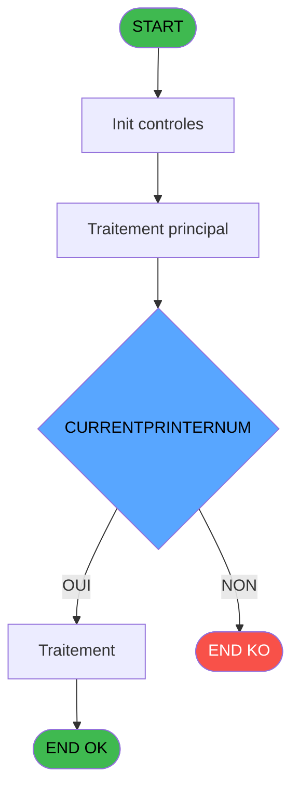

# ADH IDE 172 - Print Depot Obj/Dev/Sce

> **Analyse**: Phases 1-4 2026-02-08 03:53 -> 03:53 (5s) | Assemblage 03:53
> **Pipeline**: V7.2 Enrichi
> **Structure**: 4 onglets (Resume | Ecrans | Donnees | Connexions)

<!-- TAB:Resume -->

## 1. FICHE D'IDENTITE

| Attribut | Valeur |
|----------|--------|
| Projet | ADH |
| IDE Position | 172 |
| Nom Programme | Print Depot Obj/Dev/Sce |
| Fichier source | `Prg_172.xml` |
| Dossier IDE | Garanties |
| Taches | 63 (0 ecrans visibles) |
| Tables modifiees | 0 |
| Programmes appeles | 1 |
| Complexite | **BASSE** (score 25/100) |

## 2. DESCRIPTION FONCTIONNELLE

ADH IDE 172 - Print Depot Obj/Dev/Sce est un programme d'impression spécialisé dans l'affichage des détails relatifs aux dépôts de garantie. Il gère l'édition des données de dépôt pour trois dimensions : objet (garanties matérielles), devise (dépôts monétaires), et service (cautions de service). Le programme reçoit en paramètres les identifiants de compte et filiation, puis imprime un récapitulatif structuré des dépôts actifs associés au compte client, intégrant les montants, dates et statuts de chaque garantie.

Le flux d'exécution débute par l'initialisation de l'imprimante via un appel à ADH IDE 182 (Raz Current Printer), qui réinitialise l'état de la file d'attente d'impression. Ensuite, le programme boucle sur les trois catégories de dépôts (objets, devises, services) en lisant les tables correspondantes (depot_garantie, taux_change, etc.) et en formatant les lignes d'édition selon les règles de présentation définies. Les données sont envoyées au gestionnaire d'impression ligne par ligne, avec gestion des sauts de page et des totalisations si applicable.

Ce programme est appelé depuis deux contextes : l'affichage des garanties sur compte (IDE 0) et la consultation des comptes de dépôt (IDE 40). Il joue un rôle auxiliaire dans le workflow de visualisation des dépôts, en tant que service d'impression transparent qui isole la logique de mise en page des données métier. Aucune modification de données n'est effectuée ; seule l'impression est générée et envoyée vers le périphérique configuré.

## 3. BLOCS FONCTIONNELS

## 5. REGLES METIER

5 regles identifiees:

### Autres (5 regles)

#### [RM-001] Verification que l'imprimante courante est la n1

| Element | Detail |
|---------|--------|
| **Condition** | `GetParam ('CURRENTPRINTERNUM')=1` |
| **Si vrai** | Action si CURRENTPRINTERNUM = 1 |
| **Expression source** | Expression 4 : `GetParam ('CURRENTPRINTERNUM')=1` |
| **Exemple** | Si GetParam ('CURRENTPRINTERNUM')=1 → Action si CURRENTPRINTERNUM = 1 |

#### [RM-002] Verification que l'imprimante courante est la n4

| Element | Detail |
|---------|--------|
| **Condition** | `GetParam ('CURRENTPRINTERNUM')=4` |
| **Si vrai** | Action si CURRENTPRINTERNUM = 4 |
| **Expression source** | Expression 5 : `GetParam ('CURRENTPRINTERNUM')=4` |
| **Exemple** | Si GetParam ('CURRENTPRINTERNUM')=4 → Action si CURRENTPRINTERNUM = 4 |

#### [RM-003] Verification que l'imprimante courante est la n5

| Element | Detail |
|---------|--------|
| **Condition** | `GetParam ('CURRENTPRINTERNUM')=5` |
| **Si vrai** | Action si CURRENTPRINTERNUM = 5 |
| **Expression source** | Expression 6 : `GetParam ('CURRENTPRINTERNUM')=5` |
| **Exemple** | Si GetParam ('CURRENTPRINTERNUM')=5 → Action si CURRENTPRINTERNUM = 5 |

#### [RM-004] Verification que l'imprimante courante est la n8

| Element | Detail |
|---------|--------|
| **Condition** | `GetParam ('CURRENTPRINTERNUM')=8` |
| **Si vrai** | Action si CURRENTPRINTERNUM = 8 |
| **Expression source** | Expression 7 : `GetParam ('CURRENTPRINTERNUM')=8` |
| **Exemple** | Si GetParam ('CURRENTPRINTERNUM')=8 → Action si CURRENTPRINTERNUM = 8 |

#### [RM-005] Verification que l'imprimante courante est la n9

| Element | Detail |
|---------|--------|
| **Condition** | `GetParam ('CURRENTPRINTERNUM')=9` |
| **Si vrai** | Action si CURRENTPRINTERNUM = 9 |
| **Expression source** | Expression 8 : `GetParam ('CURRENTPRINTERNUM')=9` |
| **Exemple** | Si GetParam ('CURRENTPRINTERNUM')=9 → Action si CURRENTPRINTERNUM = 9 |

## 6. CONTEXTE

- **Appele par**: [Garantie sur compte PMS-584 (IDE 0)](ADH-IDE-0.md), [Comptes de depôt (IDE 40)](ADH-IDE-40.md)
- **Appelle**: 1 programmes | **Tables**: 6 (W:0 R:4 L:2) | **Taches**: 63 | **Expressions**: 9

<!-- TAB:Ecrans -->

## 8. ECRANS

*(Programme sans ecran visible)*

## 9. NAVIGATION

### 9.3 Structure hierarchique (0 tache)

| Position | Tache | Type | Dimensions | Bloc |
|----------|-------|------|------------|------|

### 9.4 Algorigramme

> **Legende**: Vert = START/END OK | Rouge = END KO | Bleu = Decisions
> *Algorigramme genere depuis les expressions CONDITION. Utiliser `/algorigramme` pour une synthese metier detaillee.*

<!-- TAB:Donnees -->

## 10. TABLES

### Tables utilisees (6)

| ID | Nom | Description | Type | R | W | L | Usages |
|----|-----|-------------|------|---|---|---|--------|
| 41 | depot_objets_____doa | Depots et garanties | DB | R |   |   | 26 |
| 30 | gm-recherche_____gmr | Index de recherche | DB | R |   |   | 9 |
| 42 | depot_devises____dda | Depots et garanties | DB | R |   |   | 7 |
| 456 | tai_demarrage |  | DB | R |   |   | 7 |
| 31 | gm-complet_______gmc |  | DB |   |   | L | 8 |
| 43 | solde_devises____sda | Devises / taux de change | DB |   |   | L | 6 |

### Colonnes par table (3 / 4 tables avec colonnes identifiees)

Table 41 - depot_objets_____doa (R) - 26 usages

| Lettre | Variable | Acces | Type |
|--------|----------|-------|------|
| EN | W Total depot | R | Numeric |
| EQ | W Depot objet | R | Logical |

Table 30 - gm-recherche_____gmr (R) - 9 usages

*Table utilisee uniquement en Link ou aucune colonne Real identifiee dans le DataView.*

Table 42 - depot_devises____dda (R) - 7 usages

| Lettre | Variable | Acces | Type |
|--------|----------|-------|------|
| A | W Total depot | R | Numeric |
| B | W Total retrait | R | Numeric |
| C | W1 normal | R | Alpha |
| D | W1 condense | R | Alpha |
| E | W1 detection papier | R | Alpha |
| F | W1 inhibe panel | R | Alpha |
| G | W1 massicot | R | Alpha |
| H | W1 selection feuille | R | Alpha |
| I | W1 selection rouleau | R | Alpha |
| J | W1 nom | R | Alpha |
| K | W1 prenom | R | Alpha |
| L | W1 n° adherent | R | Numeric |
| M | W1 lettre contrôle | R | Alpha |
| N | W1 filiation | R | Numeric |

Table 456 - tai_demarrage (R) - 7 usages

| Lettre | Variable | Acces | Type |
|--------|----------|-------|------|
| A | W1 initialisation | R | Alpha |
| B | W1 large | R | Alpha |
| C | W1 normal | R | Alpha |
| D | W1 condense | R | Alpha |
| E | W1 detection papier | R | Alpha |
| F | W1 inhibe panel | R | Alpha |
| G | W1 massicot | R | Alpha |
| H | W1 selection feuille | R | Alpha |
| I | W1 selection rouleau | R | Alpha |
| J | W1 nom | R | Alpha |
| K | W1 prenom | R | Alpha |
| L | W1 n° adherent | R | Numeric |
| M | W1 lettre contrôle | R | Alpha |
| N | W1 filiation | R | Numeric |

## 11. VARIABLES

### 11.1 Parametres entrants (11)

Variables recues du programme appelant ([Garantie sur compte PMS-584 (IDE 0)](ADH-IDE-0.md)).

| Lettre | Nom | Type | Usage dans |
|--------|-----|------|-----------|
| EN | P0 societe | Alpha | - |
| EO | P0 code adherent | Numeric | - |
| EP | P0 filiation | Numeric | - |
| EQ | P0 date session | Date | - |
| ER | P0 heure session | Time | - |
| ES | P0 nom village | Alpha | - |
| ET | P0 user | Alpha | - |
| EU | P0 existe objet | Alpha | - |
| EV | P0 existe devise | Alpha | - |
| EW | P0 existe scelle | Alpha | - |
| EX | P0 Code scelle | Alpha | - |

### 11.2 Variables de travail (2)

Variables internes au programme.

| Lettre | Nom | Type | Usage dans |
|--------|-----|------|-----------|
| EY | W0 nbre d'edition | Numeric | - |
| EZ | W0 fin tâche | Alpha | - |

### 11.3 Autres (1)

Variables diverses.

| Lettre | Nom | Type | Usage dans |
|--------|-----|------|-----------|
| FA | W1 filiation | Numeric | - |

## 12. EXPRESSIONS

**9 / 9 expressions decodees (100%)**

### 12.1 Repartition par type

| Type | Expressions | Regles |
|------|-------------|--------|
| CONDITION | 5 | 5 |
| CONSTANTE | 1 | 0 |
| OTHER | 2 | 0 |
| CAST_LOGIQUE | 1 | 0 |

### 12.2 Expressions cles par type

#### CONDITION (5 expressions)

| Type | IDE | Expression | Regle |
|------|-----|------------|-------|
| CONDITION | 7 | `GetParam ('CURRENTPRINTERNUM')=8` | [RM-004](#rm-RM-004) |
| CONDITION | 8 | `GetParam ('CURRENTPRINTERNUM')=9` | [RM-005](#rm-RM-005) |
| CONDITION | 6 | `GetParam ('CURRENTPRINTERNUM')=5` | [RM-003](#rm-RM-003) |
| CONDITION | 4 | `GetParam ('CURRENTPRINTERNUM')=1` | [RM-001](#rm-RM-001) |
| CONDITION | 5 | `GetParam ('CURRENTPRINTERNUM')=4` | [RM-002](#rm-RM-002) |

#### CONSTANTE (1 expressions)

| Type | IDE | Expression | Regle |
|------|-----|------------|-------|
| CONSTANTE | 3 | `1` | - |

#### OTHER (2 expressions)

| Type | IDE | Expression | Regle |
|------|-----|------------|-------|
| OTHER | 2 | `SetCrsr (2)` | - |
| OTHER | 1 | `SetCrsr (1)` | - |

#### CAST_LOGIQUE (1 expressions)

| Type | IDE | Expression | Regle |
|------|-----|------------|-------|
| CAST_LOGIQUE | 9 | `'TRUE'LOG` | - |

<!-- TAB:Connexions -->

## 13. GRAPHE D'APPELS

### 13.1 Chaine depuis Main (Callers)

Main -> ... -> [Garantie sur compte PMS-584 (IDE 0)](ADH-IDE-0.md) -> **Print Depot Obj/Dev/Sce (IDE 172)**

Main -> ... -> [Comptes de depôt (IDE 40)](ADH-IDE-40.md) -> **Print Depot Obj/Dev/Sce (IDE 172)**

### 13.2 Callers

| IDE | Nom Programme | Nb Appels |
|-----|---------------|-----------|
| [0](ADH-IDE-0.md) | Garantie sur compte PMS-584 | 4 |
| [40](ADH-IDE-40.md) | Comptes de depôt | 1 |

### 13.3 Callees (programmes appeles)

### 13.4 Detail Callees avec contexte

| IDE | Nom Programme | Appels | Contexte |
|-----|---------------|--------|----------|
| [182](ADH-IDE-182.md) | Raz Current Printer | 1 | Impression ticket/document |

## 14. RECOMMANDATIONS MIGRATION

### 14.1 Profil du programme

| Metrique | Valeur | Impact migration |
|----------|--------|-----------------|
| Lignes de logique | 972 | Programme volumineux |
| Expressions | 9 | Peu de logique |
| Tables WRITE | 0 | Impact faible |
| Sous-programmes | 1 | Peu de dependances |
| Ecrans visibles | 0 | Ecran unique ou traitement batch |
| Code desactive | 0% (0 / 972) | Code sain |
| Regles metier | 5 | Quelques regles a preserver |

### 14.2 Plan de migration par bloc

### 14.3 Dependances critiques

| Dependance | Type | Appels | Impact |
|------------|------|--------|--------|
| [Raz Current Printer (IDE 182)](ADH-IDE-182.md) | Sous-programme | 1x | Normale - Impression ticket/document |

---
*Spec DETAILED generee par Pipeline V7.2 - 2026-02-08 03:53*
