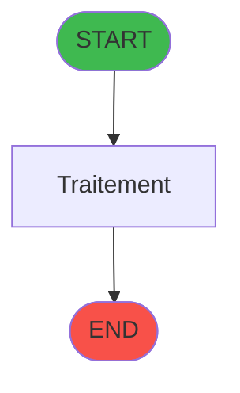
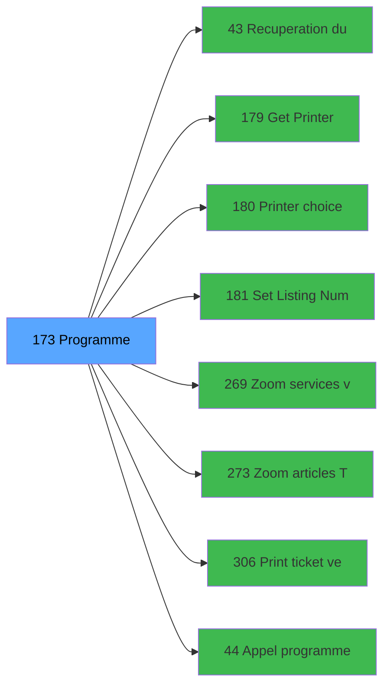

# ADH IDE 173 - Gestion forfait TAI LOCAL

> **Version spec**: 3.5
> **Analyse**: 2026-01-27 17:57
> **Source**: `Prg_XXX.xml`

---

<!-- TAB:Fonctionnel -->

## SPECIFICATION FONCTIONNELLE

### 1.1 Objectif metier

| Element | Description |
|---------|-------------|
| **Qui** | Operateur |
| **Quoi** | Gestion forfait TAI LOCAL
 |
| **Pourquoi** | A documenter |
| **Declencheur** | A identifier |

### 1.2 Regles metier

| Code | Regle | Condition |
|------|-------|-----------|
| RM-001 | A documenter | - |

### 1.3 Flux utilisateur

1. Demarrage programme
2. Traitement principal
3. Fin programme

### 1.4 Cas d'erreur

| Erreur | Comportement |
|--------|--------------|
| - | A documenter |

---

<!-- TAB:Technique -->

## SPECIFICATION TECHNIQUE

### 2.1 Identification

| Attribut | Valeur |
|----------|--------|
| **Format IDE** | ADH IDE 173 |
| **Description** | Gestion forfait TAI LOCAL
 |
| **Module** | ADH |

### 2.2 Tables

| # | Nom physique | Acces | Usage |
|---|--------------|-------|-------|
| #23 | `Table_23` | R | 2x |
| #23 | `Table_23` | **W** | 6x |
| #30 | `Table_30` | R | 3x |
| #34 | `Table_34` | R | 1x |
| #39 | `Table_39` | R | 1x |
| #40 | `Table_40` | LINK | 2x |
| #47 | `Table_47` | **W** | 4x |
| #70 | `Table_70` | LINK | 1x |
| #70 | `Table_70` | R | 1x |
| #77 | `Table_77` | LINK | 3x |
| #173 | `Table_173` | **W** | 2x |
| #463 | `Table_463` | LINK | 4x |
| #463 | `Table_463` | R | 2x |
| #463 | `Table_463` | **W** | 1x |
| #596 | `Table_596` | **W** | 4x |
### 2.3 Parametres d'entree

### 2.4 Algorigramme

### 2.5 Expressions cles

### 2.6 Variables importantes

### 2.7 Statistiques

---

<!-- TAB:Cartographie -->

## CARTOGRAPHIE APPLICATIVE

### 3.1 Chaine d'appels depuis Main

### 3.2 Callers directs

| IDE | Programme | Nb appels |
|-----|-----------|-----------|
| 0 | Garantie sur compte PMS-584 | 2 |
| 77 | Club Med Pass menu | 1 |
### 3.3 Callees

| Niv | IDE | Programme | Nb appels |
|-----|-----|-----------|-----------|
| 1 | 43 | Recuperation du titre | 4 |
| 1 | 179 | Get Printer | 2 |
| 1 | 180 | Printer choice | 2 |
| 1 | 181 | Set Listing Number | 2 |
| 1 | 269 | Zoom services village | 2 |
| 1 | 273 | Zoom articles TAI | 2 |
| 1 | 306 | Print ticket vente/OD N.U | 2 |
| 1 | 44 | Appel programme | 1 |
| 1 | 182 | Raz Current Printer | 1 |
### 3.4 Verification orphelin

| Critere | Resultat |
|---------|----------|
| Callers actifs | A verifier |
| **Conclusion** | A analyser |

---

## HISTORIQUE

| Date | Action | Auteur |
|------|--------|--------|
| 2026-01-27 19:48 | **DATA POPULATED** - Tables, Callgraph (25 expr) | Script |
| 2026-01-27 17:57 | **Upgrade V3.5** - TAB markers, Mermaid | Claude |

---

*Specification V3.5 - Format avec TAB markers et Mermaid*
