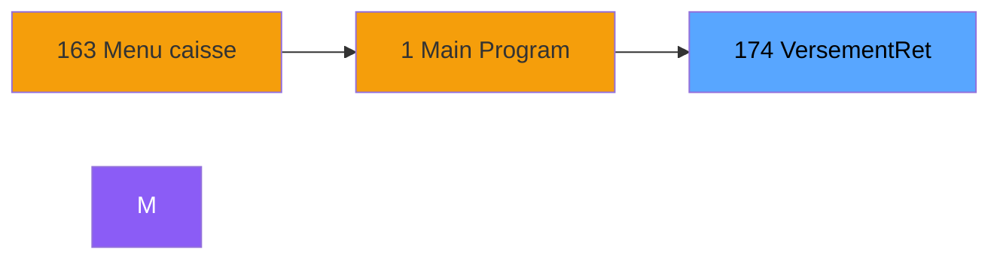
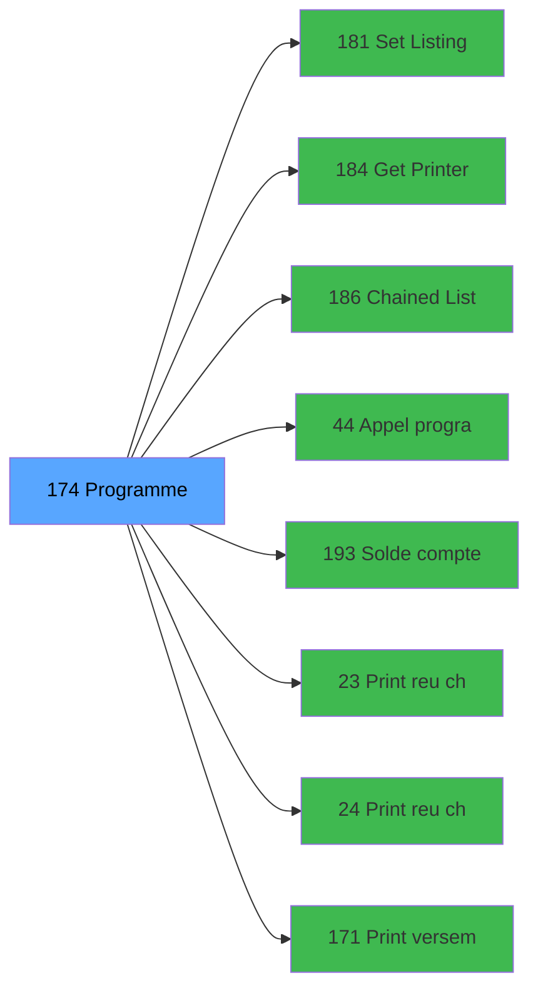

# ADH IDE 174 - Versement/Retrait

> **Version spec**: 3.5
> **Analyse**: 2026-01-27 17:57
> **Source**: `Prg_XXX.xml`

---

<!-- TAB:Fonctionnel -->

## SPECIFICATION FONCTIONNELLE

### 1.1 Objectif metier

| Element | Description |
|---------|-------------|
| **Qui** | Operateur |
| **Quoi** | Versement/Retrait
 |
| **Pourquoi** | A documenter |
| **Declencheur** | A identifier |

### 1.2 Regles metier

| Code | Regle | Condition |
|------|-------|-----------|
| RM-001 | A documenter | - |

### 1.3 Flux utilisateur

1. Demarrage programme
2. Traitement principal
3. Fin programme

### 1.4 Cas d'erreur

| Erreur | Comportement |
|--------|--------------|
| - | A documenter |

---

<!-- TAB:Technique -->

## SPECIFICATION TECHNIQUE

### 2.1 Identification

| Attribut | Valeur |
|----------|--------|
| **Format IDE** | ADH IDE 174 |
| **Description** | Versement/Retrait
 |
| **Module** | ADH |

### 2.2 Tables

| # | Nom logique | Nom physique | Acces | Usage |
|---|-------------|--------------|-------|-------|
| 23 | reseau_cloture___rec | `cafil001_dat` | L | 1x |
| 23 | reseau_cloture___rec | `cafil001_dat` | **W** | 8x |
| 30 | gm-recherche_____gmr | `cafil008_dat` | R | 1x |
| 31 | gm-complet_______gmc | `cafil009_dat` | L | 1x |
| 39 | depot_garantie___dga | `cafil017_dat` | L | 1x |
| 39 | depot_garantie___dga | `cafil017_dat` | **W** | 1x |
| 40 | comptable________cte | `cafil018_dat` | R | 3x |
| 40 | comptable________cte | `cafil018_dat` | **W** | 4x |
| 44 | change___________chg | `cafil022_dat` | L | 1x |
| 44 | change___________chg | `cafil022_dat` | **W** | 3x |
| 47 | compte_gm________cgm | `cafil025_dat` | L | 6x |
| 47 | compte_gm________cgm | `cafil025_dat` | **W** | 3x |
| 50 | moyens_reglement_mor | `cafil028_dat` | R | 1x |
| 66 | imputations______imp | `cafil044_dat` | L | 2x |
| 66 | imputations______imp | `cafil044_dat` | R | 1x |
| 68 | compteurs________cpt | `cafil046_dat` | L | 1x |
| 68 | compteurs________cpt | `cafil046_dat` | **W** | 5x |
| 70 | date_comptable___dat | `cafil048_dat` | R | 1x |
| 88 | historik_station | `cafil066_dat` | L | 1x |
| 89 | moyen_paiement___mop | `cafil067_dat` | L | 1x |
| 124 | type_taux_change | `cafil102_dat` | L | 1x |
| 139 | moyens_reglement_mor | `cafil117_dat` | L | 1x |
| 147 | change_vente_____chg | `cafil125_dat` | L | 1x |
| 147 | change_vente_____chg | `cafil125_dat` | **W** | 1x |
| 173 | intermed_compta__ite | `cafil181_dat` | L | 1x |
| 372 | pv_budget | `pv_budget_dat` | L | 1x |
| 474 | comptage_caisse_devise | `%club_user%_caisse_compcais_devise` | L | 2x |
| 474 | comptage_caisse_devise | `%club_user%_caisse_compcais_devise` | **W** | 1x |
| 728 | arc_cc_total | `arc_cctotal` | L | 1x |
| 786 | qualite_avant_reprise | `qualite_avant_reprise` | R | 1x |
| 934 | selection enregistrement diver | `selection_enregistrement_div` | L | 1x |
| 945 | Table_945 | - | **W** | 2x |
### 2.3 Parametres d'entree

| Variable | Nom | Type | Picture |
|----------|-----|------|---------|
| - | Aucun parametre | - | - |
### 2.4 Algorigramme

### 2.5 Expressions cles

| IDE | Expression | Commentaire |
|-----|------------|-------------|
| 1 | `SetCrsr (1)` | - |
| 2 | `{0,1}=''` | - |
| 3 | `'C'` | - |
| 4 | `Trim ({0,32})` | - |
| 5 | `{0,1}` | - |
| 6 | `'C'` | - |
| 7 | `{0,24}=0` | - |
| 8 | `{0,24}<>0 OR Trim (GetParam ('OPERATION_CLOTURE...` | - |
| 9 | `'F'` | - |
| 10 | `{0,16}<>'F'` | - |
| 11 | `{0,18}='O'` | - |
| 12 | `{0,16}='F'` | - |
| 13 | `{0,27}` | - |
| 14 | `{0,22}<>''` | - |
| 15 | `{0,23}<>'R'` | - |
| 16 | `'##########.##Z'` | - |
| 17 | `{0,6}=''` | - |
| 18 | `Trim (GetParam ('OPERATION_CLOTURE'))<>'O' OR T...` | - |
| 19 | `NOT {32768,78}` | - |
| 20 | `{32768,78}` | - |

> **Total**: 20 expressions (affichees: 20)
### 2.6 Variables importantes

### 2.7 Statistiques

| Metrique | Valeur |
|----------|--------|
| **Taches** | 37 |
| **Lignes logique** | 1195 |
| **Lignes desactivees** | 0 |
---

<!-- TAB:Cartographie -->

## CARTOGRAPHIE APPLICATIVE

### 3.1 Chaine d'appels depuis Main

### 3.2 Callers directs

| IDE | Programme | Nb appels |
|-----|-----------|-----------|
| 163 | Menu caisse GM - scroll | 1 |
### 3.3 Callees

| Niv | IDE | Programme | Nb appels |
|-----|-----|-----------|-----------|
| 1 | 181 | Set Listing Number | 4 |
| 1 | 184 | Get Printer for chained list | 3 |
| 1 | 186 | Chained Listing Load Default | 3 |
| 1 | 44 | Appel programme | 2 |
| 1 | 193 | Solde compte fin sejour | 2 |
| 1 | 23 | Print reçu change achat | 1 |
| 1 | 24 | Print reçu change vente | 1 |
| 1 | 171 | Print versement retrait | 1 |
| 1 | 182 | Raz Current Printer | 1 |
| 1 | 185 | Chained Listing Printer Choice | 1 |
| 1 | 260 | Zoom moyen de règlement | 1 |
| 1 | 261 | Zoom des types de taux | 1 |
| 1 | 270 | Zoom sur modes de paiement a/v | 1 |
### 3.4 Verification orphelin

| Critere | Resultat |
|---------|----------|
| Callers actifs | A verifier |
| **Conclusion** | A analyser |

---

## HISTORIQUE

| Date | Action | Auteur |
|------|--------|--------|
| 2026-01-27 20:22 | **DATA V2** - Tables reelles, Expressions, Stats, CallChain | Script |
| 2026-01-27 19:48 | **DATA POPULATED** - Tables, Callgraph (20 expr) | Script |
| 2026-01-27 17:57 | **Upgrade V3.5** - TAB markers, Mermaid | Claude |

---

*Specification V3.5 - Format avec TAB markers et Mermaid*
