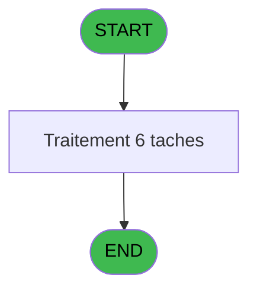
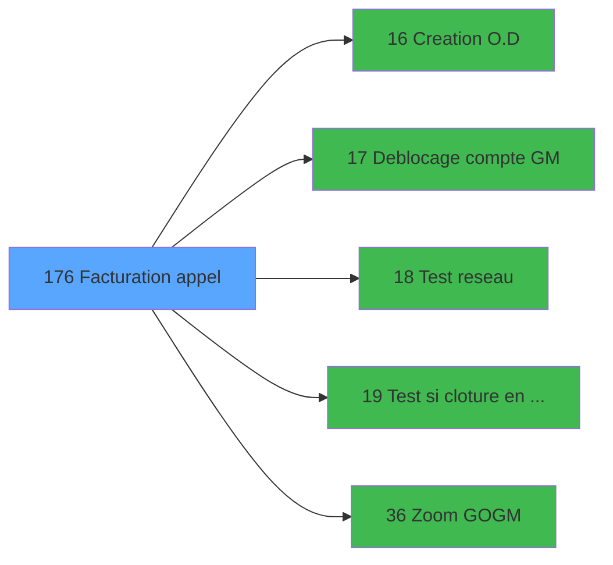

# ADH IDE 176 - Facturation appel

> **Analyse**: Phases 1-4 2026-02-03 10:54 -> 10:54 (16s) | Assemblage 07:24
> **Pipeline**: V7.2 Enrichi
> **Structure**: 4 onglets (Resume | Ecrans | Donnees | Connexions)

<!-- TAB:Resume -->

## 1. FICHE D'IDENTITE

| Attribut | Valeur |
|----------|--------|
| Projet | ADH |
| IDE Position | 176 |
| Nom Programme | Facturation appel |
| Fichier source | `Prg_176.xml` |
| Dossier IDE | Operations |
| Taches | 6 (0 ecrans visibles) |
| Tables modifiees | 3 |
| Programmes appeles | 5 |

## 2. DESCRIPTION FONCTIONNELLE

**Facturation appel** assure la gestion complete de ce processus, accessible depuis [Menu caisse GM - scroll @ (IDE 22)](ADH-IDE-22.md).

Le flux de traitement s'organise en **1 blocs fonctionnels** :

- **Traitement** (6 taches) : traitements metier divers

**Donnees modifiees** : 3 tables en ecriture (reseau_cloture___rec, historique_pabx, coef__telephone__coe).

**Logique metier** : 1 regles identifiees couvrant conditions metier.

Detail : phases du traitement

#### Phase 1 : Traitement (6 taches)

- **T1** - Facturation appel
- **T2** - Historique appel
- **T3** - Historique appel
- **T4** - Recuperation coef
- **T5** - Deblocage cloture
- **T8** - Deblocage cloture

Delegue a : [  Test reseau (IDE 18)](ADH-IDE-18.md), [  Test si cloture en cours (IDE 19)](ADH-IDE-19.md)

#### Tables impactees

| Table | Operations | Role metier |
|-------|-----------|-------------|
| reseau_cloture___rec | **W** (2 usages) | Donnees reseau/cloture |
| historique_pabx | **W** (2 usages) | Historique / journal |
| coef__telephone__coe | **W** (1 usages) |  |

## 3. BLOCS FONCTIONNELS

### 3.1 Traitement (6 taches)

Traitements internes.

---

#### T1 - Facturation appel

**Role** : Tache d'orchestration : point d'entree du programme (6 sous-taches). Coordonne l'enchainement des traitements.

5 sous-taches directes

| Tache | Nom | Bloc |
|-------|-----|------|
| [T2](#t2) | Historique appel | Traitement |
| [T3](#t3) | Historique appel | Traitement |
| [T4](#t4) | Recuperation coef | Traitement |
| [T5](#t5) | Deblocage cloture | Traitement |
| [T8](#t8) | Deblocage cloture | Traitement |

**Variables liees** : C (> date appel), D (> heure appel)
**Delegue a** : [  Test reseau (IDE 18)](ADH-IDE-18.md), [  Test si cloture en cours (IDE 19)](ADH-IDE-19.md)

---

#### T2 - Historique appel

**Role** : Consultation/chargement : Historique appel.
**Variables liees** : C (> date appel), D (> heure appel)
**Delegue a** : [  Test reseau (IDE 18)](ADH-IDE-18.md), [  Test si cloture en cours (IDE 19)](ADH-IDE-19.md)

---

#### T3 - Historique appel

**Role** : Consultation/chargement : Historique appel.
**Variables liees** : C (> date appel), D (> heure appel)
**Delegue a** : [  Test reseau (IDE 18)](ADH-IDE-18.md), [  Test si cloture en cours (IDE 19)](ADH-IDE-19.md)

---

#### T4 - Recuperation coef

**Role** : Consultation/chargement : Recuperation coef.
**Variables liees** : V (w0 coeff tel)
**Delegue a** : [  Test reseau (IDE 18)](ADH-IDE-18.md), [  Test si cloture en cours (IDE 19)](ADH-IDE-19.md)

---

#### T5 - Deblocage cloture

**Role** : Traitement : Deblocage cloture.
**Variables liees** : W (w0 cloture en cours)
**Delegue a** : [  Deblocage compte GM (IDE 17)](ADH-IDE-17.md), [  Test reseau (IDE 18)](ADH-IDE-18.md), [  Test si cloture en cours (IDE 19)](ADH-IDE-19.md)

---

#### T8 - Deblocage cloture

**Role** : Traitement : Deblocage cloture.
**Variables liees** : W (w0 cloture en cours)
**Delegue a** : [  Deblocage compte GM (IDE 17)](ADH-IDE-17.md), [  Test reseau (IDE 18)](ADH-IDE-18.md), [  Test si cloture en cours (IDE 19)](ADH-IDE-19.md)

## 5. REGLES METIER

1 regles identifiees:

### Autres (1 regles)

#### [RM-001] Si > GO [G] alors 'GO' sinon 'GM')

| Element | Detail |
|---------|--------|
| **Condition** | `> GO [G]` |
| **Si vrai** | 'GO' |
| **Si faux** | 'GM') |
| **Variables** | G (> GO) |
| **Expression source** | Expression 4 : `IF (> GO [G],'GO','GM')` |
| **Exemple** | Si > GO [G] → 'GO'. Sinon → 'GM') |

## 6. CONTEXTE

- **Appele par**: [Menu caisse GM - scroll @ (IDE 22)](ADH-IDE-22.md)
- **Appelle**: 5 programmes | **Tables**: 3 (W:3 R:0 L:0) | **Taches**: 6 | **Expressions**: 15

<!-- TAB:Ecrans -->

## 8. ECRANS

*(Programme sans ecran visible)*

## 9. NAVIGATION

### 9.3 Structure hierarchique (6 taches)

| Position | Tache | Type | Dimensions | Bloc |
|----------|-------|------|------------|------|
| **176.1** | [**Facturation appel** (T1)](#t1) | MDI | - | Traitement |
| 176.1.1 | [Historique appel (T2)](#t2) | MDI | - | |
| 176.1.2 | [Historique appel (T3)](#t3) | MDI | - | |
| 176.1.3 | [Recuperation coef (T4)](#t4) | MDI | - | |
| 176.1.4 | [Deblocage cloture (T5)](#t5) | MDI | - | |
| 176.1.5 | [Deblocage cloture (T8)](#t8) | MDI | - | |

### 9.4 Algorigramme

> *algo-data indisponible. Utiliser `/algorigramme` pour generer.*

<!-- TAB:Donnees -->

## 10. TABLES

### Tables utilisees (3)

| ID | Nom | Description | Type | R | W | L | Usages |
|----|-----|-------------|------|---|---|---|--------|
| 23 | reseau_cloture___rec | Donnees reseau/cloture | DB |   | **W** |   | 2 |
| 155 | historique_pabx | Historique / journal | DB |   | **W** |   | 2 |
| 157 | coef__telephone__coe |  | DB |   | **W** |   | 1 |

### Colonnes par table (2 / 3 tables avec colonnes identifiees)

Table 23 - reseau_cloture___rec (**W**) - 2 usages

| Lettre | Variable | Acces | Type |
|--------|----------|-------|------|
| W | w0 cloture en cours | W | Logical |
| X | w0 test reseau | W | Alpha |

Table 155 - historique_pabx (**W**) - 2 usages

*Table utilisee uniquement en Link ou aucune colonne Real identifiee dans le DataView.*

Table 157 - coef__telephone__coe (**W**) - 1 usages

| Lettre | Variable | Acces | Type |
|--------|----------|-------|------|
| V | w0 coeff tel | W | Numeric |

## 11. VARIABLES

### 11.1 Variables de travail (7)

Variables internes au programme.

| Lettre | Nom | Type | Usage dans |
|--------|-----|------|-----------|
| T | w0 numero de tel | Alpha | - |
| U | w0 qualite | Alpha | 1x calcul interne |
| V | w0 coeff tel | Numeric | 1x calcul interne |
| W | w0 cloture en cours | Logical | - |
| X | w0 test reseau | Alpha | 1x calcul interne |
| Y | w0 gratuite | Logical | - |
| Z | w0 raison gratuite | Alpha | - |

### 11.2 Autres (19)

Variables diverses.

| Lettre | Nom | Type | Usage dans |
|--------|-----|------|-----------|
| A | > societe | Alpha | - |
| B | > prefixe | Alpha | - |
| C | > date appel | Date | [T1](#t1), [T2](#t2), [T3](#t3) |
| D | > heure appel | Time | [T1](#t1), [T2](#t2), [T3](#t3) |
| E | > Nom | Alpha | 2x refs |
| F | > Prenom | Alpha | 1x refs |
| G | > GO | Logical | 1x refs |
| H | > compte fictif | Logical | 3x refs |
| I | > fin | Alpha | - |
| J | > numero de compte | Numeric | - |
| K | > filiation | Numeric | - |
| L | > montant | Numeric | 1x refs |
| M | > solde du compte | Numeric | - |
| N | < Quitter | Logical | - |
| O | > devise local | Alpha | - |
| P | > Masque | Alpha | - |
| Q | > annulation | Logical | 1x refs |
| R | > duree | Time | - |
| S | > nombre decimal | Numeric | 1x refs |

Toutes les 26 variables (liste complete)

| Cat | Lettre | Nom Variable | Type |
|-----|--------|--------------|------|
| W0 | **T** | w0 numero de tel | Alpha |
| W0 | **U** | w0 qualite | Alpha |
| W0 | **V** | w0 coeff tel | Numeric |
| W0 | **W** | w0 cloture en cours | Logical |
| W0 | **X** | w0 test reseau | Alpha |
| W0 | **Y** | w0 gratuite | Logical |
| W0 | **Z** | w0 raison gratuite | Alpha |
| Autre | **A** | > societe | Alpha |
| Autre | **B** | > prefixe | Alpha |
| Autre | **C** | > date appel | Date |
| Autre | **D** | > heure appel | Time |
| Autre | **E** | > Nom | Alpha |
| Autre | **F** | > Prenom | Alpha |
| Autre | **G** | > GO | Logical |
| Autre | **H** | > compte fictif | Logical |
| Autre | **I** | > fin | Alpha |
| Autre | **J** | > numero de compte | Numeric |
| Autre | **K** | > filiation | Numeric |
| Autre | **L** | > montant | Numeric |
| Autre | **M** | > solde du compte | Numeric |
| Autre | **N** | < Quitter | Logical |
| Autre | **O** | > devise local | Alpha |
| Autre | **P** | > Masque | Alpha |
| Autre | **Q** | > annulation | Logical |
| Autre | **R** | > duree | Time |
| Autre | **S** | > nombre decimal | Numeric |

## 12. EXPRESSIONS

**15 / 15 expressions decodees (100%)**

### 12.1 Repartition par type

| Type | Expressions | Regles |
|------|-------------|--------|
| CONDITION | 7 | 5 |
| CONSTANTE | 1 | 0 |
| NEGATION | 3 | 0 |
| CAST_LOGIQUE | 2 | 0 |
| REFERENCE_VG | 1 | 0 |
| CONCATENATION | 1 | 0 |

### 12.2 Expressions cles par type

#### CONDITION (7 expressions)

| Type | IDE | Expression | Regle |
|------|-----|------------|-------|
| CONDITION | 4 | `IF (> GO [G],'GO','GM')` | [RM-001](#rm-RM-001) |
| CONDITION | 6 | `w0 test reseau [X]<>'R'` | - |
| CONDITION | 12 | `> date appel [C]` | - |
| CONDITION | 13 | `> heure appel [D]` | - |
| CONDITION | 7 | `Round (> montant [L]*w0 coeff tel [V],15,> nombre decimal [S])` | - |
| ... | | *+2 autres* | |

#### CONSTANTE (1 expressions)

| Type | IDE | Expression | Regle |
|------|-----|------------|-------|
| CONSTANTE | 5 | `'F'` | - |

#### NEGATION (3 expressions)

| Type | IDE | Expression | Regle |
|------|-----|------------|-------|
| NEGATION | 14 | `NOT VG6` | - |
| NEGATION | 9 | `NOT (> annulation [Q])` | - |
| NEGATION | 2 | `NOT (> compte fictif [H])` | - |

#### CAST_LOGIQUE (2 expressions)

| Type | IDE | Expression | Regle |
|------|-----|------------|-------|
| CAST_LOGIQUE | 11 | `'FALSE'LOG` | - |
| CAST_LOGIQUE | 8 | `'TRUE'LOG` | - |

#### REFERENCE_VG (1 expressions)

| Type | IDE | Expression | Regle |
|------|-----|------------|-------|
| REFERENCE_VG | 15 | `VG6` | - |

#### CONCATENATION (1 expressions)

| Type | IDE | Expression | Regle |
|------|-----|------------|-------|
| CONCATENATION | 10 | `Trim (> Nom [E])&' '&Trim (> Prenom [F])` | - |

<!-- TAB:Connexions -->

## 13. GRAPHE D'APPELS

### 13.1 Chaine depuis Main (Callers)

Main -> ... -> [Menu caisse GM - scroll @ (IDE 22)](ADH-IDE-22.md) -> **Facturation appel (IDE 176)**

### 13.2 Callers

| IDE | Nom Programme | Nb Appels |
|-----|---------------|-----------|
| [22](ADH-IDE-22.md) | Menu caisse GM - scroll @ | 1 |

### 13.3 Callees (programmes appeles)

### 13.4 Detail Callees avec contexte

| IDE | Nom Programme | Appels | Contexte |
|-----|---------------|--------|----------|
| [16](ADH-IDE-16.md) |   Creation O.D | 1 | Sous-programme |
| [17](ADH-IDE-17.md) |   Deblocage compte GM | 1 | Sous-programme |
| [18](ADH-IDE-18.md) |   Test reseau | 1 | Sous-programme |
| [19](ADH-IDE-19.md) |   Test si cloture en cours | 1 | Fermeture session |
| [36](ADH-IDE-36.md) | Zoom GO/GM | 1 | Selection/consultation |

## 14. RECOMMANDATIONS MIGRATION

### 14.1 Profil du programme

| Metrique | Valeur | Impact migration |
|----------|--------|-----------------|
| Lignes de logique | 116 | Programme compact |
| Expressions | 15 | Peu de logique |
| Tables WRITE | 3 | Impact modere |
| Sous-programmes | 5 | Peu de dependances |
| Ecrans visibles | 0 | Ecran unique ou traitement batch |
| Code desactive | 0% (0 / 116) | Code sain |
| Regles metier | 1 | Quelques regles a preserver |

### 14.2 Plan de migration par bloc

#### Traitement (6 taches: 0 ecran, 6 traitements)

- **Strategie** : 6 service(s) backend injectable(s) (Domain Services).
- 5 sous-programme(s) a migrer ou a reutiliser depuis les services existants.
- Decomposer les taches en services unitaires testables.

### 14.3 Dependances critiques

| Dependance | Type | Appels | Impact |
|------------|------|--------|--------|
| reseau_cloture___rec | Table WRITE (Database) | 2x | Schema + repository |
| historique_pabx | Table WRITE (Database) | 2x | Schema + repository |
| coef__telephone__coe | Table WRITE (Database) | 1x | Schema + repository |
| [  Test si cloture en cours (IDE 19)](ADH-IDE-19.md) | Sous-programme | 1x | Normale - Fermeture session |
| [Zoom GO/GM (IDE 36)](ADH-IDE-36.md) | Sous-programme | 1x | Normale - Selection/consultation |
| [  Test reseau (IDE 18)](ADH-IDE-18.md) | Sous-programme | 1x | Normale - Sous-programme |
| [  Creation O.D (IDE 16)](ADH-IDE-16.md) | Sous-programme | 1x | Normale - Sous-programme |
| [  Deblocage compte GM (IDE 17)](ADH-IDE-17.md) | Sous-programme | 1x | Normale - Sous-programme |

---
*Spec DETAILED generee par Pipeline V7.2 - 2026-02-07 07:24*
