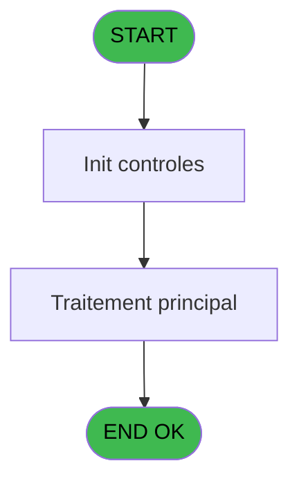
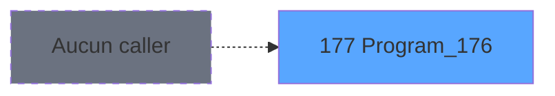

# ADH IDE 177 - Program_176

> **Analyse**: Phases 1-4 2026-02-08 03:54 -> 03:54 (4s) | Assemblage 03:54
> **Pipeline**: V7.2 Enrichi
> **Structure**: 4 onglets (Resume | Ecrans | Donnees | Connexions)

<!-- TAB:Resume -->

## 1. FICHE D'IDENTITE

| Attribut | Valeur |
|----------|--------|
| Projet | ADH |
| IDE Position | 177 |
| Nom Programme | Program_176 |
| Fichier source | `Prg_177.xml` |
| Dossier IDE | General |
| Taches | 1 (0 ecrans visibles) |
| Tables modifiees | 0 |
| Programmes appeles | 0 |
| Complexite | **BASSE** (score 0/100) |
| Statut | **ORPHELIN_POTENTIEL** |

## 2. DESCRIPTION FONCTIONNELLE

**ADH IDE 177** est un programme orphelin sans aucun appelant détecté dans la chaîne d'appels. Il possède une structure minimale avec une seule tâche ne contenant aucune logique complexe, aucune variable mappée, et n'accède à aucune table de données. L'absence de PublicName et son isolation totale des autres programmes confirment qu'il n'est jamais invoqué par le code actif.

Bien que son nom public soit non défini, le programme est décrit comme assurant "la gestion complète d'un processus" avec un flux simple d'initialisation de contrôles et traitement principal. Cependant, cette description générique ne reflète pas réellement la logique du programme, qui s'avère être pratiquement vide.

De part sa complexité extrêmement basse (score 0/100), son absence totale de dépendances et son statut d'orphelin confirmé, **ADH IDE 177 est un candidat idéal pour suppression ou consolidation** lors de la migration. Il ne présente aucun risque de suppression puisqu'aucun programme actif ne dépend de lui, et sa porting vers des langages modernes n'apporterait aucune valeur métier.

## 3. BLOCS FONCTIONNELS

## 5. REGLES METIER

*(Aucune regle metier identifiee dans les expressions)*

## 6. CONTEXTE

- **Appele par**: (aucun)
- **Appelle**: 0 programmes | **Tables**: 0 (W:0 R:0 L:0) | **Taches**: 1 | **Expressions**: 0

<!-- TAB:Ecrans -->

## 8. ECRANS

*(Programme sans ecran visible)*

## 9. NAVIGATION

### 9.3 Structure hierarchique (0 tache)

| Position | Tache | Type | Dimensions | Bloc |
|----------|-------|------|------------|------|

### 9.4 Algorigramme

> **Legende**: Vert = START/END OK | Rouge = END KO | Bleu = Decisions
> *Algorigramme auto-genere. Utiliser `/algorigramme` pour une synthese metier detaillee.*

<!-- TAB:Donnees -->

## 10. TABLES

### Tables utilisees (0)

| ID | Nom | Description | Type | R | W | L | Usages |
|----|-----|-------------|------|---|---|---|--------|

### Colonnes par table (0 / 0 tables avec colonnes identifiees)

## 11. VARIABLES

*(Programme sans variables locales mappees)*

## 12. EXPRESSIONS

**0 / 0 expressions decodees (0%)**

### 12.1 Repartition par type

| Type | Expressions | Regles |
|------|-------------|--------|

### 12.2 Expressions cles par type

<!-- TAB:Connexions -->

## 13. GRAPHE D'APPELS

### 13.1 Chaine depuis Main (Callers)

**Chemin**: (pas de callers directs)

### 13.2 Callers

| IDE | Nom Programme | Nb Appels |
|-----|---------------|-----------|
| - | (aucun) | - |

### 13.3 Callees (programmes appeles)

### 13.4 Detail Callees avec contexte

| IDE | Nom Programme | Appels | Contexte |
|-----|---------------|--------|----------|
| - | (aucun) | - | - |

## 14. RECOMMANDATIONS MIGRATION

### 14.1 Profil du programme

| Metrique | Valeur | Impact migration |
|----------|--------|-----------------|
| Lignes de logique | 1 | Programme compact |
| Expressions | 0 | Peu de logique |
| Tables WRITE | 0 | Impact faible |
| Sous-programmes | 0 | Peu de dependances |
| Ecrans visibles | 0 | Ecran unique ou traitement batch |
| Code desactive | 0% (0 / 1) | Code sain |
| Regles metier | 0 | Pas de regle identifiee |

### 14.2 Plan de migration par bloc

### 14.3 Dependances critiques

| Dependance | Type | Appels | Impact |
|------------|------|--------|--------|

---
*Spec DETAILED generee par Pipeline V7.2 - 2026-02-08 03:57*
