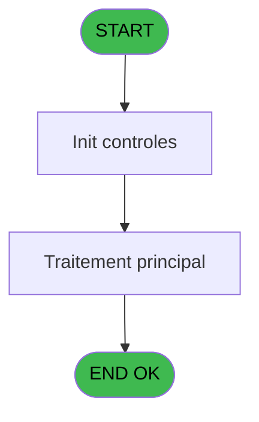
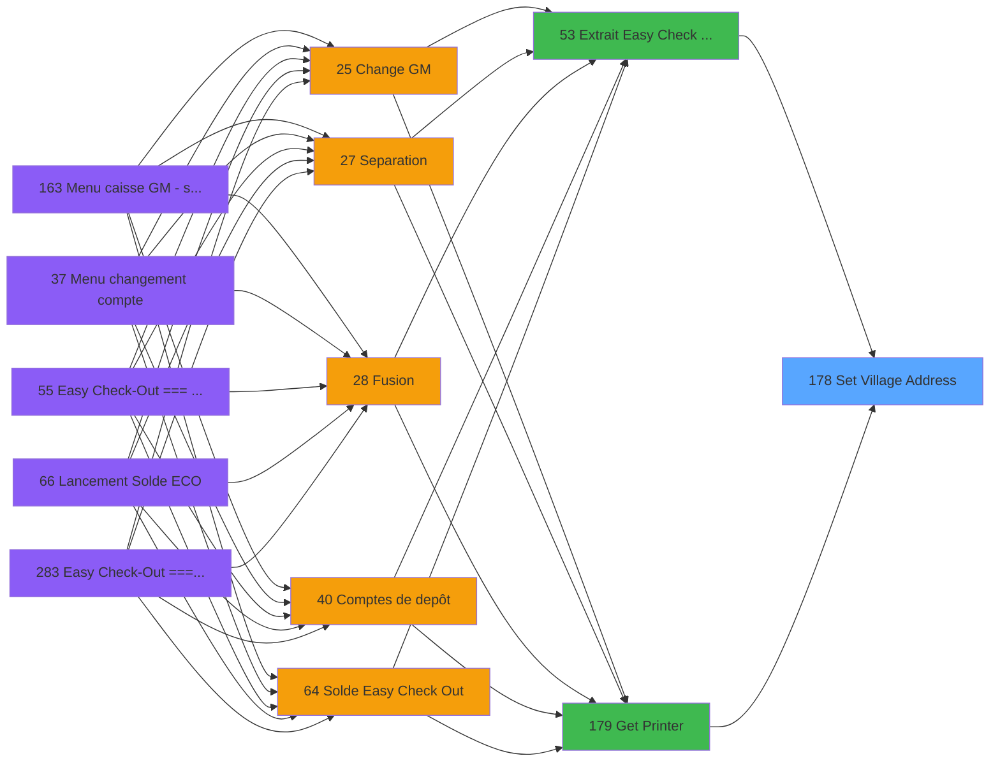

# ADH IDE 178 - Set Village Address

> **Analyse**: Phases 1-4 2026-02-07 03:52 -> 03:52 (27s) | Assemblage 03:52
> **Pipeline**: V7.2 Enrichi
> **Structure**: 4 onglets (Resume | Ecrans | Donnees | Connexions)

<!-- TAB:Resume -->

## 1. FICHE D'IDENTITE

| Attribut | Valeur |
|----------|--------|
| Projet | ADH |
| IDE Position | 178 |
| Nom Programme | Set Village Address |
| Fichier source | `Prg_178.xml` |
| Dossier IDE | General |
| Taches | 1 (0 ecrans visibles) |
| Tables modifiees | 0 |
| Programmes appeles | 0 |

## 2. DESCRIPTION FONCTIONNELLE

**Set Village Address** assure la gestion complete de ce processus, accessible depuis [Extrait Easy Check Out à J+1 (IDE 53)](ADH-IDE-53.md), [Get Printer (IDE 179)](ADH-IDE-179.md).

Le flux de traitement s'organise en **1 blocs fonctionnels** :

- **Traitement** (1 tache) : traitements metier divers

## 3. BLOCS FONCTIONNELS

### 3.1 Traitement (1 tache)

Traitements internes.

---

#### 178 - Set Village Address

**Role** : Traitement : Set Village Address.

## 5. REGLES METIER

*(Aucune regle metier identifiee)*

## 6. CONTEXTE

- **Appele par**: [Extrait Easy Check Out à J+1 (IDE 53)](ADH-IDE-53.md), [Get Printer (IDE 179)](ADH-IDE-179.md)
- **Appelle**: 0 programmes | **Tables**: 1 (W:0 R:1 L:0) | **Taches**: 1 | **Expressions**: 10

<!-- TAB:Ecrans -->

## 8. ECRANS

*(Programme sans ecran visible)*

## 9. NAVIGATION

### 9.3 Structure hierarchique (1 tache)

| Position | Tache | Type | Dimensions | Bloc |
|----------|-------|------|------------|------|
| **178.1** | [**Set Village Address** (178)](#t1) | MDI | - | Traitement |

### 9.4 Algorigramme

> **Legende**: Vert = START/END OK | Rouge = END KO | Bleu = Decisions
> *Algorigramme auto-genere. Utiliser `/algorigramme` pour une synthese metier detaillee.*

<!-- TAB:Donnees -->

## 10. TABLES

### Tables utilisees (1)

| ID | Nom | Description | Type | R | W | L | Usages |
|----|-----|-------------|------|---|---|---|--------|
| 372 | pv_budget |  | DB | R |   |   | 1 |

### Colonnes par table (0 / 1 tables avec colonnes identifiees)

Table 372 - pv_budget (R) - 1 usages

*Table utilisee uniquement en Link ou aucune colonne Real identifiee dans le DataView.*

## 11. VARIABLES

*(Programme sans variables locales mappees)*

## 12. EXPRESSIONS

**10 / 10 expressions decodees (100%)**

### 12.1 Repartition par type

| Type | Expressions | Regles |
|------|-------------|--------|
| OTHER | 4 | 0 |
| STRING | 6 | 0 |

### 12.2 Expressions cles par type

#### OTHER (4 expressions)

| Type | IDE | Expression | Regle |
|------|-----|------------|-------|
| OTHER | 3 | `SetParam ('VI_ADR1',[D])` | - |
| OTHER | 4 | `SetParam ('VI_ADR2',[E])` | - |
| OTHER | 1 | `SetParam ('VI_CLUB',[B])` | - |
| OTHER | 2 | `SetParam ('VI_NAME',[C])` | - |

#### STRING (6 expressions)

| Type | IDE | Expression | Regle |
|------|-----|------------|-------|
| STRING | 8 | `SetParam ('VI_MAIL',Trim([I]))` | - |
| STRING | 9 | `SetParam ('VI_SIRE',Trim([J]))` | - |
| STRING | 10 | `SetParam ('VI_VATN',Trim([K]))` | - |
| STRING | 5 | `SetParam ('VI_ZIPC',Trim([F]))` | - |
| STRING | 6 | `SetParam ('VI_PHON',Trim([G]))` | - |
| ... | | *+1 autres* | |

<!-- TAB:Connexions -->

## 13. GRAPHE D'APPELS

### 13.1 Chaine depuis Main (Callers)

Main -> ... -> [Extrait Easy Check Out à J+1 (IDE 53)](ADH-IDE-53.md) -> **Set Village Address (IDE 178)**

Main -> ... -> [Get Printer (IDE 179)](ADH-IDE-179.md) -> **Set Village Address (IDE 178)**

### 13.2 Callers

| IDE | Nom Programme | Nb Appels |
|-----|---------------|-----------|
| [53](ADH-IDE-53.md) | Extrait Easy Check Out à J+1 | 1 |
| [179](ADH-IDE-179.md) | Get Printer | 1 |

### 13.3 Callees (programmes appeles)

### 13.4 Detail Callees avec contexte

| IDE | Nom Programme | Appels | Contexte |
|-----|---------------|--------|----------|
| - | (aucun) | - | - |

## 14. RECOMMANDATIONS MIGRATION

### 14.1 Profil du programme

| Metrique | Valeur | Impact migration |
|----------|--------|-----------------|
| Lignes de logique | 30 | Programme compact |
| Expressions | 10 | Peu de logique |
| Tables WRITE | 0 | Impact faible |
| Sous-programmes | 0 | Peu de dependances |
| Ecrans visibles | 0 | Ecran unique ou traitement batch |
| Code desactive | 0% (0 / 30) | Code sain |
| Regles metier | 0 | Pas de regle identifiee |

### 14.2 Plan de migration par bloc

#### Traitement (1 tache: 0 ecran, 1 traitement)

- **Strategie** : 1 service(s) backend injectable(s) (Domain Services).
- Decomposer les taches en services unitaires testables.

### 14.3 Dependances critiques

| Dependance | Type | Appels | Impact |
|------------|------|--------|--------|

---
*Spec DETAILED generee par Pipeline V7.2 - 2026-02-07 03:52*
