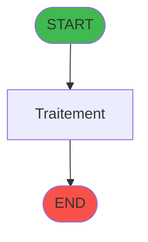
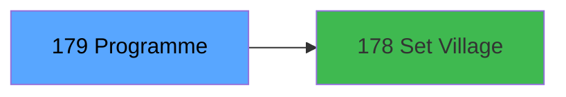

# ADH IDE 179 - Get Printer

> **Version spec**: 3.5
> **Analyse**: 2026-01-27 17:57
> **Source**: `Prg_XXX.xml`

---

<!-- TAB:Fonctionnel -->

## SPECIFICATION FONCTIONNELLE

### 1.1 Objectif metier

| Element | Description |
|---------|-------------|
| **Qui** | Operateur |
| **Quoi** | Get Printer
 |
| **Pourquoi** | A documenter |
| **Declencheur** | A identifier |

### 1.2 Regles metier

| Code | Regle | Condition |
|------|-------|-----------|
| RM-001 | A documenter | - |

### 1.3 Flux utilisateur

1. Demarrage programme
2. Traitement principal
3. Fin programme

### 1.4 Cas d'erreur

| Erreur | Comportement |
|--------|--------------|
| - | A documenter |

---

<!-- TAB:Technique -->

## SPECIFICATION TECHNIQUE

### 2.1 Identification

| Attribut | Valeur |
|----------|--------|
| **Format IDE** | ADH IDE 179 |
| **Description** | Get Printer
 |
| **Module** | ADH |

### 2.2 Tables

| # | Nom logique | Nom physique | Acces | Usage |
|---|-------------|--------------|-------|-------|
| 367 | pms_print_param_default | `pmsprintparamdefault` | R | 1x |
| 369 | presents_par_nationalite | `presparn` | L | 1x |
| 370 | pv_accounting_date | `pv_accountdate_dat` | R | 2x |
### 2.3 Parametres d'entree

| Variable | Nom | Type | Picture |
|----------|-----|------|---------|
| - | Aucun parametre | - | - |
### 2.4 Algorigramme

### 2.5 Expressions cles

| IDE | Expression | Commentaire |
|-----|------------|-------------|
| 1 | `GetParam ('CURRENTLISTINGNUM')` | - |
| 2 | `{0,1}` | - |
| 3 | `SetParam ('CURRENTLISTINGNAME',IF (GetParam ('C...` | - |
| 4 | `SetParam ('DEFAULTPRINTERNUM',{0,1})` | - |
| 5 | `SetParam ('DEFAULTPRINTERNAME',{0,7})` | - |
| 6 | `SetParam ('CURRENTPRINTERNUM',{0,1})` | - |
| 7 | `SetParam ('CURRENTPRINTERNAME',{0,7})` | - |
| 8 | `GetParam ('CURRENTPRINTERNUM')=0` | - |
| 9 | `GetParam ('CURRENTPRINTERNAME')='VOID'` | - |
| 10 | `SetParam ('NUMBERCOPIES',{0,2})` | - |
| 11 | `GetParam ('NUMBERCOPIES')=0` | - |
| 12 | `NOT {32768,78}` | - |
| 13 | `{32768,78}` | - |

> **Total**: 13 expressions (affichees: 13)
### 2.6 Variables importantes

### 2.7 Statistiques

| Metrique | Valeur |
|----------|--------|
| **Taches** | 3 |
| **Lignes logique** | 44 |
| **Lignes desactivees** | 0 |
---

<!-- TAB:Cartographie -->

## CARTOGRAPHIE APPLICATIVE

### 3.1 Chaine d'appels depuis Main

### 3.2 Callers directs

| IDE | Programme | Nb appels |
|-----|-----------|-----------|
| 69 | Extrait de compte | 7 |
| 217 | Menu telephone | 5 |
| 40 | Comptes de depôt | 3 |
| 173 | Gestion forfait TAI LOCAL | 2 |
| 193 | Solde compte fin sejour | 2 |
| 255 | VAD validés à imprimer | 2 |
| 25 | Change GM | 1 |
| 27 | Separation | 1 |
| 28 | Fusion | 1 |
| 64 | Solde Easy Check Out | 1 |
| 70 | Print extrait compte /Nom | 1 |
| 71 | Print extrait compte /Date | 1 |
| 72 | Print extrait compte /Cum | 1 |
| 73 | Print extrait compte /Imp | 1 |
| 76 | Print extrait compte /Service | 1 |
| 77 | Club Med Pass menu | 1 |
| 86 | Bar Limit | 1 |
| 137 | Ticket ouverture session | 1 |
| 138 | Ticket fermeture session | 1 |
| 139 | Ticket appro remise | 1 |
### 3.3 Callees

| Niv | IDE | Programme | Nb appels |
|-----|-----|-----------|-----------|
| 1 | 178 | Set Village Address | 1 |
### 3.4 Verification orphelin

| Critere | Resultat |
|---------|----------|
| Callers actifs | A verifier |
| **Conclusion** | A analyser |

---

## HISTORIQUE

| Date | Action | Auteur |
|------|--------|--------|
| 2026-01-27 20:22 | **DATA V2** - Tables reelles, Expressions, Stats, CallChain | Script |
| 2026-01-27 19:48 | **DATA POPULATED** - Tables, Callgraph (13 expr) | Script |
| 2026-01-27 17:57 | **Upgrade V3.5** - TAB markers, Mermaid | Claude |

---

*Specification V3.5 - Format avec TAB markers et Mermaid*
