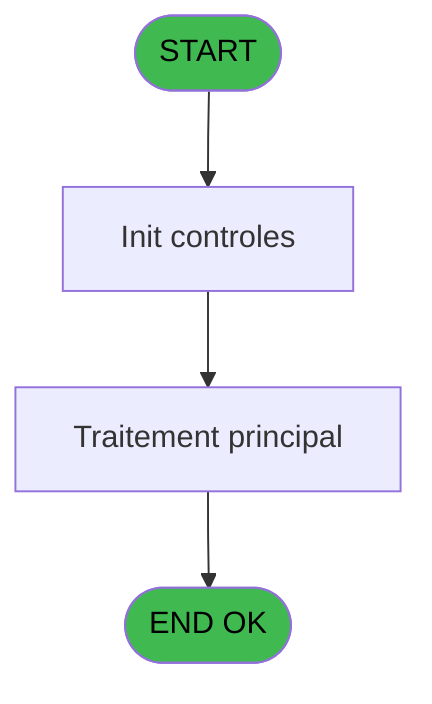

# ADH IDE 18 - Print extrait compte

> **Analyse**: Phases 1-4 2026-02-07 03:39 -> 03:40 (29s) | Assemblage 03:40
> **Pipeline**: V7.2 Enrichi
> **Structure**: 4 onglets (Resume | Ecrans | Donnees | Connexions)

<!-- TAB:Resume -->

## 1. FICHE D'IDENTITE

| Attribut | Valeur |
|----------|--------|
| Projet | ADH |
| IDE Position | 18 |
| Nom Programme | Print extrait compte |
| Fichier source | `Prg_18.xml` |
| Dossier IDE | Comptabilite |
| Taches | 6 (1 ecrans visibles) |
| Tables modifiees | 0 |
| Programmes appeles | 1 |

## 2. DESCRIPTION FONCTIONNELLE

**Print extrait compte** assure la gestion complete de ce processus, accessible depuis [Menu Data Catching (IDE 7)](ADH-IDE-7.md).

Le flux de traitement s'organise en **2 blocs fonctionnels** :

- **Traitement** (5 taches) : traitements metier divers
- **Impression** (1 tache) : generation de tickets et documents

Detail : phases du traitement

#### Phase 1 : Traitement (5 taches)

- **18** - Veuillez patienter... **[[ECRAN]](#ecran-t1)**
- **18.1** - récup nom adhérent
- **18.2.1** - Please wait **[[ECRAN]](#ecran-t4)**
- **18.2.2** - Please wait **[[ECRAN]](#ecran-t5)**
- **18.2.3** - Please wait **[[ECRAN]](#ecran-t6)**

Delegue a : [Recupere devise local (IDE 21)](ADH-IDE-21.md)

#### Phase 2 : Impression (1 tache)

- **18.2** - Printer 9

## 3. BLOCS FONCTIONNELS

### 3.1 Traitement (5 taches)

Traitements internes.

---

#### 18 - Veuillez patienter... [[ECRAN]](#ecran-t1)

**Role** : Traitement : Veuillez patienter....
**Ecran** : 424 x 57 DLU (MDI) | [Voir mockup](#ecran-t1)

4 sous-taches directes

| Tache | Nom | Bloc |
|-------|-----|------|
| [18.1](#t2) | récup nom adhérent | Traitement |
| [18.2.1](#t4) | Please wait **[[ECRAN]](#ecran-t4)** | Traitement |
| [18.2.2](#t5) | Please wait **[[ECRAN]](#ecran-t5)** | Traitement |
| [18.2.3](#t6) | Please wait **[[ECRAN]](#ecran-t6)** | Traitement |

**Delegue a** : [Recupere devise local (IDE 21)](ADH-IDE-21.md)

---

#### 18.1 - récup nom adhérent

**Role** : Traitement : récup nom adhérent.
**Variables liees** : J (W0 nom adhérent), K (W0 prénom adhérent), L (W0 n° adhérent)
**Delegue a** : [Recupere devise local (IDE 21)](ADH-IDE-21.md)

---

#### 18.2.1 - Please wait [[ECRAN]](#ecran-t4)

**Role** : Traitement : Please wait.
**Ecran** : 422 x 56 DLU (MDI) | [Voir mockup](#ecran-t4)
**Delegue a** : [Recupere devise local (IDE 21)](ADH-IDE-21.md)

---

#### 18.2.2 - Please wait [[ECRAN]](#ecran-t5)

**Role** : Traitement : Please wait.
**Ecran** : 422 x 56 DLU (MDI) | [Voir mockup](#ecran-t5)
**Delegue a** : [Recupere devise local (IDE 21)](ADH-IDE-21.md)

---

#### 18.2.3 - Please wait [[ECRAN]](#ecran-t6)

**Role** : Traitement : Please wait.
**Ecran** : 422 x 56 DLU (MDI) | [Voir mockup](#ecran-t6)
**Delegue a** : [Recupere devise local (IDE 21)](ADH-IDE-21.md)

### 3.2 Impression (1 tache)

Generation des documents et tickets.

---

#### 18.2 - Printer 9

**Role** : Generation du document : Printer 9.

## 5. REGLES METIER

*(Aucune regle metier identifiee)*

## 6. CONTEXTE

- **Appele par**: [Menu Data Catching (IDE 7)](ADH-IDE-7.md)
- **Appelle**: 1 programmes | **Tables**: 3 (W:0 R:1 L:2) | **Taches**: 6 | **Expressions**: 3

<!-- TAB:Ecrans -->

## 8. ECRANS

### 8.1 Forms visibles (1 / 6)

| # | Position | Tache | Nom | Type | Largeur | Hauteur | Bloc |
|---|----------|-------|-----|------|---------|---------|------|
| 1 | 18 | 18 | Veuillez patienter... | MDI | 424 | 57 | Traitement |

### 8.2 Mockups Ecrans

---

#### 18 - Veuillez patienter...
**Tache** : [18](#t1) | **Type** : MDI | **Dimensions** : 424 x 57 DLU
**Bloc** : Traitement | **Titre IDE** : Veuillez patienter...

<!-- FORM-DATA:
{
    "width":  424,
    "vFactor":  8,
    "type":  "MDI",
    "hFactor":  8,
    "controls":  [
                     {
                         "x":  0,
                         "type":  "label",
                         "var":  "",
                         "y":  0,
                         "w":  423,
                         "fmt":  "",
                         "name":  "",
                         "h":  29,
                         "color":  "",
                         "text":  "",
                         "parent":  null
                     },
                     {
                         "x":  120,
                         "type":  "label",
                         "var":  "",
                         "y":  10,
                         "w":  221,
                         "fmt":  "",
                         "name":  "",
                         "h":  8,
                         "color":  "7",
                         "text":  "Impression en cours ...",
                         "parent":  null
                     },
                     {
                         "x":  0,
                         "type":  "label",
                         "var":  "",
                         "y":  29,
                         "w":  423,
                         "fmt":  "",
                         "name":  "",
                         "h":  27,
                         "color":  "",
                         "text":  "",
                         "parent":  null
                     },
                     {
                         "x":  52,
                         "type":  "label",
                         "var":  "",
                         "y":  38,
                         "w":  318,
                         "fmt":  "",
                         "name":  "",
                         "h":  8,
                         "color":  "",
                         "text":  "Impression de l\u0027extrait de compte",
                         "parent":  null
                     },
                     {
                         "x":  4,
                         "type":  "image",
                         "var":  "",
                         "y":  2,
                         "w":  72,
                         "fmt":  "",
                         "name":  "",
                         "h":  25,
                         "color":  "",
                         "text":  "",
                         "parent":  null
                     }
                 ],
    "taskId":  "18",
    "height":  57
}
-->

## 9. NAVIGATION

Ecran unique: **Veuillez patienter...**

### 9.3 Structure hierarchique (6 taches)

| Position | Tache | Type | Dimensions | Bloc |
|----------|-------|------|------------|------|
| **18.1** | [**Veuillez patienter...** (18)](#t1) [mockup](#ecran-t1) | MDI | 424x57 | Traitement |
| 18.1.1 | [récup nom adhérent (18.1)](#t2) | MDI | - | |
| 18.1.2 | [Please wait (18.2.1)](#t4) [mockup](#ecran-t4) | MDI | 422x56 | |
| 18.1.3 | [Please wait (18.2.2)](#t5) [mockup](#ecran-t5) | MDI | 422x56 | |
| 18.1.4 | [Please wait (18.2.3)](#t6) [mockup](#ecran-t6) | MDI | 422x56 | |
| **18.2** | [**Printer 9** (18.2)](#t3) | MDI | - | Impression |

### 9.4 Algorigramme

> **Legende**: Vert = START/END OK | Rouge = END KO | Bleu = Decisions
> *Algorigramme auto-genere. Utiliser `/algorigramme` pour une synthese metier detaillee.*

<!-- TAB:Donnees -->

## 10. TABLES

### Tables utilisees (3)

| ID | Nom | Description | Type | R | W | L | Usages |
|----|-----|-------------|------|---|---|---|--------|
| 30 | gm-recherche_____gmr | Index de recherche | DB | R |   |   | 4 |
| 31 | gm-complet_______gmc |  | DB |   |   | L | 3 |
| 40 | comptable________cte |  | DB |   |   | L | 3 |

### Colonnes par table (2 / 1 tables avec colonnes identifiees)

Table 30 - gm-recherche_____gmr (R) - 4 usages

| Lettre | Variable | Acces | Type |
|--------|----------|-------|------|
| A | W1 initialisation | R | Alpha |
| B | W1 large | R | Alpha |
| C | W1 normal | R | Alpha |
| D | W1 condensé | R | Alpha |
| E | W1 détecteur papier | R | Alpha |
| F | W1 inhibe panel | R | Alpha |
| G | W1 massicot | R | Alpha |
| H | W1 sélection feuille | R | Alpha |
| I | W1 sélection rouleau | R | Alpha |
| J | W1 solde compte | R | Numeric |

## 11. VARIABLES

### 11.1 Parametres entrants (7)

Variables recues du programme appelant ([Menu Data Catching (IDE 7)](ADH-IDE-7.md)).

| Lettre | Nom | Type | Usage dans |
|--------|-----|------|-----------|
| A | P0 société | Alpha | - |
| B | P0 n° compte | Numeric | - |
| C | P0 filiation | Numeric | - |
| D | P0 masque montant | Alpha | 1x parametre entrant |
| E | P0 nom village | Alpha | - |
| F | P0 fictif | Logical | - |
| G | P0 date comptable | Date | - |

### 11.2 Variables de travail (10)

Variables internes au programme.

| Lettre | Nom | Type | Usage dans |
|--------|-----|------|-----------|
| H | W0 imprimante | Numeric | - |
| I | W0 titre | Alpha | - |
| J | W0 nom adhérent | Alpha | - |
| K | W0 prénom adhérent | Alpha | - |
| L | W0 n° adhérent | Numeric | - |
| M | W0 lettre contrôle | Alpha | - |
| N | W0 filiation | Numeric | - |
| O | W0 masque extrait | Alpha | - |
| P | W0 langue parlée | Alpha | - |
| Q | W0 devise locale | Alpha | - |

Toutes les 17 variables (liste complete)

| Cat | Lettre | Nom Variable | Type |
|-----|--------|--------------|------|
| P0 | **A** | P0 société | Alpha |
| P0 | **B** | P0 n° compte | Numeric |
| P0 | **C** | P0 filiation | Numeric |
| P0 | **D** | P0 masque montant | Alpha |
| P0 | **E** | P0 nom village | Alpha |
| P0 | **F** | P0 fictif | Logical |
| P0 | **G** | P0 date comptable | Date |
| W0 | **H** | W0 imprimante | Numeric |
| W0 | **I** | W0 titre | Alpha |
| W0 | **J** | W0 nom adhérent | Alpha |
| W0 | **K** | W0 prénom adhérent | Alpha |
| W0 | **L** | W0 n° adhérent | Numeric |
| W0 | **M** | W0 lettre contrôle | Alpha |
| W0 | **N** | W0 filiation | Numeric |
| W0 | **O** | W0 masque extrait | Alpha |
| W0 | **P** | W0 langue parlée | Alpha |
| W0 | **Q** | W0 devise locale | Alpha |

## 12. EXPRESSIONS

**3 / 3 expressions decodees (100%)**

### 12.1 Repartition par type

| Type | Expressions | Regles |
|------|-------------|--------|
| CALCULATION | 1 | 0 |
| OTHER | 2 | 0 |

### 12.2 Expressions cles par type

#### CALCULATION (1 expressions)

| Type | IDE | Expression | Regle |
|------|-----|------------|-------|
| CALCULATION | 3 | `Left (P0 masque montant [D],Len (RTrim (P0 masque montant [D]))-1)` | - |

#### OTHER (2 expressions)

| Type | IDE | Expression | Regle |
|------|-----|------------|-------|
| OTHER | 2 | `SetCrsr (2)` | - |
| OTHER | 1 | `SetCrsr (1)` | - |

<!-- TAB:Connexions -->

## 13. GRAPHE D'APPELS

### 13.1 Chaine depuis Main (Callers)

Main -> ... -> [Menu Data Catching (IDE 7)](ADH-IDE-7.md) -> **Print extrait compte (IDE 18)**

### 13.2 Callers

| IDE | Nom Programme | Nb Appels |
|-----|---------------|-----------|
| [7](ADH-IDE-7.md) | Menu Data Catching | 1 |

### 13.3 Callees (programmes appeles)

### 13.4 Detail Callees avec contexte

| IDE | Nom Programme | Appels | Contexte |
|-----|---------------|--------|----------|
| [21](ADH-IDE-21.md) | Recupere devise local | 1 | Recuperation donnees |

## 14. RECOMMANDATIONS MIGRATION

### 14.1 Profil du programme

| Metrique | Valeur | Impact migration |
|----------|--------|-----------------|
| Lignes de logique | 193 | Programme compact |
| Expressions | 3 | Peu de logique |
| Tables WRITE | 0 | Impact faible |
| Sous-programmes | 1 | Peu de dependances |
| Ecrans visibles | 1 | Ecran unique ou traitement batch |
| Code desactive | 0% (0 / 193) | Code sain |
| Regles metier | 0 | Pas de regle identifiee |

### 14.2 Plan de migration par bloc

#### Traitement (5 taches: 4 ecrans, 1 traitement)

- **Strategie** : Orchestrateur avec 4 ecrans (Razor/React) et 1 traitements backend (services).
- Les ecrans deviennent des composants UI, les traitements invisibles deviennent des services injectables.
- 1 sous-programme(s) a migrer ou a reutiliser depuis les services existants.
- Decomposer les taches en services unitaires testables.

#### Impression (1 tache: 0 ecran, 1 traitement)

- **Strategie** : Templates HTML -> PDF via wkhtmltopdf ou Puppeteer.
- `PrintService` injectable avec choix imprimante

### 14.3 Dependances critiques

| Dependance | Type | Appels | Impact |
|------------|------|--------|--------|
| [Recupere devise local (IDE 21)](ADH-IDE-21.md) | Sous-programme | 1x | Normale - Recuperation donnees |

---
*Spec DETAILED generee par Pipeline V7.2 - 2026-02-07 03:40*
