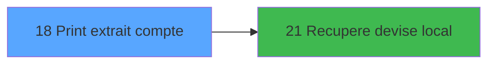

# ADH IDE 18 - Print extrait compte

> **Analyse**: Phases 1-4 2026-02-07 03:40 -> 01:19 (21h39min) | Assemblage 01:19
> **Pipeline**: V7.2 Enrichi
> **Structure**: 4 onglets (Resume | Ecrans | Donnees | Connexions)

<!-- TAB:Resume -->

## 1. FICHE D'IDENTITE

| Attribut | Valeur |
|----------|--------|
| Projet | ADH |
| IDE Position | 18 |
| Nom Programme | Print extrait compte |
| Fichier source | `Prg_18.xml` |
| Dossier IDE | Comptabilite |
| Taches | 6 (1 ecrans visibles) |
| Tables modifiees | 0 |
| Programmes appeles | 1 |
| Complexite | **BASSE** (score 12/100) |

## 2. DESCRIPTION FONCTIONNELLE

# ADH IDE 18 - Print Extrait Compte

Programme d'édition de l'extrait de compte pour un adhérent. Récupère les mouvements comptables du compte sélectionné, les formate et les envoie à l'imprimante. Le programme appelle ADH IDE 21 pour obtenir la devise locale afin d'afficher correctement les montants.

Le flux est simple : récupération du nom de l'adhérent, puis génération du document (extraction des lignes de mouvement depuis les tables comptables), mise en forme pour impression, et envoi vers la file d'attente imprimante. Plusieurs tâches « Please wait » gèrent l'affichage du sablier durant les opérations longues.

C'est un programme de consultation/édition classique du domaine ADH, alimentant le flux utilisateur "Data Catching → Menu → Print Extrait" pour générer les relevés papier des mouvements de compte.

## 3. BLOCS FONCTIONNELS

### 3.1 Traitement (5 taches)

Traitements internes.

---

#### 18 - Veuillez patienter... [[ECRAN]](#ecran-t1)

**Role** : Traitement : Veuillez patienter....
**Ecran** : 424 x 57 DLU (MDI) | [Voir mockup](#ecran-t1)

4 sous-taches directes

| Tache | Nom | Bloc |
|-------|-----|------|
| [18.1](#t2) | récup nom adhérent | Traitement |
| [18.2.1](#t4) | Please wait **[[ECRAN]](#ecran-t4)** | Traitement |
| [18.2.2](#t5) | Please wait **[[ECRAN]](#ecran-t5)** | Traitement |
| [18.2.3](#t6) | Please wait **[[ECRAN]](#ecran-t6)** | Traitement |

**Delegue a** : [Recupere devise local (IDE 21)](ADH-IDE-21.md)

---

#### 18.1 - récup nom adhérent

**Role** : Traitement : récup nom adhérent.
**Variables liees** : EW (W0 nom adhérent), EX (W0 prénom adhérent), EY (W0 n° adhérent)
**Delegue a** : [Recupere devise local (IDE 21)](ADH-IDE-21.md)

---

#### 18.2.1 - Please wait [[ECRAN]](#ecran-t4)

**Role** : Traitement : Please wait.
**Ecran** : 422 x 56 DLU (MDI) | [Voir mockup](#ecran-t4)
**Delegue a** : [Recupere devise local (IDE 21)](ADH-IDE-21.md)

---

#### 18.2.2 - Please wait [[ECRAN]](#ecran-t5)

**Role** : Traitement : Please wait.
**Ecran** : 422 x 56 DLU (MDI) | [Voir mockup](#ecran-t5)
**Delegue a** : [Recupere devise local (IDE 21)](ADH-IDE-21.md)

---

#### 18.2.3 - Please wait [[ECRAN]](#ecran-t6)

**Role** : Traitement : Please wait.
**Ecran** : 422 x 56 DLU (MDI) | [Voir mockup](#ecran-t6)
**Delegue a** : [Recupere devise local (IDE 21)](ADH-IDE-21.md)

### 3.2 Impression (1 tache)

Generation des documents et tickets.

---

#### 18.2 - Printer 9

**Role** : Generation du document : Printer 9.

## 5. REGLES METIER

*(Programme d'impression - logique technique sans conditions metier)*

## 6. CONTEXTE

- **Appele par**: [Menu Data Catching (IDE 7)](ADH-IDE-7.md)
- **Appelle**: 1 programmes | **Tables**: 3 (W:0 R:1 L:2) | **Taches**: 6 | **Expressions**: 3

<!-- TAB:Ecrans -->

## 8. ECRANS

### 8.1 Forms visibles (1 / 6)

| # | Position | Tache | Nom | Type | Largeur | Hauteur | Bloc |
|---|----------|-------|-----|------|---------|---------|------|
| 1 | 18 | 18 | Veuillez patienter... | MDI | 424 | 57 | Traitement |

### 8.2 Mockups Ecrans

---

#### 18 - Veuillez patienter...
**Tache** : [18](#t1) | **Type** : MDI | **Dimensions** : 424 x 57 DLU
**Bloc** : Traitement | **Titre IDE** : Veuillez patienter...

<!-- FORM-DATA:
{
    "width":  424,
    "vFactor":  8,
    "type":  "MDI",
    "hFactor":  8,
    "controls":  [
                     {
                         "x":  0,
                         "type":  "label",
                         "var":  "",
                         "y":  0,
                         "w":  423,
                         "fmt":  "",
                         "name":  "",
                         "h":  29,
                         "color":  "",
                         "text":  "",
                         "parent":  null
                     },
                     {
                         "x":  120,
                         "type":  "label",
                         "var":  "",
                         "y":  10,
                         "w":  221,
                         "fmt":  "",
                         "name":  "",
                         "h":  8,
                         "color":  "7",
                         "text":  "Impression en cours ...",
                         "parent":  null
                     },
                     {
                         "x":  0,
                         "type":  "label",
                         "var":  "",
                         "y":  29,
                         "w":  423,
                         "fmt":  "",
                         "name":  "",
                         "h":  27,
                         "color":  "",
                         "text":  "",
                         "parent":  null
                     },
                     {
                         "x":  52,
                         "type":  "label",
                         "var":  "",
                         "y":  38,
                         "w":  318,
                         "fmt":  "",
                         "name":  "",
                         "h":  8,
                         "color":  "",
                         "text":  "Impression de l\u0027extrait de compte",
                         "parent":  null
                     },
                     {
                         "x":  4,
                         "type":  "image",
                         "var":  "",
                         "y":  2,
                         "w":  72,
                         "fmt":  "",
                         "name":  "",
                         "h":  25,
                         "color":  "",
                         "text":  "",
                         "parent":  null
                     }
                 ],
    "taskId":  "18",
    "height":  57
}
-->

## 9. NAVIGATION

Ecran unique: **Veuillez patienter...**

### 9.3 Structure hierarchique (6 taches)

| Position | Tache | Type | Dimensions | Bloc |
|----------|-------|------|------------|------|
| **18.1** | [**Veuillez patienter...** (18)](#t1) [mockup](#ecran-t1) | MDI | 424x57 | Traitement |
| 18.1.1 | [récup nom adhérent (18.1)](#t2) | MDI | - | |
| 18.1.2 | [Please wait (18.2.1)](#t4) [mockup](#ecran-t4) | MDI | 422x56 | |
| 18.1.3 | [Please wait (18.2.2)](#t5) [mockup](#ecran-t5) | MDI | 422x56 | |
| 18.1.4 | [Please wait (18.2.3)](#t6) [mockup](#ecran-t6) | MDI | 422x56 | |
| **18.2** | [**Printer 9** (18.2)](#t3) | MDI | - | Impression |

### 9.4 Algorigramme

> **Legende**: Vert = START/END OK | Rouge = END KO | Bleu = Decisions
> *Algorigramme auto-genere. Utiliser `/algorigramme` pour une synthese metier detaillee.*

<!-- TAB:Donnees -->

## 10. TABLES

### Tables utilisees (3)

| ID | Nom | Description | Type | R | W | L | Usages |
|----|-----|-------------|------|---|---|---|--------|
| 30 | gm-recherche_____gmr | Index de recherche | DB | R |   |   | 4 |
| 40 | comptable________cte |  | DB |   |   | L | 3 |
| 31 | gm-complet_______gmc |  | DB |   |   | L | 3 |

### Colonnes par table (2 / 1 tables avec colonnes identifiees)

Table 30 - gm-recherche_____gmr (R) - 4 usages

| Lettre | Variable | Acces | Type |
|--------|----------|-------|------|
| A | W1 initialisation | R | Alpha |
| B | W1 large | R | Alpha |
| C | W1 normal | R | Alpha |
| D | W1 condensé | R | Alpha |
| E | W1 détecteur papier | R | Alpha |
| F | W1 inhibe panel | R | Alpha |
| G | W1 massicot | R | Alpha |
| H | W1 sélection feuille | R | Alpha |
| I | W1 sélection rouleau | R | Alpha |
| J | W1 solde compte | R | Numeric |

## 11. VARIABLES

### 11.1 Parametres entrants (7)

Variables recues du programme appelant ([Menu Data Catching (IDE 7)](ADH-IDE-7.md)).

| Lettre | Nom | Type | Usage dans |
|--------|-----|------|-----------|
| EN | P0 société | Alpha | - |
| EO | P0 n° compte | Numeric | - |
| EP | P0 filiation | Numeric | - |
| EQ | P0 masque montant | Alpha | 1x parametre entrant |
| ER | P0 nom village | Alpha | - |
| ES | P0 fictif | Logical | - |
| ET | P0 date comptable | Date | - |

### 11.2 Variables de travail (10)

Variables internes au programme.

| Lettre | Nom | Type | Usage dans |
|--------|-----|------|-----------|
| EU | W0 imprimante | Numeric | - |
| EV | W0 titre | Alpha | - |
| EW | W0 nom adhérent | Alpha | - |
| EX | W0 prénom adhérent | Alpha | - |
| EY | W0 n° adhérent | Numeric | - |
| EZ | W0 lettre contrôle | Alpha | - |
| FA | W0 filiation | Numeric | - |
| FB | W0 masque extrait | Alpha | - |
| FC | W0 langue parlée | Alpha | - |
| FD | W0 devise locale | Alpha | - |

Toutes les 17 variables (liste complete)

| Cat | Lettre | Nom Variable | Type |
|-----|--------|--------------|------|
| P0 | **EN** | P0 société | Alpha |
| P0 | **EO** | P0 n° compte | Numeric |
| P0 | **EP** | P0 filiation | Numeric |
| P0 | **EQ** | P0 masque montant | Alpha |
| P0 | **ER** | P0 nom village | Alpha |
| P0 | **ES** | P0 fictif | Logical |
| P0 | **ET** | P0 date comptable | Date |
| W0 | **EU** | W0 imprimante | Numeric |
| W0 | **EV** | W0 titre | Alpha |
| W0 | **EW** | W0 nom adhérent | Alpha |
| W0 | **EX** | W0 prénom adhérent | Alpha |
| W0 | **EY** | W0 n° adhérent | Numeric |
| W0 | **EZ** | W0 lettre contrôle | Alpha |
| W0 | **FA** | W0 filiation | Numeric |
| W0 | **FB** | W0 masque extrait | Alpha |
| W0 | **FC** | W0 langue parlée | Alpha |
| W0 | **FD** | W0 devise locale | Alpha |

## 12. EXPRESSIONS

**3 / 3 expressions decodees (100%)**

### 12.1 Repartition par type

| Type | Expressions | Regles |
|------|-------------|--------|
| CALCULATION | 1 | 0 |
| OTHER | 2 | 0 |

### 12.2 Expressions cles par type

#### CALCULATION (1 expressions)

| Type | IDE | Expression | Regle |
|------|-----|------------|-------|
| CALCULATION | 3 | `Left (P0 masque montant [D],Len (RTrim (P0 masque montant [D]))-1)` | - |

#### OTHER (2 expressions)

| Type | IDE | Expression | Regle |
|------|-----|------------|-------|
| OTHER | 2 | `SetCrsr (2)` | - |
| OTHER | 1 | `SetCrsr (1)` | - |

<!-- TAB:Connexions -->

## 13. GRAPHE D'APPELS

### 13.1 Chaine depuis Main (Callers)

Main -> ... -> [Menu Data Catching (IDE 7)](ADH-IDE-7.md) -> **Print extrait compte (IDE 18)**

### 13.2 Callers

| IDE | Nom Programme | Nb Appels |
|-----|---------------|-----------|
| [7](ADH-IDE-7.md) | Menu Data Catching | 1 |

### 13.3 Callees (programmes appeles)

### 13.4 Detail Callees avec contexte

| IDE | Nom Programme | Appels | Contexte |
|-----|---------------|--------|----------|
| [21](ADH-IDE-21.md) | Recupere devise local | 1 | Recuperation donnees |

## 14. RECOMMANDATIONS MIGRATION

### 14.1 Profil du programme

| Metrique | Valeur | Impact migration |
|----------|--------|-----------------|
| Lignes de logique | 193 | Programme compact |
| Expressions | 3 | Peu de logique |
| Tables WRITE | 0 | Impact faible |
| Sous-programmes | 1 | Peu de dependances |
| Ecrans visibles | 1 | Ecran unique ou traitement batch |
| Code desactive | 0% (0 / 193) | Code sain |
| Regles metier | 0 | Pas de regle identifiee |

### 14.2 Plan de migration par bloc

#### Traitement (5 taches: 4 ecrans, 1 traitement)

- **Strategie** : Orchestrateur avec 4 ecrans (Razor/React) et 1 traitements backend (services).
- Les ecrans deviennent des composants UI, les traitements invisibles deviennent des services injectables.
- 1 sous-programme(s) a migrer ou a reutiliser depuis les services existants.
- Decomposer les taches en services unitaires testables.

#### Impression (1 tache: 0 ecran, 1 traitement)

- **Strategie** : Templates HTML -> PDF via wkhtmltopdf ou Puppeteer.
- `PrintService` injectable avec choix imprimante

### 14.3 Dependances critiques

| Dependance | Type | Appels | Impact |
|------------|------|--------|--------|
| [Recupere devise local (IDE 21)](ADH-IDE-21.md) | Sous-programme | 1x | Normale - Recuperation donnees |

---
*Spec DETAILED generee par Pipeline V7.2 - 2026-02-08 01:20*
