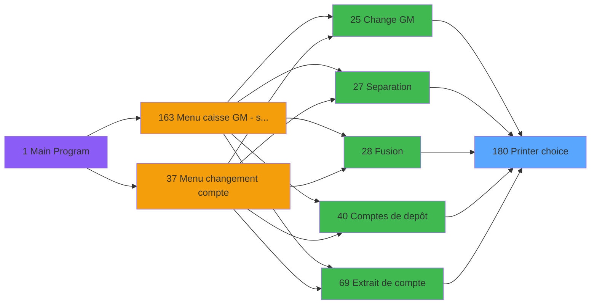
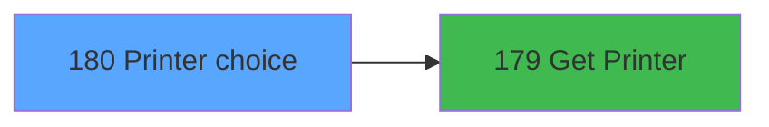

# ADH IDE 180 - Printer choice

> **Analyse**: Phases 1-4 2026-02-07 03:52 -> 03:52 (27s) | Assemblage 04:00
> **Pipeline**: V7.2 Enrichi
> **Structure**: 4 onglets (Resume | Ecrans | Donnees | Connexions)

<!-- TAB:Resume -->

## 1. FICHE D'IDENTITE

| Attribut | Valeur |
|----------|--------|
| Projet | ADH |
| IDE Position | 180 |
| Nom Programme | Printer choice |
| Fichier source | `Prg_180.xml` |
| Dossier IDE | Impression |
| Taches | 5 (1 ecrans visibles) |
| Tables modifiees | 0 |
| Programmes appeles | 1 |
| Complexite | **BASSE** (score 5/100) |

## 2. DESCRIPTION FONCTIONNELLE

ADH IDE 180 est un programme utilitaire de **sélection d'imprimante** utilisé par plus de 20 programmes dans le système de gestion de caisse. Son rôle est de permettre à l'utilisateur de choisir parmi les imprimantes disponibles avant d'exécuter une opération d'impression (factures, reçus, listes de comptes, rapports). Le programme gère l'interface de dialogue et l'affichage des options d'imprimante configurées dans le système.

Le flux fonctionnel repose sur plusieurs tâches : la tâche "Printer choice" affiche une grille de sélection avec les imprimantes disponibles, la tâche "Load" initialise le contexte en récupérant la liste des périphériques via le programme ADH IDE 179 (Get Printer), et la validation de la sélection retourne l'imprimante choisie au programme appelant. Le programme est systématiquement appelé avant tout processus d'impression pour garantir que l'utilisateur sélectionne consciemment sa destination (imprimante réseau, locale, PDF, etc.).

Ses appelants couvrent tous les domaines critiques : gestion des sessions (ouverture/fermeture caisse IDE 122-131), opérations monétaires (change IDE 25, dépôts IDE 40), consultation de comptes (extraits IDE 69), ventes (IDE 237-240), et utilitaires (listes chaînées IDE 185, menus impression IDE 214). Cette réutilisation massive en fait un composant central de l'écosystème d'impression du système PMS.

## 3. BLOCS FONCTIONNELS

### 3.1 Impression (3 taches)

Generation des documents et tickets.

---

#### <a id="t1"></a>T1 - Printer choice [ECRAN]

**Role** : Generation du document : Printer choice.
**Ecran** : 366 x 0 DLU (MDI) | [Voir mockup](#ecran-t1)
**Variables liees** : B (EndprinterChoice)
**Delegue a** : [Get Printer (IDE 179)](ADH-IDE-179.md)

---

#### <a id="t2"></a>T2 - Printer choice [ECRAN]

**Role** : Generation du document : Printer choice.
**Ecran** : 366 x 0 DLU (MDI) | [Voir mockup](#ecran-t2)
**Variables liees** : B (EndprinterChoice)
**Delegue a** : [Get Printer (IDE 179)](ADH-IDE-179.md)

---

#### <a id="t5"></a>T5 - Printer Choice [ECRAN]

**Role** : Generation du document : Printer Choice.
**Ecran** : 770 x 229 DLU (MDI) | [Voir mockup](#ecran-t5)
**Variables liees** : B (EndprinterChoice)
**Delegue a** : [Get Printer (IDE 179)](ADH-IDE-179.md)


### 3.2 Traitement (2 taches)

Traitements internes.

---

#### <a id="t3"></a>T3 - Load

**Role** : Traitement : Load.

---

#### <a id="t4"></a>T4 - Load

**Role** : Traitement : Load.


## 5. REGLES METIER

1 regles identifiees:

### Autres (1 regles)

#### <a id="rm-RM-001"></a>[RM-001] Negation de VG78 (condition inversee)

| Element | Detail |
|---------|--------|
| **Condition** | `NOT VG78` |
| **Si vrai** | Action conditionnelle |
| **Expression source** | Expression 3 : `NOT VG78` |
| **Exemple** | Si NOT VG78 → Action conditionnelle |

## 6. CONTEXTE

- **Appele par**: [Gestion forfait TAI LOCAL (IDE 173)](ADH-IDE-173.md), [Menu telephone (IDE 217)](ADH-IDE-217.md), [Change GM (IDE 25)](ADH-IDE-25.md), [Separation (IDE 27)](ADH-IDE-27.md), [Fusion (IDE 28)](ADH-IDE-28.md), [Comptes de depôt (IDE 40)](ADH-IDE-40.md), [Extrait de compte (IDE 69)](ADH-IDE-69.md), [Club Med Pass menu (IDE 77)](ADH-IDE-77.md), [Bar Limit (IDE 86)](ADH-IDE-86.md), [Tableau recap fermeture (IDE 154)](ADH-IDE-154.md), [Transferts (IDE 175)](ADH-IDE-175.md), [Other Listing (IDE 183)](ADH-IDE-183.md), [Chained Listing Printer Choice (IDE 185)](ADH-IDE-185.md), [Menu impression des appels (IDE 214)](ADH-IDE-214.md), [Transaction Nouv vente avec GP (IDE 237)](ADH-IDE-237.md), [Transaction Nouv vente PMS-584 (IDE 238)](ADH-IDE-238.md), [Transaction Nouv vente PMS-721 (IDE 239)](ADH-IDE-239.md), [Transaction Nouv vente PMS-710 (IDE 240)](ADH-IDE-240.md), [Bi  Change GM Achat (IDE 293)](ADH-IDE-293.md), [Bi  Change GM Vente (IDE 294)](ADH-IDE-294.md)
- **Appelle**: 1 programmes | **Tables**: 5 (W:0 R:2 L:3) | **Taches**: 5 | **Expressions**: 4

<!-- TAB:Ecrans -->

## 8. ECRANS

### 8.1 Forms visibles (1 / 5)

| # | Position | Tache | Nom | Type | Largeur | Hauteur | Bloc |
|---|----------|-------|-----|------|---------|---------|------|
| 1 | 180.1.2 | T5 | Printer Choice | MDI | 770 | 229 | Impression |

### 8.2 Mockups Ecrans

---

#### <a id="ecran-t5"></a>180.1.2 - Printer Choice
**Tache** : [T5](#t5) | **Type** : MDI | **Dimensions** : 770 x 229 DLU
**Bloc** : Impression | **Titre IDE** : Printer Choice

<!-- FORM-DATA:
{
    "width":  770,
    "vFactor":  8,
    "type":  "MDI",
    "hFactor":  8,
    "controls":  [
                     {
                         "x":  8,
                         "type":  "label",
                         "var":  "",
                         "y":  167,
                         "w":  165,
                         "fmt":  "",
                         "name":  "",
                         "h":  12,
                         "color":  "",
                         "text":  "Default printer",
                         "parent":  null
                     },
                     {
                         "x":  8,
                         "type":  "label",
                         "var":  "",
                         "y":  181,
                         "w":  165,
                         "fmt":  "",
                         "name":  "",
                         "h":  12,
                         "color":  "",
                         "text":  "Current listing",
                         "parent":  null
                     },
                     {
                         "x":  8,
                         "type":  "label",
                         "var":  "",
                         "y":  195,
                         "w":  165,
                         "fmt":  "",
                         "name":  "",
                         "h":  12,
                         "color":  "",
                         "text":  "Current printer",
                         "parent":  null
                     },
                     {
                         "x":  8,
                         "type":  "label",
                         "var":  "",
                         "y":  209,
                         "w":  165,
                         "fmt":  "",
                         "name":  "",
                         "h":  12,
                         "color":  "",
                         "text":  "Current copies",
                         "parent":  null
                     },
                     {
                         "x":  10,
                         "type":  "table",
                         "var":  "",
                         "name":  "",
                         "titleH":  12,
                         "color":  "110",
                         "w":  742,
                         "y":  8,
                         "fmt":  "",
                         "parent":  null,
                         "text":  "",
                         "rowH":  14,
                         "h":  154,
                         "cols":  [
                                      {
                                          "title":  "Chrono",
                                          "layer":  1,
                                          "w":  78
                                      },
                                      {
                                          "title":  "Libellé",
                                          "layer":  2,
                                          "w":  431
                                      },
                                      {
                                          "title":  "Tray",
                                          "layer":  3,
                                          "w":  49
                                      },
                                      {
                                          "title":  "Copies",
                                          "layer":  4,
                                          "w":  69
                                      },
                                      {
                                          "title":  "Choice",
                                          "layer":  5,
                                          "w":  82
                                      }
                                  ],
                         "rows":  5
                     },
                     {
                         "x":  506,
                         "type":  "button",
                         "var":  "",
                         "y":  211,
                         "w":  240,
                         "fmt":  "",
                         "name":  "NoChangeAndExitButton",
                         "h":  16,
                         "color":  "",
                         "text":  "",
                         "parent":  null
                     },
                     {
                         "x":  194,
                         "type":  "edit",
                         "var":  "",
                         "y":  167,
                         "w":  549,
                         "fmt":  "",
                         "name":  "",
                         "h":  12,
                         "color":  "146",
                         "text":  "",
                         "parent":  null
                     },
                     {
                         "x":  194,
                         "type":  "edit",
                         "var":  "",
                         "y":  195,
                         "w":  549,
                         "fmt":  "",
                         "name":  "",
                         "h":  12,
                         "color":  "144",
                         "text":  "",
                         "parent":  null
                     },
                     {
                         "x":  18,
                         "type":  "edit",
                         "var":  "",
                         "y":  22,
                         "w":  62,
                         "fmt":  "",
                         "name":  "",
                         "h":  12,
                         "color":  "110",
                         "text":  "",
                         "parent":  9
                     },
                     {
                         "x":  96,
                         "type":  "edit",
                         "var":  "",
                         "y":  22,
                         "w":  421,
                         "fmt":  "",
                         "name":  "",
                         "h":  12,
                         "color":  "110",
                         "text":  "",
                         "parent":  9
                     },
                     {
                         "x":  525,
                         "type":  "edit",
                         "var":  "",
                         "y":  22,
                         "w":  40,
                         "fmt":  "",
                         "name":  "",
                         "h":  12,
                         "color":  "110",
                         "text":  "",
                         "parent":  9
                     },
                     {
                         "x":  575,
                         "type":  "edit",
                         "var":  "",
                         "y":  22,
                         "w":  59,
                         "fmt":  "",
                         "name":  "Copies",
                         "h":  12,
                         "color":  "110",
                         "text":  "",
                         "parent":  9
                     },
                     {
                         "x":  643,
                         "type":  "button",
                         "var":  "",
                         "y":  22,
                         "w":  72,
                         "fmt":  "",
                         "name":  "Choice",
                         "h":  12,
                         "color":  "",
                         "text":  "",
                         "parent":  9
                     },
                     {
                         "x":  194,
                         "type":  "edit",
                         "var":  "",
                         "y":  181,
                         "w":  549,
                         "fmt":  "64",
                         "name":  "",
                         "h":  12,
                         "color":  "144",
                         "text":  "",
                         "parent":  null
                     },
                     {
                         "x":  194,
                         "type":  "edit",
                         "var":  "",
                         "y":  209,
                         "w":  56,
                         "fmt":  "4",
                         "name":  "",
                         "h":  12,
                         "color":  "144",
                         "text":  "",
                         "parent":  null
                     }
                 ],
    "taskId":  "180.1.2",
    "height":  229
}
-->

<details>
<summary><strong>Champs : 8 champs</strong></summary>

| Pos (x,y) | Nom | Variable | Type |
|-----------|-----|----------|------|
| 194,167 | (sans nom) | - | edit |
| 194,195 | (sans nom) | - | edit |
| 18,22 | (sans nom) | - | edit |
| 96,22 | (sans nom) | - | edit |
| 525,22 | (sans nom) | - | edit |
| 575,22 | Copies | - | edit |
| 194,181 | 64 | - | edit |
| 194,209 | 4 | - | edit |

</details>

<details>
<summary><strong>Boutons : 2 boutons</strong></summary>

| Bouton | Pos (x,y) | Action |
|--------|-----------|--------|
| NoChangeAndExitButton | 506,211 | Modifie l'element Quitte le programme |
| Choice | 643,22 | Bouton fonctionnel |

</details>

## 9. NAVIGATION

Ecran unique: **Printer Choice**

### 9.3 Structure hierarchique (5 taches)

| Position | Tache | Type | Dimensions | Bloc |
|----------|-------|------|------------|------|
| **180.1** | [**Printer choice** (T1)](#t1) [mockup](#ecran-t1) | MDI | 366x0 | Impression |
| 180.1.1 | [Printer choice (T2)](#t2) [mockup](#ecran-t2) | MDI | 366x0 | |
| 180.1.2 | [Printer Choice (T5)](#t5) [mockup](#ecran-t5) | MDI | 770x229 | |
| **180.2** | [**Load** (T3)](#t3) | MDI | - | Traitement |
| 180.2.1 | [Load (T4)](#t4) | MDI | - | |

### 9.4 Algorigramme

```mermaid
flowchart TD
    START([START])
    INIT[Init controles]
    START --> INIT
    B1[Impression (3t)]
    INIT --> B1
    B2[Traitement (2t)]
    B1 --> B2
    ENDOK([END OK])
    B2 --> ENDOK

    style START fill:#3fb950,color:#000
    style ENDOK fill:#3fb950,color:#000
```

> **Legende**: Vert = START/END OK | Rouge = END KO | Bleu = Decisions
> *Algorigramme genere depuis les expressions CONDITION. Utiliser `/algorigramme` pour une synthese metier detaillee.*

<!-- TAB:Donnees -->

## 10. TABLES

### Tables utilisees (5)

| ID | Nom | Description | Type | R | W | L | Usages |
|----|-----|-------------|------|---|---|---|--------|
| 367 | pms_print_param_default |  | DB | R |   |   | 2 |
| 370 | pv_accounting_date |  | DB | R |   |   | 1 |
| 584 | tempo_type_millesia | Table temporaire ecran | TMP |   |   | L | 2 |
| 369 | presents_par_nationalite |  | DB |   |   | L | 2 |
| 371 | pv_binding_settings |  | DB |   |   | L | 1 |

### Colonnes par table (1 / 2 tables avec colonnes identifiees)

<details>
<summary>Table 367 - pms_print_param_default (R) - 2 usages</summary>

| Lettre | Variable | Acces | Type |
|--------|----------|-------|------|
| A | v.For current | R | Logical |
| B | v.Copies paramétrées term/host | R | Numeric |
| C | v.For default term | R | Logical |

</details>

<details>
<summary>Table 370 - pv_accounting_date (R) - 1 usages</summary>

*Table utilisee uniquement en Link ou aucune colonne Real identifiee dans le DataView.*

</details>

## 11. VARIABLES

### 11.1 Parametres entrants (1)

Variables recues du programme appelant ([Gestion forfait TAI LOCAL (IDE 173)](ADH-IDE-173.md)).

| Lettre | Nom | Type | Usage dans |
|--------|-----|------|-----------|
| A | P.ViensDe | Alpha | 1x parametre entrant |

### 11.2 Variables de session (1)

Variables persistantes pendant toute la session.

| Lettre | Nom | Type | Usage dans |
|--------|-----|------|-----------|
| C | v.For default term | Logical | - |

### 11.3 Autres (1)

Variables diverses.

| Lettre | Nom | Type | Usage dans |
|--------|-----|------|-----------|
| B | EndprinterChoice | Logical | - |

## 12. EXPRESSIONS

**4 / 4 expressions decodees (100%)**

### 12.1 Repartition par type

| Type | Expressions | Regles |
|------|-------------|--------|
| OTHER | 1 | 0 |
| CAST_LOGIQUE | 1 | 0 |
| NEGATION | 1 | 0 |
| REFERENCE_VG | 1 | 0 |

### 12.2 Expressions cles par type

#### OTHER (1 expressions)

| Type | IDE | Expression | Regle |
|------|-----|------------|-------|
| OTHER | 1 | `P.ViensDe [A]` | - |

#### CAST_LOGIQUE (1 expressions)

| Type | IDE | Expression | Regle |
|------|-----|------------|-------|
| CAST_LOGIQUE | 2 | `'FALSE'LOG` | - |

#### NEGATION (1 expressions)

| Type | IDE | Expression | Regle |
|------|-----|------------|-------|
| NEGATION | 3 | `NOT VG78` | - |

#### REFERENCE_VG (1 expressions)

| Type | IDE | Expression | Regle |
|------|-----|------------|-------|
| REFERENCE_VG | 4 | `VG78` | - |

<!-- TAB:Connexions -->

## 13. GRAPHE D'APPELS

### 13.1 Chaine depuis Main (Callers)

Main -> ... -> [Gestion forfait TAI LOCAL (IDE 173)](ADH-IDE-173.md) -> **Printer choice (IDE 180)**

Main -> ... -> [Menu telephone (IDE 217)](ADH-IDE-217.md) -> **Printer choice (IDE 180)**

Main -> ... -> [Change GM (IDE 25)](ADH-IDE-25.md) -> **Printer choice (IDE 180)**

Main -> ... -> [Separation (IDE 27)](ADH-IDE-27.md) -> **Printer choice (IDE 180)**

Main -> ... -> [Fusion (IDE 28)](ADH-IDE-28.md) -> **Printer choice (IDE 180)**

Main -> ... -> [Comptes de depôt (IDE 40)](ADH-IDE-40.md) -> **Printer choice (IDE 180)**

Main -> ... -> [Extrait de compte (IDE 69)](ADH-IDE-69.md) -> **Printer choice (IDE 180)**

Main -> ... -> [Club Med Pass menu (IDE 77)](ADH-IDE-77.md) -> **Printer choice (IDE 180)**

Main -> ... -> [Bar Limit (IDE 86)](ADH-IDE-86.md) -> **Printer choice (IDE 180)**

Main -> ... -> [Tableau recap fermeture (IDE 154)](ADH-IDE-154.md) -> **Printer choice (IDE 180)**

Main -> ... -> [Transferts (IDE 175)](ADH-IDE-175.md) -> **Printer choice (IDE 180)**

Main -> ... -> [Other Listing (IDE 183)](ADH-IDE-183.md) -> **Printer choice (IDE 180)**

Main -> ... -> [Chained Listing Printer Choice (IDE 185)](ADH-IDE-185.md) -> **Printer choice (IDE 180)**

Main -> ... -> [Menu impression des appels (IDE 214)](ADH-IDE-214.md) -> **Printer choice (IDE 180)**

Main -> ... -> [Transaction Nouv vente avec GP (IDE 237)](ADH-IDE-237.md) -> **Printer choice (IDE 180)**

Main -> ... -> [Transaction Nouv vente PMS-584 (IDE 238)](ADH-IDE-238.md) -> **Printer choice (IDE 180)**

Main -> ... -> [Transaction Nouv vente PMS-721 (IDE 239)](ADH-IDE-239.md) -> **Printer choice (IDE 180)**

Main -> ... -> [Transaction Nouv vente PMS-710 (IDE 240)](ADH-IDE-240.md) -> **Printer choice (IDE 180)**

Main -> ... -> [Bi  Change GM Achat (IDE 293)](ADH-IDE-293.md) -> **Printer choice (IDE 180)**

Main -> ... -> [Bi  Change GM Vente (IDE 294)](ADH-IDE-294.md) -> **Printer choice (IDE 180)**



### 13.2 Callers

| IDE | Nom Programme | Nb Appels |
|-----|---------------|-----------|
| [173](ADH-IDE-173.md) | Gestion forfait TAI LOCAL | 2 |
| [217](ADH-IDE-217.md) | Menu telephone | 2 |
| [25](ADH-IDE-25.md) | Change GM | 1 |
| [27](ADH-IDE-27.md) | Separation | 1 |
| [28](ADH-IDE-28.md) | Fusion | 1 |
| [40](ADH-IDE-40.md) | Comptes de depôt | 1 |
| [69](ADH-IDE-69.md) | Extrait de compte | 1 |
| [77](ADH-IDE-77.md) | Club Med Pass menu | 1 |
| [86](ADH-IDE-86.md) | Bar Limit | 1 |
| [154](ADH-IDE-154.md) | Tableau recap fermeture | 1 |
| [175](ADH-IDE-175.md) | Transferts | 1 |
| [183](ADH-IDE-183.md) | Other Listing | 1 |
| [185](ADH-IDE-185.md) | Chained Listing Printer Choice | 1 |
| [214](ADH-IDE-214.md) | Menu impression des appels | 1 |
| [237](ADH-IDE-237.md) | Transaction Nouv vente avec GP | 1 |
| [238](ADH-IDE-238.md) | Transaction Nouv vente PMS-584 | 1 |
| [239](ADH-IDE-239.md) | Transaction Nouv vente PMS-721 | 1 |
| [240](ADH-IDE-240.md) | Transaction Nouv vente PMS-710 | 1 |
| [293](ADH-IDE-293.md) | Bi  Change GM Achat | 1 |
| [294](ADH-IDE-294.md) | Bi  Change GM Vente | 1 |

### 13.3 Callees (programmes appeles)



### 13.4 Detail Callees avec contexte

| IDE | Nom Programme | Appels | Contexte |
|-----|---------------|--------|----------|
| [179](ADH-IDE-179.md) | Get Printer | 1 | Impression ticket/document |

## 14. RECOMMANDATIONS MIGRATION

### 14.1 Profil du programme

| Metrique | Valeur | Impact migration |
|----------|--------|-----------------|
| Lignes de logique | 97 | Programme compact |
| Expressions | 4 | Peu de logique |
| Tables WRITE | 0 | Impact faible |
| Sous-programmes | 1 | Peu de dependances |
| Ecrans visibles | 1 | Ecran unique ou traitement batch |
| Code desactive | 0% (0 / 97) | Code sain |
| Regles metier | 1 | Quelques regles a preserver |

### 14.2 Plan de migration par bloc

#### Impression (3 taches: 3 ecrans, 0 traitement)

- **Strategie** : Templates HTML -> PDF via wkhtmltopdf ou Puppeteer.
- `PrintService` injectable avec choix imprimante

#### Traitement (2 taches: 0 ecran, 2 traitements)

- **Strategie** : 2 service(s) backend injectable(s) (Domain Services).
- 1 sous-programme(s) a migrer ou a reutiliser depuis les services existants.
- Decomposer les taches en services unitaires testables.

### 14.3 Dependances critiques

| Dependance | Type | Appels | Impact |
|------------|------|--------|--------|
| [Get Printer (IDE 179)](ADH-IDE-179.md) | Sous-programme | 1x | Normale - Impression ticket/document |

---
*Spec DETAILED generee par Pipeline V7.2 - 2026-02-08 04:01*
