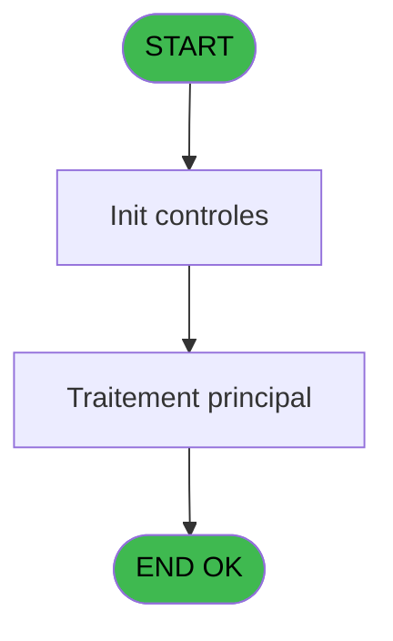
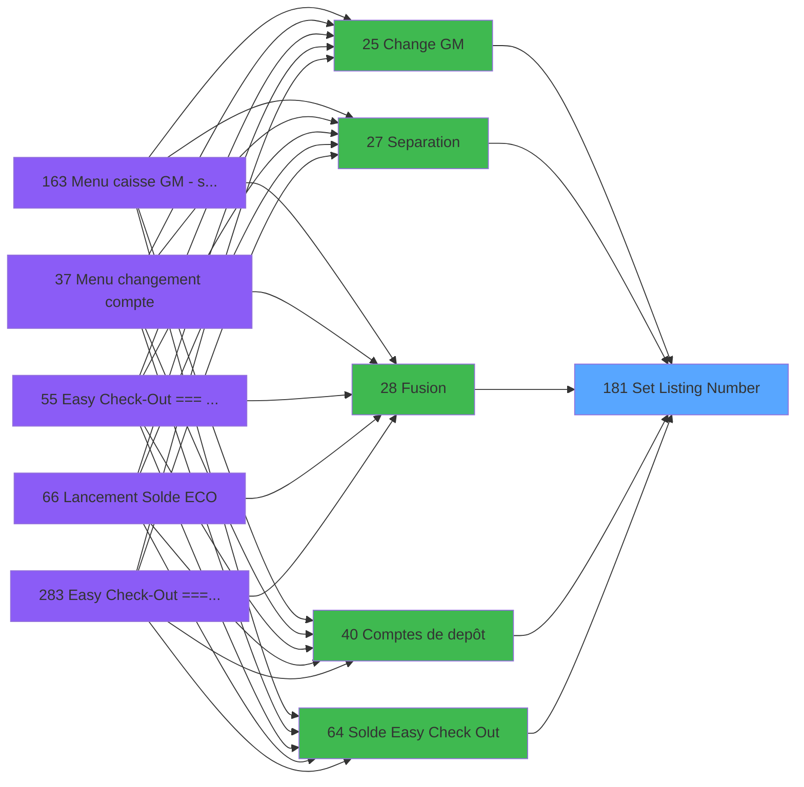

# ADH IDE 181 - Set Listing Number

> **Analyse**: Phases 1-4 2026-02-07 03:52 -> 03:52 (26s) | Assemblage 03:52
> **Pipeline**: V7.2 Enrichi
> **Structure**: 4 onglets (Resume | Ecrans | Donnees | Connexions)

<!-- TAB:Resume -->

## 1. FICHE D'IDENTITE

| Attribut | Valeur |
|----------|--------|
| Projet | ADH |
| IDE Position | 181 |
| Nom Programme | Set Listing Number |
| Fichier source | `Prg_181.xml` |
| Dossier IDE | General |
| Taches | 1 (0 ecrans visibles) |
| Tables modifiees | 0 |
| Programmes appeles | 0 |

## 2. DESCRIPTION FONCTIONNELLE

**Set Listing Number** assure la gestion complete de ce processus, accessible depuis [Extrait de compte (IDE 69)](ADH-IDE-69.md), [Solde compte fin sejour (IDE 193)](ADH-IDE-193.md), [Menu telephone (IDE 217)](ADH-IDE-217.md), [Garantie sur compte (IDE 111)](ADH-IDE-111.md), [Garantie sur compte PMS-584 (IDE 112)](ADH-IDE-112.md), [Versement/Retrait (IDE 174)](ADH-IDE-174.md), [Garantie sur compte (IDE 288)](ADH-IDE-288.md), [Comptes de depôt (IDE 40)](ADH-IDE-40.md), [VAD validés à imprimer (IDE 255)](ADH-IDE-255.md), [Balance Credit de conso (IDE 79)](ADH-IDE-79.md), [Gestion forfait TAI LOCAL (IDE 173)](ADH-IDE-173.md), [Change GM (IDE 25)](ADH-IDE-25.md), [Separation (IDE 27)](ADH-IDE-27.md), [Fusion (IDE 28)](ADH-IDE-28.md), [Solde Easy Check Out (IDE 64)](ADH-IDE-64.md), [Print extrait compte /Nom (IDE 70)](ADH-IDE-70.md), [Print extrait compte /Date (IDE 71)](ADH-IDE-71.md), [Print extrait compte /Cum (IDE 72)](ADH-IDE-72.md), [Print extrait compte /Imp (IDE 73)](ADH-IDE-73.md), [Print extrait compte /Service (IDE 76)](ADH-IDE-76.md).

Le flux de traitement s'organise en **1 blocs fonctionnels** :

- **Traitement** (1 tache) : traitements metier divers

## 3. BLOCS FONCTIONNELS

### 3.1 Traitement (1 tache)

Traitements internes.

---

#### 181 - Set Listing Number

**Role** : Traitement : Set Listing Number.
**Variables liees** : A (Param Listing number)

## 5. REGLES METIER

*(Aucune regle metier identifiee)*

## 6. CONTEXTE

- **Appele par**: [Extrait de compte (IDE 69)](ADH-IDE-69.md), [Solde compte fin sejour (IDE 193)](ADH-IDE-193.md), [Menu telephone (IDE 217)](ADH-IDE-217.md), [Garantie sur compte (IDE 111)](ADH-IDE-111.md), [Garantie sur compte PMS-584 (IDE 112)](ADH-IDE-112.md), [Versement/Retrait (IDE 174)](ADH-IDE-174.md), [Garantie sur compte (IDE 288)](ADH-IDE-288.md), [Comptes de depôt (IDE 40)](ADH-IDE-40.md), [VAD validés à imprimer (IDE 255)](ADH-IDE-255.md), [Balance Credit de conso (IDE 79)](ADH-IDE-79.md), [Gestion forfait TAI LOCAL (IDE 173)](ADH-IDE-173.md), [Change GM (IDE 25)](ADH-IDE-25.md), [Separation (IDE 27)](ADH-IDE-27.md), [Fusion (IDE 28)](ADH-IDE-28.md), [Solde Easy Check Out (IDE 64)](ADH-IDE-64.md), [Print extrait compte /Nom (IDE 70)](ADH-IDE-70.md), [Print extrait compte /Date (IDE 71)](ADH-IDE-71.md), [Print extrait compte /Cum (IDE 72)](ADH-IDE-72.md), [Print extrait compte /Imp (IDE 73)](ADH-IDE-73.md), [Print extrait compte /Service (IDE 76)](ADH-IDE-76.md)
- **Appelle**: 0 programmes | **Tables**: 0 (W:0 R:0 L:0) | **Taches**: 1 | **Expressions**: 5

<!-- TAB:Ecrans -->

## 8. ECRANS

*(Programme sans ecran visible)*

## 9. NAVIGATION

### 9.3 Structure hierarchique (1 tache)

| Position | Tache | Type | Dimensions | Bloc |
|----------|-------|------|------------|------|
| **181.1** | [**Set Listing Number** (181)](#t1) | MDI | - | Traitement |

### 9.4 Algorigramme

> **Legende**: Vert = START/END OK | Rouge = END KO | Bleu = Decisions
> *Algorigramme auto-genere. Utiliser `/algorigramme` pour une synthese metier detaillee.*

<!-- TAB:Donnees -->

## 10. TABLES

### Tables utilisees (0)

| ID | Nom | Description | Type | R | W | L | Usages |
|----|-----|-------------|------|---|---|---|--------|

### Colonnes par table (0 / 0 tables avec colonnes identifiees)

## 11. VARIABLES

*(Programme sans variables locales mappees)*

## 12. EXPRESSIONS

**5 / 5 expressions decodees (100%)**

### 12.1 Repartition par type

| Type | Expressions | Regles |
|------|-------------|--------|
| OTHER | 4 | 0 |
| CONDITION | 1 | 0 |

### 12.2 Expressions cles par type

#### OTHER (4 expressions)

| Type | IDE | Expression | Regle |
|------|-----|------------|-------|
| OTHER | 3 | `SetParam ('CURRENTPRINTERNAME','VOID')` | - |
| OTHER | 4 | `SetParam ('NUMBERCOPIES',0)` | - |
| OTHER | 1 | `SetParam ('CURRENTLISTINGNUM',Param Listing number [A])` | - |
| OTHER | 2 | `SetParam ('CURRENTPRINTERNUM',0)` | - |

#### CONDITION (1 expressions)

| Type | IDE | Expression | Regle |
|------|-----|------------|-------|
| CONDITION | 5 | `GetParam ('SPECIFICPRINT')='VOID'` | - |

<!-- TAB:Connexions -->

## 13. GRAPHE D'APPELS

### 13.1 Chaine depuis Main (Callers)

Main -> ... -> [Extrait de compte (IDE 69)](ADH-IDE-69.md) -> **Set Listing Number (IDE 181)**

Main -> ... -> [Solde compte fin sejour (IDE 193)](ADH-IDE-193.md) -> **Set Listing Number (IDE 181)**

Main -> ... -> [Menu telephone (IDE 217)](ADH-IDE-217.md) -> **Set Listing Number (IDE 181)**

Main -> ... -> [Garantie sur compte (IDE 111)](ADH-IDE-111.md) -> **Set Listing Number (IDE 181)**

Main -> ... -> [Garantie sur compte PMS-584 (IDE 112)](ADH-IDE-112.md) -> **Set Listing Number (IDE 181)**

Main -> ... -> [Versement/Retrait (IDE 174)](ADH-IDE-174.md) -> **Set Listing Number (IDE 181)**

Main -> ... -> [Garantie sur compte (IDE 288)](ADH-IDE-288.md) -> **Set Listing Number (IDE 181)**

Main -> ... -> [Comptes de depôt (IDE 40)](ADH-IDE-40.md) -> **Set Listing Number (IDE 181)**

Main -> ... -> [VAD validés à imprimer (IDE 255)](ADH-IDE-255.md) -> **Set Listing Number (IDE 181)**

Main -> ... -> [Balance Credit de conso (IDE 79)](ADH-IDE-79.md) -> **Set Listing Number (IDE 181)**

Main -> ... -> [Gestion forfait TAI LOCAL (IDE 173)](ADH-IDE-173.md) -> **Set Listing Number (IDE 181)**

Main -> ... -> [Change GM (IDE 25)](ADH-IDE-25.md) -> **Set Listing Number (IDE 181)**

Main -> ... -> [Separation (IDE 27)](ADH-IDE-27.md) -> **Set Listing Number (IDE 181)**

Main -> ... -> [Fusion (IDE 28)](ADH-IDE-28.md) -> **Set Listing Number (IDE 181)**

Main -> ... -> [Solde Easy Check Out (IDE 64)](ADH-IDE-64.md) -> **Set Listing Number (IDE 181)**

Main -> ... -> [Print extrait compte /Nom (IDE 70)](ADH-IDE-70.md) -> **Set Listing Number (IDE 181)**

Main -> ... -> [Print extrait compte /Date (IDE 71)](ADH-IDE-71.md) -> **Set Listing Number (IDE 181)**

Main -> ... -> [Print extrait compte /Cum (IDE 72)](ADH-IDE-72.md) -> **Set Listing Number (IDE 181)**

Main -> ... -> [Print extrait compte /Imp (IDE 73)](ADH-IDE-73.md) -> **Set Listing Number (IDE 181)**

Main -> ... -> [Print extrait compte /Service (IDE 76)](ADH-IDE-76.md) -> **Set Listing Number (IDE 181)**

### 13.2 Callers

| IDE | Nom Programme | Nb Appels |
|-----|---------------|-----------|
| [69](ADH-IDE-69.md) | Extrait de compte | 7 |
| [193](ADH-IDE-193.md) | Solde compte fin sejour | 5 |
| [217](ADH-IDE-217.md) | Menu telephone | 5 |
| [111](ADH-IDE-111.md) | Garantie sur compte | 4 |
| [112](ADH-IDE-112.md) | Garantie sur compte PMS-584 | 4 |
| [174](ADH-IDE-174.md) | Versement/Retrait | 4 |
| [288](ADH-IDE-288.md) | Garantie sur compte | 4 |
| [40](ADH-IDE-40.md) | Comptes de depôt | 3 |
| [255](ADH-IDE-255.md) | VAD validés à imprimer | 3 |
| [79](ADH-IDE-79.md) | Balance Credit de conso | 2 |
| [173](ADH-IDE-173.md) | Gestion forfait TAI LOCAL | 2 |
| [25](ADH-IDE-25.md) | Change GM | 1 |
| [27](ADH-IDE-27.md) | Separation | 1 |
| [28](ADH-IDE-28.md) | Fusion | 1 |
| [64](ADH-IDE-64.md) | Solde Easy Check Out | 1 |
| [70](ADH-IDE-70.md) | Print extrait compte /Nom | 1 |
| [71](ADH-IDE-71.md) | Print extrait compte /Date | 1 |
| [72](ADH-IDE-72.md) | Print extrait compte /Cum | 1 |
| [73](ADH-IDE-73.md) | Print extrait compte /Imp | 1 |
| [76](ADH-IDE-76.md) | Print extrait compte /Service | 1 |

### 13.3 Callees (programmes appeles)

### 13.4 Detail Callees avec contexte

| IDE | Nom Programme | Appels | Contexte |
|-----|---------------|--------|----------|
| - | (aucun) | - | - |

## 14. RECOMMANDATIONS MIGRATION

### 14.1 Profil du programme

| Metrique | Valeur | Impact migration |
|----------|--------|-----------------|
| Lignes de logique | 11 | Programme compact |
| Expressions | 5 | Peu de logique |
| Tables WRITE | 0 | Impact faible |
| Sous-programmes | 0 | Peu de dependances |
| Ecrans visibles | 0 | Ecran unique ou traitement batch |
| Code desactive | 0% (0 / 11) | Code sain |
| Regles metier | 0 | Pas de regle identifiee |

### 14.2 Plan de migration par bloc

#### Traitement (1 tache: 0 ecran, 1 traitement)

- **Strategie** : 1 service(s) backend injectable(s) (Domain Services).
- Decomposer les taches en services unitaires testables.

### 14.3 Dependances critiques

| Dependance | Type | Appels | Impact |
|------------|------|--------|--------|

---
*Spec DETAILED generee par Pipeline V7.2 - 2026-02-07 03:52*
