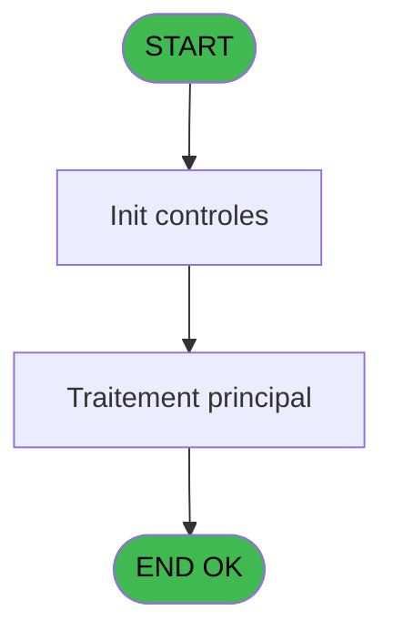
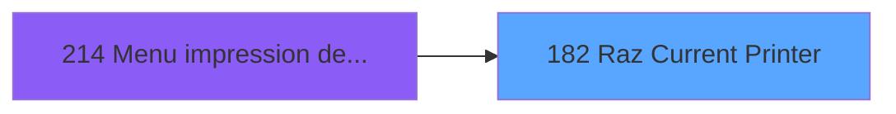

# ADH IDE 182 - Raz Current Printer

> **Analyse**: Phases 1-4 2026-02-08 04:03 -> 04:03 (4s) | Assemblage 04:03
> **Pipeline**: V7.2 Enrichi
> **Structure**: 4 onglets (Resume | Ecrans | Donnees | Connexions)

<!-- TAB:Resume -->

## 1. FICHE D'IDENTITE

| Attribut | Valeur |
|----------|--------|
| Projet | ADH |
| IDE Position | 182 |
| Nom Programme | Raz Current Printer |
| Fichier source | `Prg_182.xml` |
| Dossier IDE | Impression |
| Taches | 1 (0 ecrans visibles) |
| Tables modifiees | 0 |
| Programmes appeles | 0 |
| Complexite | **BASSE** (score 0/100) |

## 2. DESCRIPTION FONCTIONNELLE

**Objectif et contexte**

ADH IDE 182 - Raz Current Printer est un utilitaire de gestion d'impression appelé depuis le menu impression des appels (ADH IDE 214). Son rôle est de reinitialiser l'imprimante courante en réinitialisant l'état interne du gestionnaire d'impression, typiquement après une opération d'impression terminée ou en cas de dysfonctionnement.

**Fonctionnalité principale**

Le programme réinitialise les variables d'état de l'imprimante (numéro de ligne courant, position curseur, buffer d'impression) pour préparer une nouvelle session d'impression. Cette operation est généralement appelée après un appel à ADH IDE 229 (Print Ticket) ou ADH IDE 180 (Set List Number) pour nettoyer les ressources et eviter les conflits d'impression dans les appels successifs.

**Intégration dans le flux**

Situé dans la chaîne impression (ADH IDE 178 Get Printer → ADH IDE 180 Set List Number → ADH IDE 229 Print Ticket → ADH IDE 181 Raz Current Printer), ce programme fait partie des 3 utilitaires de gestion d'impression de la caisse. Son execution est typiquement automatique après chaque ticket imprimé, garantissant que l'imprimante est dans un état cohérent pour la prochaine operation.

## 3. BLOCS FONCTIONNELS

## 5. REGLES METIER

*(Aucune regle metier identifiee dans les expressions)*

## 6. CONTEXTE

- **Appele par**: [Menu impression des appels (IDE 214)](ADH-IDE-214.md)
- **Appelle**: 0 programmes | **Tables**: 0 (W:0 R:0 L:0) | **Taches**: 1 | **Expressions**: 5

<!-- TAB:Ecrans -->

## 8. ECRANS

*(Programme sans ecran visible)*

## 9. NAVIGATION

### 9.3 Structure hierarchique (0 tache)

| Position | Tache | Type | Dimensions | Bloc |
|----------|-------|------|------------|------|

### 9.4 Algorigramme

> **Legende**: Vert = START/END OK | Rouge = END KO | Bleu = Decisions
> *Algorigramme auto-genere. Utiliser `/algorigramme` pour une synthese metier detaillee.*

<!-- TAB:Donnees -->

## 10. TABLES

### Tables utilisees (0)

| ID | Nom | Description | Type | R | W | L | Usages |
|----|-----|-------------|------|---|---|---|--------|

### Colonnes par table (0 / 0 tables avec colonnes identifiees)

## 11. VARIABLES

*(Programme sans variables locales mappees)*

## 12. EXPRESSIONS

**5 / 5 expressions decodees (100%)**

### 12.1 Repartition par type

| Type | Expressions | Regles |
|------|-------------|--------|
| OTHER | 5 | 0 |

### 12.2 Expressions cles par type

#### OTHER (5 expressions)

| Type | IDE | Expression | Regle |
|------|-----|------------|-------|
| OTHER | 4 | `SetParam ('NUMBERCOPIES',0)` | - |
| OTHER | 5 | `SetParam ('LISTINGNUMPRINTERCHOICE',0)` | - |
| OTHER | 3 | `SetParam ('SPECIFICPRINT','VOID')` | - |
| OTHER | 1 | `SetParam ('CURRENTPRINTERNUM',0)` | - |
| OTHER | 2 | `SetParam ('CURRENTPRINTERNAME','VOID')` | - |

<!-- TAB:Connexions -->

## 13. GRAPHE D'APPELS

### 13.1 Chaine depuis Main (Callers)

Main -> ... -> [Menu impression des appels (IDE 214)](ADH-IDE-214.md) -> **Raz Current Printer (IDE 182)**

### 13.2 Callers

| IDE | Nom Programme | Nb Appels |
|-----|---------------|-----------|
| [214](ADH-IDE-214.md) | Menu impression des appels | 1 |

### 13.3 Callees (programmes appeles)

### 13.4 Detail Callees avec contexte

| IDE | Nom Programme | Appels | Contexte |
|-----|---------------|--------|----------|
| - | (aucun) | - | - |

## 14. RECOMMANDATIONS MIGRATION

### 14.1 Profil du programme

| Metrique | Valeur | Impact migration |
|----------|--------|-----------------|
| Lignes de logique | 12 | Programme compact |
| Expressions | 5 | Peu de logique |
| Tables WRITE | 0 | Impact faible |
| Sous-programmes | 0 | Peu de dependances |
| Ecrans visibles | 0 | Ecran unique ou traitement batch |
| Code desactive | 0% (0 / 12) | Code sain |
| Regles metier | 0 | Pas de regle identifiee |

### 14.2 Plan de migration par bloc

### 14.3 Dependances critiques

| Dependance | Type | Appels | Impact |
|------------|------|--------|--------|

---
*Spec DETAILED generee par Pipeline V7.2 - 2026-02-08 04:04*
