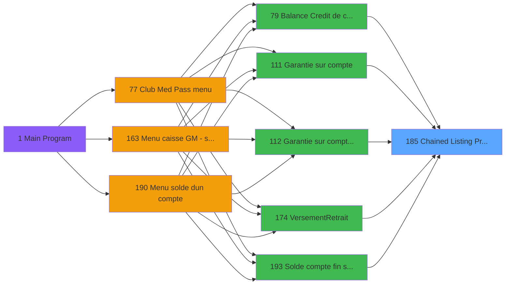
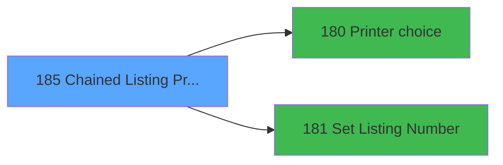

# ADH IDE 185 - Chained Listing Printer Choice

> **Analyse**: Phases 1-4 2026-02-07 03:52 -> 03:53 (28s) | Assemblage 04:05
> **Pipeline**: V7.2 Enrichi
> **Structure**: 4 onglets (Resume | Ecrans | Donnees | Connexions)

<!-- TAB:Resume -->

## 1. FICHE D'IDENTITE

| Attribut | Valeur |
|----------|--------|
| Projet | ADH |
| IDE Position | 185 |
| Nom Programme | Chained Listing Printer Choice |
| Fichier source | `Prg_185.xml` |
| Dossier IDE | Impression |
| Taches | 3 (0 ecrans visibles) |
| Tables modifiees | 1 |
| Programmes appeles | 2 |
| Complexite | **BASSE** (score 12/100) |

## 2. DESCRIPTION FONCTIONNELLE

ADH IDE 185 - Chained Listing Printer Choice gère la sélection d'une imprimante enchaînée pour l'impression de listes. Ce programme est appelé par plusieurs modules critiques (garanties, solde de compte, balance crédit, versements) et joue un rôle de coordinateur dans le flux d'impression. Il enchaîne deux opérations principales via CallTask : récupérer le choix d'imprimante via IDE 180 (Printer choice) puis configurer le numéro de listing via IDE 181 (Set Listing Number).

La logique du programme repose sur trois tâches. La première charge l'imprimante courante depuis la table tempo_comptage_bateau. La deuxième tâche appelle le programme de sélection d'imprimante (IDE 180) qui retourne le code de l'appareil choisi. La troisième tâche définit le numéro de listing suivant (IDE 181) et met à jour la table tempo_comptage_bateau avec les paramètres de l'imprimante sélectionnée.

Ce programme illustre un pattern classique Magic de chaînage de sous-programmes : il agit comme orchestrateur entre l'interface de choix d'imprimante et la configuration du numéroteur de listings, permettant aux modules appelants de déléguer la complexité de la gestion des imprimantes enchaînées. Les informations d'imprimante sont persistées dans tempo_comptage_bateau pour être accessibles aux étapes ultérieures du processus d'impression.

## 3. BLOCS FONCTIONNELS

### 3.1 Impression (2 taches)

Generation des documents et tickets.

---

#### <a id="t1"></a>T1 - Chained Listing Printer Choice

**Role** : Generation du document : Chained Listing Printer Choice.
**Variables liees** : A (P Listing Nombre), B (P Listing 01), C (P Listing 02), D (P Listing 03), E (P Listing 04)
**Delegue a** : [Printer choice (IDE 180)](ADH-IDE-180.md)

---

#### <a id="t3"></a>T3 - Load current printer

**Role** : Generation du document : Load current printer.
**Delegue a** : [Printer choice (IDE 180)](ADH-IDE-180.md)


### 3.2 Traitement (1 tache)

Traitements internes.

---

#### <a id="t2"></a>T2 - Update File

**Role** : Traitement : Update File.
**Delegue a** : [Set Listing Number (IDE 181)](ADH-IDE-181.md)


## 5. REGLES METIER

*(Programme d'impression - logique technique sans conditions metier)*

## 6. CONTEXTE

- **Appele par**: [Garantie sur compte (IDE 111)](ADH-IDE-111.md), [Garantie sur compte PMS-584 (IDE 112)](ADH-IDE-112.md), [Garantie sur compte (IDE 288)](ADH-IDE-288.md), [Solde compte fin sejour (IDE 193)](ADH-IDE-193.md), [Balance Credit de conso (IDE 79)](ADH-IDE-79.md), [Versement/Retrait (IDE 174)](ADH-IDE-174.md)
- **Appelle**: 2 programmes | **Tables**: 1 (W:1 R:1 L:0) | **Taches**: 3 | **Expressions**: 3

<!-- TAB:Ecrans -->

## 8. ECRANS

*(Programme sans ecran visible)*

## 9. NAVIGATION

### 9.3 Structure hierarchique (3 taches)

| Position | Tache | Type | Dimensions | Bloc |
|----------|-------|------|------------|------|
| **185.1** | [**Chained Listing Printer Choice** (T1)](#t1) | MDI | - | Impression |
| 185.1.1 | [Load current printer (T3)](#t3) | MDI | - | |
| **185.2** | [**Update File** (T2)](#t2) | MDI | - | Traitement |

### 9.4 Algorigramme

```mermaid
flowchart TD
    START([START])
    INIT[Init controles]
    START --> INIT
    B1[Impression (2t)]
    INIT --> B1
    B2[Traitement (1t)]
    B1 --> B2
    WRITE[MAJ 1 tables]
    B2 --> WRITE
    ENDOK([END OK])
    WRITE --> ENDOK

    style START fill:#3fb950,color:#000
    style ENDOK fill:#3fb950,color:#000
    style WRITE fill:#ffeb3b,color:#000
```

> **Legende**: Vert = START/END OK | Rouge = END KO | Bleu = Decisions
> *Algorigramme genere depuis les expressions CONDITION. Utiliser `/algorigramme` pour une synthese metier detaillee.*

<!-- TAB:Donnees -->

## 10. TABLES

### Tables utilisees (1)

| ID | Nom | Description | Type | R | W | L | Usages |
|----|-----|-------------|------|---|---|---|--------|
| 581 | tempo_comptage_bateau | Table temporaire ecran | TMP | R | **W** |   | 2 |

### Colonnes par table (0 / 1 tables avec colonnes identifiees)

<details>
<summary>Table 581 - tempo_comptage_bateau (R/**W**) - 2 usages</summary>

*Table utilisee uniquement en Link ou aucune colonne Real identifiee dans le DataView.*

</details>

## 11. VARIABLES

### 11.1 Parametres entrants (6)

Variables recues du programme appelant ([Garantie sur compte (IDE 111)](ADH-IDE-111.md)).

| Lettre | Nom | Type | Usage dans |
|--------|-----|------|-----------|
| A | P Listing Nombre | Numeric | [T1](#t1) |
| B | P Listing 01 | Numeric | - |
| C | P Listing 02 | Numeric | - |
| D | P Listing 03 | Numeric | - |
| E | P Listing 04 | Numeric | - |
| F | P Listing 05 | Numeric | - |

### 11.2 Autres (1)

Variables diverses.

| Lettre | Nom | Type | Usage dans |
|--------|-----|------|-----------|
| G | ListingToDo | Numeric | 1x refs |

## 12. EXPRESSIONS

**3 / 3 expressions decodees (100%)**

### 12.1 Repartition par type

| Type | Expressions | Regles |
|------|-------------|--------|
| CALCULATION | 1 | 0 |
| CONDITION | 1 | 0 |
| OTHER | 1 | 0 |

### 12.2 Expressions cles par type

#### CALCULATION (1 expressions)

| Type | IDE | Expression | Regle |
|------|-----|------------|-------|
| CALCULATION | 3 | `VarSet ('ListingToDo [G]'VAR,VarCurr ('P Listing Nombre [A]'VAR+Counter (0)))` | - |

#### CONDITION (1 expressions)

| Type | IDE | Expression | Regle |
|------|-----|------------|-------|
| CONDITION | 1 | `Counter (0)>=P Listing Nombre [A]` | - |

#### OTHER (1 expressions)

| Type | IDE | Expression | Regle |
|------|-----|------------|-------|
| OTHER | 2 | `DbDel ('{581,4}'DSOURCE,'')` | - |

<!-- TAB:Connexions -->

## 13. GRAPHE D'APPELS

### 13.1 Chaine depuis Main (Callers)

Main -> ... -> [Garantie sur compte (IDE 111)](ADH-IDE-111.md) -> **Chained Listing Printer Choice (IDE 185)**

Main -> ... -> [Garantie sur compte PMS-584 (IDE 112)](ADH-IDE-112.md) -> **Chained Listing Printer Choice (IDE 185)**

Main -> ... -> [Garantie sur compte (IDE 288)](ADH-IDE-288.md) -> **Chained Listing Printer Choice (IDE 185)**

Main -> ... -> [Solde compte fin sejour (IDE 193)](ADH-IDE-193.md) -> **Chained Listing Printer Choice (IDE 185)**

Main -> ... -> [Balance Credit de conso (IDE 79)](ADH-IDE-79.md) -> **Chained Listing Printer Choice (IDE 185)**

Main -> ... -> [Versement/Retrait (IDE 174)](ADH-IDE-174.md) -> **Chained Listing Printer Choice (IDE 185)**



### 13.2 Callers

| IDE | Nom Programme | Nb Appels |
|-----|---------------|-----------|
| [111](ADH-IDE-111.md) | Garantie sur compte | 4 |
| [112](ADH-IDE-112.md) | Garantie sur compte PMS-584 | 4 |
| [288](ADH-IDE-288.md) | Garantie sur compte | 4 |
| [193](ADH-IDE-193.md) | Solde compte fin sejour | 2 |
| [79](ADH-IDE-79.md) | Balance Credit de conso | 1 |
| [174](ADH-IDE-174.md) | Versement/Retrait | 1 |

### 13.3 Callees (programmes appeles)



### 13.4 Detail Callees avec contexte

| IDE | Nom Programme | Appels | Contexte |
|-----|---------------|--------|----------|
| [180](ADH-IDE-180.md) | Printer choice | 1 | Impression ticket/document |
| [181](ADH-IDE-181.md) | Set Listing Number | 1 | Configuration impression |

## 14. RECOMMANDATIONS MIGRATION

### 14.1 Profil du programme

| Metrique | Valeur | Impact migration |
|----------|--------|-----------------|
| Lignes de logique | 40 | Programme compact |
| Expressions | 3 | Peu de logique |
| Tables WRITE | 1 | Impact faible |
| Sous-programmes | 2 | Peu de dependances |
| Ecrans visibles | 0 | Ecran unique ou traitement batch |
| Code desactive | 0% (0 / 40) | Code sain |
| Regles metier | 0 | Pas de regle identifiee |

### 14.2 Plan de migration par bloc

#### Impression (2 taches: 0 ecran, 2 traitements)

- **Strategie** : Templates HTML -> PDF via wkhtmltopdf ou Puppeteer.
- `PrintService` injectable avec choix imprimante

#### Traitement (1 tache: 0 ecran, 1 traitement)

- **Strategie** : 1 service(s) backend injectable(s) (Domain Services).
- 2 sous-programme(s) a migrer ou a reutiliser depuis les services existants.
- Decomposer les taches en services unitaires testables.

### 14.3 Dependances critiques

| Dependance | Type | Appels | Impact |
|------------|------|--------|--------|
| tempo_comptage_bateau | Table WRITE (Temp) | 1x | Schema + repository |
| [Set Listing Number (IDE 181)](ADH-IDE-181.md) | Sous-programme | 1x | Normale - Configuration impression |
| [Printer choice (IDE 180)](ADH-IDE-180.md) | Sous-programme | 1x | Normale - Impression ticket/document |

---
*Spec DETAILED generee par Pipeline V7.2 - 2026-02-08 04:05*
