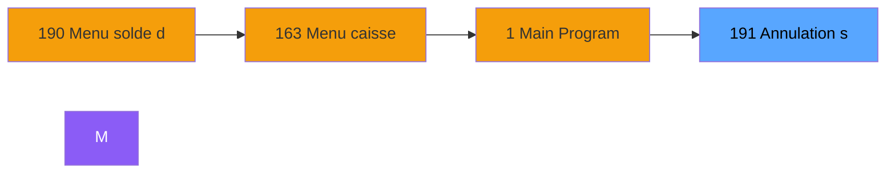
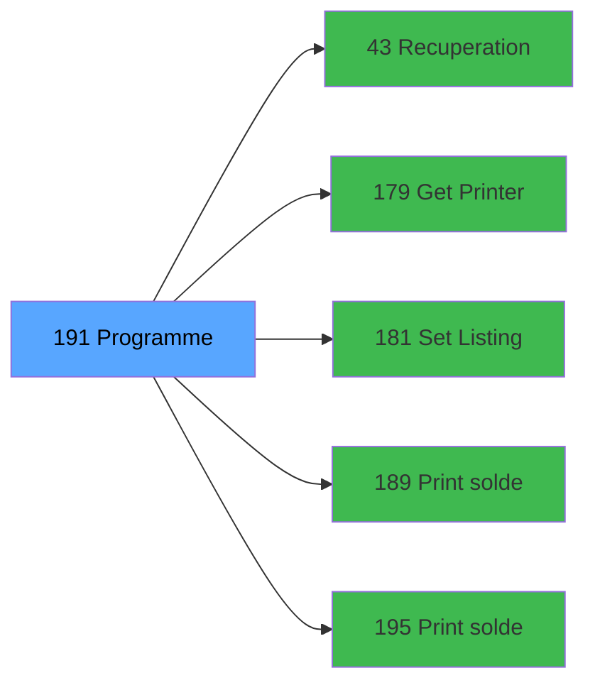

# ADH IDE 191 - Annulation solde

> **Version spec**: 3.5
> **Analyse**: 2026-01-27 17:57
> **Source**: `Prg_XXX.xml`

---

<!-- TAB:Fonctionnel -->

## SPECIFICATION FONCTIONNELLE

### 1.1 Objectif metier

| Element | Description |
|---------|-------------|
| **Qui** | Operateur |
| **Quoi** | Annulation solde
 |
| **Pourquoi** | A documenter |
| **Declencheur** | A identifier |

### 1.2 Regles metier

| Code | Regle | Condition |
|------|-------|-----------|
| RM-001 | A documenter | - |

### 1.3 Flux utilisateur

1. Demarrage programme
2. Traitement principal
3. Fin programme

### 1.4 Cas d'erreur

| Erreur | Comportement |
|--------|--------------|
| - | A documenter |

---

<!-- TAB:Technique -->

## SPECIFICATION TECHNIQUE

### 2.1 Identification

| Attribut | Valeur |
|----------|--------|
| **Format IDE** | ADH IDE 191 |
| **Description** | Annulation solde
 |
| **Module** | ADH |

### 2.2 Tables

| # | Nom logique | Nom physique | Acces | Usage |
|---|-------------|--------------|-------|-------|
| 30 | gm-recherche_____gmr | `cafil008_dat` | L | 1x |
| 31 | gm-complet_______gmc | `cafil009_dat` | R | 1x |
| 40 | comptable________cte | `cafil018_dat` | L | 2x |
| 40 | comptable________cte | `cafil018_dat` | R | 2x |
| 44 | change___________chg | `cafil022_dat` | L | 1x |
| 44 | change___________chg | `cafil022_dat` | **W** | 2x |
| 47 | compte_gm________cgm | `cafil025_dat` | L | 2x |
| 68 | compteurs________cpt | `cafil046_dat` | L | 4x |
| 70 | date_comptable___dat | `cafil048_dat` | L | 1x |
| 89 | moyen_paiement___mop | `cafil067_dat` | L | 5x |
| 140 | moyen_paiement___mop | `cafil118_dat` | L | 2x |
| 268 | cc_total_par_type | `ccpartyp` | **W** | 2x |
| 271 | cc_total | `cctotal` | L | 2x |
| 272 | cc_type_detail | `cctypdet` | L | 2x |
| 517 | pv_palmtemp | `%club_user%_pv_palmtmp_dat` | L | 2x |
| 517 | pv_palmtemp | `%club_user%_pv_palmtmp_dat` | R | 2x |
| 582 | tempo_comptage_nation | `%club_user%tempocomptagen_dat` | L | 2x |
| 582 | tempo_comptage_nation | `%club_user%tempocomptagen_dat` | **W** | 2x |
| 945 | Table_945 | - | **W** | 4x |
### 2.3 Parametres d'entree

| Variable | Nom | Type | Picture |
|----------|-----|------|---------|
| - | Aucun parametre | - | - |
### 2.4 Algorigramme

### 2.5 Expressions cles

| IDE | Expression | Commentaire |
|-----|------------|-------------|
| 1 | `{0,1}` | - |
| 2 | `{0,2}` | - |
| 3 | `{0,4}` | - |
| 4 | `Date ()` | - |
| 5 | `Time ()` | - |
| 6 | `DbDel ('{517,4}'DSOURCE,'')` | - |
| 7 | `{0,19}` | - |
| 8 | `{32768,23} AND {32768,24} AND {0,27}<>0 AND {0,...` | - |
| 9 | `'TRUE'LOG` | - |
| 10 | `{32768,23} AND {32768,24} AND {0,27}<>0 AND {0,...` | - |
| 11 | `MlsTrans('Erreur transaction TPE : ')&Trim({0,33})` | - |
| 12 | `NOT({0,34})` | - |
| 13 | `NOT ({0,20})` | - |
| 14 | `41` | - |
| 15 | `'FIN'` | - |
| 16 | `'O'` | - |
| 17 | `IF ({0,10}='U','N','O')` | - |
| 18 | `DbDel ('{582,4}'DSOURCE,'')` | - |
| 19 | `NOT({32768,51})` | - |
| 20 | `{32768,51}` | - |

> **Total**: 25 expressions (affichees: 20)
### 2.6 Variables importantes

### 2.7 Statistiques

| Metrique | Valeur |
|----------|--------|
| **Taches** | 15 |
| **Lignes logique** | 805 |
| **Lignes desactivees** | 0 |
---

<!-- TAB:Cartographie -->

## CARTOGRAPHIE APPLICATIVE

### 3.1 Chaine d'appels depuis Main

### 3.2 Callers directs

| IDE | Programme | Nb appels |
|-----|-----------|-----------|
| 190 | Menu solde d'un compte | 1 |
### 3.3 Callees

| Niv | IDE | Programme | Nb appels |
|-----|-----|-----------|-----------|
| 1 | 43 | Recuperation du titre | 1 |
| 1 | 179 | Get Printer | 1 |
| 1 | 181 | Set Listing Number | 1 |
| 1 | 189 | Print solde compte | 1 |
| 1 | 195 | Print solde compte TIK V1 | 1 |
### 3.4 Verification orphelin

| Critere | Resultat |
|---------|----------|
| Callers actifs | A verifier |
| **Conclusion** | A analyser |

---

## HISTORIQUE

| Date | Action | Auteur |
|------|--------|--------|
| 2026-01-27 20:22 | **DATA V2** - Tables reelles, Expressions, Stats, CallChain | Script |
| 2026-01-27 19:48 | **DATA POPULATED** - Tables, Callgraph (25 expr) | Script |
| 2026-01-27 17:57 | **Upgrade V3.5** - TAB markers, Mermaid | Claude |

---

*Specification V3.5 - Format avec TAB markers et Mermaid*
