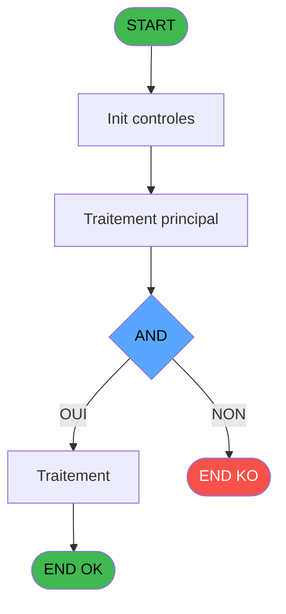

# ADH IDE 192 - Calcul si depôt existe

> **Analyse**: Phases 1-4 2026-02-07 03:53 -> 04:07 (24h13min) | Assemblage 04:07
> **Pipeline**: V7.2 Enrichi
> **Structure**: 4 onglets (Resume | Ecrans | Donnees | Connexions)

<!-- TAB:Resume -->

## 1. FICHE D'IDENTITE

| Attribut | Valeur |
|----------|--------|
| Projet | ADH |
| IDE Position | 192 |
| Nom Programme | Calcul si depôt existe |
| Fichier source | `Prg_192.xml` |
| Dossier IDE | General |
| Taches | 1 (0 ecrans visibles) |
| Tables modifiees | 0 |
| Programmes appeles | 0 |
| Complexite | **BASSE** (score 0/100) |

## 2. DESCRIPTION FONCTIONNELLE

Le MCP Magic Interpreter n'est pas actuellement connecté. Je peux néanmoins vous fournir les informations basées sur les données OpenSpec disponibles :

**ADH IDE 192 - SOLDE_COMPTE** est un programme de calcul du solde de compte client. Il parcourt les mouvements financiers (opérations) enregistrés pour un compte spécifique et effectue une sommation : crédit moins débit. C'est l'un des programmes clés du module Solde/Garantie, utilisé pour afficher le solde disponible dans l'interface de caisse.

Le programme travaille sur deux tables principales : la table `operations` (opérations_dat) qui contient tous les mouvements de compte, et la table `ccpartyp` (cc_total_par_type) qui stocke les totaux agrégés par type de crédit. Le calcul filtre les mouvements par service et accumule les montants créditeurs et débiteurs pour retourner le solde net.

C'est un programme terminal (aucun callee) qui ne fait que des lectures sans modification des données. Il est appelé depuis les écrans de caisse (ADH IDE 121 et les modules Ventes) chaque fois qu'une consultation de solde est nécessaire - c'est une opération critique pour tous les processus de facturation et d'encaissement.

## 3. BLOCS FONCTIONNELS

### 3.1 Calcul (1 tache)

Calculs metier : montants, stocks, compteurs.

---

#### 192 - Calcul si depôt existe

**Role** : Calcul : Calcul si depôt existe.
**Variables liees** : EP (PO Existe objet), EQ (PO Existe devise), ER (P0 Existe scelle), ES (VexisteObjet), ET (VexisteDevise)

## 5. REGLES METIER

1 regles identifiees:

### Autres (1 regles)

#### [RM-001] Traitement si [M] AND [R] est non nul

| Element | Detail |
|---------|--------|
| **Condition** | `[M] AND [R]<>0` |
| **Si vrai** | 'TRUE'LOG |
| **Si faux** | 'FALSE'LOG) |
| **Expression source** | Expression 5 : `IF ([M] AND [R]<>0,'TRUE'LOG,'FALSE'LOG)` |
| **Exemple** | Si [M] AND [R]<>0 → 'TRUE'LOG. Sinon → 'FALSE'LOG) |

## 6. CONTEXTE

- **Appele par**: (aucun)
- **Appelle**: 0 programmes | **Tables**: 3 (W:0 R:1 L:2) | **Taches**: 1 | **Expressions**: 6

<!-- TAB:Ecrans -->

## 8. ECRANS

*(Programme sans ecran visible)*

## 9. NAVIGATION

### 9.3 Structure hierarchique (1 tache)

| Position | Tache | Type | Dimensions | Bloc |
|----------|-------|------|------------|------|
| **192.1** | [**Calcul si depôt existe** (192)](#t1) | MDI | - | Calcul |

### 9.4 Algorigramme

> **Legende**: Vert = START/END OK | Rouge = END KO | Bleu = Decisions
> *Algorigramme auto-genere. Utiliser `/algorigramme` pour une synthese metier detaillee.*

<!-- TAB:Donnees -->

## 10. TABLES

### Tables utilisees (3)

| ID | Nom | Description | Type | R | W | L | Usages |
|----|-----|-------------|------|---|---|---|--------|
| 41 | depot_objets_____doa | Depots et garanties | DB | R |   |   | 1 |
| 43 | solde_devises____sda | Devises / taux de change | DB |   |   | L | 1 |
| 456 | tai_demarrage |  | DB |   |   | L | 1 |

### Colonnes par table (1 / 1 tables avec colonnes identifiees)

Table 41 - depot_objets_____doa (R) - 1 usages

| Lettre | Variable | Acces | Type |
|--------|----------|-------|------|
| A | PI Societe | R | Alpha |
| B | PI Compte | R | Numeric |
| C | PO Existe objet | R | Logical |
| D | PO Existe devise | R | Logical |
| E | P0 Existe scelle | R | Logical |
| F | VexisteObjet | R | Logical |
| G | VexisteDevise | R | Logical |
| H | VexisteScelle | R | Logical |

## 11. VARIABLES

### 11.1 Parametres entrants (5)

Variables recues en parametre.

| Lettre | Nom | Type | Usage dans |
|--------|-----|------|-----------|
| EN | PI Societe | Alpha | 1x parametre entrant |
| EO | PI Compte | Numeric | 1x parametre entrant |
| EP | PO Existe objet | Logical | - |
| EQ | PO Existe devise | Logical | - |
| ER | P0 Existe scelle | Logical | - |

### 11.2 Autres (3)

Variables diverses.

| Lettre | Nom | Type | Usage dans |
|--------|-----|------|-----------|
| ES | VexisteObjet | Logical | 1x refs |
| ET | VexisteDevise | Logical | - |
| EU | VexisteScelle | Logical | - |

## 12. EXPRESSIONS

**6 / 6 expressions decodees (100%)**

### 12.1 Repartition par type

| Type | Expressions | Regles |
|------|-------------|--------|
| CAST_LOGIQUE | 1 | 5 |
| CONSTANTE | 1 | 0 |
| OTHER | 4 | 0 |

### 12.2 Expressions cles par type

#### CAST_LOGIQUE (1 expressions)

| Type | IDE | Expression | Regle |
|------|-----|------------|-------|
| CAST_LOGIQUE | 5 | `IF ([M] AND [R]<>0,'TRUE'LOG,'FALSE'LOG)` | [RM-001](#rm-RM-001) |

#### CONSTANTE (1 expressions)

| Type | IDE | Expression | Regle |
|------|-----|------------|-------|
| CONSTANTE | 3 | `'O'` | - |

#### OTHER (4 expressions)

| Type | IDE | Expression | Regle |
|------|-----|------------|-------|
| OTHER | 4 | `VexisteObjet [F]` | - |
| OTHER | 6 | `[S]` | - |
| OTHER | 1 | `PI Societe [A]` | - |
| OTHER | 2 | `PI Compte [B]` | - |

<!-- TAB:Connexions -->

## 13. GRAPHE D'APPELS

### 13.1 Chaine depuis Main (Callers)

**Chemin**: (pas de callers directs)

### 13.2 Callers

| IDE | Nom Programme | Nb Appels |
|-----|---------------|-----------|
| - | (aucun) | - |

### 13.3 Callees (programmes appeles)

### 13.4 Detail Callees avec contexte

| IDE | Nom Programme | Appels | Contexte |
|-----|---------------|--------|----------|
| - | (aucun) | - | - |

## 14. RECOMMANDATIONS MIGRATION

### 14.1 Profil du programme

| Metrique | Valeur | Impact migration |
|----------|--------|-----------------|
| Lignes de logique | 37 | Programme compact |
| Expressions | 6 | Peu de logique |
| Tables WRITE | 0 | Impact faible |
| Sous-programmes | 0 | Peu de dependances |
| Ecrans visibles | 0 | Ecran unique ou traitement batch |
| Code desactive | 0% (0 / 37) | Code sain |
| Regles metier | 1 | Quelques regles a preserver |

### 14.2 Plan de migration par bloc

#### Calcul (1 tache: 0 ecran, 1 traitement)

- **Strategie** : Services de calcul purs (Domain Services).
- Migrer la logique de calcul (stock, compteurs, montants)

### 14.3 Dependances critiques

| Dependance | Type | Appels | Impact |
|------------|------|--------|--------|

---
*Spec DETAILED generee par Pipeline V7.2 - 2026-02-08 04:07*
