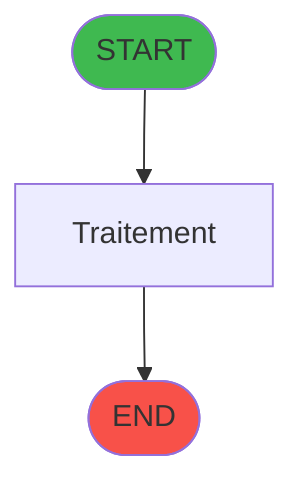
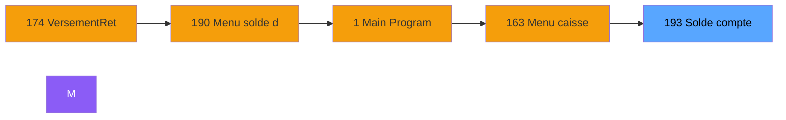
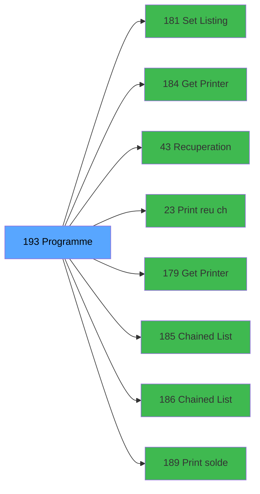

# ADH IDE 193 - Solde compte fin sejour

> **Version spec**: 3.5
> **Analyse**: 2026-01-27 17:57
> **Source**: `Prg_XXX.xml`

---

<!-- TAB:Fonctionnel -->

## SPECIFICATION FONCTIONNELLE

### 1.1 Objectif metier

| Element | Description |
|---------|-------------|
| **Qui** | Operateur |
| **Quoi** | Solde compte fin sejour
 |
| **Pourquoi** | A documenter |
| **Declencheur** | A identifier |

### 1.2 Regles metier

| Code | Regle | Condition |
|------|-------|-----------|
| RM-001 | A documenter | - |

### 1.3 Flux utilisateur

1. Demarrage programme
2. Traitement principal
3. Fin programme

### 1.4 Cas d'erreur

| Erreur | Comportement |
|--------|--------------|
| - | A documenter |

---

<!-- TAB:Technique -->

## SPECIFICATION TECHNIQUE

### 2.1 Identification

| Attribut | Valeur |
|----------|--------|
| **Format IDE** | ADH IDE 193 |
| **Description** | Solde compte fin sejour
 |
| **Module** | ADH |

### 2.2 Tables

| # | Nom logique | Nom physique | Acces | Usage |
|---|-------------|--------------|-------|-------|
| 23 | reseau_cloture___rec | `cafil001_dat` | R | 1x |
| 23 | reseau_cloture___rec | `cafil001_dat` | **W** | 4x |
| 30 | gm-recherche_____gmr | `cafil008_dat` | L | 1x |
| 31 | gm-complet_______gmc | `cafil009_dat` | R | 2x |
| 34 | hebergement______heb | `cafil012_dat` | **W** | 1x |
| 39 | depot_garantie___dga | `cafil017_dat` | L | 4x |
| 40 | comptable________cte | `cafil018_dat` | R | 5x |
| 40 | comptable________cte | `cafil018_dat` | **W** | 14x |
| 44 | change___________chg | `cafil022_dat` | **W** | 4x |
| 47 | compte_gm________cgm | `cafil025_dat` | L | 1x |
| 47 | compte_gm________cgm | `cafil025_dat` | **W** | 6x |
| 48 | lignes_de_solde__sld | `cafil026_dat` | R | 1x |
| 48 | lignes_de_solde__sld | `cafil026_dat` | **W** | 2x |
| 50 | moyens_reglement_mor | `cafil028_dat` | L | 1x |
| 53 | ligne_telephone__lgn | `cafil031_dat` | **W** | 1x |
| 66 | imputations______imp | `cafil044_dat` | L | 1x |
| 66 | imputations______imp | `cafil044_dat` | R | 1x |
| 68 | compteurs________cpt | `cafil046_dat` | **W** | 12x |
| 70 | date_comptable___dat | `cafil048_dat` | L | 1x |
| 70 | date_comptable___dat | `cafil048_dat` | R | 3x |
| 75 | commande_autocom_cot | `cafil053_dat` | **W** | 1x |
| 77 | articles_________art | `cafil055_dat` | L | 1x |
| 80 | codes_autocom____aut | `cafil058_dat` | R | 2x |
| 80 | codes_autocom____aut | `cafil058_dat` | **W** | 2x |
| 87 | sda_telephone____sda | `cafil065_dat` | L | 2x |
| 87 | sda_telephone____sda | `cafil065_dat` | **W** | 2x |
| 89 | moyen_paiement___mop | `cafil067_dat` | L | 3x |
| 124 | type_taux_change | `cafil102_dat` | L | 1x |
| 136 | fichier_echanges | `cafil114_dat` | **W** | 2x |
| 139 | moyens_reglement_mor | `cafil117_dat` | L | 1x |
| 141 | devises__________dev | `cafil119_dat` | R | 1x |
| 148 | lignes_de_solde__sld | `cafil126_dat` | L | 1x |
| 148 | lignes_de_solde__sld | `cafil126_dat` | **W** | 1x |
| 151 | nb_code__poste | `cafil129_dat` | **W** | 2x |
| 268 | cc_total_par_type | `ccpartyp` | R | 1x |
| 268 | cc_total_par_type | `ccpartyp` | **W** | 1x |
| 312 | ez_card | `ezcard` | R | 1x |
| 382 | pv_discount_reasons | `pv_discountlist_dat` | L | 1x |
| 382 | pv_discount_reasons | `pv_discountlist_dat` | R | 1x |
| 400 | pv_cust_rentals | `pv_rentals_dat` | L | 1x |
| 403 | pv_sellers | `pv_sellers_dat` | L | 1x |
| 404 | pv_sellers_by_week | `pv_sellersweek_dat` | L | 1x |
| 474 | comptage_caisse_devise | `%club_user%_caisse_compcais_devise` | L | 1x |
| 474 | comptage_caisse_devise | `%club_user%_caisse_compcais_devise` | **W** | 2x |
| 728 | arc_cc_total | `arc_cctotal` | L | 1x |
| 945 | Table_945 | - | **W** | 4x |
| 979 | Table_979 | - | L | 1x |
| 979 | Table_979 | - | R | 1x |
| 979 | Table_979 | - | **W** | 1x |
### 2.3 Parametres d'entree

| Variable | Nom | Type | Picture |
|----------|-----|------|---------|
| - | Aucun parametre | - | - |
### 2.4 Algorigramme

### 2.5 Expressions cles

| IDE | Expression | Commentaire |
|-----|------------|-------------|
| 1 | `SetCrsr (1)` | - |
| 2 | `DbDel ('{979,4}'DSOURCE,'')` | - |
| 3 | `{0,49} > 0 AND {32768,60} AND NOT({0,23})` | - |
| 4 | `'FALSE'LOG` | - |
| 5 | `SetCrsr (2)` | - |
| 6 | `{0,26}<>'F'` | - |
| 7 | `{0,26}='S'` | - |
| 8 | `{0,26}='S' AND {0,7}='O'` | - |
| 9 | `{0,26}='S' AND {0,14}='O' AND {0,15}='N'` | - |
| 10 | `{0,26}='S' AND {0,14}='O' AND {0,15}='O'` | - |
| 11 | `{0,26}='T'` | - |
| 12 | `{0,26}='U'` | - |
| 13 | `{0,26}='U' AND {0,27}='O'` | - |
| 14 | `{0,26}='U' AND {0,29}='O' AND {0,18}<>'CLUB'` | - |
| 15 | `{0,26}='U' AND {0,29}='O' AND {0,18}='CLUB'` | - |
| 16 | `{0,26}='U' AND {0,31}='O'` | - |
| 17 | `{0,26}='A'` | - |
| 18 | `{0,7}='O'` | - |
| 19 | `{0,14}='O'` | - |
| 20 | `{0,7}='O' AND {0,14}='O'` | - |

> **Total**: 53 expressions (affichees: 20)
### 2.6 Variables importantes

### 2.7 Statistiques

| Metrique | Valeur |
|----------|--------|
| **Taches** | 89 |
| **Lignes logique** | 2272 |
| **Lignes desactivees** | 0 |
---

<!-- TAB:Cartographie -->

## CARTOGRAPHIE APPLICATIVE

### 3.1 Chaine d'appels depuis Main

### 3.2 Callers directs

| IDE | Programme | Nb appels |
|-----|-----------|-----------|
| 174 | Versement/Retrait | 2 |
| 190 | Menu solde d'un compte | 1 |
### 3.3 Callees

| Niv | IDE | Programme | Nb appels |
|-----|-----|-----------|-----------|
| 1 | 181 | Set Listing Number | 5 |
| 1 | 184 | Get Printer for chained list | 4 |
| 1 | 43 | Recuperation du titre | 3 |
| 1 | 23 | Print reçu change achat | 2 |
| 1 | 179 | Get Printer | 2 |
| 1 | 185 | Chained Listing Printer Choice | 2 |
| 1 | 186 | Chained Listing Load Default | 2 |
| 1 | 189 | Print solde compte | 2 |
| 1 | 195 | Print solde compte TIK V1 | 2 |
| 1 | 83 | Deactivate all cards | 1 |
| 1 | 97 | Factures (Tble Compta&Vent) V3 | 1 |
| 1 | 182 | Raz Current Printer | 1 |
| 1 | 188 | Print solde garantie | 1 |
| 1 | 192 | Calcul si depôt existe | 1 |
| 1 | 194 | Update CC type | 1 |
| 1 | 196 | Choix Articles Gift Pass | 1 |
| 1 | 259 | Zoom modes de paiement | 1 |
| 1 | 261 | Zoom des types de taux | 1 |
| 1 | 264 | Zoom devise solde compte | 1 |
| 1 | 270 | Zoom sur modes de paiement a/v | 1 |
### 3.4 Verification orphelin

| Critere | Resultat |
|---------|----------|
| Callers actifs | A verifier |
| **Conclusion** | A analyser |

---

## HISTORIQUE

| Date | Action | Auteur |
|------|--------|--------|
| 2026-01-27 20:22 | **DATA V2** - Tables reelles, Expressions, Stats, CallChain | Script |
| 2026-01-27 19:48 | **DATA POPULATED** - Tables, Callgraph (53 expr) | Script |
| 2026-01-27 17:57 | **Upgrade V3.5** - TAB markers, Mermaid | Claude |

---

*Specification V3.5 - Format avec TAB markers et Mermaid*
