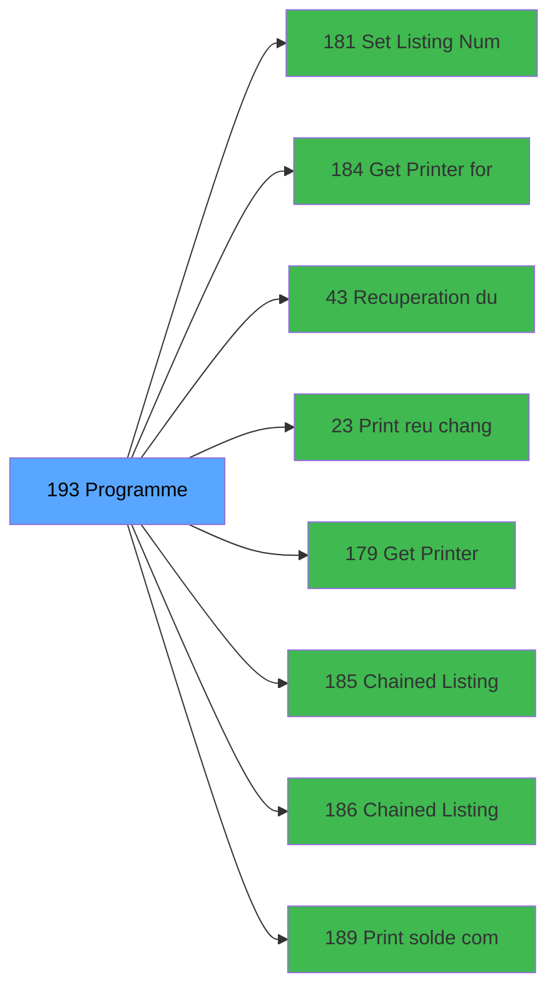

# ADH IDE 193 - Solde compte fin sejour

> **Version spec**: 3.5
> **Analyse**: 2026-01-27 17:57
> **Source**: `Prg_XXX.xml`

---

<!-- TAB:Fonctionnel -->

## SPECIFICATION FONCTIONNELLE

### 1.1 Objectif metier

| Element | Description |
|---------|-------------|
| **Qui** | Operateur |
| **Quoi** | Solde compte fin sejour
 |
| **Pourquoi** | A documenter |
| **Declencheur** | A identifier |

### 1.2 Regles metier

| Code | Regle | Condition |
|------|-------|-----------|
| RM-001 | A documenter | - |

### 1.3 Flux utilisateur

1. Demarrage programme
2. Traitement principal
3. Fin programme

### 1.4 Cas d'erreur

| Erreur | Comportement |
|--------|--------------|
| - | A documenter |

---

<!-- TAB:Technique -->

## SPECIFICATION TECHNIQUE

### 2.1 Identification

| Attribut | Valeur |
|----------|--------|
| **Format IDE** | ADH IDE 193 |
| **Description** | Solde compte fin sejour
 |
| **Module** | ADH |

### 2.2 Tables

| # | Nom physique | Acces | Usage |
|---|--------------|-------|-------|
| #23 | `Table_23` | R | 1x |
| #23 | `Table_23` | **W** | 4x |
| #30 | `Table_30` | LINK | 1x |
| #31 | `Table_31` | R | 2x |
| #34 | `Table_34` | **W** | 1x |
| #39 | `Table_39` | LINK | 4x |
| #40 | `Table_40` | R | 5x |
| #40 | `Table_40` | **W** | 14x |
| #44 | `Table_44` | **W** | 4x |
| #47 | `Table_47` | LINK | 1x |
| #47 | `Table_47` | **W** | 6x |
| #48 | `Table_48` | R | 1x |
| #48 | `Table_48` | **W** | 2x |
| #50 | `Table_50` | LINK | 1x |
| #53 | `Table_53` | **W** | 1x |
| #66 | `Table_66` | LINK | 1x |
| #66 | `Table_66` | R | 1x |
| #68 | `Table_68` | **W** | 12x |
| #70 | `Table_70` | LINK | 1x |
| #70 | `Table_70` | R | 3x |
| #75 | `Table_75` | **W** | 1x |
| #77 | `Table_77` | LINK | 1x |
| #80 | `Table_80` | R | 2x |
| #80 | `Table_80` | **W** | 2x |
| #87 | `Table_87` | LINK | 2x |
| #87 | `Table_87` | **W** | 2x |
| #89 | `Table_89` | LINK | 3x |
| #124 | `Table_124` | LINK | 1x |
| #136 | `Table_136` | **W** | 2x |
| #139 | `Table_139` | LINK | 1x |
| #141 | `Table_141` | R | 1x |
| #148 | `Table_148` | LINK | 1x |
| #148 | `Table_148` | **W** | 1x |
| #151 | `Table_151` | **W** | 2x |
| #268 | `Table_268` | R | 1x |
| #268 | `Table_268` | **W** | 1x |
| #312 | `Table_312` | R | 1x |
| #382 | `Table_382` | LINK | 1x |
| #382 | `Table_382` | R | 1x |
| #400 | `Table_400` | LINK | 1x |
| #403 | `Table_403` | LINK | 1x |
| #404 | `Table_404` | LINK | 1x |
| #474 | `Table_474` | LINK | 1x |
| #474 | `Table_474` | **W** | 2x |
| #728 | `Table_728` | LINK | 1x |
| #945 | `Table_945` | **W** | 4x |
| #979 | `Table_979` | LINK | 1x |
| #979 | `Table_979` | R | 1x |
| #979 | `Table_979` | **W** | 1x |
### 2.3 Parametres d'entree

### 2.4 Algorigramme

### 2.5 Expressions cles

### 2.6 Variables importantes

### 2.7 Statistiques

---

<!-- TAB:Cartographie -->

## CARTOGRAPHIE APPLICATIVE

### 3.1 Chaine d'appels depuis Main

### 3.2 Callers directs

| IDE | Programme | Nb appels |
|-----|-----------|-----------|
| 174 | Versement/Retrait | 2 |
| 190 | Menu solde d'un compte | 1 |
### 3.3 Callees

| Niv | IDE | Programme | Nb appels |
|-----|-----|-----------|-----------|
| 1 | 181 | Set Listing Number | 5 |
| 1 | 184 | Get Printer for chained list | 4 |
| 1 | 43 | Recuperation du titre | 3 |
| 1 | 23 | Print reçu change achat | 2 |
| 1 | 179 | Get Printer | 2 |
| 1 | 185 | Chained Listing Printer Choice | 2 |
| 1 | 186 | Chained Listing Load Default | 2 |
| 1 | 189 | Print solde compte | 2 |
| 1 | 195 | Print solde compte TIK V1 | 2 |
| 1 | 83 | Deactivate all cards | 1 |
| 1 | 97 | Factures (Tble Compta&Vent) V3 | 1 |
| 1 | 182 | Raz Current Printer | 1 |
| 1 | 188 | Print solde garantie | 1 |
| 1 | 192 | Calcul si depôt existe | 1 |
| 1 | 194 | Update CC type | 1 |
| 1 | 196 | Choix Articles Gift Pass | 1 |
| 1 | 259 | Zoom modes de paiement | 1 |
| 1 | 261 | Zoom des types de taux | 1 |
| 1 | 264 | Zoom devise solde compte | 1 |
| 1 | 270 | Zoom sur modes de paiement a/v | 1 |
### 3.4 Verification orphelin

| Critere | Resultat |
|---------|----------|
| Callers actifs | A verifier |
| **Conclusion** | A analyser |

---

## HISTORIQUE

| Date | Action | Auteur |
|------|--------|--------|
| 2026-01-27 19:48 | **DATA POPULATED** - Tables, Callgraph (53 expr) | Script |
| 2026-01-27 17:57 | **Upgrade V3.5** - TAB markers, Mermaid | Claude |

---

*Specification V3.5 - Format avec TAB markers et Mermaid*
