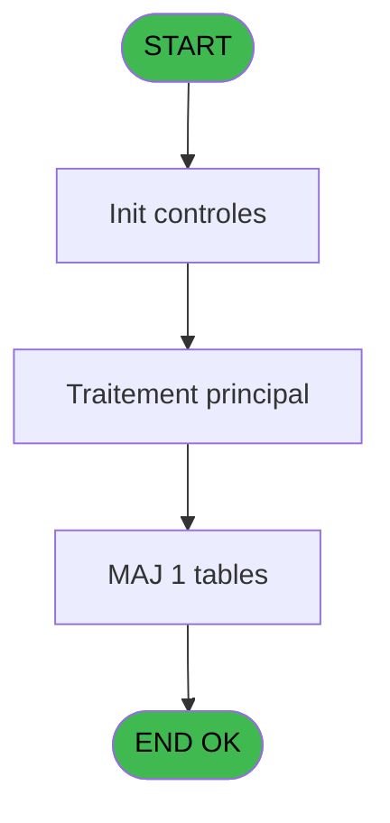

# ADH IDE 194 - Update CC type

> **Analyse**: Phases 1-4 2026-02-08 04:08 -> 04:08 (4s) | Assemblage 04:08
> **Pipeline**: V7.2 Enrichi
> **Structure**: 4 onglets (Resume | Ecrans | Donnees | Connexions)

<!-- TAB:Resume -->

## 1. FICHE D'IDENTITE

| Attribut | Valeur |
|----------|--------|
| Projet | ADH |
| IDE Position | 194 |
| Nom Programme | Update CC type |
| Fichier source | `Prg_194.xml` |
| Dossier IDE | General |
| Taches | 1 (0 ecrans visibles) |
| Tables modifiees | 1 |
| Programmes appeles | 0 |
| Complexite | **BASSE** (score 7/100) |
| Statut | **ORPHELIN_POTENTIEL** |

## 2. DESCRIPTION FONCTIONNELLE

**ADH IDE 194 – Update CC type** est un utilitaire de maintenance qui recalcule et synchronise les totaux par type de carte de crédit stockés dans la table `cc_total_par_type` (ccpartyp). Il parcourt les données détaillées des transactions (`cc_type_detail`) et les totaux maîtres (`cc_total`) pour mettre à jour les soldes agrégés par catégorie de carte (Visa, Mastercard, Amex, etc.), garantissant la cohérence des données pour le reporting et la clôture de caisse.

Programme simple (34 lignes de logique) sans dépendances externes ni paramètres d'entrée, classé comme orphelin mais probablement appelé directement depuis un menu ou point d'entrée principal. Sa faible complexité en fait un bon candidat pour une migration rapide vers une fonction utilitaire C# de réconciliation des soldes par type de moyen de paiement.

## 3. BLOCS FONCTIONNELS

## 5. REGLES METIER

*(Aucune regle metier identifiee dans les expressions)*

## 6. CONTEXTE

- **Appele par**: (aucun)
- **Appelle**: 0 programmes | **Tables**: 3 (W:1 R:0 L:2) | **Taches**: 1 | **Expressions**: 11

<!-- TAB:Ecrans -->

## 8. ECRANS

*(Programme sans ecran visible)*

## 9. NAVIGATION

### 9.3 Structure hierarchique (0 tache)

| Position | Tache | Type | Dimensions | Bloc |
|----------|-------|------|------------|------|

### 9.4 Algorigramme

> **Legende**: Vert = START/END OK | Rouge = END KO | Bleu = Decisions
> *Algorigramme auto-genere. Utiliser `/algorigramme` pour une synthese metier detaillee.*

<!-- TAB:Donnees -->

## 10. TABLES

### Tables utilisees (3)

| ID | Nom | Description | Type | R | W | L | Usages |
|----|-----|-------------|------|---|---|---|--------|
| 268 | cc_total_par_type |  | DB |   | **W** |   | 1 |
| 271 | cc_total |  | DB |   |   | L | 1 |
| 272 | cc_type_detail |  | DB |   |   | L | 1 |

### Colonnes par table (1 / 1 tables avec colonnes identifiees)

Table 268 - cc_total_par_type (**W**) - 1 usages

| Lettre | Variable | Acces | Type |
|--------|----------|-------|------|
| A | P Societé | W | Alpha |
| B | P Adherent | W | Numeric |
| C | P Filiation | W | Numeric |
| D | P Montant | W | Numeric |

## 11. VARIABLES

### 11.1 Parametres entrants (4)

Variables recues en parametre.

| Lettre | Nom | Type | Usage dans |
|--------|-----|------|-----------|
| EN | P Societé | Alpha | 1x parametre entrant |
| EO | P Adherent | Numeric | 1x parametre entrant |
| EP | P Filiation | Numeric | 1x parametre entrant |
| EQ | P Montant | Numeric | 3x parametre entrant |

## 12. EXPRESSIONS

**11 / 11 expressions decodees (100%)**

### 12.1 Repartition par type

| Type | Expressions | Regles |
|------|-------------|--------|
| CALCULATION | 3 | 0 |
| CONSTANTE | 2 | 0 |
| DATE | 1 | 0 |
| OTHER | 4 | 0 |
| REFERENCE_VG | 1 | 0 |

### 12.2 Expressions cles par type

#### CALCULATION (3 expressions)

| Type | IDE | Expression | Regle |
|------|-----|------------|-------|
| CALCULATION | 11 | `P Montant [D]-(-1)` | - |
| CALCULATION | 10 | `[V]-P Montant [D]` | - |
| CALCULATION | 9 | `[I]-P Montant [D]` | - |

#### CONSTANTE (2 expressions)

| Type | IDE | Expression | Regle |
|------|-----|------------|-------|
| CONSTANTE | 5 | `'99'` | - |
| CONSTANTE | 4 | `'99'` | - |

#### DATE (1 expressions)

| Type | IDE | Expression | Regle |
|------|-----|------------|-------|
| DATE | 6 | `Date ()` | - |

#### OTHER (4 expressions)

| Type | IDE | Expression | Regle |
|------|-----|------------|-------|
| OTHER | 3 | `P Filiation [C]` | - |
| OTHER | 7 | `Time ()` | - |
| OTHER | 1 | `P Societé [A]` | - |
| OTHER | 2 | `P Adherent [B]` | - |

#### REFERENCE_VG (1 expressions)

| Type | IDE | Expression | Regle |
|------|-----|------------|-------|
| REFERENCE_VG | 8 | `VG1` | - |

<!-- TAB:Connexions -->

## 13. GRAPHE D'APPELS

### 13.1 Chaine depuis Main (Callers)

**Chemin**: (pas de callers directs)

### 13.2 Callers

| IDE | Nom Programme | Nb Appels |
|-----|---------------|-----------|
| - | (aucun) | - |

### 13.3 Callees (programmes appeles)

### 13.4 Detail Callees avec contexte

| IDE | Nom Programme | Appels | Contexte |
|-----|---------------|--------|----------|
| - | (aucun) | - | - |

## 14. RECOMMANDATIONS MIGRATION

### 14.1 Profil du programme

| Metrique | Valeur | Impact migration |
|----------|--------|-----------------|
| Lignes de logique | 34 | Programme compact |
| Expressions | 11 | Peu de logique |
| Tables WRITE | 1 | Impact faible |
| Sous-programmes | 0 | Peu de dependances |
| Ecrans visibles | 0 | Ecran unique ou traitement batch |
| Code desactive | 0% (0 / 34) | Code sain |
| Regles metier | 0 | Pas de regle identifiee |

### 14.2 Plan de migration par bloc

### 14.3 Dependances critiques

| Dependance | Type | Appels | Impact |
|------------|------|--------|--------|
| cc_total_par_type | Table WRITE (Database) | 1x | Schema + repository |

---
*Spec DETAILED generee par Pipeline V7.2 - 2026-02-08 04:09*
