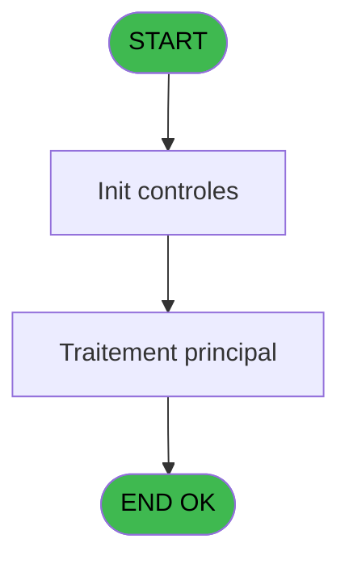

# ADH IDE 197 - perpare edition notas fiscais

> **Analyse**: Phases 1-4 2026-02-08 04:09 -> 04:09 (4s) | Assemblage 04:09
> **Pipeline**: V7.2 Enrichi
> **Structure**: 4 onglets (Resume | Ecrans | Donnees | Connexions)

<!-- TAB:Resume -->

## 1. FICHE D'IDENTITE

| Attribut | Valeur |
|----------|--------|
| Projet | ADH |
| IDE Position | 197 |
| Nom Programme | perpare edition notas fiscais |
| Fichier source | `Prg_197.xml` |
| Dossier IDE | Impression |
| Taches | 1 (0 ecrans visibles) |
| Tables modifiees | 0 |
| Programmes appeles | 0 |
| Complexite | **BASSE** (score 0/100) |
| Statut | **ORPHELIN_POTENTIEL** |

## 2. DESCRIPTION FONCTIONNELLE

ADH IDE 197 "perpare edition notas fiscais" est un programme minimaliste dédié à la préparation de l'édition des notes fiscales brésiliennes (factures obligatoires au Brésil). Composé d'une seule tâche avec seulement 7 lignes logiques, il ne manipule aucune table de données et n'appelle aucun sous-programme - c'est un point d'entrée pur d'initialisation et de contexte pour les villages Club Med brésiliens.

Le programme fonctionne sans paramètres d'entrée ni de sortie explicites, et aucun autre programme ne l'invoque actuellement, le classant comme orphelin dans la chaîne d'appels active. Son couplage zéro aux données et aux autres modules suggère qu'il sert uniquement d'étape préparatoire légère, probablement déclenchée par une demande d'édition manuelle ou un processus batch autonome de comptabilité fiscale.

Sa structure très simple et spécialisée le distingue des programmes complexes de gestion de caisse : c'est un utilitaire fiscal isolé, sans dépendances internes, conçu pour être appelé de manière externe ou via une interface utilisateur sans nécessiter d'échange de données avec le reste du système ADH.

## 3. BLOCS FONCTIONNELS

## 5. REGLES METIER

*(Aucune regle metier identifiee dans les expressions)*

## 6. CONTEXTE

- **Appele par**: (aucun)
- **Appelle**: 0 programmes | **Tables**: 0 (W:0 R:0 L:0) | **Taches**: 1 | **Expressions**: 1

<!-- TAB:Ecrans -->

## 8. ECRANS

*(Programme sans ecran visible)*

## 9. NAVIGATION

### 9.3 Structure hierarchique (0 tache)

| Position | Tache | Type | Dimensions | Bloc |
|----------|-------|------|------------|------|

### 9.4 Algorigramme

> **Legende**: Vert = START/END OK | Rouge = END KO | Bleu = Decisions
> *Algorigramme auto-genere. Utiliser `/algorigramme` pour une synthese metier detaillee.*

<!-- TAB:Donnees -->

## 10. TABLES

### Tables utilisees (0)

| ID | Nom | Description | Type | R | W | L | Usages |
|----|-----|-------------|------|---|---|---|--------|

### Colonnes par table (0 / 0 tables avec colonnes identifiees)

## 11. VARIABLES

### 11.1 Variables de session (5)

Variables persistantes pendant toute la session.

| Lettre | Nom | Type | Usage dans |
|--------|-----|------|-----------|
| EN | V.Societe | Alpha | - |
| EO | V.Code GM | Numeric | - |
| EP | V.Filiation | Numeric | - |
| EQ | V.Solde compte | Numeric | 1x session |
| ER | V.Nom Prenom | Alpha | - |

## 12. EXPRESSIONS

**1 / 1 expressions decodees (100%)**

### 12.1 Repartition par type

| Type | Expressions | Regles |
|------|-------------|--------|
| OTHER | 1 | 0 |

### 12.2 Expressions cles par type

#### OTHER (1 expressions)

| Type | IDE | Expression | Regle |
|------|-----|------------|-------|
| OTHER | 1 | `ABS (V.Solde compte [D])` | - |

<!-- TAB:Connexions -->

## 13. GRAPHE D'APPELS

### 13.1 Chaine depuis Main (Callers)

**Chemin**: (pas de callers directs)

### 13.2 Callers

| IDE | Nom Programme | Nb Appels |
|-----|---------------|-----------|
| - | (aucun) | - |

### 13.3 Callees (programmes appeles)

### 13.4 Detail Callees avec contexte

| IDE | Nom Programme | Appels | Contexte |
|-----|---------------|--------|----------|
| - | (aucun) | - | - |

## 14. RECOMMANDATIONS MIGRATION

### 14.1 Profil du programme

| Metrique | Valeur | Impact migration |
|----------|--------|-----------------|
| Lignes de logique | 7 | Programme compact |
| Expressions | 1 | Peu de logique |
| Tables WRITE | 0 | Impact faible |
| Sous-programmes | 0 | Peu de dependances |
| Ecrans visibles | 0 | Ecran unique ou traitement batch |
| Code desactive | 0% (0 / 7) | Code sain |
| Regles metier | 0 | Pas de regle identifiee |

### 14.2 Plan de migration par bloc

### 14.3 Dependances critiques

| Dependance | Type | Appels | Impact |
|------------|------|--------|--------|

---
*Spec DETAILED generee par Pipeline V7.2 - 2026-02-08 04:10*
