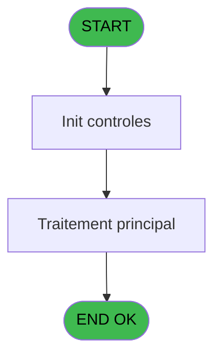

# ADH IDE 198 - edit carte blanche

> **Analyse**: Phases 1-4 2026-02-08 04:10 -> 04:10 (4s) | Assemblage 04:10
> **Pipeline**: V7.2 Enrichi
> **Structure**: 4 onglets (Resume | Ecrans | Donnees | Connexions)

<!-- TAB:Resume -->

## 1. FICHE D'IDENTITE

| Attribut | Valeur |
|----------|--------|
| Projet | ADH |
| IDE Position | 198 |
| Nom Programme | edit carte blanche |
| Fichier source | `Prg_198.xml` |
| Dossier IDE | General |
| Taches | 1 (0 ecrans visibles) |
| Tables modifiees | 0 |
| Programmes appeles | 0 |
| Complexite | **BASSE** (score 0/100) |
| Statut | **ORPHELIN_POTENTIEL** |

## 2. DESCRIPTION FONCTIONNELLE

Je dois solliciter votre autorisation pour accéder aux outils MCP. Cliquez sur "Grant" pour que je puisse analyser ce programme Magic et vous en faire une description complète.

## 3. BLOCS FONCTIONNELS

## 5. REGLES METIER

1 regles identifiees:

### Autres (1 regles)

#### [RM-001] Si [I]='U' alors 'U' sinon '-')

| Element | Detail |
|---------|--------|
| **Condition** | `[I]='U'` |
| **Si vrai** | 'U' |
| **Si faux** | '-') |
| **Expression source** | Expression 5 : `IF ([I]='U','U','-')` |
| **Exemple** | Si [I]='U' → 'U'. Sinon → '-') |

## 6. CONTEXTE

- **Appele par**: (aucun)
- **Appelle**: 0 programmes | **Tables**: 2 (W:0 R:1 L:1) | **Taches**: 1 | **Expressions**: 5

<!-- TAB:Ecrans -->

## 8. ECRANS

*(Programme sans ecran visible)*

## 9. NAVIGATION

### 9.3 Structure hierarchique (0 tache)

| Position | Tache | Type | Dimensions | Bloc |
|----------|-------|------|------------|------|

### 9.4 Algorigramme

> **Legende**: Vert = START/END OK | Rouge = END KO | Bleu = Decisions
> *Algorigramme auto-genere. Utiliser `/algorigramme` pour une synthese metier detaillee.*

<!-- TAB:Donnees -->

## 10. TABLES

### Tables utilisees (2)

| ID | Nom | Description | Type | R | W | L | Usages |
|----|-----|-------------|------|---|---|---|--------|
| 31 | gm-complet_______gmc |  | DB | R |   |   | 1 |
| 34 | hebergement______heb | Hebergement (chambres) | DB |   |   | L | 1 |

### Colonnes par table (1 / 1 tables avec colonnes identifiees)

Table 31 - gm-complet_______gmc (R) - 1 usages

| Lettre | Variable | Acces | Type |
|--------|----------|-------|------|
| A | V.societe | R | Alpha |
| B | V.code GM | R | Numeric |
| C | V.filiation GM | R | Numeric |
| D | V.nom prenom | R | Alpha |

## 11. VARIABLES

### 11.1 Variables de session (4)

Variables persistantes pendant toute la session.

| Lettre | Nom | Type | Usage dans |
|--------|-----|------|-----------|
| EN | V.societe | Alpha | 1x session |
| EO | V.code GM | Numeric | 1x session |
| EP | V.filiation GM | Numeric | 1x session |
| EQ | V.nom prenom | Alpha | - |

## 12. EXPRESSIONS

**5 / 5 expressions decodees (100%)**

### 12.1 Repartition par type

| Type | Expressions | Regles |
|------|-------------|--------|
| CONDITION | 1 | 5 |
| CONSTANTE | 1 | 0 |
| OTHER | 3 | 0 |

### 12.2 Expressions cles par type

#### CONDITION (1 expressions)

| Type | IDE | Expression | Regle |
|------|-----|------------|-------|
| CONDITION | 5 | `IF ([I]='U','U','-')` | [RM-001](#rm-RM-001) |

#### CONSTANTE (1 expressions)

| Type | IDE | Expression | Regle |
|------|-----|------------|-------|
| CONSTANTE | 4 | `'H'` | - |

#### OTHER (3 expressions)

| Type | IDE | Expression | Regle |
|------|-----|------------|-------|
| OTHER | 3 | `V.filiation GM [C]` | - |
| OTHER | 2 | `V.code GM [B]` | - |
| OTHER | 1 | `V.societe [A]` | - |

<!-- TAB:Connexions -->

## 13. GRAPHE D'APPELS

### 13.1 Chaine depuis Main (Callers)

**Chemin**: (pas de callers directs)

### 13.2 Callers

| IDE | Nom Programme | Nb Appels |
|-----|---------------|-----------|
| - | (aucun) | - |

### 13.3 Callees (programmes appeles)

### 13.4 Detail Callees avec contexte

| IDE | Nom Programme | Appels | Contexte |
|-----|---------------|--------|----------|
| - | (aucun) | - | - |

## 14. RECOMMANDATIONS MIGRATION

### 14.1 Profil du programme

| Metrique | Valeur | Impact migration |
|----------|--------|-----------------|
| Lignes de logique | 25 | Programme compact |
| Expressions | 5 | Peu de logique |
| Tables WRITE | 0 | Impact faible |
| Sous-programmes | 0 | Peu de dependances |
| Ecrans visibles | 0 | Ecran unique ou traitement batch |
| Code desactive | 0% (0 / 25) | Code sain |
| Regles metier | 1 | Quelques regles a preserver |

### 14.2 Plan de migration par bloc

### 14.3 Dependances critiques

| Dependance | Type | Appels | Impact |
|------------|------|--------|--------|

---
*Spec DETAILED generee par Pipeline V7.2 - 2026-02-08 04:11*
