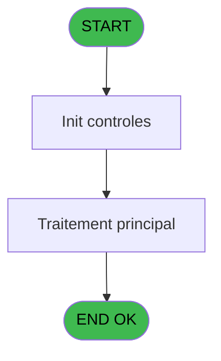
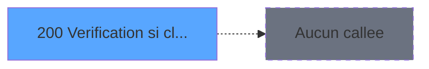

# ADH IDE 200 - Verification si client/serveur

> **Analyse**: Phases 1-4 2026-02-08 04:12 -> 04:12 (4s) | Assemblage 04:12
> **Pipeline**: V7.2 Enrichi
> **Structure**: 4 onglets (Resume | Ecrans | Donnees | Connexions)

<!-- TAB:Resume -->

## 1. FICHE D'IDENTITE

| Attribut | Valeur |
|----------|--------|
| Projet | ADH |
| IDE Position | 200 |
| Nom Programme | Verification si client/serveur |
| Fichier source | `Prg_200.xml` |
| Dossier IDE | General |
| Taches | 1 (0 ecrans visibles) |
| Tables modifiees | 0 |
| Programmes appeles | 0 |
| Complexite | **BASSE** (score 0/100) |
| Statut | **ORPHELIN_POTENTIEL** |

## 2. DESCRIPTION FONCTIONNELLE

**ADH IDE 200 - Vérification si client/serveur** est un programme utilitaire de **détection d'environnement d'exécution**. Il détermine si l'application tourne en mode client local (poste autonome) ou architecture client/serveur (environnement réseau distribué), permettant aux modules ADH d'adapter leur comportement selon le contexte de déploiement (chemins fichiers, connexions base de données, verrouillages).

Le programme opère sur une **logique extrêmement simple**: aucun paramètre d'entrée, une seule table consultée en lecture (`arc_cc_total`), neuf lignes de logique sans branchements complexes. Il définit probablement un drapeau de mode dans les variables globales (VG) et ne modifie aucune donnée. Aucun sous-programme n'est appelé, ce qui en fait un point terminal isolé.

Bien qu'actuellement **orphelin** (sans appelants directs), ce programme revêt probablement une importance historique ou est activé dynamiquement via des chaînes d'initialisation non indexées. Pour la migration vers .NET, il se traduirait par un service d'injection de dépendances IConfiguration vérifiant le mode de déploiement au démarrage.

## 3. BLOCS FONCTIONNELS

## 5. REGLES METIER

1 regles identifiees:

### Autres (1 regles)

#### [RM-001] Condition: Left (Trim (INIGet ('[MAGIC_LOGICAL_NAMES]club_prog')),1) egale 'E'

| Element | Detail |
|---------|--------|
| **Condition** | `Left (Trim (INIGet ('[MAGIC_LOGICAL_NAMES]club_prog')),1)='E'` |
| **Si vrai** | Action si vrai |
| **Expression source** | Expression 2 : `Left (Trim (INIGet ('[MAGIC_LOGICAL_NAMES]club_prog')),1)='E` |
| **Exemple** | Si Left (Trim (INIGet ('[MAGIC_LOGICAL_NAMES]club_prog')),1)='E' → Action si vrai |

## 6. CONTEXTE

- **Appele par**: (aucun)
- **Appelle**: 0 programmes | **Tables**: 1 (W:0 R:1 L:0) | **Taches**: 1 | **Expressions**: 3

<!-- TAB:Ecrans -->

## 8. ECRANS

*(Programme sans ecran visible)*

## 9. NAVIGATION

### 9.3 Structure hierarchique (0 tache)

| Position | Tache | Type | Dimensions | Bloc |
|----------|-------|------|------------|------|

### 9.4 Algorigramme

> **Legende**: Vert = START/END OK | Rouge = END KO | Bleu = Decisions
> *Algorigramme auto-genere. Utiliser `/algorigramme` pour une synthese metier detaillee.*

<!-- TAB:Donnees -->

## 10. TABLES

### Tables utilisees (1)

| ID | Nom | Description | Type | R | W | L | Usages |
|----|-----|-------------|------|---|---|---|--------|
| 728 | arc_cc_total |  | DB | R |   |   | 1 |

### Colonnes par table (0 / 1 tables avec colonnes identifiees)

Table 728 - arc_cc_total (R) - 1 usages

*Table utilisee uniquement en Link ou aucune colonne Real identifiee dans le DataView.*

## 11. VARIABLES

*(Programme sans variables locales mappees)*

## 12. EXPRESSIONS

**3 / 3 expressions decodees (100%)**

### 12.1 Repartition par type

| Type | Expressions | Regles |
|------|-------------|--------|
| CONDITION | 1 | 5 |
| CONSTANTE | 1 | 0 |
| OTHER | 1 | 0 |

### 12.2 Expressions cles par type

#### CONDITION (1 expressions)

| Type | IDE | Expression | Regle |
|------|-----|------------|-------|
| CONDITION | 2 | `Left (Trim (INIGet ('[MAGIC_LOGICAL_NAMES]club_prog')),1)='E'` | [RM-001](#rm-RM-001) |

#### CONSTANTE (1 expressions)

| Type | IDE | Expression | Regle |
|------|-----|------------|-------|
| CONSTANTE | 1 | `'C'` | - |

#### OTHER (1 expressions)

| Type | IDE | Expression | Regle |
|------|-----|------------|-------|
| OTHER | 3 | `[B]` | - |

<!-- TAB:Connexions -->

## 13. GRAPHE D'APPELS

### 13.1 Chaine depuis Main (Callers)

**Chemin**: (pas de callers directs)

### 13.2 Callers

| IDE | Nom Programme | Nb Appels |
|-----|---------------|-----------|
| - | (aucun) | - |

### 13.3 Callees (programmes appeles)

### 13.4 Detail Callees avec contexte

| IDE | Nom Programme | Appels | Contexte |
|-----|---------------|--------|----------|
| - | (aucun) | - | - |

## 14. RECOMMANDATIONS MIGRATION

### 14.1 Profil du programme

| Metrique | Valeur | Impact migration |
|----------|--------|-----------------|
| Lignes de logique | 9 | Programme compact |
| Expressions | 3 | Peu de logique |
| Tables WRITE | 0 | Impact faible |
| Sous-programmes | 0 | Peu de dependances |
| Ecrans visibles | 0 | Ecran unique ou traitement batch |
| Code desactive | 0% (0 / 9) | Code sain |
| Regles metier | 1 | Quelques regles a preserver |

### 14.2 Plan de migration par bloc

### 14.3 Dependances critiques

| Dependance | Type | Appels | Impact |
|------------|------|--------|--------|

---
*Spec DETAILED generee par Pipeline V7.2 - 2026-02-08 04:14*
