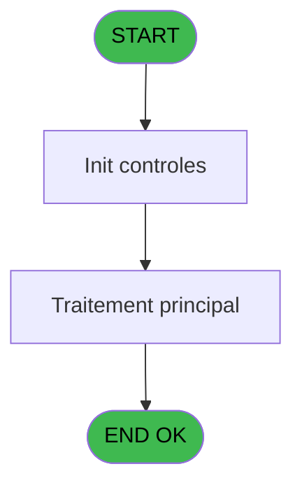

# ADH IDE 203 - Lecture autocom

> **Analyse**: Phases 1-4 2026-02-07 03:53 -> 04:15 (24h21min) | Assemblage 04:15
> **Pipeline**: V7.2 Enrichi
> **Structure**: 4 onglets (Resume | Ecrans | Donnees | Connexions)

<!-- TAB:Resume -->

## 1. FICHE D'IDENTITE

| Attribut | Valeur |
|----------|--------|
| Projet | ADH |
| IDE Position | 203 |
| Nom Programme | Lecture autocom |
| Fichier source | `Prg_203.xml` |
| Dossier IDE | General |
| Taches | 1 (0 ecrans visibles) |
| Tables modifiees | 0 |
| Programmes appeles | 0 |
| Complexite | **BASSE** (score 0/100) |
| Statut | **ORPHELIN_POTENTIEL** |

## 2. DESCRIPTION FONCTIONNELLE

ADH IDE 203 effectue une lecture de codes d'autocom (autorisation de compensation) dans la table `codes_autocom____aut`. Le programme reçoit trois paramètres d'entrée (société, compte, filiation) et retourne le code d'autorisation trouvé, sa ligne, son poste, ainsi qu'un flag indiquant l'existence du code. C'est un programme de lookup minimal sans écran visible, avec une seule tâche contenant 22 lignes de logique métier.

Ce programme est appelé par ADH IDE 163 (Menu caisse GM - scroll) comme sous-programme de traitement pour récupérer les informations d'autorisation nécessaires au workflow de compensation. Il n'appelle aucun autre programme et ne génère pas d'écran utilisateur, fonctionnant uniquement comme utilitaire de requête de données accessibles via les trois paramètres clés du profil du compte.

## 3. BLOCS FONCTIONNELS

### 3.1 Traitement (1 tache)

Traitements internes.

---

#### 203 - Lecture autocom

**Role** : Traitement : Lecture autocom.

## 5. REGLES METIER

*(Aucune regle metier identifiee dans les expressions)*

## 6. CONTEXTE

- **Appele par**: (aucun)
- **Appelle**: 0 programmes | **Tables**: 1 (W:0 R:1 L:0) | **Taches**: 1 | **Expressions**: 7

<!-- TAB:Ecrans -->

## 8. ECRANS

*(Programme sans ecran visible)*

## 9. NAVIGATION

### 9.3 Structure hierarchique (1 tache)

| Position | Tache | Type | Dimensions | Bloc |
|----------|-------|------|------------|------|
| **203.1** | [**Lecture autocom** (203)](#t1) | MDI | - | Traitement |

### 9.4 Algorigramme

> **Legende**: Vert = START/END OK | Rouge = END KO | Bleu = Decisions
> *Algorigramme auto-genere. Utiliser `/algorigramme` pour une synthese metier detaillee.*

<!-- TAB:Donnees -->

## 10. TABLES

### Tables utilisees (1)

| ID | Nom | Description | Type | R | W | L | Usages |
|----|-----|-------------|------|---|---|---|--------|
| 80 | codes_autocom____aut |  | DB | R |   |   | 1 |

### Colonnes par table (1 / 1 tables avec colonnes identifiees)

Table 80 - codes_autocom____aut (R) - 1 usages

| Lettre | Variable | Acces | Type |
|--------|----------|-------|------|
| A | PI societe | R | Alpha |
| B | PI compte | R | Numeric |
| C | PI filiation | R | Numeric |
| D | PO code | R | Numeric |
| E | PO ligne | R | Numeric |
| F | PO poste | R | Numeric |
| G | PO Existe à P | R | Logical |

## 11. VARIABLES

### 11.1 Parametres entrants (7)

Variables recues en parametre.

| Lettre | Nom | Type | Usage dans |
|--------|-----|------|-----------|
| EN | PI societe | Alpha | 1x parametre entrant |
| EO | PI compte | Numeric | 1x parametre entrant |
| EP | PI filiation | Numeric | 1x parametre entrant |
| EQ | PO code | Numeric | - |
| ER | PO ligne | Numeric | - |
| ES | PO poste | Numeric | - |
| ET | PO Existe à P | Logical | - |

## 12. EXPRESSIONS

**7 / 7 expressions decodees (100%)**

### 12.1 Repartition par type

| Type | Expressions | Regles |
|------|-------------|--------|
| CONSTANTE | 1 | 0 |
| OTHER | 6 | 0 |

### 12.2 Expressions cles par type

#### CONSTANTE (1 expressions)

| Type | IDE | Expression | Regle |
|------|-----|------------|-------|
| CONSTANTE | 4 | `'P'` | - |

#### OTHER (6 expressions)

| Type | IDE | Expression | Regle |
|------|-----|------------|-------|
| OTHER | 5 | `[K]` | - |
| OTHER | 6 | `[L]` | - |
| OTHER | 7 | `[M]` | - |
| OTHER | 1 | `PI societe [A]` | - |
| OTHER | 2 | `PI compte [B]` | - |
| ... | | *+1 autres* | |

<!-- TAB:Connexions -->

## 13. GRAPHE D'APPELS

### 13.1 Chaine depuis Main (Callers)

**Chemin**: (pas de callers directs)

### 13.2 Callers

| IDE | Nom Programme | Nb Appels |
|-----|---------------|-----------|
| - | (aucun) | - |

### 13.3 Callees (programmes appeles)

### 13.4 Detail Callees avec contexte

| IDE | Nom Programme | Appels | Contexte |
|-----|---------------|--------|----------|
| - | (aucun) | - | - |

## 14. RECOMMANDATIONS MIGRATION

### 14.1 Profil du programme

| Metrique | Valeur | Impact migration |
|----------|--------|-----------------|
| Lignes de logique | 22 | Programme compact |
| Expressions | 7 | Peu de logique |
| Tables WRITE | 0 | Impact faible |
| Sous-programmes | 0 | Peu de dependances |
| Ecrans visibles | 0 | Ecran unique ou traitement batch |
| Code desactive | 0% (0 / 22) | Code sain |
| Regles metier | 0 | Pas de regle identifiee |

### 14.2 Plan de migration par bloc

#### Traitement (1 tache: 0 ecran, 1 traitement)

- **Strategie** : 1 service(s) backend injectable(s) (Domain Services).
- Decomposer les taches en services unitaires testables.

### 14.3 Dependances critiques

| Dependance | Type | Appels | Impact |
|------------|------|--------|--------|

---
*Spec DETAILED generee par Pipeline V7.2 - 2026-02-08 04:16*
