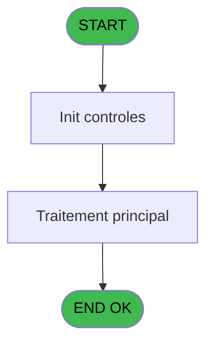

# ADH IDE 208 - Print Reçu code autocom

> **Analyse**: Phases 1-4 2026-02-07 03:53 -> 03:53 (28s) | Assemblage 03:53
> **Pipeline**: V7.2 Enrichi
> **Structure**: 4 onglets (Resume | Ecrans | Donnees | Connexions)

<!-- TAB:Resume -->

## 1. FICHE D'IDENTITE

| Attribut | Valeur |
|----------|--------|
| Projet | ADH |
| IDE Position | 208 |
| Nom Programme | Print Reçu code autocom |
| Fichier source | `Prg_208.xml` |
| Dossier IDE | Impression |
| Taches | 13 (1 ecrans visibles) |
| Tables modifiees | 0 |
| Programmes appeles | 1 |

## 2. DESCRIPTION FONCTIONNELLE

**Print Reçu code autocom** assure la gestion complete de ce processus, accessible depuis [Affectation code autocom (IDE 209)](ADH-IDE-209.md), [Menu telephone (IDE 217)](ADH-IDE-217.md).

Le flux de traitement s'organise en **2 blocs fonctionnels** :

- **Traitement** (8 taches) : traitements metier divers
- **Impression** (5 taches) : generation de tickets et documents

Detail : phases du traitement

#### Phase 1 : Traitement (8 taches)

- **208** - (sans nom)
- **208.1.1** - Impression reçu code auto
- **208.1.2** - Impression reçu code auto
- **208.2.1** - Impression reçu code auto
- **208.2.2** - Impression reçu code auto
- **208.3.1** - Veuillez patienter... **[[ECRAN]](#ecran-t9)**
- **208.4.1** - Impression reçu code auto
- **208.5.1** - Impression reçu code auto

#### Phase 2 : Impression (5 taches)

- **208.1** - Printer 1
- **208.2** - Printer 4
- **208.3** - Printer 6 **[[ECRAN]](#ecran-t8)**
- **208.4** - Printer 8
- **208.5** - Printer 9

Delegue a : [Raz Current Printer (IDE 182)](ADH-IDE-182.md)

## 3. BLOCS FONCTIONNELS

### 3.1 Traitement (8 taches)

Traitements internes.

---

#### 208 - (sans nom)

**Role** : Tache d'orchestration : point d'entree du programme (8 sous-taches). Coordonne l'enchainement des traitements.

7 sous-taches directes

| Tache | Nom | Bloc |
|-------|-----|------|
| [208.1.1](#t3) | Impression reçu code auto | Traitement |
| [208.1.2](#t4) | Impression reçu code auto | Traitement |
| [208.2.1](#t6) | Impression reçu code auto | Traitement |
| [208.2.2](#t7) | Impression reçu code auto | Traitement |
| [208.3.1](#t9) | Veuillez patienter... **[[ECRAN]](#ecran-t9)** | Traitement |
| [208.4.1](#t11) | Impression reçu code auto | Traitement |
| [208.5.1](#t13) | Impression reçu code auto | Traitement |

---

#### 208.1.1 - Impression reçu code auto

**Role** : Generation du document : Impression reçu code auto.
**Variables liees** : B (P0 code adherent), E (P0 longueur code), F (P0 code autocom)

---

#### 208.1.2 - Impression reçu code auto

**Role** : Generation du document : Impression reçu code auto.
**Variables liees** : B (P0 code adherent), E (P0 longueur code), F (P0 code autocom)

---

#### 208.2.1 - Impression reçu code auto

**Role** : Generation du document : Impression reçu code auto.
**Variables liees** : B (P0 code adherent), E (P0 longueur code), F (P0 code autocom)

---

#### 208.2.2 - Impression reçu code auto

**Role** : Generation du document : Impression reçu code auto.
**Variables liees** : B (P0 code adherent), E (P0 longueur code), F (P0 code autocom)

---

#### 208.3.1 - Veuillez patienter... [[ECRAN]](#ecran-t9)

**Role** : Traitement : Veuillez patienter....
**Ecran** : 422 x 56 DLU (MDI) | [Voir mockup](#ecran-t9)

---

#### 208.4.1 - Impression reçu code auto

**Role** : Generation du document : Impression reçu code auto.
**Variables liees** : B (P0 code adherent), E (P0 longueur code), F (P0 code autocom)

---

#### 208.5.1 - Impression reçu code auto

**Role** : Generation du document : Impression reçu code auto.
**Variables liees** : B (P0 code adherent), E (P0 longueur code), F (P0 code autocom)

### 3.2 Impression (5 taches)

Generation des documents et tickets.

---

#### 208.1 - Printer 1

**Role** : Generation du document : Printer 1.
**Delegue a** : [Raz Current Printer (IDE 182)](ADH-IDE-182.md)

---

#### 208.2 - Printer 4

**Role** : Generation du document : Printer 4.
**Delegue a** : [Raz Current Printer (IDE 182)](ADH-IDE-182.md)

---

#### 208.3 - Printer 6 [[ECRAN]](#ecran-t8)

**Role** : Generation du document : Printer 6.
**Ecran** : 422 x 56 DLU (MDI) | [Voir mockup](#ecran-t8)
**Delegue a** : [Raz Current Printer (IDE 182)](ADH-IDE-182.md)

---

#### 208.4 - Printer 8

**Role** : Generation du document : Printer 8.
**Delegue a** : [Raz Current Printer (IDE 182)](ADH-IDE-182.md)

---

#### 208.5 - Printer 9

**Role** : Generation du document : Printer 9.
**Delegue a** : [Raz Current Printer (IDE 182)](ADH-IDE-182.md)

## 5. REGLES METIER

*(Aucune regle metier identifiee)*

## 6. CONTEXTE

- **Appele par**: [Affectation code autocom (IDE 209)](ADH-IDE-209.md), [Menu telephone (IDE 217)](ADH-IDE-217.md)
- **Appelle**: 1 programmes | **Tables**: 2 (W:0 R:1 L:1) | **Taches**: 13 | **Expressions**: 6

<!-- TAB:Ecrans -->

## 8. ECRANS

### 8.1 Forms visibles (1 / 13)

| # | Position | Tache | Nom | Type | Largeur | Hauteur | Bloc |
|---|----------|-------|-----|------|---------|---------|------|
| 1 | 208.3.1 | 208.3.1 | Veuillez patienter... | MDI | 422 | 56 | Traitement |

### 8.2 Mockups Ecrans

---

#### 208.3.1 - Veuillez patienter...
**Tache** : [208.3.1](#t9) | **Type** : MDI | **Dimensions** : 422 x 56 DLU
**Bloc** : Traitement | **Titre IDE** : Veuillez patienter...

<!-- FORM-DATA:
{
    "width":  422,
    "vFactor":  8,
    "type":  "MDI",
    "hFactor":  8,
    "controls":  [
                     {
                         "x":  0,
                         "type":  "label",
                         "var":  "",
                         "y":  0,
                         "w":  423,
                         "fmt":  "",
                         "name":  "",
                         "h":  29,
                         "color":  "",
                         "text":  "",
                         "parent":  null
                     },
                     {
                         "x":  120,
                         "type":  "label",
                         "var":  "",
                         "y":  10,
                         "w":  221,
                         "fmt":  "",
                         "name":  "",
                         "h":  8,
                         "color":  "7",
                         "text":  "Impression en cours ...",
                         "parent":  null
                     },
                     {
                         "x":  0,
                         "type":  "label",
                         "var":  "",
                         "y":  29,
                         "w":  423,
                         "fmt":  "",
                         "name":  "",
                         "h":  27,
                         "color":  "",
                         "text":  "",
                         "parent":  null
                     },
                     {
                         "x":  71,
                         "type":  "label",
                         "var":  "",
                         "y":  38,
                         "w":  280,
                         "fmt":  "",
                         "name":  "",
                         "h":  8,
                         "color":  "",
                         "text":  "Edition du reçu code autocom",
                         "parent":  null
                     },
                     {
                         "x":  4,
                         "type":  "image",
                         "var":  "",
                         "y":  2,
                         "w":  72,
                         "fmt":  "",
                         "name":  "",
                         "h":  25,
                         "color":  "",
                         "text":  "",
                         "parent":  null
                     }
                 ],
    "taskId":  "208.3.1",
    "height":  56
}
-->

## 9. NAVIGATION

Ecran unique: **Veuillez patienter...**

### 9.3 Structure hierarchique (13 taches)

| Position | Tache | Type | Dimensions | Bloc |
|----------|-------|------|------------|------|
| **208.1** | [**(sans nom)** (208)](#t1) | MDI | - | Traitement |
| 208.1.1 | [Impression reçu code auto (208.1.1)](#t3) | MDI | - | |
| 208.1.2 | [Impression reçu code auto (208.1.2)](#t4) | MDI | - | |
| 208.1.3 | [Impression reçu code auto (208.2.1)](#t6) | MDI | - | |
| 208.1.4 | [Impression reçu code auto (208.2.2)](#t7) | MDI | - | |
| 208.1.5 | [Veuillez patienter... (208.3.1)](#t9) [mockup](#ecran-t9) | MDI | 422x56 | |
| 208.1.6 | [Impression reçu code auto (208.4.1)](#t11) | MDI | - | |
| 208.1.7 | [Impression reçu code auto (208.5.1)](#t13) | MDI | - | |
| **208.2** | [**Printer 1** (208.1)](#t2) | MDI | - | Impression |
| 208.2.1 | [Printer 4 (208.2)](#t5) | MDI | - | |
| 208.2.2 | [Printer 6 (208.3)](#t8) [mockup](#ecran-t8) | MDI | 422x56 | |
| 208.2.3 | [Printer 8 (208.4)](#t10) | MDI | - | |
| 208.2.4 | [Printer 9 (208.5)](#t12) | MDI | - | |

### 9.4 Algorigramme

> **Legende**: Vert = START/END OK | Rouge = END KO | Bleu = Decisions
> *Algorigramme auto-genere. Utiliser `/algorigramme` pour une synthese metier detaillee.*

<!-- TAB:Donnees -->

## 10. TABLES

### Tables utilisees (2)

| ID | Nom | Description | Type | R | W | L | Usages |
|----|-----|-------------|------|---|---|---|--------|
| 30 | gm-recherche_____gmr | Index de recherche | DB | R |   |   | 7 |
| 80 | codes_autocom____aut |  | DB |   |   | L | 7 |

### Colonnes par table (2 / 1 tables avec colonnes identifiees)

Table 30 - gm-recherche_____gmr (R) - 7 usages

| Lettre | Variable | Acces | Type |
|--------|----------|-------|------|
| A | W1 initialisation | R | Alpha |
| B | W1 large | R | Alpha |
| C | W1 normal | R | Alpha |
| D | W1 condense | R | Alpha |
| E | W1 detecteur papier | R | Alpha |
| F | W1 inhibe panel | R | Alpha |
| G | W1 massicot | R | Alpha |
| H | W1 selection feuille | R | Alpha |
| I | W1 selection rouleau | R | Alpha |

## 11. VARIABLES

### 11.1 Parametres entrants (9)

Variables recues du programme appelant ([Affectation code autocom (IDE 209)](ADH-IDE-209.md)).

| Lettre | Nom | Type | Usage dans |
|--------|-----|------|-----------|
| A | P0 societe | Alpha | - |
| B | P0 code adherent | Numeric | - |
| C | P0 filiation | Numeric | - |
| D | P0 nom village | Alpha | - |
| E | P0 longueur code | Numeric | - |
| F | P0 code autocom | Numeric | - |
| G | P0 n° ligne | Numeric | - |
| H | P0 salle seminaire | Alpha | - |
| I | P0 telephone direct | Alpha | - |

## 12. EXPRESSIONS

**6 / 6 expressions decodees (100%)**

### 12.1 Repartition par type

| Type | Expressions | Regles |
|------|-------------|--------|
| CONDITION | 5 | 0 |
| CAST_LOGIQUE | 1 | 0 |

### 12.2 Expressions cles par type

#### CONDITION (5 expressions)

| Type | IDE | Expression | Regle |
|------|-----|------------|-------|
| CONDITION | 4 | `GetParam ('CURRENTPRINTERNUM')=8` | - |
| CONDITION | 5 | `GetParam ('CURRENTPRINTERNUM')=9` | - |
| CONDITION | 3 | `GetParam ('CURRENTPRINTERNUM')=6` | - |
| CONDITION | 1 | `GetParam ('CURRENTPRINTERNUM')=1` | - |
| CONDITION | 2 | `GetParam ('CURRENTPRINTERNUM')=4` | - |

#### CAST_LOGIQUE (1 expressions)

| Type | IDE | Expression | Regle |
|------|-----|------------|-------|
| CAST_LOGIQUE | 6 | `'TRUE'LOG` | - |

<!-- TAB:Connexions -->

## 13. GRAPHE D'APPELS

### 13.1 Chaine depuis Main (Callers)

Main -> ... -> [Affectation code autocom (IDE 209)](ADH-IDE-209.md) -> **Print Reçu code autocom (IDE 208)**

Main -> ... -> [Menu telephone (IDE 217)](ADH-IDE-217.md) -> **Print Reçu code autocom (IDE 208)**

### 13.2 Callers

| IDE | Nom Programme | Nb Appels |
|-----|---------------|-----------|
| [209](ADH-IDE-209.md) | Affectation code autocom | 1 |
| [217](ADH-IDE-217.md) | Menu telephone | 1 |

### 13.3 Callees (programmes appeles)

### 13.4 Detail Callees avec contexte

| IDE | Nom Programme | Appels | Contexte |
|-----|---------------|--------|----------|
| [182](ADH-IDE-182.md) | Raz Current Printer | 1 | Impression ticket/document |

## 14. RECOMMANDATIONS MIGRATION

### 14.1 Profil du programme

| Metrique | Valeur | Impact migration |
|----------|--------|-----------------|
| Lignes de logique | 177 | Programme compact |
| Expressions | 6 | Peu de logique |
| Tables WRITE | 0 | Impact faible |
| Sous-programmes | 1 | Peu de dependances |
| Ecrans visibles | 1 | Ecran unique ou traitement batch |
| Code desactive | 0% (0 / 177) | Code sain |
| Regles metier | 0 | Pas de regle identifiee |

### 14.2 Plan de migration par bloc

#### Traitement (8 taches: 1 ecran, 7 traitements)

- **Strategie** : Orchestrateur avec 1 ecrans (Razor/React) et 7 traitements backend (services).
- Les ecrans deviennent des composants UI, les traitements invisibles deviennent des services injectables.
- 1 sous-programme(s) a migrer ou a reutiliser depuis les services existants.
- Decomposer les taches en services unitaires testables.

#### Impression (5 taches: 1 ecran, 4 traitements)

- **Strategie** : Templates HTML -> PDF via wkhtmltopdf ou Puppeteer.
- `PrintService` injectable avec choix imprimante

### 14.3 Dependances critiques

| Dependance | Type | Appels | Impact |
|------------|------|--------|--------|
| [Raz Current Printer (IDE 182)](ADH-IDE-182.md) | Sous-programme | 1x | Normale - Impression ticket/document |

---
*Spec DETAILED generee par Pipeline V7.2 - 2026-02-07 03:53*
