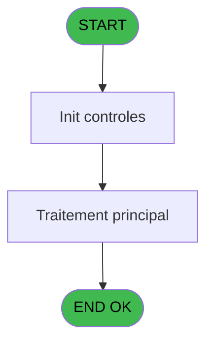
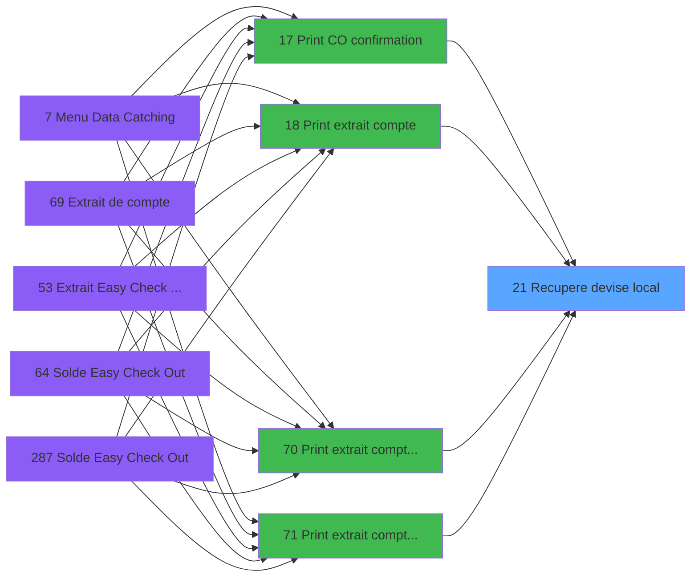

# ADH IDE 21 - Recupere devise local

> **Analyse**: Phases 1-4 2026-02-07 06:38 -> 01:21 (18h42min) | Assemblage 01:21
> **Pipeline**: V7.2 Enrichi
> **Structure**: 4 onglets (Resume | Ecrans | Donnees | Connexions)

<!-- TAB:Resume -->

## 1. FICHE D'IDENTITE

| Attribut | Valeur |
|----------|--------|
| Projet | ADH |
| IDE Position | 21 |
| Nom Programme | Recupere devise local |
| Fichier source | `Prg_21.xml` |
| Dossier IDE | Change |
| Taches | 1 (0 ecrans visibles) |
| Tables modifiees | 0 |
| Programmes appeles | 0 |
| Complexite | **BASSE** (score 0/100) |

## 2. DESCRIPTION FONCTIONNELLE

### 1.1 Objectif metier

**Recupere devise local** est le **programme utilitaire de recuperation de la devise locale** qui **fournit le code devise aux programmes d'impression et d'affichage**.

**Objectif metier** : Ce programme est un service reutilisable appele par 14 programmes d'impression (extraits de compte, confirmations check-out, plafonds). Il consulte la table d'initialisation pour recuperer le code de la devise locale du village et le retourne via la variable A. Cette information est indispensable pour formater correctement les montants sur les tickets et documents imprimes dans la monnaie locale du pays d'implantation du village.

**Recupere devise local** assure la gestion complete de ce processus, accessible depuis [Print extrait compte /Service (IDE 0)](ADH-IDE-0.md), [Print C/O confirmation (IDE 17)](ADH-IDE-17.md), [Print extrait compte (IDE 18)](ADH-IDE-18.md), [Print extrait compte /Nom (IDE 70)](ADH-IDE-70.md), [Print extrait compte /Date (IDE 71)](ADH-IDE-71.md), [Print extrait compte /Cum (IDE 72)](ADH-IDE-72.md), [Print extrait compte /Imp (IDE 73)](ADH-IDE-73.md), [Print extrait DateImp /O (IDE 74)](ADH-IDE-74.md), [Print extrait compte /Service (IDE 76)](ADH-IDE-76.md), [    Print Plafonds alloués (IDE 87)](ADH-IDE-87.md), [Extrait Compte (IDE 301)](ADH-IDE-301.md), [Print extrait compte /Date (IDE 302)](ADH-IDE-302.md), [Print extrait compte /Cum (IDE 303)](ADH-IDE-303.md), [Print extrait compte /Imp (IDE 304)](ADH-IDE-304.md).

Le flux de traitement s'organise en **1 blocs fonctionnels** :

- **Traitement** (1 tache) : traitements metier divers

## 3. BLOCS FONCTIONNELS

## 5. REGLES METIER

*(Aucune regle metier identifiee dans les expressions)*

## 6. CONTEXTE

- **Appele par**: [Print extrait compte /Service (IDE 0)](ADH-IDE-0.md), [Print C/O confirmation (IDE 17)](ADH-IDE-17.md), [Print extrait compte (IDE 18)](ADH-IDE-18.md), [Print extrait compte /Nom (IDE 70)](ADH-IDE-70.md), [Print extrait compte /Date (IDE 71)](ADH-IDE-71.md), [Print extrait compte /Cum (IDE 72)](ADH-IDE-72.md), [Print extrait compte /Imp (IDE 73)](ADH-IDE-73.md), [Print extrait DateImp /O (IDE 74)](ADH-IDE-74.md), [Print extrait compte /Service (IDE 76)](ADH-IDE-76.md), [    Print Plafonds alloués (IDE 87)](ADH-IDE-87.md), [Extrait Compte (IDE 301)](ADH-IDE-301.md), [Print extrait compte /Date (IDE 302)](ADH-IDE-302.md), [Print extrait compte /Cum (IDE 303)](ADH-IDE-303.md), [Print extrait compte /Imp (IDE 304)](ADH-IDE-304.md)
- **Appelle**: 0 programmes | **Tables**: 1 (W:0 R:1 L:0) | **Taches**: 1 | **Expressions**: 1

<!-- TAB:Ecrans -->

## 8. ECRANS

*(Programme sans ecran visible)*

## 9. NAVIGATION

### 9.3 Structure hierarchique (0 tache)

| Position | Tache | Type | Dimensions | Bloc |
|----------|-------|------|------------|------|

### 9.4 Algorigramme

> **Legende**: Vert = START/END OK | Rouge = END KO | Bleu = Decisions
> *Algorigramme auto-genere. Utiliser `/algorigramme` pour une synthese metier detaillee.*

<!-- TAB:Donnees -->

## 10. TABLES

### Tables utilisees (1)

| ID | Nom | Description | Type | R | W | L | Usages |
|----|-----|-------------|------|---|---|---|--------|
| 69 | initialisation___ini |  | DB | R |   |   | 1 |

### Colonnes par table (0 / 1 tables avec colonnes identifiees)

Table 69 - initialisation___ini (R) - 1 usages

*Table utilisee uniquement en Link ou aucune colonne Real identifiee dans le DataView.*

## 11. VARIABLES

*(Programme sans variables locales mappees)*

## 12. EXPRESSIONS

**1 / 1 expressions decodees (100%)**

### 12.1 Repartition par type

| Type | Expressions | Regles |
|------|-------------|--------|
| OTHER | 1 | 0 |

### 12.2 Expressions cles par type

#### OTHER (1 expressions)

| Type | IDE | Expression | Regle |
|------|-----|------------|-------|
| OTHER | 1 | `[B]` | - |

<!-- TAB:Connexions -->

## 13. GRAPHE D'APPELS

### 13.1 Chaine depuis Main (Callers)

Main -> ... -> [Print extrait compte /Service (IDE 0)](ADH-IDE-0.md) -> **Recupere devise local (IDE 21)**

Main -> ... -> [Print C/O confirmation (IDE 17)](ADH-IDE-17.md) -> **Recupere devise local (IDE 21)**

Main -> ... -> [Print extrait compte (IDE 18)](ADH-IDE-18.md) -> **Recupere devise local (IDE 21)**

Main -> ... -> [Print extrait compte /Nom (IDE 70)](ADH-IDE-70.md) -> **Recupere devise local (IDE 21)**

Main -> ... -> [Print extrait compte /Date (IDE 71)](ADH-IDE-71.md) -> **Recupere devise local (IDE 21)**

Main -> ... -> [Print extrait compte /Cum (IDE 72)](ADH-IDE-72.md) -> **Recupere devise local (IDE 21)**

Main -> ... -> [Print extrait compte /Imp (IDE 73)](ADH-IDE-73.md) -> **Recupere devise local (IDE 21)**

Main -> ... -> [Print extrait DateImp /O (IDE 74)](ADH-IDE-74.md) -> **Recupere devise local (IDE 21)**

Main -> ... -> [Print extrait compte /Service (IDE 76)](ADH-IDE-76.md) -> **Recupere devise local (IDE 21)**

Main -> ... -> [    Print Plafonds alloués (IDE 87)](ADH-IDE-87.md) -> **Recupere devise local (IDE 21)**

Main -> ... -> [Extrait Compte (IDE 301)](ADH-IDE-301.md) -> **Recupere devise local (IDE 21)**

Main -> ... -> [Print extrait compte /Date (IDE 302)](ADH-IDE-302.md) -> **Recupere devise local (IDE 21)**

Main -> ... -> [Print extrait compte /Cum (IDE 303)](ADH-IDE-303.md) -> **Recupere devise local (IDE 21)**

Main -> ... -> [Print extrait compte /Imp (IDE 304)](ADH-IDE-304.md) -> **Recupere devise local (IDE 21)**

### 13.2 Callers

| IDE | Nom Programme | Nb Appels |
|-----|---------------|-----------|
| [0](ADH-IDE-0.md) | Print extrait compte /Service | 1 |
| [17](ADH-IDE-17.md) | Print C/O confirmation | 1 |
| [18](ADH-IDE-18.md) | Print extrait compte | 1 |
| [70](ADH-IDE-70.md) | Print extrait compte /Nom | 1 |
| [71](ADH-IDE-71.md) | Print extrait compte /Date | 1 |
| [72](ADH-IDE-72.md) | Print extrait compte /Cum | 1 |
| [73](ADH-IDE-73.md) | Print extrait compte /Imp | 1 |
| [74](ADH-IDE-74.md) | Print extrait DateImp /O | 1 |
| [76](ADH-IDE-76.md) | Print extrait compte /Service | 1 |
| [87](ADH-IDE-87.md) |     Print Plafonds alloués | 1 |
| [301](ADH-IDE-301.md) | Extrait Compte | 1 |
| [302](ADH-IDE-302.md) | Print extrait compte /Date | 1 |
| [303](ADH-IDE-303.md) | Print extrait compte /Cum | 1 |
| [304](ADH-IDE-304.md) | Print extrait compte /Imp | 1 |

### 13.3 Callees (programmes appeles)

### 13.4 Detail Callees avec contexte

| IDE | Nom Programme | Appels | Contexte |
|-----|---------------|--------|----------|
| - | (aucun) | - | - |

## 14. RECOMMANDATIONS MIGRATION

### 14.1 Profil du programme

| Metrique | Valeur | Impact migration |
|----------|--------|-----------------|
| Lignes de logique | 5 | Programme compact |
| Expressions | 1 | Peu de logique |
| Tables WRITE | 0 | Impact faible |
| Sous-programmes | 0 | Peu de dependances |
| Ecrans visibles | 0 | Ecran unique ou traitement batch |
| Code desactive | 0% (0 / 5) | Code sain |
| Regles metier | 0 | Pas de regle identifiee |

### 14.2 Plan de migration par bloc

### 14.3 Dependances critiques

| Dependance | Type | Appels | Impact |
|------------|------|--------|--------|

---
*Spec DETAILED generee par Pipeline V7.2 - 2026-02-08 01:21*
