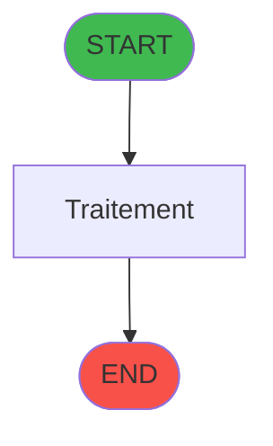
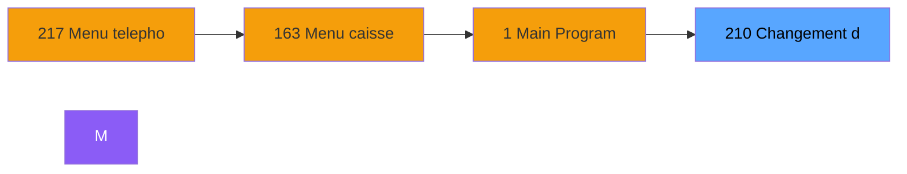

# ADH IDE 210 - Programme supprime (Prg_209)

> **Version spec**: 3.5
> **Analyse**: 2026-01-27 17:57
> **Source**: `Prg_XXX.xml`

---

<!-- TAB:Fonctionnel -->

## SPECIFICATION FONCTIONNELLE

### 1.1 Objectif metier

| Element | Description |
|---------|-------------|
| **Qui** | Operateur |
| **Quoi** | Programme supprime (Prg_209)
 |
| **Pourquoi** | A documenter |
| **Declencheur** | A identifier |

### 1.2 Regles metier

| Code | Regle | Condition |
|------|-------|-----------|
| RM-001 | A documenter | - |

### 1.3 Flux utilisateur

1. Demarrage programme
2. Traitement principal
3. Fin programme

### 1.4 Cas d'erreur

| Erreur | Comportement |
|--------|--------------|
| - | A documenter |

---

<!-- TAB:Technique -->

## SPECIFICATION TECHNIQUE

### 2.1 Identification

| Attribut | Valeur |
|----------|--------|
| **Format IDE** | ADH IDE 210 |
| **Description** | Programme supprime (Prg_209)
 |
| **Module** | ADH |

### 2.2 Tables

| # | Nom logique | Nom physique | Acces | Usage |
|---|-------------|--------------|-------|-------|
| 30 | gm-recherche_____gmr | `cafil008_dat` | L | 1x |
| 30 | gm-recherche_____gmr | `cafil008_dat` | R | 2x |
| 34 | hebergement______heb | `cafil012_dat` | L | 2x |
| 53 | ligne_telephone__lgn | `cafil031_dat` | **W** | 1x |
| 68 | compteurs________cpt | `cafil046_dat` | **W** | 1x |
| 75 | commande_autocom_cot | `cafil053_dat` | **W** | 3x |
| 80 | codes_autocom____aut | `cafil058_dat` | R | 1x |
| 80 | codes_autocom____aut | `cafil058_dat` | **W** | 2x |
| 87 | sda_telephone____sda | `cafil065_dat` | L | 1x |
| 104 | fichier_menage | `cafil082_dat` | R | 1x |
| 130 | fichier_langue | `cafil108_dat` | L | 1x |
| 131 | fichier_validation | `cafil109_dat` | L | 1x |
| 136 | fichier_echanges | `cafil114_dat` | **W** | 6x |
| 151 | nb_code__poste | `cafil129_dat` | **W** | 3x |
| 152 | parametres_pour_pabx | `cafil130_dat` | L | 1x |
| 152 | parametres_pour_pabx | `cafil130_dat` | R | 1x |
### 2.3 Parametres d'entree

| Variable | Nom | Type | Picture |
|----------|-----|------|---------|
| - | Aucun parametre | - | - |
### 2.4 Algorigramme

### 2.5 Expressions cles

| IDE | Expression | Commentaire |
|-----|------------|-------------|
| 1 | `{0,7}='1' OR {0,7}='3'` | - |
| 2 | `'F'` | - |
| 3 | `{0,15}='F'` | - |
| 4 | `{0,15}<>'F'` | - |

> **Total**: 4 expressions (affichees: 4)
### 2.6 Variables importantes

### 2.7 Statistiques

| Metrique | Valeur |
|----------|--------|
| **Taches** | 26 |
| **Lignes logique** | 507 |
| **Lignes desactivees** | 0 |
---

<!-- TAB:Cartographie -->

## CARTOGRAPHIE APPLICATIVE

### 3.1 Chaine d'appels depuis Main

### 3.2 Callers directs

| IDE | Programme | Nb appels |
|-----|-----------|-----------|
| 217 | Menu telephone | 1 |
### 3.3 Callees

| Niv | IDE | Programme | Nb appels |
|-----|-----|-----------|-----------|
| - | - | Programme terminal | - |
### 3.4 Verification orphelin

| Critere | Resultat |
|---------|----------|
| Callers actifs | A verifier |
| **Conclusion** | A analyser |

---

## HISTORIQUE

| Date | Action | Auteur |
|------|--------|--------|
| 2026-01-27 20:23 | **DATA V2** - Tables reelles, Expressions, Stats, CallChain | Script |
| 2026-01-27 19:49 | **DATA POPULATED** - Tables, Callgraph (4 expr) | Script |
| 2026-01-27 17:57 | **Upgrade V3.5** - TAB markers, Mermaid | Claude |

---

*Specification V3.5 - Format avec TAB markers et Mermaid*
