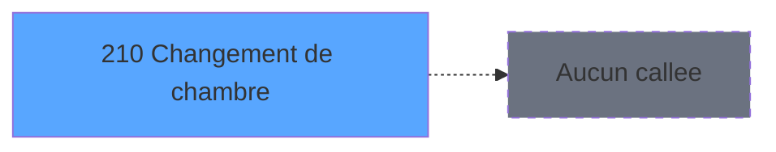

# ADH IDE 210 - Changement de chambre

> **Analyse**: Phases 1-4 2026-02-07 03:53 -> 03:54 (31s) | Assemblage 04:17
> **Pipeline**: V7.2 Enrichi
> **Structure**: 4 onglets (Resume | Ecrans | Donnees | Connexions)

<!-- TAB:Resume -->

## 1. FICHE D'IDENTITE

| Attribut | Valeur |
|----------|--------|
| Projet | ADH |
| IDE Position | 210 |
| Nom Programme | Changement de chambre |
| Fichier source | `Prg_210.xml` |
| Dossier IDE | Change |
| Taches | 26 (1 ecrans visibles) |
| Tables modifiees | 6 |
| Programmes appeles | 0 |
| Complexite | **BASSE** (score 33/100) |

## 2. DESCRIPTION FONCTIONNELLE

# ADH IDE 210 - Changement de chambre

Programme de gestion des changements de numéro de chambre pour les clients. Accessible depuis le menu téléphonie (IDE 217), il permet de modifier l'affectation d'une ligne téléphonique à un nouveau numéro de chambre. Le flux valide d'abord si le nouveau code chambre existe déjà dans la base avant d'autoriser la modification.

La logique métier repose sur une séquence de tâches : vérification de l'existence du code, mise à jour de la table `ligne_telephone__lgn` avec la nouvelle chambre, puis synchronisation dans les tables de comptage (`compteurs________cpt`) et codes auto-com (`codes_autocom____aut`). Un triplet ASCII est généré et écrit dans le fichier d'échanges (`fichier_echanges`) pour communiquer le changement aux équipements téléphoniques externes.

Les tables impliquées gèrent le cycle complet : stockage de la ligne téléphonique, récupération des compteurs d'autocoms, codes d'autorisation, et génération des données d'export au format ASCII triplet nécessaires pour synchroniser les changements avec les systèmes de téléphonie.

## 3. BLOCS FONCTIONNELS

### 3.1 Traitement (12 taches)

Traitements internes.

---

#### <a id="t1"></a>T1 - Veuillez patienter... [ECRAN]

**Role** : Tache d'orchestration : point d'entree du programme (12 sous-taches). Coordonne l'enchainement des traitements.
**Ecran** : 424 x 57 DLU (MDI) | [Voir mockup](#ecran-t1)

<details>
<summary>11 sous-taches directes</summary>

| Tache | Nom | Bloc |
|-------|-----|------|
| [T2](#t2) | Code existe deja? | Traitement |
| [T3](#t3) | Ecriture dans table autocom | Traitement |
| [T6](#t6) | Ecrire ASCII triplet | Traitement |
| [T11](#t11) | Ecrire ASCII triplet | Traitement |
| [T15](#t15) | Tempo 1 seconde | Traitement |
| [T16](#t16) | Formation triplet | Traitement |
| [T17](#t17) | Nettoyage des anciens triplets | Traitement |
| [T19](#t19) | Libère Ligne | Traitement |
| [T20](#t20) | Libère Ligne | Traitement |
| [T21](#t21) | Ecrire ASCII triplet | Traitement |
| [T25](#t25) | Tempo 1 seconde | Traitement |

</details>

---

#### <a id="t2"></a>T2 - Code existe deja?

**Role** : Traitement : Code existe deja?.
**Variables liees** : B (P0 code GM), D (P0 code autocom), F (P0 nb code accepte), L (W0 code autocom)

---

#### <a id="t3"></a>T3 - Ecriture dans table autocom

**Role** : Traitement : Ecriture dans table autocom.
**Variables liees** : D (P0 code autocom), L (W0 code autocom)

---

#### <a id="t6"></a>T6 - Ecrire ASCII triplet

**Role** : Traitement : Ecrire ASCII triplet.
**Variables liees** : G (P0 type triplet), M (W0 triplet)

---

#### <a id="t11"></a>T11 - Ecrire ASCII triplet

**Role** : Traitement : Ecrire ASCII triplet.
**Variables liees** : G (P0 type triplet), M (W0 triplet)

---

#### <a id="t15"></a>T15 - Tempo 1 seconde

**Role** : Traitement : Tempo 1 seconde.

---

#### <a id="t16"></a>T16 - Formation triplet

**Role** : Traitement : Formation triplet.
**Variables liees** : G (P0 type triplet), M (W0 triplet)

---

#### <a id="t17"></a>T17 - Nettoyage des anciens triplets

**Role** : Traitement : Nettoyage des anciens triplets.

---

#### <a id="t19"></a>T19 - Libère Ligne

**Role** : Traitement : Libère Ligne.
**Variables liees** : H (P0 Max Ligne / Poste), J (P0 n° ligne)

---

#### <a id="t20"></a>T20 - Libère Ligne

**Role** : Traitement : Libère Ligne.
**Variables liees** : H (P0 Max Ligne / Poste), J (P0 n° ligne)

---

#### <a id="t21"></a>T21 - Ecrire ASCII triplet

**Role** : Traitement : Ecrire ASCII triplet.
**Variables liees** : G (P0 type triplet), M (W0 triplet)

---

#### <a id="t25"></a>T25 - Tempo 1 seconde

**Role** : Traitement : Tempo 1 seconde.


### 3.2 Calcul (2 taches)

Calculs metier : montants, stocks, compteurs.

---

#### <a id="t4"></a>T4 - Recup. compteur codes

**Role** : Calcul : Recup. compteur codes.

---

#### <a id="t18"></a>T18 - Decrementation compteur

**Role** : Calcul : Decrementation compteur.


### 3.3 Creation (11 taches)

Insertion de nouveaux enregistrements en base.

---

#### <a id="t5"></a>T5 - Creation ASCII

**Role** : Creation d'enregistrement : Creation ASCII.

---

#### <a id="t7"></a>T7 - Creation commande tel

**Role** : Creation d'enregistrement : Creation commande tel.

---

#### <a id="t8"></a>T8 - Creation commande tel

**Role** : Creation d'enregistrement : Creation commande tel.

---

#### <a id="t9"></a>T9 - Creation commande tel

**Role** : Creation d'enregistrement : Creation commande tel.

---

#### <a id="t10"></a>T10 - Creation ASCII

**Role** : Creation d'enregistrement : Creation ASCII.

---

#### <a id="t12"></a>T12 - Creation commande tel

**Role** : Creation d'enregistrement : Creation commande tel.

---

#### <a id="t13"></a>T13 - Creation commande tel

**Role** : Creation d'enregistrement : Creation commande tel.

---

#### <a id="t14"></a>T14 - Creation commande tel

**Role** : Creation d'enregistrement : Creation commande tel.

---

#### <a id="t22"></a>T22 - Creation commande tel

**Role** : Creation d'enregistrement : Creation commande tel.

---

#### <a id="t23"></a>T23 - Creation commande tel

**Role** : Creation d'enregistrement : Creation commande tel.

---

#### <a id="t24"></a>T24 - Creation commande tel

**Role** : Creation d'enregistrement : Creation commande tel.


### 3.4 Validation (1 tache)

Controles de coherence : 1 tache verifie les donnees et conditions.

---

#### <a id="t26"></a>T26 - Controle du nombre de code

**Role** : Calcul : Controle du nombre de code.
**Variables liees** : B (P0 code GM), D (P0 code autocom), F (P0 nb code accepte), L (W0 code autocom)


## 5. REGLES METIER

1 regles identifiees:

### Autres (1 regles)

#### <a id="rm-RM-001"></a>[RM-001] Condition composite: P0 type triplet [G]='1' OR P0 type triplet [G]='3'

| Element | Detail |
|---------|--------|
| **Condition** | `P0 type triplet [G]='1' OR P0 type triplet [G]='3'` |
| **Si vrai** | Action conditionnelle |
| **Variables** | G (P0 type triplet) |
| **Expression source** | Expression 1 : `P0 type triplet [G]='1' OR P0 type triplet [G]='3'` |
| **Exemple** | Si P0 type triplet [G]='1' OR P0 type triplet [G]='3' → Action conditionnelle |

## 6. CONTEXTE

- **Appele par**: [Menu telephone (IDE 217)](ADH-IDE-217.md)
- **Appelle**: 0 programmes | **Tables**: 13 (W:6 R:4 L:6) | **Taches**: 26 | **Expressions**: 4

<!-- TAB:Ecrans -->

## 8. ECRANS

### 8.1 Forms visibles (1 / 26)

| # | Position | Tache | Nom | Type | Largeur | Hauteur | Bloc |
|---|----------|-------|-----|------|---------|---------|------|
| 1 | 210 | T1 | Veuillez patienter... | MDI | 424 | 57 | Traitement |

### 8.2 Mockups Ecrans

---

#### <a id="ecran-t1"></a>210 - Veuillez patienter...
**Tache** : [T1](#t1) | **Type** : MDI | **Dimensions** : 424 x 57 DLU
**Bloc** : Traitement | **Titre IDE** : Veuillez patienter...

<!-- FORM-DATA:
{
    "width":  424,
    "vFactor":  8,
    "type":  "MDI",
    "hFactor":  8,
    "controls":  [
                     {
                         "x":  0,
                         "type":  "label",
                         "var":  "",
                         "y":  0,
                         "w":  423,
                         "fmt":  "",
                         "name":  "",
                         "h":  29,
                         "color":  "",
                         "text":  "",
                         "parent":  null
                     },
                     {
                         "x":  120,
                         "type":  "label",
                         "var":  "",
                         "y":  10,
                         "w":  221,
                         "fmt":  "",
                         "name":  "",
                         "h":  8,
                         "color":  "7",
                         "text":  "Traitement en cours ...",
                         "parent":  null
                     },
                     {
                         "x":  0,
                         "type":  "label",
                         "var":  "",
                         "y":  29,
                         "w":  423,
                         "fmt":  "",
                         "name":  "",
                         "h":  27,
                         "color":  "",
                         "text":  "",
                         "parent":  null
                     },
                     {
                         "x":  72,
                         "type":  "label",
                         "var":  "",
                         "y":  38,
                         "w":  280,
                         "fmt":  "",
                         "name":  "",
                         "h":  8,
                         "color":  "",
                         "text":  "Changement de chambre",
                         "parent":  null
                     },
                     {
                         "x":  4,
                         "type":  "image",
                         "var":  "",
                         "y":  2,
                         "w":  72,
                         "fmt":  "",
                         "name":  "",
                         "h":  25,
                         "color":  "",
                         "text":  "",
                         "parent":  null
                     }
                 ],
    "taskId":  "210",
    "height":  57
}
-->

## 9. NAVIGATION

Ecran unique: **Veuillez patienter...**

### 9.3 Structure hierarchique (26 taches)

| Position | Tache | Type | Dimensions | Bloc |
|----------|-------|------|------------|------|
| **210.1** | [**Veuillez patienter...** (T1)](#t1) [mockup](#ecran-t1) | MDI | 424x57 | Traitement |
| 210.1.1 | [Code existe deja? (T2)](#t2) | MDI | - | |
| 210.1.2 | [Ecriture dans table autocom (T3)](#t3) | MDI | - | |
| 210.1.3 | [Ecrire ASCII triplet (T6)](#t6) | MDI | - | |
| 210.1.4 | [Ecrire ASCII triplet (T11)](#t11) | MDI | - | |
| 210.1.5 | [Tempo 1 seconde (T15)](#t15) | MDI | - | |
| 210.1.6 | [Formation triplet (T16)](#t16) | MDI | - | |
| 210.1.7 | [Nettoyage des anciens triplets (T17)](#t17) | MDI | - | |
| 210.1.8 | [Libère Ligne (T19)](#t19) | MDI | - | |
| 210.1.9 | [Libère Ligne (T20)](#t20) | MDI | - | |
| 210.1.10 | [Ecrire ASCII triplet (T21)](#t21) | MDI | - | |
| 210.1.11 | [Tempo 1 seconde (T25)](#t25) | MDI | - | |
| **210.2** | [**Recup. compteur codes** (T4)](#t4) | MDI | - | Calcul |
| 210.2.1 | [Decrementation compteur (T18)](#t18) | MDI | - | |
| **210.3** | [**Creation ASCII** (T5)](#t5) | MDI | - | Creation |
| 210.3.1 | [Creation commande tel (T7)](#t7) | MDI | - | |
| 210.3.2 | [Creation commande tel (T8)](#t8) | MDI | - | |
| 210.3.3 | [Creation commande tel (T9)](#t9) | MDI | - | |
| 210.3.4 | [Creation ASCII (T10)](#t10) | MDI | - | |
| 210.3.5 | [Creation commande tel (T12)](#t12) | MDI | - | |
| 210.3.6 | [Creation commande tel (T13)](#t13) | MDI | - | |
| 210.3.7 | [Creation commande tel (T14)](#t14) | MDI | - | |
| 210.3.8 | [Creation commande tel (T22)](#t22) | MDI | - | |
| 210.3.9 | [Creation commande tel (T23)](#t23) | MDI | - | |
| 210.3.10 | [Creation commande tel (T24)](#t24) | MDI | - | |
| **210.4** | [**Controle du nombre de code** (T26)](#t26) | MDI | - | Validation |

### 9.4 Algorigramme

```mermaid
flowchart TD
    START([START])
    INIT[Init controles]
    START --> INIT
    B1[Traitement (12t)]
    INIT --> B1
    B2[Calcul (2t)]
    B1 --> B2
    B3[Creation (11t)]
    B2 --> B3
    B4[Validation (1t)]
    B3 --> B4
    WRITE[MAJ 6 tables]
    B4 --> WRITE
    ENDOK([END OK])
    WRITE --> ENDOK

    style START fill:#3fb950,color:#000
    style ENDOK fill:#3fb950,color:#000
    style WRITE fill:#ffeb3b,color:#000
```

> **Legende**: Vert = START/END OK | Rouge = END KO | Bleu = Decisions
> *Algorigramme genere depuis les expressions CONDITION. Utiliser `/algorigramme` pour une synthese metier detaillee.*

<!-- TAB:Donnees -->

## 10. TABLES

### Tables utilisees (13)

| ID | Nom | Description | Type | R | W | L | Usages |
|----|-----|-------------|------|---|---|---|--------|
| 80 | codes_autocom____aut |  | DB | R | **W** |   | 3 |
| 136 | fichier_echanges |  | DB |   | **W** |   | 6 |
| 75 | commande_autocom_cot |  | DB |   | **W** |   | 3 |
| 151 | nb_code__poste |  | DB |   | **W** |   | 3 |
| 68 | compteurs________cpt | Comptes GM (generaux) | DB |   | **W** |   | 1 |
| 53 | ligne_telephone__lgn |  | DB |   | **W** |   | 1 |
| 30 | gm-recherche_____gmr | Index de recherche | DB | R |   | L | 3 |
| 152 | parametres_pour_pabx |  | DB | R |   | L | 2 |
| 104 | fichier_menage |  | DB | R |   |   | 1 |
| 34 | hebergement______heb | Hebergement (chambres) | DB |   |   | L | 2 |
| 131 | fichier_validation |  | DB |   |   | L | 1 |
| 87 | sda_telephone____sda |  | DB |   |   | L | 1 |
| 130 | fichier_langue |  | DB |   |   | L | 1 |

### Colonnes par table (6 / 9 tables avec colonnes identifiees)

<details>
<summary>Table 80 - codes_autocom____aut (R/**W**) - 3 usages</summary>

| Lettre | Variable | Acces | Type |
|--------|----------|-------|------|
| A | W1 ret.lien code | W | Numeric |
| B | W1 fin tâche | W | Alpha |
| C | W2 date debut futur | W | Alpha |
| D | W2 nom ascii | W | Alpha |
| E | W2 triplet | W | Alpha |
| F | W2 retlien HEB actu | W | Numeric |
| G | W2 retlien HEB futur | W | Numeric |

</details>

<details>
<summary>Table 136 - fichier_echanges (**W**) - 6 usages</summary>

*Table utilisee uniquement en Link ou aucune colonne Real identifiee dans le DataView.*

</details>

<details>
<summary>Table 75 - commande_autocom_cot (**W**) - 3 usages</summary>

| Lettre | Variable | Acces | Type |
|--------|----------|-------|------|
| D | P0 code autocom | W | Numeric |
| L | W0 code autocom | W | Numeric |

</details>

<details>
<summary>Table 151 - nb_code__poste (**W**) - 3 usages</summary>

| Lettre | Variable | Acces | Type |
|--------|----------|-------|------|
| A | W1 ret.lien code | W | Numeric |
| B | P0 code GM | W | Numeric |
| D | P0 code autocom | W | Numeric |
| F | P0 nb code accepte | W | Numeric |
| H | P0 Max Ligne / Poste | W | Numeric |
| K | P0 n° poste | W | Numeric |
| L | W0 code autocom | W | Numeric |
| N | W0 n° poste | W | Numeric |

</details>

<details>
<summary>Table 68 - compteurs________cpt (**W**) - 1 usages</summary>

*Table utilisee uniquement en Link ou aucune colonne Real identifiee dans le DataView.*

</details>

<details>
<summary>Table 53 - ligne_telephone__lgn (**W**) - 1 usages</summary>

| Lettre | Variable | Acces | Type |
|--------|----------|-------|------|
| A | W3 ret.lien ligne | W | Numeric |
| B | W3 ret.lien SDA | W | Numeric |
| C | W3 fin tâche | W | Alpha |

</details>

<details>
<summary>Table 30 - gm-recherche_____gmr (R/L) - 3 usages</summary>

| Lettre | Variable | Acces | Type |
|--------|----------|-------|------|
| A | W1 nom ASCII | R | Alpha |
| B | W1 fin tâche | R | Alpha |

</details>

<details>
<summary>Table 152 - parametres_pour_pabx (R/L) - 2 usages</summary>

*Table utilisee uniquement en Link ou aucune colonne Real identifiee dans le DataView.*

</details>

<details>
<summary>Table 104 - fichier_menage (R) - 1 usages</summary>

| Lettre | Variable | Acces | Type |
|--------|----------|-------|------|
| A | W1 fin tâche | R | Alpha |
| B | W1 ret.lien HEB | R | Numeric |
| C | W1 date debut | R | Alpha |
| D | W1 date fin | R | Alpha |
| E | W1 Heb futur ? | R | Numeric |
| F | W1 date deb future | R | Alpha |

</details>

## 11. VARIABLES

### 11.1 Parametres entrants (11)

Variables recues du programme appelant ([Menu telephone (IDE 217)](ADH-IDE-217.md)).

| Lettre | Nom | Type | Usage dans |
|--------|-----|------|-----------|
| A | P0 societe | Alpha | - |
| B | P0 code GM | Numeric | - |
| C | P0 filiation | Numeric | - |
| D | P0 code autocom | Numeric | - |
| E | P0 nom village | Alpha | - |
| F | P0 nb code accepte | Numeric | - |
| G | P0 type triplet | Alpha | [T6](#t6), [T11](#t11), [T16](#t16) |
| H | P0 Max Ligne / Poste | Numeric | - |
| I | P0 Interface | Alpha | - |
| J | P0 n° ligne | Numeric | - |
| K | P0 n° poste | Numeric | - |

### 11.2 Variables de travail (4)

Variables internes au programme.

| Lettre | Nom | Type | Usage dans |
|--------|-----|------|-----------|
| L | W0 code autocom | Numeric | - |
| M | W0 triplet | Alpha | - |
| N | W0 n° poste | Numeric | - |
| O | W0 fin tâche | Alpha | 2x calcul interne |

## 12. EXPRESSIONS

**4 / 4 expressions decodees (100%)**

### 12.1 Repartition par type

| Type | Expressions | Regles |
|------|-------------|--------|
| CONSTANTE | 1 | 0 |
| CONDITION | 3 | 0 |

### 12.2 Expressions cles par type

#### CONSTANTE (1 expressions)

| Type | IDE | Expression | Regle |
|------|-----|------------|-------|
| CONSTANTE | 2 | `'F'` | - |

#### CONDITION (3 expressions)

| Type | IDE | Expression | Regle |
|------|-----|------------|-------|
| CONDITION | 4 | `W0 fin tâche [O]<>'F'` | - |
| CONDITION | 3 | `W0 fin tâche [O]='F'` | - |
| CONDITION | 1 | `P0 type triplet [G]='1' OR P0 type triplet [G]='3'` | - |

<!-- TAB:Connexions -->

## 13. GRAPHE D'APPELS

### 13.1 Chaine depuis Main (Callers)

Main -> ... -> [Menu telephone (IDE 217)](ADH-IDE-217.md) -> **Changement de chambre (IDE 210)**


### 13.2 Callers

| IDE | Nom Programme | Nb Appels |
|-----|---------------|-----------|
| [217](ADH-IDE-217.md) | Menu telephone | 1 |

### 13.3 Callees (programmes appeles)



### 13.4 Detail Callees avec contexte

| IDE | Nom Programme | Appels | Contexte |
|-----|---------------|--------|----------|
| - | (aucun) | - | - |

## 14. RECOMMANDATIONS MIGRATION

### 14.1 Profil du programme

| Metrique | Valeur | Impact migration |
|----------|--------|-----------------|
| Lignes de logique | 507 | Programme volumineux |
| Expressions | 4 | Peu de logique |
| Tables WRITE | 6 | Fort impact donnees |
| Sous-programmes | 0 | Peu de dependances |
| Ecrans visibles | 1 | Ecran unique ou traitement batch |
| Code desactive | 0% (0 / 507) | Code sain |
| Regles metier | 1 | Quelques regles a preserver |

### 14.2 Plan de migration par bloc

#### Traitement (12 taches: 1 ecran, 11 traitements)

- **Strategie** : Orchestrateur avec 1 ecrans (Razor/React) et 11 traitements backend (services).
- Les ecrans deviennent des composants UI, les traitements invisibles deviennent des services injectables.
- Decomposer les taches en services unitaires testables.

#### Calcul (2 taches: 0 ecran, 2 traitements)

- **Strategie** : Services de calcul purs (Domain Services).
- Migrer la logique de calcul (stock, compteurs, montants)

#### Creation (11 taches: 0 ecran, 11 traitements)

- **Strategie** : Repository pattern avec Entity Framework Core.
- Insertion via `IRepository<T>.CreateAsync()`

#### Validation (1 tache: 0 ecran, 1 traitement)

- **Strategie** : FluentValidation avec validators specifiques.
- Chaque tache de validation -> un validator injectable

### 14.3 Dependances critiques

| Dependance | Type | Appels | Impact |
|------------|------|--------|--------|
| ligne_telephone__lgn | Table WRITE (Database) | 1x | Schema + repository |
| compteurs________cpt | Table WRITE (Database) | 1x | Schema + repository |
| commande_autocom_cot | Table WRITE (Database) | 3x | Schema + repository |
| codes_autocom____aut | Table WRITE (Database) | 2x | Schema + repository |
| fichier_echanges | Table WRITE (Database) | 6x | Schema + repository |
| nb_code__poste | Table WRITE (Database) | 3x | Schema + repository |

---
*Spec DETAILED generee par Pipeline V7.2 - 2026-02-08 04:18*
