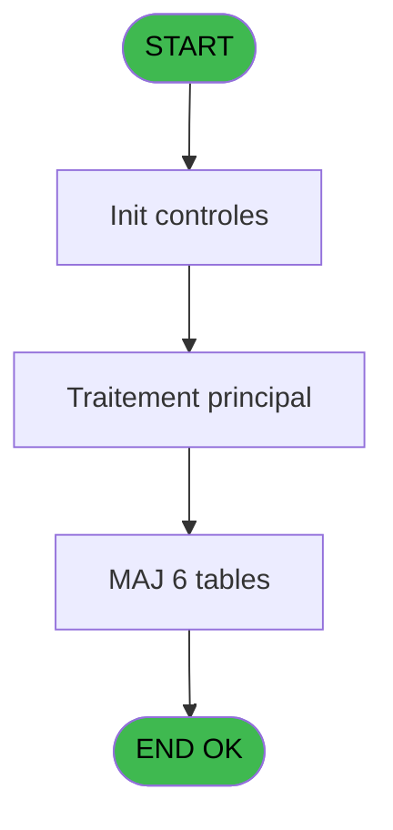

# ADH IDE 210 - Changement de chambre

> **Analyse**: Phases 1-4 2026-02-07 03:53 -> 03:54 (31s) | Assemblage 03:54
> **Pipeline**: V7.2 Enrichi
> **Structure**: 4 onglets (Resume | Ecrans | Donnees | Connexions)

<!-- TAB:Resume -->

## 1. FICHE D'IDENTITE

| Attribut | Valeur |
|----------|--------|
| Projet | ADH |
| IDE Position | 210 |
| Nom Programme | Changement de chambre |
| Fichier source | `Prg_210.xml` |
| Dossier IDE | Change |
| Taches | 26 (1 ecrans visibles) |
| Tables modifiees | 6 |
| Programmes appeles | 0 |

## 2. DESCRIPTION FONCTIONNELLE

**Changement de chambre** assure la gestion complete de ce processus, accessible depuis [Menu telephone (IDE 217)](ADH-IDE-217.md).

Le flux de traitement s'organise en **4 blocs fonctionnels** :

- **Traitement** (12 taches) : traitements metier divers
- **Creation** (11 taches) : insertion d'enregistrements en base (mouvements, prestations)
- **Calcul** (2 taches) : calculs de montants, stocks ou compteurs
- **Validation** (1 tache) : controles et verifications de coherence

**Donnees modifiees** : 6 tables en ecriture (ligne_telephone__lgn, compteurs________cpt, commande_autocom_cot, codes_autocom____aut, fichier_echanges, nb_code__poste).

Detail : phases du traitement

#### Phase 1 : Traitement (12 taches)

- **210** - Veuillez patienter... **[[ECRAN]](#ecran-t1)**
- **210.1** - Code existe deja?
- **210.2** - Ecriture dans table autocom
- **210.4.1** - Ecrire ASCII triplet
- **210.5.1** - Ecrire ASCII triplet
- **210.6** - Tempo 1 seconde
- **210.7** - Formation triplet
- **210.7.1** - Nettoyage des anciens triplets
- **210.7.1.2** - Libère Ligne
- **210.7.1.3** - Libère Ligne
- **210.7.1.4** - Ecrire ASCII triplet
- **210.7.1.8** - Tempo 1 seconde

#### Phase 2 : Calcul (2 taches)

- **210.3** - Recup. compteur codes
- **210.7.1.1** - Decrementation compteur

#### Phase 3 : Creation (11 taches)

- **210.4** - Creation ASCII
- **210.4.2** - Creation commande tel
- **210.4.3** - Creation commande tel
- **210.4.4** - Creation commande tel
- **210.5** - Creation ASCII
- **210.5.2** - Creation commande tel
- **210.5.3** - Creation commande tel
- **210.5.4** - Creation commande tel
- **210.7.1.5** - Creation commande tel
- **210.7.1.6** - Creation commande tel
- **210.7.1.7** - Creation commande tel

#### Phase 4 : Validation (1 tache)

- **210.7.2** - Controle du nombre de code

#### Tables impactees

| Table | Operations | Role metier |
|-------|-----------|-------------|
| fichier_echanges | **W** (6 usages) |  |
| commande_autocom_cot | **W** (3 usages) |  |
| nb_code__poste | **W** (3 usages) |  |
| codes_autocom____aut | R/**W** (3 usages) |  |
| ligne_telephone__lgn | **W** (1 usages) |  |
| compteurs________cpt | **W** (1 usages) | Comptes GM (generaux) |

## 3. BLOCS FONCTIONNELS

### 3.1 Traitement (12 taches)

Traitements internes.

---

#### 210 - Veuillez patienter... [[ECRAN]](#ecran-t1)

**Role** : Tache d'orchestration : point d'entree du programme (12 sous-taches). Coordonne l'enchainement des traitements.
**Ecran** : 424 x 57 DLU (MDI) | [Voir mockup](#ecran-t1)

11 sous-taches directes

| Tache | Nom | Bloc |
|-------|-----|------|
| [210.1](#t2) | Code existe deja? | Traitement |
| [210.2](#t3) | Ecriture dans table autocom | Traitement |
| [210.4.1](#t6) | Ecrire ASCII triplet | Traitement |
| [210.5.1](#t11) | Ecrire ASCII triplet | Traitement |
| [210.6](#t15) | Tempo 1 seconde | Traitement |
| [210.7](#t16) | Formation triplet | Traitement |
| [210.7.1](#t17) | Nettoyage des anciens triplets | Traitement |
| [210.7.1.2](#t19) | Libère Ligne | Traitement |
| [210.7.1.3](#t20) | Libère Ligne | Traitement |
| [210.7.1.4](#t21) | Ecrire ASCII triplet | Traitement |
| [210.7.1.8](#t25) | Tempo 1 seconde | Traitement |

---

#### 210.1 - Code existe deja?

**Role** : Traitement : Code existe deja?.
**Variables liees** : B (P0 code GM), D (P0 code autocom), F (P0 nb code accepte), L (W0 code autocom)

---

#### 210.2 - Ecriture dans table autocom

**Role** : Traitement : Ecriture dans table autocom.
**Variables liees** : D (P0 code autocom), L (W0 code autocom)

---

#### 210.4.1 - Ecrire ASCII triplet

**Role** : Traitement : Ecrire ASCII triplet.
**Variables liees** : G (P0 type triplet), M (W0 triplet)

---

#### 210.5.1 - Ecrire ASCII triplet

**Role** : Traitement : Ecrire ASCII triplet.
**Variables liees** : G (P0 type triplet), M (W0 triplet)

---

#### 210.6 - Tempo 1 seconde

**Role** : Traitement : Tempo 1 seconde.

---

#### 210.7 - Formation triplet

**Role** : Traitement : Formation triplet.
**Variables liees** : G (P0 type triplet), M (W0 triplet)

---

#### 210.7.1 - Nettoyage des anciens triplets

**Role** : Traitement : Nettoyage des anciens triplets.

---

#### 210.7.1.2 - Libère Ligne

**Role** : Traitement : Libère Ligne.
**Variables liees** : H (P0 Max Ligne / Poste), J (P0 n° ligne)

---

#### 210.7.1.3 - Libère Ligne

**Role** : Traitement : Libère Ligne.
**Variables liees** : H (P0 Max Ligne / Poste), J (P0 n° ligne)

---

#### 210.7.1.4 - Ecrire ASCII triplet

**Role** : Traitement : Ecrire ASCII triplet.
**Variables liees** : G (P0 type triplet), M (W0 triplet)

---

#### 210.7.1.8 - Tempo 1 seconde

**Role** : Traitement : Tempo 1 seconde.

### 3.2 Calcul (2 taches)

Calculs metier : montants, stocks, compteurs.

---

#### 210.3 - Recup. compteur codes

**Role** : Calcul : Recup. compteur codes.

---

#### 210.7.1.1 - Decrementation compteur

**Role** : Calcul : Decrementation compteur.

### 3.3 Creation (11 taches)

Insertion de nouveaux enregistrements en base.

---

#### 210.4 - Creation ASCII

**Role** : Creation d'enregistrement : Creation ASCII.

---

#### 210.4.2 - Creation commande tel

**Role** : Creation d'enregistrement : Creation commande tel.

---

#### 210.4.3 - Creation commande tel

**Role** : Creation d'enregistrement : Creation commande tel.

---

#### 210.4.4 - Creation commande tel

**Role** : Creation d'enregistrement : Creation commande tel.

---

#### 210.5 - Creation ASCII

**Role** : Creation d'enregistrement : Creation ASCII.

---

#### 210.5.2 - Creation commande tel

**Role** : Creation d'enregistrement : Creation commande tel.

---

#### 210.5.3 - Creation commande tel

**Role** : Creation d'enregistrement : Creation commande tel.

---

#### 210.5.4 - Creation commande tel

**Role** : Creation d'enregistrement : Creation commande tel.

---

#### 210.7.1.5 - Creation commande tel

**Role** : Creation d'enregistrement : Creation commande tel.

---

#### 210.7.1.6 - Creation commande tel

**Role** : Creation d'enregistrement : Creation commande tel.

---

#### 210.7.1.7 - Creation commande tel

**Role** : Creation d'enregistrement : Creation commande tel.

### 3.4 Validation (1 tache)

Controles de coherence : 1 tache verifie les donnees et conditions.

---

#### 210.7.2 - Controle du nombre de code

**Role** : Calcul : Controle du nombre de code.
**Variables liees** : B (P0 code GM), D (P0 code autocom), F (P0 nb code accepte), L (W0 code autocom)

## 5. REGLES METIER

*(Aucune regle metier identifiee)*

## 6. CONTEXTE

- **Appele par**: [Menu telephone (IDE 217)](ADH-IDE-217.md)
- **Appelle**: 0 programmes | **Tables**: 13 (W:6 R:4 L:6) | **Taches**: 26 | **Expressions**: 4

<!-- TAB:Ecrans -->

## 8. ECRANS

### 8.1 Forms visibles (1 / 26)

| # | Position | Tache | Nom | Type | Largeur | Hauteur | Bloc |
|---|----------|-------|-----|------|---------|---------|------|
| 1 | 210 | 210 | Veuillez patienter... | MDI | 424 | 57 | Traitement |

### 8.2 Mockups Ecrans

---

#### 210 - Veuillez patienter...
**Tache** : [210](#t1) | **Type** : MDI | **Dimensions** : 424 x 57 DLU
**Bloc** : Traitement | **Titre IDE** : Veuillez patienter...

<!-- FORM-DATA:
{
    "width":  424,
    "vFactor":  8,
    "type":  "MDI",
    "hFactor":  8,
    "controls":  [
                     {
                         "x":  0,
                         "type":  "label",
                         "var":  "",
                         "y":  0,
                         "w":  423,
                         "fmt":  "",
                         "name":  "",
                         "h":  29,
                         "color":  "",
                         "text":  "",
                         "parent":  null
                     },
                     {
                         "x":  120,
                         "type":  "label",
                         "var":  "",
                         "y":  10,
                         "w":  221,
                         "fmt":  "",
                         "name":  "",
                         "h":  8,
                         "color":  "7",
                         "text":  "Traitement en cours ...",
                         "parent":  null
                     },
                     {
                         "x":  0,
                         "type":  "label",
                         "var":  "",
                         "y":  29,
                         "w":  423,
                         "fmt":  "",
                         "name":  "",
                         "h":  27,
                         "color":  "",
                         "text":  "",
                         "parent":  null
                     },
                     {
                         "x":  72,
                         "type":  "label",
                         "var":  "",
                         "y":  38,
                         "w":  280,
                         "fmt":  "",
                         "name":  "",
                         "h":  8,
                         "color":  "",
                         "text":  "Changement de chambre",
                         "parent":  null
                     },
                     {
                         "x":  4,
                         "type":  "image",
                         "var":  "",
                         "y":  2,
                         "w":  72,
                         "fmt":  "",
                         "name":  "",
                         "h":  25,
                         "color":  "",
                         "text":  "",
                         "parent":  null
                     }
                 ],
    "taskId":  "210",
    "height":  57
}
-->

## 9. NAVIGATION

Ecran unique: **Veuillez patienter...**

### 9.3 Structure hierarchique (26 taches)

| Position | Tache | Type | Dimensions | Bloc |
|----------|-------|------|------------|------|
| **210.1** | [**Veuillez patienter...** (210)](#t1) [mockup](#ecran-t1) | MDI | 424x57 | Traitement |
| 210.1.1 | [Code existe deja? (210.1)](#t2) | MDI | - | |
| 210.1.2 | [Ecriture dans table autocom (210.2)](#t3) | MDI | - | |
| 210.1.3 | [Ecrire ASCII triplet (210.4.1)](#t6) | MDI | - | |
| 210.1.4 | [Ecrire ASCII triplet (210.5.1)](#t11) | MDI | - | |
| 210.1.5 | [Tempo 1 seconde (210.6)](#t15) | MDI | - | |
| 210.1.6 | [Formation triplet (210.7)](#t16) | MDI | - | |
| 210.1.7 | [Nettoyage des anciens triplets (210.7.1)](#t17) | MDI | - | |
| 210.1.8 | [Libère Ligne (210.7.1.2)](#t19) | MDI | - | |
| 210.1.9 | [Libère Ligne (210.7.1.3)](#t20) | MDI | - | |
| 210.1.10 | [Ecrire ASCII triplet (210.7.1.4)](#t21) | MDI | - | |
| 210.1.11 | [Tempo 1 seconde (210.7.1.8)](#t25) | MDI | - | |
| **210.2** | [**Recup. compteur codes** (210.3)](#t4) | MDI | - | Calcul |
| 210.2.1 | [Decrementation compteur (210.7.1.1)](#t18) | MDI | - | |
| **210.3** | [**Creation ASCII** (210.4)](#t5) | MDI | - | Creation |
| 210.3.1 | [Creation commande tel (210.4.2)](#t7) | MDI | - | |
| 210.3.2 | [Creation commande tel (210.4.3)](#t8) | MDI | - | |
| 210.3.3 | [Creation commande tel (210.4.4)](#t9) | MDI | - | |
| 210.3.4 | [Creation ASCII (210.5)](#t10) | MDI | - | |
| 210.3.5 | [Creation commande tel (210.5.2)](#t12) | MDI | - | |
| 210.3.6 | [Creation commande tel (210.5.3)](#t13) | MDI | - | |
| 210.3.7 | [Creation commande tel (210.5.4)](#t14) | MDI | - | |
| 210.3.8 | [Creation commande tel (210.7.1.5)](#t22) | MDI | - | |
| 210.3.9 | [Creation commande tel (210.7.1.6)](#t23) | MDI | - | |
| 210.3.10 | [Creation commande tel (210.7.1.7)](#t24) | MDI | - | |
| **210.4** | [**Controle du nombre de code** (210.7.2)](#t26) | MDI | - | Validation |

### 9.4 Algorigramme

> **Legende**: Vert = START/END OK | Rouge = END KO | Bleu = Decisions
> *Algorigramme auto-genere. Utiliser `/algorigramme` pour une synthese metier detaillee.*

<!-- TAB:Donnees -->

## 10. TABLES

### Tables utilisees (13)

| ID | Nom | Description | Type | R | W | L | Usages |
|----|-----|-------------|------|---|---|---|--------|
| 30 | gm-recherche_____gmr | Index de recherche | DB | R |   | L | 3 |
| 34 | hebergement______heb | Hebergement (chambres) | DB |   |   | L | 2 |
| 53 | ligne_telephone__lgn |  | DB |   | **W** |   | 1 |
| 68 | compteurs________cpt | Comptes GM (generaux) | DB |   | **W** |   | 1 |
| 75 | commande_autocom_cot |  | DB |   | **W** |   | 3 |
| 80 | codes_autocom____aut |  | DB | R | **W** |   | 3 |
| 87 | sda_telephone____sda |  | DB |   |   | L | 1 |
| 104 | fichier_menage |  | DB | R |   |   | 1 |
| 130 | fichier_langue |  | DB |   |   | L | 1 |
| 131 | fichier_validation |  | DB |   |   | L | 1 |
| 136 | fichier_echanges |  | DB |   | **W** |   | 6 |
| 151 | nb_code__poste |  | DB |   | **W** |   | 3 |
| 152 | parametres_pour_pabx |  | DB | R |   | L | 2 |

### Colonnes par table (6 / 9 tables avec colonnes identifiees)

Table 30 - gm-recherche_____gmr (R/L) - 3 usages

| Lettre | Variable | Acces | Type |
|--------|----------|-------|------|
| A | W1 nom ASCII | R | Alpha |
| B | W1 fin tâche | R | Alpha |

Table 53 - ligne_telephone__lgn (**W**) - 1 usages

| Lettre | Variable | Acces | Type |
|--------|----------|-------|------|
| A | W3 ret.lien ligne | W | Numeric |
| B | W3 ret.lien SDA | W | Numeric |
| C | W3 fin tâche | W | Alpha |

Table 68 - compteurs________cpt (**W**) - 1 usages

*Table utilisee uniquement en Link ou aucune colonne Real identifiee dans le DataView.*

Table 75 - commande_autocom_cot (**W**) - 3 usages

| Lettre | Variable | Acces | Type |
|--------|----------|-------|------|
| D | P0 code autocom | W | Numeric |
| L | W0 code autocom | W | Numeric |

Table 80 - codes_autocom____aut (R/**W**) - 3 usages

| Lettre | Variable | Acces | Type |
|--------|----------|-------|------|
| A | W1 ret.lien code | W | Numeric |
| B | W1 fin tâche | W | Alpha |
| C | W2 date debut futur | W | Alpha |
| D | W2 nom ascii | W | Alpha |
| E | W2 triplet | W | Alpha |
| F | W2 retlien HEB actu | W | Numeric |
| G | W2 retlien HEB futur | W | Numeric |

Table 104 - fichier_menage (R) - 1 usages

| Lettre | Variable | Acces | Type |
|--------|----------|-------|------|
| A | W1 fin tâche | R | Alpha |
| B | W1 ret.lien HEB | R | Numeric |
| C | W1 date debut | R | Alpha |
| D | W1 date fin | R | Alpha |
| E | W1 Heb futur ? | R | Numeric |
| F | W1 date deb future | R | Alpha |

Table 136 - fichier_echanges (**W**) - 6 usages

*Table utilisee uniquement en Link ou aucune colonne Real identifiee dans le DataView.*

Table 151 - nb_code__poste (**W**) - 3 usages

| Lettre | Variable | Acces | Type |
|--------|----------|-------|------|
| A | W1 ret.lien code | W | Numeric |
| B | P0 code GM | W | Numeric |
| D | P0 code autocom | W | Numeric |
| F | P0 nb code accepte | W | Numeric |
| H | P0 Max Ligne / Poste | W | Numeric |
| K | P0 n° poste | W | Numeric |
| L | W0 code autocom | W | Numeric |
| N | W0 n° poste | W | Numeric |

Table 152 - parametres_pour_pabx (R/L) - 2 usages

*Table utilisee uniquement en Link ou aucune colonne Real identifiee dans le DataView.*

## 11. VARIABLES

### 11.1 Parametres entrants (11)

Variables recues du programme appelant ([Menu telephone (IDE 217)](ADH-IDE-217.md)).

| Lettre | Nom | Type | Usage dans |
|--------|-----|------|-----------|
| A | P0 societe | Alpha | - |
| B | P0 code GM | Numeric | - |
| C | P0 filiation | Numeric | - |
| D | P0 code autocom | Numeric | - |
| E | P0 nom village | Alpha | - |
| F | P0 nb code accepte | Numeric | - |
| G | P0 type triplet | Alpha | [210.4.1](#t6), [210.5.1](#t11), [210.7](#t16) |
| H | P0 Max Ligne / Poste | Numeric | - |
| I | P0 Interface | Alpha | - |
| J | P0 n° ligne | Numeric | - |
| K | P0 n° poste | Numeric | - |

### 11.2 Variables de travail (4)

Variables internes au programme.

| Lettre | Nom | Type | Usage dans |
|--------|-----|------|-----------|
| L | W0 code autocom | Numeric | - |
| M | W0 triplet | Alpha | - |
| N | W0 n° poste | Numeric | - |
| O | W0 fin tâche | Alpha | 2x calcul interne |

## 12. EXPRESSIONS

**4 / 4 expressions decodees (100%)**

### 12.1 Repartition par type

| Type | Expressions | Regles |
|------|-------------|--------|
| CONSTANTE | 1 | 0 |
| CONDITION | 3 | 0 |

### 12.2 Expressions cles par type

#### CONSTANTE (1 expressions)

| Type | IDE | Expression | Regle |
|------|-----|------------|-------|
| CONSTANTE | 2 | `'F'` | - |

#### CONDITION (3 expressions)

| Type | IDE | Expression | Regle |
|------|-----|------------|-------|
| CONDITION | 4 | `W0 fin tâche [O]<>'F'` | - |
| CONDITION | 3 | `W0 fin tâche [O]='F'` | - |
| CONDITION | 1 | `P0 type triplet [G]='1' OR P0 type triplet [G]='3'` | - |

<!-- TAB:Connexions -->

## 13. GRAPHE D'APPELS

### 13.1 Chaine depuis Main (Callers)

Main -> ... -> [Menu telephone (IDE 217)](ADH-IDE-217.md) -> **Changement de chambre (IDE 210)**

### 13.2 Callers

| IDE | Nom Programme | Nb Appels |
|-----|---------------|-----------|
| [217](ADH-IDE-217.md) | Menu telephone | 1 |

### 13.3 Callees (programmes appeles)

### 13.4 Detail Callees avec contexte

| IDE | Nom Programme | Appels | Contexte |
|-----|---------------|--------|----------|
| - | (aucun) | - | - |

## 14. RECOMMANDATIONS MIGRATION

### 14.1 Profil du programme

| Metrique | Valeur | Impact migration |
|----------|--------|-----------------|
| Lignes de logique | 507 | Programme volumineux |
| Expressions | 4 | Peu de logique |
| Tables WRITE | 6 | Fort impact donnees |
| Sous-programmes | 0 | Peu de dependances |
| Ecrans visibles | 1 | Ecran unique ou traitement batch |
| Code desactive | 0% (0 / 507) | Code sain |
| Regles metier | 0 | Pas de regle identifiee |

### 14.2 Plan de migration par bloc

#### Traitement (12 taches: 1 ecran, 11 traitements)

- **Strategie** : Orchestrateur avec 1 ecrans (Razor/React) et 11 traitements backend (services).
- Les ecrans deviennent des composants UI, les traitements invisibles deviennent des services injectables.
- Decomposer les taches en services unitaires testables.

#### Calcul (2 taches: 0 ecran, 2 traitements)

- **Strategie** : Services de calcul purs (Domain Services).
- Migrer la logique de calcul (stock, compteurs, montants)

#### Creation (11 taches: 0 ecran, 11 traitements)

- **Strategie** : Repository pattern avec Entity Framework Core.
- Insertion via `IRepository<T>.CreateAsync()`

#### Validation (1 tache: 0 ecran, 1 traitement)

- **Strategie** : FluentValidation avec validators specifiques.
- Chaque tache de validation -> un validator injectable

### 14.3 Dependances critiques

| Dependance | Type | Appels | Impact |
|------------|------|--------|--------|
| ligne_telephone__lgn | Table WRITE (Database) | 1x | Schema + repository |
| compteurs________cpt | Table WRITE (Database) | 1x | Schema + repository |
| commande_autocom_cot | Table WRITE (Database) | 3x | Schema + repository |
| codes_autocom____aut | Table WRITE (Database) | 2x | Schema + repository |
| fichier_echanges | Table WRITE (Database) | 6x | Schema + repository |
| nb_code__poste | Table WRITE (Database) | 3x | Schema + repository |

---
*Spec DETAILED generee par Pipeline V7.2 - 2026-02-07 03:54*
