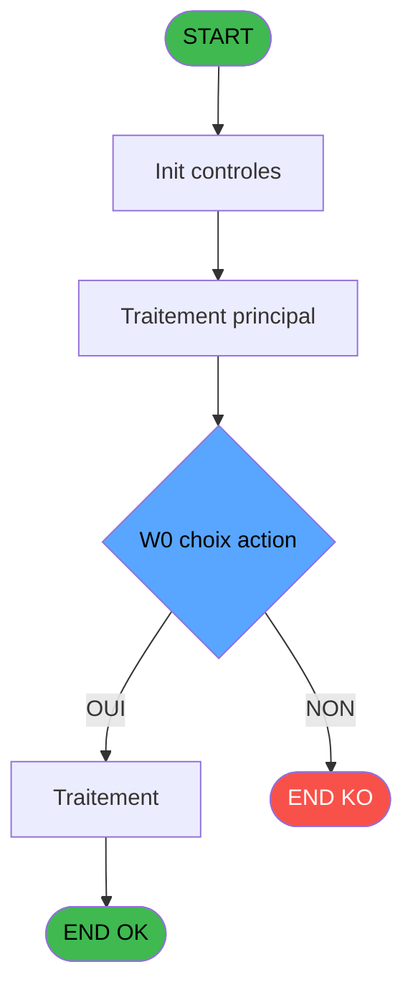
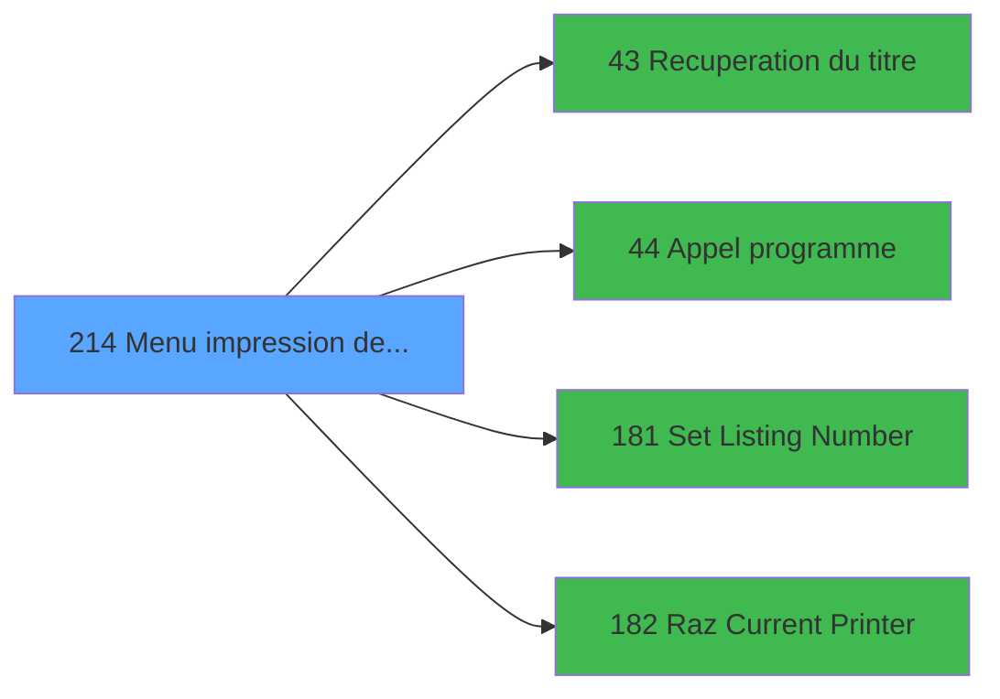

# ADH IDE 214 - Menu impression des appels

> **Analyse**: Phases 1-4 2026-02-08 04:18 -> 04:18 (4s) | Assemblage 04:18
> **Pipeline**: V7.2 Enrichi
> **Structure**: 4 onglets (Resume | Ecrans | Donnees | Connexions)

<!-- TAB:Resume -->

## 1. FICHE D'IDENTITE

| Attribut | Valeur |
|----------|--------|
| Projet | ADH |
| IDE Position | 214 |
| Nom Programme | Menu impression des appels |
| Fichier source | `Prg_214.xml` |
| Dossier IDE | Navigation |
| Taches | 1 (0 ecrans visibles) |
| Tables modifiees | 0 |
| Programmes appeles | 4 |
| Complexite | **BASSE** (score 5/100) |
| Statut | **ORPHELIN_POTENTIEL** |

## 2. DESCRIPTION FONCTIONNELLE

ADH IDE 214 est un menu de gestion d'impression dédié aux appels téléphoniques. Ce programme orchestre le workflow complet d'impression en coordinant quatre sous-programmes critiques : récupération du titre (IDE 43), appel de la fonction d'impression principale (IDE 44), configuration du numéro de listing (IDE 181), et réinitialisation de l'imprimante (IDE 182). Le flux garantit que chaque appel est imprimé avec les paramètres corrects avant de réinitialiser l'état de l'imprimante.

La logique opérationnelle suit une séquence déterministe : d'abord récupérer le titre de l'appel depuis IDE 43, puis exécuter l'impression via IDE 44 avec ce titre, ensuite configurer le numéro de listing via IDE 181 pour les appels suivants, et enfin nettoyer l'état de l'imprimante via IDE 182. Cette orchestration assure que l'imprimante revient à un état cohérent après chaque cycle d'impression.

Ce programme fait partie de la couche présentation/impression du module ADH (Adhérents/Caisse) et supporte le sous-module **Telephone** (phases 8 du plan migration). Il est appelé depuis le menu principal ou depuis des workflows d'impression contextuels dans les écrans de gestion des lignes téléphoniques.

## 3. BLOCS FONCTIONNELS

## 5. REGLES METIER

2 regles identifiees:

### Autres (2 regles)

#### [RM-001] Condition: W0 choix action [M] egale '1'

| Element | Detail |
|---------|--------|
| **Condition** | `W0 choix action [M]='1'` |
| **Si vrai** | Action si vrai |
| **Variables** | EZ (W0 choix action) |
| **Expression source** | Expression 6 : `W0 choix action [M]='1'` |
| **Exemple** | Si W0 choix action [M]='1' → Action si vrai |

#### [RM-002] Condition: W0 choix action [M] egale '2'

| Element | Detail |
|---------|--------|
| **Condition** | `W0 choix action [M]='2'` |
| **Si vrai** | Action si vrai |
| **Variables** | EZ (W0 choix action) |
| **Expression source** | Expression 7 : `W0 choix action [M]='2'` |
| **Exemple** | Si W0 choix action [M]='2' → Action si vrai |

## 6. CONTEXTE

- **Appele par**: (aucun)
- **Appelle**: 4 programmes | **Tables**: 0 (W:0 R:0 L:0) | **Taches**: 1 | **Expressions**: 8

<!-- TAB:Ecrans -->

## 8. ECRANS

*(Programme sans ecran visible)*

## 9. NAVIGATION

### 9.3 Structure hierarchique (0 tache)

| Position | Tache | Type | Dimensions | Bloc |
|----------|-------|------|------------|------|

### 9.4 Algorigramme

> **Legende**: Vert = START/END OK | Rouge = END KO | Bleu = Decisions
> *Algorigramme auto-genere. Utiliser `/algorigramme` pour une synthese metier detaillee.*

<!-- TAB:Donnees -->

## 10. TABLES

### Tables utilisees (0)

| ID | Nom | Description | Type | R | W | L | Usages |
|----|-----|-------------|------|---|---|---|--------|

### Colonnes par table (0 / 0 tables avec colonnes identifiees)

## 11. VARIABLES

### 11.1 Parametres entrants (12)

Variables recues en parametre.

| Lettre | Nom | Type | Usage dans |
|--------|-----|------|-----------|
| EN | P0 societe | Alpha | - |
| EO | P0 code GM | Numeric | - |
| EP | P0 filiation | Numeric | - |
| EQ | P0 code autocom | Numeric | - |
| ER | P0 masque montant | Alpha | - |
| ES | P0 masque cumul | Alpha | - |
| ET | P0 nbre decimales | Numeric | - |
| EU | P0 nom village | Alpha | - |
| EV | P0 telephone | Alpha | - |
| EW | P0 fax | Alpha | - |
| EX | P0 nom | Alpha | - |
| EY | P0 prenom | Alpha | - |

### 11.2 Variables de session (1)

Variables persistantes pendant toute la session.

| Lettre | Nom | Type | Usage dans |
|--------|-----|------|-----------|
| FA | v. titre ecran | Alpha | 1x session |

### 11.3 Variables de travail (1)

Variables internes au programme.

| Lettre | Nom | Type | Usage dans |
|--------|-----|------|-----------|
| EZ | W0 choix action | Alpha | 2x calcul interne |

## 12. EXPRESSIONS

**8 / 8 expressions decodees (100%)**

### 12.1 Repartition par type

| Type | Expressions | Regles |
|------|-------------|--------|
| CONDITION | 2 | 2 |
| CONSTANTE | 3 | 0 |
| DATE | 1 | 0 |
| REFERENCE_VG | 1 | 0 |
| STRING | 1 | 0 |

### 12.2 Expressions cles par type

#### CONDITION (2 expressions)

| Type | IDE | Expression | Regle |
|------|-----|------------|-------|
| CONDITION | 7 | `W0 choix action [M]='2'` | [RM-002](#rm-RM-002) |
| CONDITION | 6 | `W0 choix action [M]='1'` | [RM-001](#rm-RM-001) |

#### CONSTANTE (3 expressions)

| Type | IDE | Expression | Regle |
|------|-----|------------|-------|
| CONSTANTE | 8 | `34` | - |
| CONSTANTE | 5 | `''` | - |
| CONSTANTE | 2 | `78` | - |

#### DATE (1 expressions)

| Type | IDE | Expression | Regle |
|------|-----|------------|-------|
| DATE | 3 | `Date ()` | - |

#### REFERENCE_VG (1 expressions)

| Type | IDE | Expression | Regle |
|------|-----|------------|-------|
| REFERENCE_VG | 4 | `VG2` | - |

#### STRING (1 expressions)

| Type | IDE | Expression | Regle |
|------|-----|------------|-------|
| STRING | 1 | `Trim (v. titre ecran [N])` | - |

<!-- TAB:Connexions -->

## 13. GRAPHE D'APPELS

### 13.1 Chaine depuis Main (Callers)

**Chemin**: (pas de callers directs)

### 13.2 Callers

| IDE | Nom Programme | Nb Appels |
|-----|---------------|-----------|
| - | (aucun) | - |

### 13.3 Callees (programmes appeles)

### 13.4 Detail Callees avec contexte

| IDE | Nom Programme | Appels | Contexte |
|-----|---------------|--------|----------|
| [43](ADH-IDE-43.md) | Recuperation du titre | 1 | Recuperation donnees |
| [44](ADH-IDE-44.md) | Appel programme | 1 | Sous-programme |
| [181](ADH-IDE-181.md) | Set Listing Number | 1 | Configuration impression |
| [182](ADH-IDE-182.md) | Raz Current Printer | 1 | Impression ticket/document |

## 14. RECOMMANDATIONS MIGRATION

### 14.1 Profil du programme

| Metrique | Valeur | Impact migration |
|----------|--------|-----------------|
| Lignes de logique | 32 | Programme compact |
| Expressions | 8 | Peu de logique |
| Tables WRITE | 0 | Impact faible |
| Sous-programmes | 4 | Peu de dependances |
| Ecrans visibles | 0 | Ecran unique ou traitement batch |
| Code desactive | 0% (0 / 32) | Code sain |
| Regles metier | 2 | Quelques regles a preserver |

### 14.2 Plan de migration par bloc

### 14.3 Dependances critiques

| Dependance | Type | Appels | Impact |
|------------|------|--------|--------|
| [Set Listing Number (IDE 181)](ADH-IDE-181.md) | Sous-programme | 1x | Normale - Configuration impression |
| [Raz Current Printer (IDE 182)](ADH-IDE-182.md) | Sous-programme | 1x | Normale - Impression ticket/document |
| [Recuperation du titre (IDE 43)](ADH-IDE-43.md) | Sous-programme | 1x | Normale - Recuperation donnees |
| [Appel programme (IDE 44)](ADH-IDE-44.md) | Sous-programme | 1x | Normale - Sous-programme |

---
*Spec DETAILED generee par Pipeline V7.2 - 2026-02-08 04:19*
