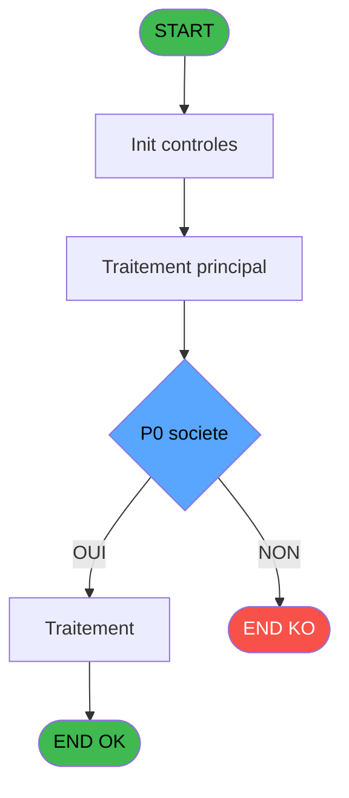
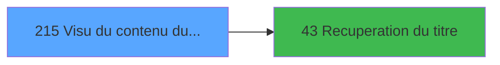

# ADH IDE 215 - Visu du contenu d'un poste

> **Analyse**: Phases 1-4 2026-02-08 04:19 -> 04:19 (4s) | Assemblage 04:19
> **Pipeline**: V7.2 Enrichi
> **Structure**: 4 onglets (Resume | Ecrans | Donnees | Connexions)

<!-- TAB:Resume -->

## 1. FICHE D'IDENTITE

| Attribut | Valeur |
|----------|--------|
| Projet | ADH |
| IDE Position | 215 |
| Nom Programme | Visu du contenu d'un poste |
| Fichier source | `Prg_215.xml` |
| Dossier IDE | General |
| Taches | 1 (0 ecrans visibles) |
| Tables modifiees | 0 |
| Programmes appeles | 1 |
| Complexite | **BASSE** (score 5/100) |
| Statut | **ORPHELIN_POTENTIEL** |

## 2. DESCRIPTION FONCTIONNELLE

ADH IDE 215 est un programme de visualisation destiné à afficher le contenu détaillé d'un poste de caisse. Il intervient dans le flux de consultation des caisses, permettant aux utilisateurs de voir en détail ce qu'un poste contient.

Le programme effectue un appel à ADH IDE 43 pour récupérer le titre associé au poste visualisé. Cette dépendance suggère qu'il réutilise la logique de titrage commune à plusieurs programmes de gestion de caisse, assurant une cohérence dans la présentation des informations aux utilisateurs.

Ce programme s'inscrit dans l'écosystème de gestion caisse du module ADH, permettant une navigation et une consultation fluides des données liées aux postes. Son rôle limité mais spécialisé en fait un élément de l'interface utilisateur dédiée à l'inspection et la consultation des données existantes plutôt qu'à leur modification.

## 3. BLOCS FONCTIONNELS

## 5. REGLES METIER

2 regles identifiees:

### Autres (2 regles)

#### [RM-001] Condition: P0 societe [A] egale

| Element | Detail |
|---------|--------|
| **Condition** | `P0 societe [A]=''` |
| **Si vrai** | Action si vrai |
| **Variables** | EN (P0 societe) |
| **Expression source** | Expression 1 : `P0 societe [A]=''` |
| **Exemple** | Si P0 societe [A]='' → Action si vrai |

#### [RM-002] Si [I]='O' alors 'Opposition' sinon 'Valide')

| Element | Detail |
|---------|--------|
| **Condition** | `[I]='O'` |
| **Si vrai** | 'Opposition' |
| **Si faux** | 'Valide') |
| **Expression source** | Expression 12 : `IF ([I]='O','Opposition','Valide')` |
| **Exemple** | Si [I]='O' → 'Opposition'. Sinon → 'Valide') |

## 6. CONTEXTE

- **Appele par**: (aucun)
- **Appelle**: 1 programmes | **Tables**: 2 (W:0 R:1 L:1) | **Taches**: 1 | **Expressions**: 14

<!-- TAB:Ecrans -->

## 8. ECRANS

*(Programme sans ecran visible)*

## 9. NAVIGATION

### 9.3 Structure hierarchique (0 tache)

| Position | Tache | Type | Dimensions | Bloc |
|----------|-------|------|------------|------|

### 9.4 Algorigramme

> **Legende**: Vert = START/END OK | Rouge = END KO | Bleu = Decisions
> *Algorigramme auto-genere. Utiliser `/algorigramme` pour une synthese metier detaillee.*

<!-- TAB:Donnees -->

## 10. TABLES

### Tables utilisees (2)

| ID | Nom | Description | Type | R | W | L | Usages |
|----|-----|-------------|------|---|---|---|--------|
| 80 | codes_autocom____aut |  | DB | R |   |   | 1 |
| 30 | gm-recherche_____gmr | Index de recherche | DB |   |   | L | 1 |

### Colonnes par table (1 / 1 tables avec colonnes identifiees)

Table 80 - codes_autocom____aut (R) - 1 usages

| Lettre | Variable | Acces | Type |
|--------|----------|-------|------|
| A | P0 societe | R | Alpha |
| B | P0 poste | R | Numeric |
| C | v. titre ecran | R | Alpha |

## 11. VARIABLES

### 11.1 Parametres entrants (2)

Variables recues en parametre.

| Lettre | Nom | Type | Usage dans |
|--------|-----|------|-----------|
| EN | P0 societe | Alpha | 2x parametre entrant |
| EO | P0 poste | Numeric | 1x parametre entrant |

### 11.2 Variables de session (1)

Variables persistantes pendant toute la session.

| Lettre | Nom | Type | Usage dans |
|--------|-----|------|-----------|
| EP | v. titre ecran | Alpha | - |

## 12. EXPRESSIONS

**14 / 14 expressions decodees (100%)**

### 12.1 Repartition par type

| Type | Expressions | Regles |
|------|-------------|--------|
| CONDITION | 2 | 2 |
| CONSTANTE | 2 | 0 |
| DATE | 1 | 0 |
| REFERENCE_VG | 1 | 0 |
| OTHER | 7 | 0 |
| STRING | 1 | 0 |

### 12.2 Expressions cles par type

#### CONDITION (2 expressions)

| Type | IDE | Expression | Regle |
|------|-----|------------|-------|
| CONDITION | 12 | `IF ([I]='O','Opposition','Valide')` | [RM-002](#rm-RM-002) |
| CONDITION | 1 | `P0 societe [A]=''` | [RM-001](#rm-RM-001) |

#### CONSTANTE (2 expressions)

| Type | IDE | Expression | Regle |
|------|-----|------------|-------|
| CONSTANTE | 6 | `79` | - |
| CONSTANTE | 2 | `'C'` | - |

#### DATE (1 expressions)

| Type | IDE | Expression | Regle |
|------|-----|------------|-------|
| DATE | 4 | `Date ()` | - |

#### REFERENCE_VG (1 expressions)

| Type | IDE | Expression | Regle |
|------|-----|------------|-------|
| REFERENCE_VG | 5 | `VG2` | - |

#### OTHER (7 expressions)

| Type | IDE | Expression | Regle |
|------|-----|------------|-------|
| OTHER | 11 | `[F]` | - |
| OTHER | 13 | `MlsTrans ('Du')` | - |
| OTHER | 14 | `MlsTrans ('au')` | - |
| OTHER | 10 | `[E]` | - |
| OTHER | 7 | `P0 societe [A]` | - |
| ... | | *+2 autres* | |

#### STRING (1 expressions)

| Type | IDE | Expression | Regle |
|------|-----|------------|-------|
| STRING | 3 | `Trim ([Q])` | - |

<!-- TAB:Connexions -->

## 13. GRAPHE D'APPELS

### 13.1 Chaine depuis Main (Callers)

**Chemin**: (pas de callers directs)

### 13.2 Callers

| IDE | Nom Programme | Nb Appels |
|-----|---------------|-----------|
| - | (aucun) | - |

### 13.3 Callees (programmes appeles)

### 13.4 Detail Callees avec contexte

| IDE | Nom Programme | Appels | Contexte |
|-----|---------------|--------|----------|
| [43](ADH-IDE-43.md) | Recuperation du titre | 1 | Recuperation donnees |

## 14. RECOMMANDATIONS MIGRATION

### 14.1 Profil du programme

| Metrique | Valeur | Impact migration |
|----------|--------|-----------------|
| Lignes de logique | 26 | Programme compact |
| Expressions | 14 | Peu de logique |
| Tables WRITE | 0 | Impact faible |
| Sous-programmes | 1 | Peu de dependances |
| Ecrans visibles | 0 | Ecran unique ou traitement batch |
| Code desactive | 0% (0 / 26) | Code sain |
| Regles metier | 2 | Quelques regles a preserver |

### 14.2 Plan de migration par bloc

### 14.3 Dependances critiques

| Dependance | Type | Appels | Impact |
|------------|------|--------|--------|
| [Recuperation du titre (IDE 43)](ADH-IDE-43.md) | Sous-programme | 1x | Normale - Recuperation donnees |

---
*Spec DETAILED generee par Pipeline V7.2 - 2026-02-08 04:20*
