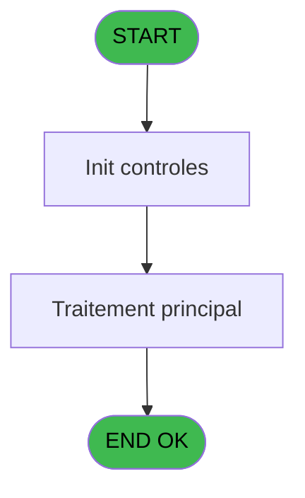

# ADH IDE 221 - Verif automatic pooling Tic

> **Analyse**: Phases 1-4 2026-02-08 04:23 -> 04:23 (5s) | Assemblage 04:23
> **Pipeline**: V7.2 Enrichi
> **Structure**: 4 onglets (Resume | Ecrans | Donnees | Connexions)

<!-- TAB:Resume -->

## 1. FICHE D'IDENTITE

| Attribut | Valeur |
|----------|--------|
| Projet | ADH |
| IDE Position | 221 |
| Nom Programme | Verif automatic pooling Tic |
| Fichier source | `Prg_221.xml` |
| Dossier IDE | General |
| Taches | 1 (0 ecrans visibles) |
| Tables modifiees | 0 |
| Programmes appeles | 0 |
| Complexite | **BASSE** (score 0/100) |
| Statut | **ORPHELIN_POTENTIEL** |

## 2. DESCRIPTION FONCTIONNELLE

ADH IDE 221 - Verif automatic pooling Tic est un **contrôleur de taxation automatique** qui vérifie la réception des tickets de taxation téléphonique (TIC) en provenance du PABX via le système de pooling. Son objectif métier est de garantir automatiquement la complétude et la continuité des données de facturation téléphonique en détectant les interruptions de communication et en levant des alertes en cas de perte de données. Le programme s'exécute périodiquement de manière automatique ou sur demande manuelle pour contrôle supervisé.

Le programme accède à **2 tables** en lecture seule : **table 155** (historique_pabx, cafil133_dat) et **table 477** (cumul_devises_tempo). Il n'a **0 paramètres d'entrée** et aucune sortie formellement documentée. La structure est très simple avec **1 seule tâche principale** contenant 26 lignes de logique, **0 expressions** et **0 appels à des sous-programmes**, ce qui en fait un programme terminal sans dépendances aval.

Le programme est actuellement **orphelin** (0 callers actifs, pas de PublicName, non référencé dans un ECF partagé), ce qui suggère qu'il s'agit soit d'un point d'entrée direct depuis le Main Program, soit d'un traitement résiduel. Avec une complexité très faible, il s'agit d'un contrôle de monitoring simple qui livre un véritable rapport de supervision des flux de taxation téléphonique.

## 3. BLOCS FONCTIONNELS

## 5. REGLES METIER

2 regles identifiees:

### Autres (2 regles)

#### [RM-001] Condition: [J]=0 AND [K] <= 10800

| Element | Detail |
|---------|--------|
| **Condition** | `[J]=0 AND [K]<=10800` |
| **Si vrai** | Action si vrai |
| **Expression source** | Expression 6 : `[J]=0 AND [K]<=10800` |
| **Exemple** | Si [J]=0 AND [K]<=10800 → Action si vrai |

#### [RM-002] Condition: [J]=0 AND [K] <= 5400

| Element | Detail |
|---------|--------|
| **Condition** | `[J]=0 AND [K]<=5400` |
| **Si vrai** | Action si vrai |
| **Expression source** | Expression 7 : `[J]=0 AND [K]<=5400` |
| **Exemple** | Si [J]=0 AND [K]<=5400 → Action si vrai |

## 6. CONTEXTE

- **Appele par**: (aucun)
- **Appelle**: 0 programmes | **Tables**: 2 (W:0 R:1 L:1) | **Taches**: 1 | **Expressions**: 7

<!-- TAB:Ecrans -->

## 8. ECRANS

*(Programme sans ecran visible)*

## 9. NAVIGATION

### 9.3 Structure hierarchique (0 tache)

| Position | Tache | Type | Dimensions | Bloc |
|----------|-------|------|------------|------|

### 9.4 Algorigramme

> **Legende**: Vert = START/END OK | Rouge = END KO | Bleu = Decisions
> *Algorigramme auto-genere. Utiliser `/algorigramme` pour une synthese metier detaillee.*

<!-- TAB:Donnees -->

## 10. TABLES

### Tables utilisees (2)

| ID | Nom | Description | Type | R | W | L | Usages |
|----|-----|-------------|------|---|---|---|--------|
| 155 | historique_pabx | Historique / journal | DB | R |   |   | 1 |
| 477 | cumul_devises_tempo | Table temporaire ecran | TMP |   |   | L | 1 |

### Colonnes par table (1 / 1 tables avec colonnes identifiees)

Table 155 - historique_pabx (R) - 1 usages

| Lettre | Variable | Acces | Type |
|--------|----------|-------|------|
| A | < reception ticket | R | Logical |
| B | < verification magic | R | Logical |
| C | v. Dif Days | R | Numeric |
| D | v. Dif Seconds | R | Numeric |

## 11. VARIABLES

### 11.1 Variables de session (2)

Variables persistantes pendant toute la session.

| Lettre | Nom | Type | Usage dans |
|--------|-----|------|-----------|
| EP | v. Dif Days | Numeric | - |
| EQ | v. Dif Seconds | Numeric | - |

### 11.2 Autres (2)

Variables diverses.

| Lettre | Nom | Type | Usage dans |
|--------|-----|------|-----------|
| EN | < reception ticket | Logical | - |
| EO | < verification magic | Logical | - |

## 12. EXPRESSIONS

**7 / 7 expressions decodees (100%)**

### 12.1 Repartition par type

| Type | Expressions | Regles |
|------|-------------|--------|
| CONDITION | 2 | 2 |
| CONSTANTE | 4 | 0 |
| DATE | 1 | 0 |

### 12.2 Expressions cles par type

#### CONDITION (2 expressions)

| Type | IDE | Expression | Regle |
|------|-----|------------|-------|
| CONDITION | 7 | `[J]=0 AND [K]<=5400` | [RM-002](#rm-RM-002) |
| CONDITION | 6 | `[J]=0 AND [K]<=10800` | [RM-001](#rm-RM-001) |

#### CONSTANTE (4 expressions)

| Type | IDE | Expression | Regle |
|------|-----|------------|-------|
| CONSTANTE | 3 | `'C'` | - |
| CONSTANTE | 4 | `99` | - |
| CONSTANTE | 1 | `'0'` | - |
| CONSTANTE | 2 | `'9'` | - |

#### DATE (1 expressions)

| Type | IDE | Expression | Regle |
|------|-----|------------|-------|
| DATE | 5 | `DifDateTime(Date(),Time(),[H],[I],'[J]'VAR,'[K]'VAR)` | - |

<!-- TAB:Connexions -->

## 13. GRAPHE D'APPELS

### 13.1 Chaine depuis Main (Callers)

**Chemin**: (pas de callers directs)

### 13.2 Callers

| IDE | Nom Programme | Nb Appels |
|-----|---------------|-----------|
| - | (aucun) | - |

### 13.3 Callees (programmes appeles)

### 13.4 Detail Callees avec contexte

| IDE | Nom Programme | Appels | Contexte |
|-----|---------------|--------|----------|
| - | (aucun) | - | - |

## 14. RECOMMANDATIONS MIGRATION

### 14.1 Profil du programme

| Metrique | Valeur | Impact migration |
|----------|--------|-----------------|
| Lignes de logique | 26 | Programme compact |
| Expressions | 7 | Peu de logique |
| Tables WRITE | 0 | Impact faible |
| Sous-programmes | 0 | Peu de dependances |
| Ecrans visibles | 0 | Ecran unique ou traitement batch |
| Code desactive | 0% (0 / 26) | Code sain |
| Regles metier | 2 | Quelques regles a preserver |

### 14.2 Plan de migration par bloc

### 14.3 Dependances critiques

| Dependance | Type | Appels | Impact |
|------------|------|--------|--------|

---
*Spec DETAILED generee par Pipeline V7.2 - 2026-02-08 04:24*
