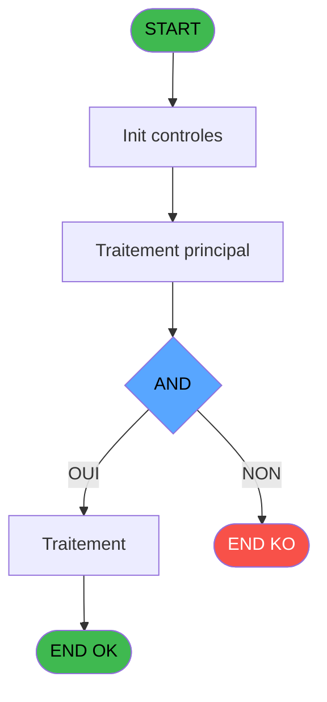
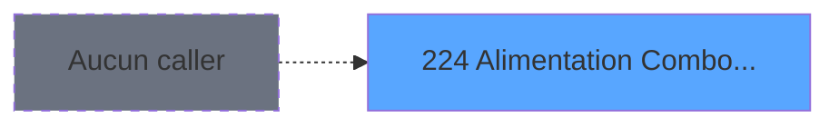
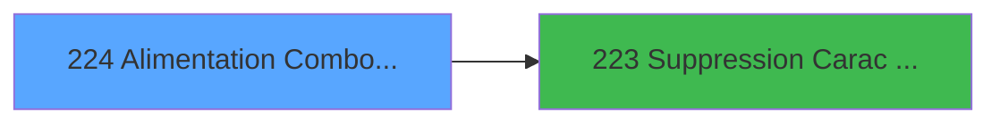

# ADH IDE 224 - Alimentation Combos LIEU SEJ

> **Analyse**: Phases 1-4 2026-02-08 04:26 -> 04:26 (4s) | Assemblage 04:26
> **Pipeline**: V7.2 Enrichi
> **Structure**: 4 onglets (Resume | Ecrans | Donnees | Connexions)

<!-- TAB:Resume -->

## 1. FICHE D'IDENTITE

| Attribut | Valeur |
|----------|--------|
| Projet | ADH |
| IDE Position | 224 |
| Nom Programme | Alimentation Combos LIEU SEJ |
| Fichier source | `Prg_224.xml` |
| Dossier IDE | General |
| Taches | 1 (0 ecrans visibles) |
| Tables modifiees | 0 |
| Programmes appeles | 1 |
| Complexite | **BASSE** (score 5/100) |
| Statut | **ORPHELIN_POTENTIEL** |

## 2. DESCRIPTION FONCTIONNELLE

**ADH IDE 224 - Alimentation Combos LIEU SEJ** gère l'alimentati des combinaisons de lieux de séjour. Ce programme traite les données de configuration pour les séjours, permettant la création et la maintenance des combos (combinaisons d'emplacements) disponibles dans le système de réservation. Il s'intègre dans la chaîne de gestion des référentiels d'accueil.

Le programme appelle **ADH IDE 223 - Suppression Carac interdit**, ce qui indique qu'il valide les caractères autorisés avant d'insérer ou de modifier les données dans les tables de combos. Cette dépendance suggère une logique de nettoyage ou de validation des entrées utilisateur.

En tant que programme de configuration (non visible dans l'interface caisse), ADH IDE 224 supporte les écrans de maintenance des tables de référence. Les données qu'il gère alimentent probablement les zooms et les listes déroulantes utilisées dans les formulaires de réservation et de gestion des séjours.

## 3. BLOCS FONCTIONNELS

## 5. REGLES METIER

3 regles identifiees:

### Autres (3 regles)

#### [RM-001] Condition: [B]<>'N' AND [B] different de 'G'

| Element | Detail |
|---------|--------|
| **Condition** | `[B]<>'N' AND [B]<>'G'` |
| **Si vrai** | Action si vrai |
| **Expression source** | Expression 1 : `[B]<>'N' AND [B]<>'G'` |
| **Exemple** | Si [B]<>'N' AND [B]<>'G' → Action si vrai |

#### [RM-002] Condition: Counter (0) egale 1

| Element | Detail |
|---------|--------|
| **Condition** | `Counter (0)=1` |
| **Si vrai** | Action si vrai |
| **Expression source** | Expression 3 : `Counter (0)=1` |
| **Exemple** | Si Counter (0)=1 → Action si vrai |

#### [RM-003] Condition: Counter (0) different de 1

| Element | Detail |
|---------|--------|
| **Condition** | `Counter (0)<>1` |
| **Si vrai** | Action si vrai |
| **Expression source** | Expression 4 : `Counter (0)<>1` |
| **Exemple** | Si Counter (0)<>1 → Action si vrai |

## 6. CONTEXTE

- **Appele par**: (aucun)
- **Appelle**: 1 programmes | **Tables**: 1 (W:0 R:1 L:0) | **Taches**: 1 | **Expressions**: 7

<!-- TAB:Ecrans -->

## 8. ECRANS

*(Programme sans ecran visible)*

## 9. NAVIGATION

### 9.3 Structure hierarchique (0 tache)

| Position | Tache | Type | Dimensions | Bloc |
|----------|-------|------|------------|------|

### 9.4 Algorigramme

> **Legende**: Vert = START/END OK | Rouge = END KO | Bleu = Decisions
> *Algorigramme auto-genere. Utiliser `/algorigramme` pour une synthese metier detaillee.*

<!-- TAB:Donnees -->

## 10. TABLES

### Tables utilisees (1)

| ID | Nom | Description | Type | R | W | L | Usages |
|----|-----|-------------|------|---|---|---|--------|
| 118 | tables_imports |  | DB | R |   |   | 1 |

### Colonnes par table (0 / 1 tables avec colonnes identifiees)

Table 118 - tables_imports (R) - 1 usages

*Table utilisee uniquement en Link ou aucune colonne Real identifiee dans le DataView.*

## 11. VARIABLES

*(Programme sans variables locales mappees)*

## 12. EXPRESSIONS

**7 / 7 expressions decodees (100%)**

### 12.1 Repartition par type

| Type | Expressions | Regles |
|------|-------------|--------|
| CONDITION | 3 | 3 |
| CONSTANTE | 1 | 0 |
| CONCATENATION | 2 | 0 |
| OTHER | 1 | 0 |

### 12.2 Expressions cles par type

#### CONDITION (3 expressions)

| Type | IDE | Expression | Regle |
|------|-----|------------|-------|
| CONDITION | 4 | `Counter (0)<>1` | [RM-003](#rm-RM-003) |
| CONDITION | 3 | `Counter (0)=1` | [RM-002](#rm-RM-002) |
| CONDITION | 1 | `[B]<>'N' AND [B]<>'G'` | [RM-001](#rm-RM-001) |

#### CONSTANTE (1 expressions)

| Type | IDE | Expression | Regle |
|------|-----|------------|-------|
| CONSTANTE | 2 | `'C'` | - |

#### CONCATENATION (2 expressions)

| Type | IDE | Expression | Regle |
|------|-----|------------|-------|
| CONCATENATION | 6 | `Trim ([E])&','&Left ([B],2)&' '&Left ([C],12)` | - |
| CONCATENATION | 5 | `Left ([B],2)&' '&Left ([C],12)` | - |

#### OTHER (1 expressions)

| Type | IDE | Expression | Regle |
|------|-----|------------|-------|
| OTHER | 7 | `[E]` | - |

<!-- TAB:Connexions -->

## 13. GRAPHE D'APPELS

### 13.1 Chaine depuis Main (Callers)

**Chemin**: (pas de callers directs)

### 13.2 Callers

| IDE | Nom Programme | Nb Appels |
|-----|---------------|-----------|
| - | (aucun) | - |

### 13.3 Callees (programmes appeles)

### 13.4 Detail Callees avec contexte

| IDE | Nom Programme | Appels | Contexte |
|-----|---------------|--------|----------|
| [223](ADH-IDE-223.md) | Suppression Carac interdit | 1 | Validation saisie |

## 14. RECOMMANDATIONS MIGRATION

### 14.1 Profil du programme

| Metrique | Valeur | Impact migration |
|----------|--------|-----------------|
| Lignes de logique | 10 | Programme compact |
| Expressions | 7 | Peu de logique |
| Tables WRITE | 0 | Impact faible |
| Sous-programmes | 1 | Peu de dependances |
| Ecrans visibles | 0 | Ecran unique ou traitement batch |
| Code desactive | 0% (0 / 10) | Code sain |
| Regles metier | 3 | Quelques regles a preserver |

### 14.2 Plan de migration par bloc

### 14.3 Dependances critiques

| Dependance | Type | Appels | Impact |
|------------|------|--------|--------|
| [Suppression Carac interdit (IDE 223)](ADH-IDE-223.md) | Sous-programme | 1x | Normale - Validation saisie |

---
*Spec DETAILED generee par Pipeline V7.2 - 2026-02-08 04:26*
