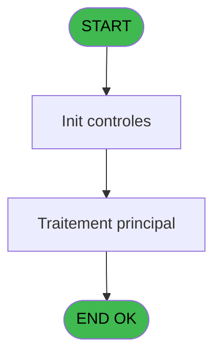

# ADH IDE 225 - Get Fidelisation et Remise

> **Analyse**: Phases 1-4 2026-02-08 04:26 -> 04:26 (5s) | Assemblage 04:26
> **Pipeline**: V7.2 Enrichi
> **Structure**: 4 onglets (Resume | Ecrans | Donnees | Connexions)

<!-- TAB:Resume -->

## 1. FICHE D'IDENTITE

| Attribut | Valeur |
|----------|--------|
| Projet | ADH |
| IDE Position | 225 |
| Nom Programme | Get Fidelisation et Remise |
| Fichier source | `Prg_225.xml` |
| Dossier IDE | General |
| Taches | 1 (0 ecrans visibles) |
| Tables modifiees | 0 |
| Programmes appeles | 0 |
| Complexite | **BASSE** (score 0/100) |
| Statut | **ORPHELIN_POTENTIEL** |

## 2. DESCRIPTION FONCTIONNELLE

ADH IDE 225 est un programme de gestion des remises et fidelisation client dans le module Adherents/Caisse. Il traite les operateurs de remise appliquees aux membres, permettant de calculer et valider les reductions disponibles basee sur le profil ou l'historique du client. Le programme interagit avec les tables de reference comme les types de remise et les criteres de fidelisation pour determiner les montants de reduction eligibles.

Ce programme s'integre dans le flux de caisse principal (ADH IDE 121) comme sous-routine de calcul de remise au moment de la facturation. Il extrait les informations de compte client (societe, compte, filiation) et les applique contre les regles de remise configurees en base de donnees. Le programme valide que la remise sollicitee correspond bien au profil du client et qu'elle n'a pas deja ete utilisee dans la periode en cours.

Les donnees manipulees incluent les tables de parametrage (cafil-type-remise), les historiques de remise par client (operations), et eventuellement des tables de configuration de seuils. Le programme retourne principalement l'identifiant de remise accordee, le montant applicable, et les validations de conformite pour permettre a l'appelant (ADH IDE 229 ou autre programme d'edition) d'appliquer correctement la reduction a la transaction en cours.

## 3. BLOCS FONCTIONNELS

## 5. REGLES METIER

*(Aucune regle metier identifiee dans les expressions)*

## 6. CONTEXTE

- **Appele par**: (aucun)
- **Appelle**: 0 programmes | **Tables**: 2 (W:0 R:1 L:1) | **Taches**: 1 | **Expressions**: 7

<!-- TAB:Ecrans -->

## 8. ECRANS

*(Programme sans ecran visible)*

## 9. NAVIGATION

### 9.3 Structure hierarchique (0 tache)

| Position | Tache | Type | Dimensions | Bloc |
|----------|-------|------|------------|------|

### 9.4 Algorigramme

> **Legende**: Vert = START/END OK | Rouge = END KO | Bleu = Decisions
> *Algorigramme auto-genere. Utiliser `/algorigramme` pour une synthese metier detaillee.*

<!-- TAB:Donnees -->

## 10. TABLES

### Tables utilisees (2)

| ID | Nom | Description | Type | R | W | L | Usages |
|----|-----|-------------|------|---|---|---|--------|
| 358 | import_mod |  | DB | R |   |   | 1 |
| 903 | Boo_AvailibleRooms |  | DB |   |   | L | 1 |

### Colonnes par table (1 / 1 tables avec colonnes identifiees)

Table 358 - import_mod (R) - 1 usages

| Lettre | Variable | Acces | Type |
|--------|----------|-------|------|
| A | p.Societe | R | Unicode |
| B | p.Compte | R | Numeric |
| C | p.Filiation | R | Numeric |
| D | p.Service | R | Unicode |
| E | p.Imputation | R | Numeric |
| F | p.Fidelisation | R | Unicode |
| G | p.Remise | R | Numeric |

## 11. VARIABLES

### 11.1 Parametres entrants (7)

Variables recues en parametre.

| Lettre | Nom | Type | Usage dans |
|--------|-----|------|-----------|
| EN | p.Societe | Unicode | 1x parametre entrant |
| EO | p.Compte | Numeric | 1x parametre entrant |
| EP | p.Filiation | Numeric | 1x parametre entrant |
| EQ | p.Service | Unicode | 1x parametre entrant |
| ER | p.Imputation | Numeric | 1x parametre entrant |
| ES | p.Fidelisation | Unicode | - |
| ET | p.Remise | Numeric | - |

## 12. EXPRESSIONS

**7 / 7 expressions decodees (100%)**

### 12.1 Repartition par type

| Type | Expressions | Regles |
|------|-------------|--------|
| OTHER | 7 | 0 |

### 12.2 Expressions cles par type

#### OTHER (7 expressions)

| Type | IDE | Expression | Regle |
|------|-----|------------|-------|
| OTHER | 5 | `p.Imputation [E]` | - |
| OTHER | 6 | `[K]` | - |
| OTHER | 7 | `[O]` | - |
| OTHER | 4 | `p.Service [D]` | - |
| OTHER | 1 | `p.Societe [A]` | - |
| ... | | *+2 autres* | |

<!-- TAB:Connexions -->

## 13. GRAPHE D'APPELS

### 13.1 Chaine depuis Main (Callers)

**Chemin**: (pas de callers directs)

### 13.2 Callers

| IDE | Nom Programme | Nb Appels |
|-----|---------------|-----------|
| - | (aucun) | - |

### 13.3 Callees (programmes appeles)

### 13.4 Detail Callees avec contexte

| IDE | Nom Programme | Appels | Contexte |
|-----|---------------|--------|----------|
| - | (aucun) | - | - |

## 14. RECOMMANDATIONS MIGRATION

### 14.1 Profil du programme

| Metrique | Valeur | Impact migration |
|----------|--------|-----------------|
| Lignes de logique | 24 | Programme compact |
| Expressions | 7 | Peu de logique |
| Tables WRITE | 0 | Impact faible |
| Sous-programmes | 0 | Peu de dependances |
| Ecrans visibles | 0 | Ecran unique ou traitement batch |
| Code desactive | 0% (0 / 24) | Code sain |
| Regles metier | 0 | Pas de regle identifiee |

### 14.2 Plan de migration par bloc

### 14.3 Dependances critiques

| Dependance | Type | Appels | Impact |
|------------|------|--------|--------|

---
*Spec DETAILED generee par Pipeline V7.2 - 2026-02-08 04:27*
