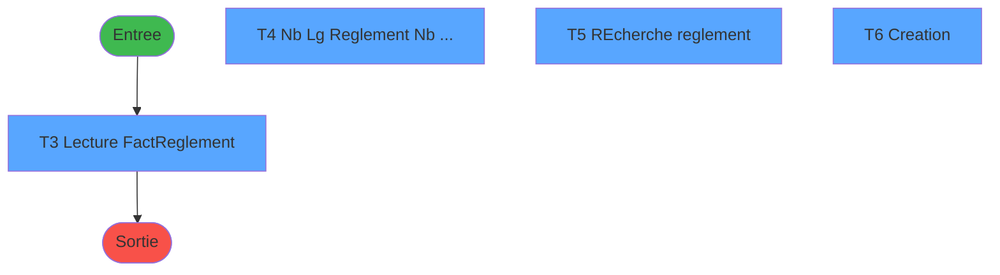

# ADH IDE 229 - Ventilation Lignes Ventes

> **Analyse**: Phases 1-4 2026-01-30 09:42 -> 09:42 (8s) | Assemblage 09:42
> **Pipeline**: V7.2 Enrichi
> **Structure**: 4 onglets (Resume | Ecrans | Donnees | Connexions)

<!-- TAB:Resume -->

## 1. FICHE D'IDENTITE

| Attribut | Valeur |
|----------|--------|
| Projet | ADH |
| IDE Position | 229 |
| Nom Programme | Ventilation Lignes Ventes |
| Fichier source | `Prg_229.xml` |
| Domaine metier | Ventes |
| Taches | 7 (4 ecrans visibles) |
| Tables modifiees | 1 |
| Programmes appeles | 0 |

## 2. DESCRIPTION FONCTIONNELLE

**Ventilation Lignes Ventes** assure la gestion complete de ce processus.

Le flux de traitement s'organise en **4 blocs fonctionnels** :

- **Reglement** (3 taches) : gestion des moyens de paiement et reglements
- **Traitement** (2 taches) : traitements metier divers
- **Creation** (1 tache) : insertion d'enregistrements en base (mouvements, prestations)
- **Saisie** (1 tache) : ecrans de saisie utilisateur (formulaires, champs, donnees)

**Donnees modifiees** : 1 tables en ecriture (type_mail_a_traiter).

Detail : phases du traitement

#### Phase 1 : Saisie (1 tache)

- **T1** - Maj lignes de ventes\Multi Reg

#### Phase 2 : Traitement (2 taches)

- **T2** - Creaion Temp Fac
- **T7** - Efface

#### Phase 3 : Reglement (3 taches)

- **T3** - Lecture Fact/Reglement **[ECRAN]**
- **T4** - Nb Lg Reglement < Nb LgFacture **[ECRAN]**
- **T5** - REcherche reglement **[ECRAN]**

#### Phase 4 : Creation (1 tache)

- **T6** - Creation **[ECRAN]**

#### Tables impactees

| Table | Operations | Role metier |
|-------|-----------|-------------|
| type_mail_a_traiter | **W** (6 usages) |  |

## 3. BLOCS FONCTIONNELS

### 3.1 Saisie (1 tache)

Ce bloc traite la saisie des donnees de la transaction.

---

#### T1 - Maj lignes de ventes\Multi Reg

**Role** : Ecran de saisie pour la transaction.

### 3.2 Traitement (2 taches)

Traitements internes.

---

#### T2 - Creaion Temp Fac

**Role** : Traitement interne.

---

#### T7 - Efface

**Role** : Traitement interne.

### 3.3 Reglement (3 taches)

Gestion des moyens de paiement : 3 taches de reglement.

---

#### T3 - Lecture Fact/Reglement [ECRAN]

**Role** : Gestion du reglement et moyens de paiement.
**Ecran** : 467 x 0 DLU | [Voir mockup](#ecran-t3)

---

#### T4 - Nb Lg Reglement < Nb LgFacture [ECRAN]

**Role** : Gestion du reglement et moyens de paiement.
**Ecran** : 612 x 169 DLU | [Voir mockup](#ecran-t4)

---

#### T5 - REcherche reglement [ECRAN]

**Role** : Gestion du reglement et moyens de paiement.
**Ecran** : 502 x 192 DLU | [Voir mockup](#ecran-t5)

### 3.4 Creation (1 tache)

Insertion de nouveaux enregistrements en base.

---

#### T6 - Creation [ECRAN]

**Role** : Insertion de donnees en base.
**Ecran** : 143 x 138 DLU | [Voir mockup](#ecran-t6)

## 5. REGLES METIER

*(Aucune regle metier identifiee)*

## 6. CONTEXTE

- **Appele par**: (aucun)
- **Appelle**: 0 programmes | **Tables**: 3 (W:1 R:0 L:2) | **Taches**: 7 | **Expressions**: 2

<!-- TAB:Ecrans -->

## 8. ECRANS

### 8.1 Forms visibles (4 / 7)

| # | Position | Tache | Nom | Type | Largeur | Hauteur | Bloc |
|---|----------|-------|-----|------|---------|---------|------|
| 1 | 229.1 | T3 | Lecture Fact/Reglement | Type0 | 467 | 0 | Reglement |
| 2 | 229.2 | T4 | Nb Lg Reglement < Nb LgFacture | Type0 | 612 | 169 | Reglement |
| 3 | 229.3 | T5 | REcherche reglement | Type0 | 502 | 192 | Reglement |
| 4 | 229.4 | T6 | Creation | Type0 | 143 | 138 | Creation |

### 8.2 Mockups Ecrans

---

#### 229.1 - Lecture Fact/Reglement
**Tache** : [T3](#t3) | **Type** : Type0 | **Dimensions** : 467 x 0 DLU
**Bloc** : Reglement | **Titre IDE** : Lecture Fact/Reglement

<!-- FORM-DATA:
{
    "width":  467,
    "controls":  [

                 ],
    "type":  "Type0",
    "height":  0,
    "taskId":  3
}
-->

---

#### 229.2 - Nb Lg Reglement < Nb LgFacture
**Tache** : [T4](#t4) | **Type** : Type0 | **Dimensions** : 612 x 169 DLU
**Bloc** : Reglement | **Titre IDE** : Nb Lg Reglement < Nb LgFacture

<!-- FORM-DATA:
{
    "width":  612,
    "controls":  [

                 ],
    "type":  "Type0",
    "height":  169,
    "taskId":  4
}
-->

---

#### 229.3 - REcherche reglement
**Tache** : [T5](#t5) | **Type** : Type0 | **Dimensions** : 502 x 192 DLU
**Bloc** : Reglement | **Titre IDE** : REcherche reglement

<!-- FORM-DATA:
{
    "width":  502,
    "controls":  [

                 ],
    "type":  "Type0",
    "height":  192,
    "taskId":  5
}
-->

---

#### 229.4 - Creation
**Tache** : [T6](#t6) | **Type** : Type0 | **Dimensions** : 143 x 138 DLU
**Bloc** : Creation | **Titre IDE** : Creation

<!-- FORM-DATA:
{
    "width":  143,
    "controls":  [

                 ],
    "type":  "Type0",
    "height":  138,
    "taskId":  6
}
-->

## 9. NAVIGATION

### 9.1 Enchainement des ecrans

**Detail par enchainement :**

| Depuis | Action | Vers | Retour |
|--------|--------|------|--------|

### 9.3 Structure hierarchique (7 taches)

- **229.1** [Maj lignes de ventes\Multi Reg (T1)](#t1)   *[Saisie]*
- **229.2** [Creaion Temp Fac (T2)](#t2)   *[Traitement]*
  - **229.2.1** [Efface (T7)](#t7)  
- **229.3** [Lecture Fact/Reglement (T3)](#t3) **[ECRAN]**  467x0 -> [mockup](#ecran-t3) *[Reglement]*
  - **229.3.1** [Nb Lg Reglement < Nb LgFacture (T4)](#t4) **[ECRAN]**  612x169 -> [mockup](#ecran-t4)
  - **229.3.2** [REcherche reglement (T5)](#t5) **[ECRAN]**  502x192 -> [mockup](#ecran-t5)
- **229.4** [Creation (T6)](#t6) **[ECRAN]**  143x138 -> [mockup](#ecran-t6) *[Creation]*

<!-- TAB:Donnees -->

## 10. TABLES

### Tables utilisees (3)

| ID | Nom | Description | Type | R | W | L | Usages |
|----|-----|-------------|------|---|---|---|--------|
| 596 | tempo_ecran_police | Table temporaire ecran | TMP |   |   | L | 1 |
| 847 | stat_lieu_vente_date | Statistiques point de vente | TMP |   |   | L | 1 |
| 864 | type_mail_a_traiter |  | DB |   | **W** |   | 6 |

### Colonnes par table

Table 864 - type_mail_a_traiter (**W**) - 6 usages

| Lettre | Variable | Acces | Type | Utilisee |
|--------|----------|-------|------|----------|
| C | V.type Payment | W | Alpha | **OUI** |
| D | P.type d'enregistrement créé | W | Alpha | **OUI** |

## 11. VARIABLES

### 11.1 Variables de session (5)

Variables persistantes pendant toute la session.

| Lettre | Nom | Type | Usage dans |
|--------|-----|------|-----------|
| E | V.Nb ligne facturée | Numeric | - |
| F | V.Mtt Ligne Facturee | Numeric | - |
| G | V.Nb ligne Fact/Reglement | Numeric | - |
| H | V.Mtt Ligne regle | Numeric | - |
| I | V.Dernier Article Lu | Numeric | - |

### 11.2 Autres (4)

Variables diverses.

| Lettre | Nom | Type | Usage dans |
|--------|-----|------|-----------|
| A | P.Societe | Alpha | - |
| B | P.Compte | Numeric | - |
| C | P.Filiation | Numeric | - |
| D | P.type d'enregistrement créé | Alpha | - |

## 12. EXPRESSIONS

**2 / 2 expressions decodees (100%)**

### 12.1 Repartition par type

| Type | Expressions | Regles |
|------|-------------|--------|
| CONSTANTE | 1 | 0 |
| OTHER | 1 | 0 |

### 12.2 Expressions cles par type

#### CONSTANTE (1 expressions)

| Type | IDE | Expression | Regle |
|------|-----|------------|-------|
| CONSTANTE | 2 | `'N'` | - |

#### OTHER (1 expressions)

| Type | IDE | Expression | Regle |
|------|-----|------------|-------|
| OTHER | 1 | `DbDel('{864,4}'DSOURCE,'')` | - |

<!-- TAB:Connexions -->

## 13. GRAPHE D'APPELS

### 13.1 Chaine depuis Main (Callers)

**Chemin**: (pas de callers directs)

### 13.2 Callers

| IDE | Nom Programme | Nb Appels |
|-----|---------------|-----------|
| - | (aucun) | - |

### 13.3 Callees (programmes appeles)

### 13.4 Detail Callees avec contexte

| IDE | Nom Programme | Appels | Contexte |
|-----|---------------|--------|----------|
| - | (aucun) | - | - |

## 14. RECOMMANDATIONS MIGRATION

### 14.1 Profil du programme

| Metrique | Valeur | Impact migration |
|----------|--------|-----------------|
| Lignes de logique | 161 | Programme compact |
| Expressions | 2 | Peu de logique |
| Tables WRITE | 1 | Impact faible |
| Sous-programmes | 0 | Peu de dependances |
| Ecrans visibles | 4 | Quelques ecrans |
| Code desactive | 0% (0 / 161) | Code sain |
| Regles metier | 0 | Pas de regle identifiee |

### 14.2 Plan de migration par bloc

#### Saisie (1 tache: 0 ecran, 1 traitement)

- **Strategie** : Formulaire React/Blazor avec validation Zod/FluentValidation.
- Validation temps reel cote client + serveur

#### Traitement (2 taches: 0 ecran, 2 traitements)

- Traitement standard a migrer

#### Reglement (3 taches: 3 ecrans, 0 traitement)

- **Strategie** : Service `IReglementService` avec pattern Strategy par mode de paiement.
- Integration TPE si applicable

#### Creation (1 tache: 1 ecran, 0 traitement)

- **Strategie** : Repository pattern avec Entity Framework Core.
- Insertion via `IRepository<T>.CreateAsync()`

### 14.3 Dependances critiques

| Dependance | Type | Appels | Impact |
|------------|------|--------|--------|
| type_mail_a_traiter | Table WRITE (Database) | 6x | Schema + repository |

---
*Spec DETAILED generee par Pipeline V7.2 - 2026-01-30 09:42*
